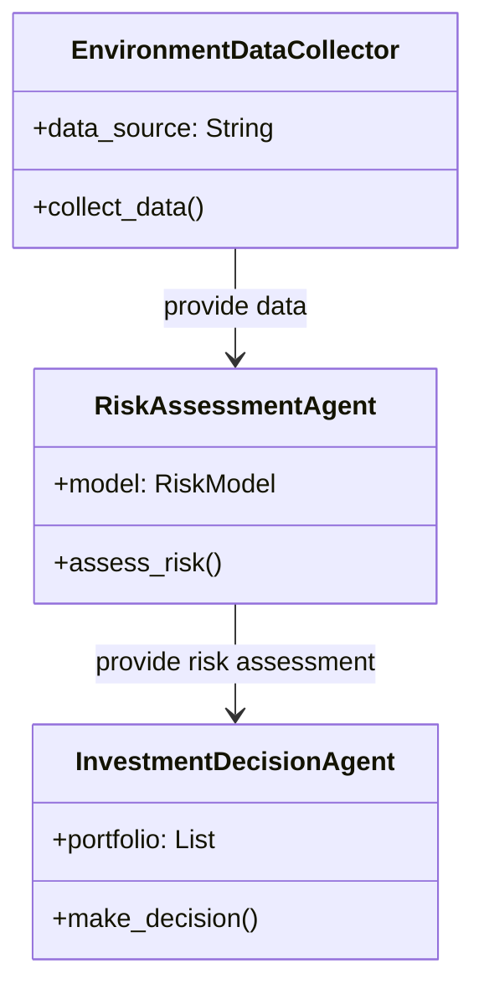
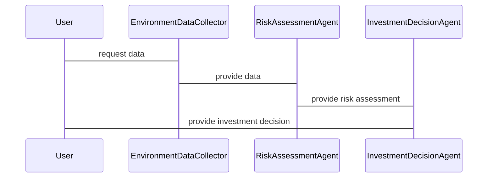

                 


# AI多智能体系统在价值投资中的环境风险评估

> 关键词：AI多智能体系统，环境风险评估，价值投资，金融，风险管理

> 摘要：本文探讨了AI多智能体系统在价值投资中的应用，特别是在环境风险评估方面的潜力。通过分析多智能体系统的协作机制和环境风险评估的核心概念，本文详细介绍了如何利用多智能体系统的优势来提高环境风险评估的准确性和效率。文章还讨论了相关的算法原理、系统架构设计、项目实战以及最佳实践，为读者提供了全面的视角。

---

## 第1章: AI多智能体系统概述

### 1.1 多智能体系统的基本概念

#### 1.1.1 多智能体系统的定义
多智能体系统（Multi-Agent System, MAS）是由多个智能体（Agent）组成的分布式系统，这些智能体能够通过协作和竞争共同完成复杂任务。

#### 1.1.2 多智能体系统的特征
- **分布式性**：智能体分布在不同的节点上，独立决策。
- **协作性**：智能体之间通过信息共享和协作完成任务。
- **适应性**：能够根据环境变化自适应调整行为。
- **主动性**：智能体主动感知环境并采取行动。

#### 1.1.3 多智能体系统的分类
1. **基于任务的多智能体系统**：智能体协作完成特定任务。
2. **基于市场的多智能体系统**：智能体通过市场机制进行资源分配。
3. **基于网络的多智能体系统**：智能体通过网络进行交互和协作。

### 1.2 多智能体系统的核心原理

#### 1.2.1 分布式智能
多智能体系统通过分布式计算实现任务的分解与协作，避免单点故障。

#### 1.2.2 协作与竞争
智能体之间可以协作完成任务，也可以通过竞争优化系统性能。

#### 1.2.3 自适应与学习
智能体通过机器学习算法不断优化自身的决策能力。

### 1.3 多智能体系统在金融领域的应用

#### 1.3.1 金融市场的复杂性
金融市场涉及众多参与者，信息复杂且动态变化，需要高效的风险评估和决策机制。

#### 1.3.2 多智能体系统的适用性
多智能体系统能够处理复杂的信息，通过协作提供更准确的市场分析。

#### 1.3.3 价值投资中的环境风险
价值投资需要考虑环境因素对企业的影响，多智能体系统能够量化这些风险。

### 1.4 本章小结
本章介绍了多智能体系统的基本概念、核心原理及其在金融领域的应用，特别是其在环境风险评估中的潜力。

---

## 第2章: 环境风险评估的核心概念

### 2.1 环境风险的定义与分类

#### 2.1.1 环境风险的定义
环境风险是指由于环境因素对企业或投资带来的潜在损失。

#### 2.1.2 环境风险的分类
- **物理风险**：如气候变化导致的自然灾害。
- **监管风险**：环境法规对企业的影响。
- **声誉风险**：环境问题对企业声誉的影响。

#### 2.1.3 环境风险的评估方法
- **定性评估**：通过专家意见进行评估。
- **定量评估**：利用数据模型进行量化分析。

### 2.2 价值投资中的环境风险

#### 2.2.1 价值投资的基本原理
价值投资注重企业的内在价值，选择被市场低估的企业进行投资。

#### 2.2.2 环境风险对价值投资的影响
环境风险可能影响企业的长期盈利能力，从而影响其内在价值。

#### 2.2.3 环境风险评估的重要性
准确评估环境风险有助于投资者做出更明智的投资决策。

### 2.3 环境风险评估的核心要素

#### 2.3.1 环境数据的获取
- **数据来源**：政府报告、企业披露、第三方机构数据。
- **数据类型**：排放数据、资源消耗数据、环境影响评估数据。

#### 2.3.2 环境风险的量化
- **量化方法**：利用环境影响评估模型，将环境风险转化为可量化的指标。

#### 2.3.3 环境风险的动态变化
环境风险会随着政策、技术和社会的变化而变化，需要实时监控和调整。

### 2.4 本章小结
本章详细介绍了环境风险的定义、分类及其在价值投资中的重要性，强调了环境风险评估的核心要素。

---

## 第3章: AI多智能体系统与环境风险评估的结合

### 3.1 多智能体系统在环境风险评估中的优势

#### 3.1.1 分布式计算能力
多智能体系统能够处理海量数据，提高计算效率。

#### 3.1.2 多维度数据处理
系统能够整合来自不同来源的环境数据，提供全面的分析。

#### 3.1.3 自适应调整能力
智能体能够根据环境变化自适应调整评估模型。

### 3.2 多智能体系统在价值投资中的应用场景

#### 3.2.1 个股风险评估
通过多智能体系统分析单个企业的环境风险，帮助投资者做出决策。

#### 3.2.2 行业风险分析
评估整个行业的环境风险，识别高风险行业。

#### 3.2.3 市场整体风险监控
实时监控市场整体的环境风险，提前预警潜在风险。

### 3.3 环境风险评估的多智能体系统架构

#### 3.3.1 系统整体架构
- **数据采集层**：收集环境数据和市场数据。
- **智能体协作层**：多个智能体协作完成风险评估。
- **用户交互层**：提供用户友好的界面，展示评估结果。

#### 3.3.2 各智能体的功能划分
- **数据智能体**：负责数据的采集和预处理。
- **评估智能体**：负责环境风险的评估和量化。
- **决策智能体**：根据评估结果提供投资建议。

#### 3.3.3 智能体之间的交互机制
智能体之间通过消息传递进行协作，确保数据的实时共享和信息的高效处理。

### 3.4 本章小结
本章探讨了多智能体系统在环境风险评估中的优势及其在价值投资中的应用场景，介绍了系统的整体架构和功能划分。

---

## 第4章: 多智能体系统环境风险评估的算法原理

### 4.1 环境风险评估的基本算法

#### 4.1.1 统计分析方法
- **回归分析**：通过统计模型预测环境风险。
- **聚类分析**：将企业分为不同风险类别。

#### 4.1.2 机器学习算法
- **支持向量机（SVM）**：用于分类和回归分析。
- **随机森林**：用于特征选择和风险预测。

#### 4.1.3 深度学习模型
- **神经网络**：用于复杂的非线性关系建模。
- **长短期记忆网络（LSTM）**：用于时间序列数据的分析。

### 4.2 多智能体系统中的协同学习

#### 4.2.1 协同学习的基本原理
多个智能体通过共享知识和经验共同优化模型。

#### 4.2.2 协同学习的实现方式
- **联邦学习**：数据不集中，模型在不同设备上联合训练。
- **参数同步**：智能体之间定期同步模型参数。

#### 4.2.3 协同学习的优势与挑战
- **优势**：提高模型泛化能力，避免数据孤岛。
- **挑战**：数据隐私问题，通信成本高。

### 4.3 环境风险评估的数学模型

#### 4.3.1 风险评估的数学公式
$$ R = f(e_1, e_2, ..., e_n) $$
其中，$R$ 是风险值，$e_i$ 是环境因素。

#### 4.3.2 多智能体协同的数学模型
$$ R_{total} = \sum_{i=1}^{n} R_i $$
其中，$R_i$ 是每个智能体评估的风险值。

### 4.4 本章小结
本章详细介绍了环境风险评估的基本算法和多智能体系统中的协同学习机制，提出了数学模型用于风险计算。

---

## 第5章: 系统架构设计与实现

### 5.1 问题场景介绍

#### 5.1.1 项目背景
本项目旨在利用多智能体系统对企业的环境风险进行评估，帮助投资者做出更明智的投资决策。

#### 5.1.2 项目目标
- 实现多智能体系统的环境风险评估模型。
- 提供实时的环境风险监控功能。

### 5.2 系统功能设计

#### 5.2.1 领域模型设计（Mermaid类图）


#### 5.2.2 系统架构设计（Mermaid架构图）


#### 5.2.3 系统接口设计
- 数据接口：提供环境数据的采集和预处理功能。
- 评估接口：提供环境风险评估的API。
- 决策接口：提供投资决策的建议。

#### 5.2.4 系统交互设计（Mermaid序列图）


### 5.3 本章小结
本章详细介绍了系统架构设计，包括领域模型、架构图、接口设计和交互设计。

---

## 第6章: 项目实战与案例分析

### 6.1 环境安装

```bash
pip install -r requirements.txt
```

### 6.2 系统核心实现源代码

```python
class EnvironmentDataCollector:
    def __init__(self):
        self.data_source = ""
    
    def collect_data(self):
        # 实现数据采集逻辑
        pass

class RiskAssessmentAgent:
    def __init__(self):
        self.model = RiskModel()
    
    def assess_risk(self, data):
        return self.model.predict(data)

class InvestmentDecisionAgent:
    def __init__(self):
        self.portfolio = []
    
    def make_decision(self, risk_assessment):
        # 实现投资决策逻辑
        pass
```

### 6.3 案例分析与详细解读

#### 6.3.1 案例背景
假设我们有一个企业，需要评估其环境风险。

#### 6.3.2 数据采集
从政府报告和企业披露中获取环境数据。

#### 6.3.3 风险评估
使用多智能体系统评估企业的环境风险，得到风险值。

#### 6.3.4 投资决策
根据风险评估结果，做出投资决策。

### 6.4 经验总结

#### 6.4.1 成功经验
- 系统的分布式计算能力显著提高了评估效率。
- 协作学习显著提高了模型的准确性。

#### 6.4.2 挑战与改进
- 数据隐私问题需要进一步解决。
- 系统的通信成本较高，需要优化。

### 6.5 本章小结
本章通过一个实际案例展示了多智能体系统在环境风险评估中的应用，总结了项目的成功经验与挑战。

---

## 第7章: 结论与展望

### 7.1 本章总结
本文详细探讨了AI多智能体系统在价值投资中的环境风险评估的应用，介绍了系统的背景、核心概念、算法原理、系统架构设计和项目实战。

### 7.2 未来展望
- **技术改进**：优化多智能体系统的通信机制，降低通信成本。
- **应用扩展**：探索多智能体系统在其他金融领域的应用。
- **数据隐私**：加强数据隐私保护，确保系统的安全性。

### 7.3 最佳实践 tips
- 在使用多智能体系统时，需注意数据隐私和通信成本问题。
- 定期更新模型，以适应环境变化。
- 结合人工审核，确保评估结果的准确性。

### 7.4 本章小结
本章总结了全文，并展望了未来的研究方向和改进措施。

---

# 参考文献
（此处列出相关文献和资料）

---

通过以上结构和内容，文章系统地介绍了AI多智能体系统在环境风险评估中的应用，从理论到实践，为读者提供了全面的视角。

