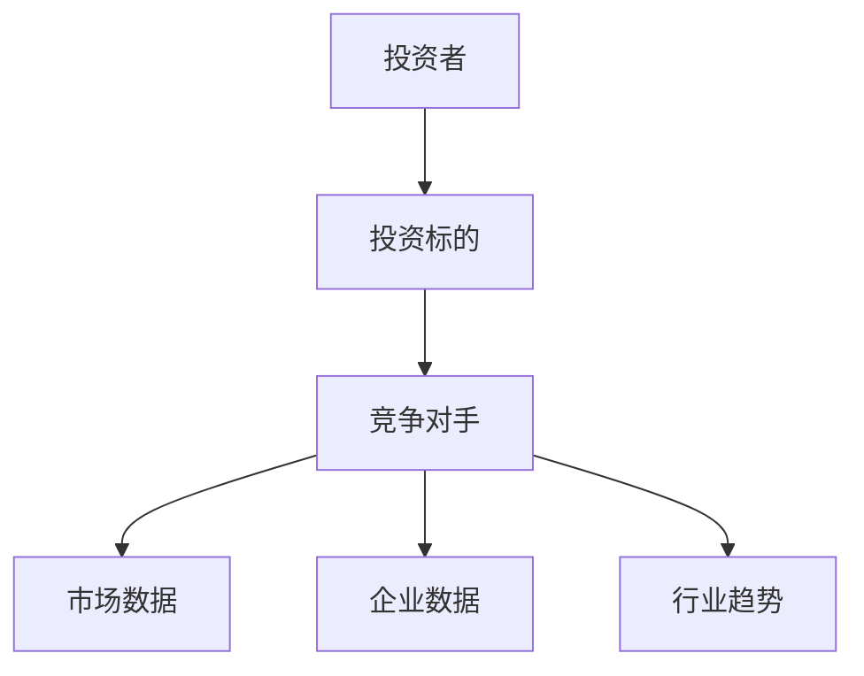
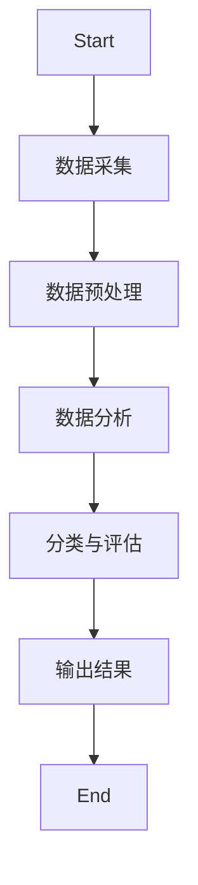
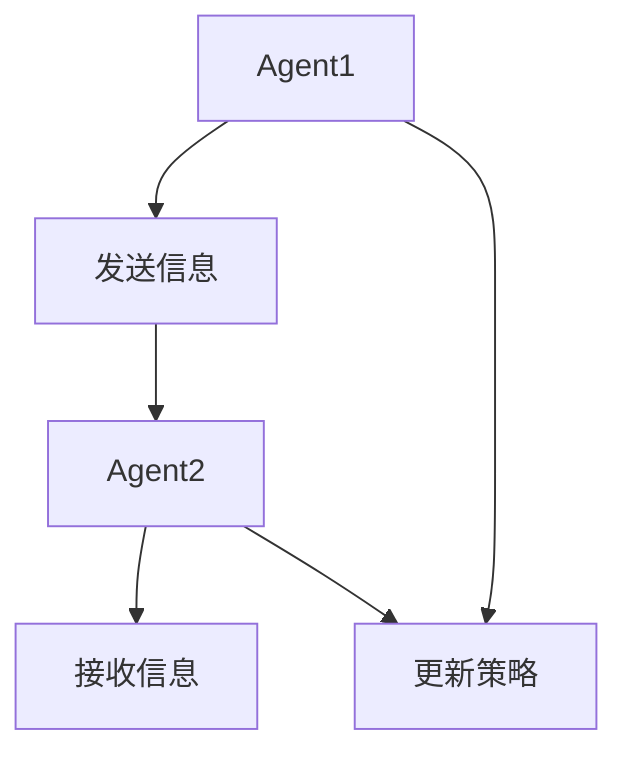
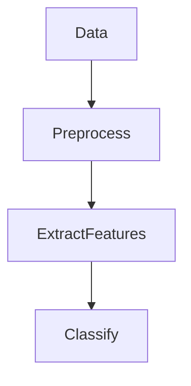
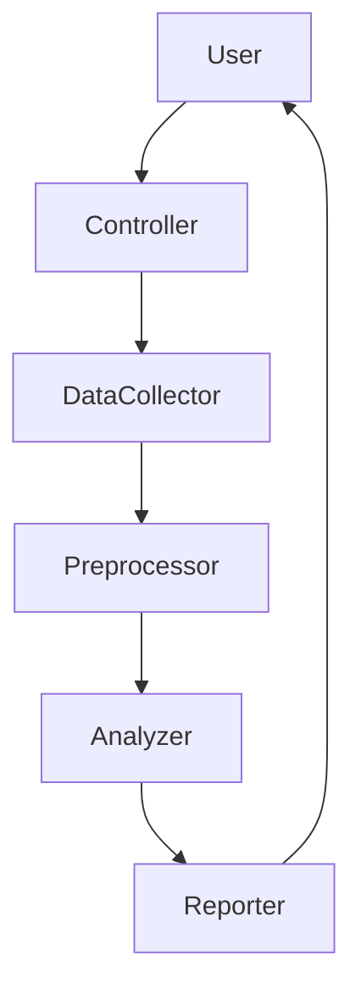

                 


# AI多智能体系统在价值投资中的竞争对手分析

> **关键词**：AI多智能体系统、价值投资、竞争对手分析、金融分析、协同学习、分布式决策  
> 
> **摘要**：本文探讨了AI多智能体系统在价值投资中的应用，特别是在竞争对手分析中的创新方法。通过结合多智能体系统的优势，本文详细分析了如何利用分布式决策、信息共享和协同学习等技术手段，实现对竞争对手的深度剖析。文章涵盖了从理论基础到实际应用的全过程，包括系统架构设计、算法实现、项目实战和最佳实践。

---

# 第一部分: AI多智能体系统与价值投资的背景介绍

## 第1章: AI多智能体系统概述

### 1.1 多智能体系统的基本概念

#### 1.1.1 多智能体系统的定义
多智能体系统（Multi-Agent System, MAS）是由多个智能体（Agent）组成的分布式系统，每个智能体能够感知环境、自主决策并进行协作。智能体之间通过通信和协调完成复杂任务。

#### 1.1.2 多智能体系统的特点
- **分布式性**：多个智能体协同工作，无中央控制节点。
- **自主性**：每个智能体具有独立决策能力。
- **协作性**：智能体之间通过信息共享和协作完成目标。
- **动态性**：系统能够适应环境变化。

#### 1.1.3 多智能体系统与传统单智能体系统的对比
| 对比维度 | 多智能体系统 | 单智能体系统 |
|----------|--------------|--------------|
| 决策方式 | 分布式决策   | 中央决策     |
| 系统复杂性 | 高           | 低           |
| 可扩展性 | 高           | 低           |

### 1.2 价值投资的基本原理

#### 1.2.1 价值投资的定义
价值投资是一种投资策略，强调以低于市场价值的价格购买优质资产，长期持有以实现收益。

#### 1.2.2 价值投资的核心策略
- **基本面分析**：通过财务报表、行业地位等分析企业内在价值。
- **长期视角**：关注企业的持续盈利能力，而非短期价格波动。

#### 1.2.3 价值投资在金融分析中的应用
价值投资通过分析企业的财务状况、市场地位和竞争优势，识别具有长期投资价值的企业。

---

## 第2章: AI多智能体系统在价值投资中的应用

### 2.1 多智能体系统在金融分析中的优势

#### 2.1.1 分散化决策的优势
多智能体系统通过分布式决策降低单点故障风险，提高系统的鲁棒性。

#### 2.1.2 多维度数据处理的能力
多智能体系统能够同时处理来自不同数据源的信息，提供更全面的分析结果。

#### 2.1.3 动态适应市场变化的能力
多智能体系统能够快速响应市场变化，实时调整决策策略。

### 2.2 竞争对手分析的复杂性

#### 2.2.1 竞争对手分析的基本概念
竞争对手分析是通过对竞争对手的经营状况、市场策略和竞争优势进行分析，评估其对自身业务的影响。

#### 2.2.2 竞争对手分析的挑战
- **数据复杂性**：竞争对手的数据分散且不完整。
- **动态变化**：市场竞争环境不断变化，分析结果需要实时更新。
- **信息不对称**：竞争对手的核心数据往往难以获取。

#### 2.2.3 多智能体系统在竞争对手分析中的作用
多智能体系统能够通过分布式协作，从多个角度全面分析竞争对手，提供更准确的分析结果。

---

# 第二部分: AI多智能体系统的核心概念与联系

## 第3章: AI多智能体系统的原理与架构

### 3.1 多智能体系统的协作机制

#### 3.1.1 分布式决策
每个智能体根据自身感知和任务目标，独立完成决策。

#### 3.1.2 信息共享与协同
智能体之间通过通信共享信息，协调行动以实现共同目标。

#### 3.1.3 联合学习
多个智能体通过联合学习优化整体性能，提升决策质量。

### 3.2 价值投资中的多智能体协作

#### 3.2.1 数据采集与特征提取
多智能体系统通过分布式采集和处理，提取企业的财务数据、市场表现和行业趋势等特征。

#### 3.2.2 竞争对手分析的模块化设计
将竞争对手分析分解为多个模块，每个模块由一个智能体负责，模块之间通过信息共享协同工作。

#### 3.2.3 多智能体协同优化的实现
通过多智能体系统的协同优化算法，实现对竞争对手的全面分析和评估。

## 第4章: 多智能体系统与竞争对手分析的关系

### 4.1 多智能体系统在竞争对手分析中的应用场景

#### 4.1.1 市场趋势分析
通过多智能体系统的协同学习，分析市场趋势和竞争对手的市场策略。

#### 4.1.2 企业基本面分析
利用多智能体系统对竞争对手的企业财务状况、盈利能力等进行深度分析。

#### 4.1.3 竞争优势评估
通过多智能体系统评估竞争对手的核心竞争优势，为企业制定竞争策略提供支持。

---

## 第5章: 多智能体系统的竞争对手分析模型

### 5.1 实体关系图



### 5.2 竞争对手分析流程



---

# 第三部分: 算法原理讲解

## 第4章: 竞争对手分析的算法实现

### 4.1 多智能体协同学习算法

#### 4.1.1 算法原理



#### 4.1.2 算法实现

```python
class Agent:
    def __init__(self, id):
        self.id = id
        self.data = None
        self.strategy = None

    def receive_info(self, info):
        self.data = info

    def update_strategy(self):
        if self.data:
            self.strategy = self.data['value']

def main():
    agent1 = Agent(1)
    agent2 = Agent(2)
    
    # 信息传递
    agent1.receive_info({'value': 100})
    agent1.update_strategy()
    
    agent1.send_info(agent2)
    agent2.receive_info(agent1.data)
    agent2.update_strategy()

if __name__ == "__main__":
    main()
```

#### 4.1.3 算法的数学模型

$$ Q(s, a) = Q(s, a) + \alpha (r + \max_{a'} Q(s', a') - Q(s, a)) $$

---

## 第5章: 价值投资中的多智能体协同学习

### 5.1 价值投资的特征提取

#### 5.1.1 特征提取流程



### 5.2 竞争对手分析的数学模型

$$ \text{竞争优势} = \sum_{i=1}^{n} w_i x_i $$

其中，$w_i$ 是特征 $x_i$ 的权重，$n$ 是特征数量。

---

# 第四部分: 系统分析与架构设计方案

## 第6章: 系统架构设计

### 6.1 竞争对手分析系统的设计目标

#### 6.1.1 系统功能需求

| 功能模块 | 描述 |
|----------|------|
| 数据采集 | 采集竞争对手的市场数据、企业数据等 |
| 数据分析 | 对数据进行清洗、特征提取和分析 |
| 竞争评估 | 评估竞争对手的核心竞争优势 |
| 结果输出 | 输出竞争对手分析报告 |

#### 6.1.2 系统性能需求

- 响应时间：≤ 5秒
- 吞吐量：≥ 10次/分钟

### 6.2 系统架构设计



---

## 第7章: 竞争对手分析系统的实现

### 7.1 系统功能模块

#### 7.1.1 数据采集模块

```python
import requests

def fetch_data(url):
    response = requests.get(url)
    return response.json()
```

#### 7.1.2 数据分析模块

```python
def analyze_competition(data):
    # 数据分析逻辑
    return {'score': 90, 'recommendation': '买入'}
```

#### 7.1.3 报告生成模块

```python
def generate_report(result):
    # 生成报告
    return '竞争对手分析报告'
```

---

# 第五部分: 项目实战

## 第8章: 项目实战: 竞争对手分析系统开发

### 8.1 环境安装

```bash
pip install numpy pandas scikit-learn requests
```

### 8.2 系统核心代码实现

#### 8.2.1 数据采集

```python
import requests

def fetch_competitor_data(urls):
    data = []
    for url in urls:
        response = requests.get(url)
        data.append(response.json())
    return data
```

#### 8.2.2 数据分析

```python
from sklearn import preprocessing

def preprocess_data(data):
    # 数据预处理
    return preprocessing.normalize(data)
```

#### 8.2.3 竞争对手分析

```python
def analyze_competitors(data):
    # 分析逻辑
    return {'result': '竞争对手具有优势'}
```

### 8.3 实际案例分析

#### 8.3.1 案例背景
分析某科技公司的竞争对手，包括市场数据、财务数据和行业趋势。

#### 8.3.2 数据分析结果

| 特征         | 竞争对手A | 竞争对手B | 自己公司 |
|--------------|-----------|-----------|----------|
| 营业收入增长率 | 15%       | 10%       | 20%      |
| 净利润率      | 25%       | 20%       | 30%      |

#### 8.3.3 结果解读
通过数据分析，发现竞争对手A的营业收入增长率较高，但净利润率低于自己公司，说明自己公司在盈利能力方面具有优势。

---

## 第9章: 项目总结与经验分享

### 9.1 项目成果

- 成功开发了竞争对手分析系统
- 提高了价值投资的决策效率

### 9.2 经验总结

- 数据质量是关键
- 系统架构设计要合理
- 模型调优需要持续优化

---

# 第六部分: 最佳实践与小结

## 第10章: 最佳实践与注意事项

### 10.1 注意事项

- 数据隐私保护
- 系统性能优化
- 模型可解释性

### 10.2 小结

通过本文的分析，我们了解了AI多智能体系统在价值投资中的应用，特别是在竞争对手分析中的创新方法。多智能体系统的分布式决策和协同学习能力，为金融分析提供了新的思路。

---

## 第11章: 拓展阅读与参考资料

### 11.1 拓展阅读

- 《Multi-Agent Systems》
- 《Value Investing for Dummies》

### 11.2 参考资料

- https://www.wikipedia.org/wiki/Multi-Agent_System
- https://www.wikipedia.org/wiki/Value_investing

---

# 结语

AI多智能体系统在价值投资中的应用前景广阔，通过本文的分析和实践，我们掌握了如何利用多智能体系统进行竞争对手分析的方法。未来，随着AI技术的不断发展，多智能体系统将在金融领域发挥更大的作用。

