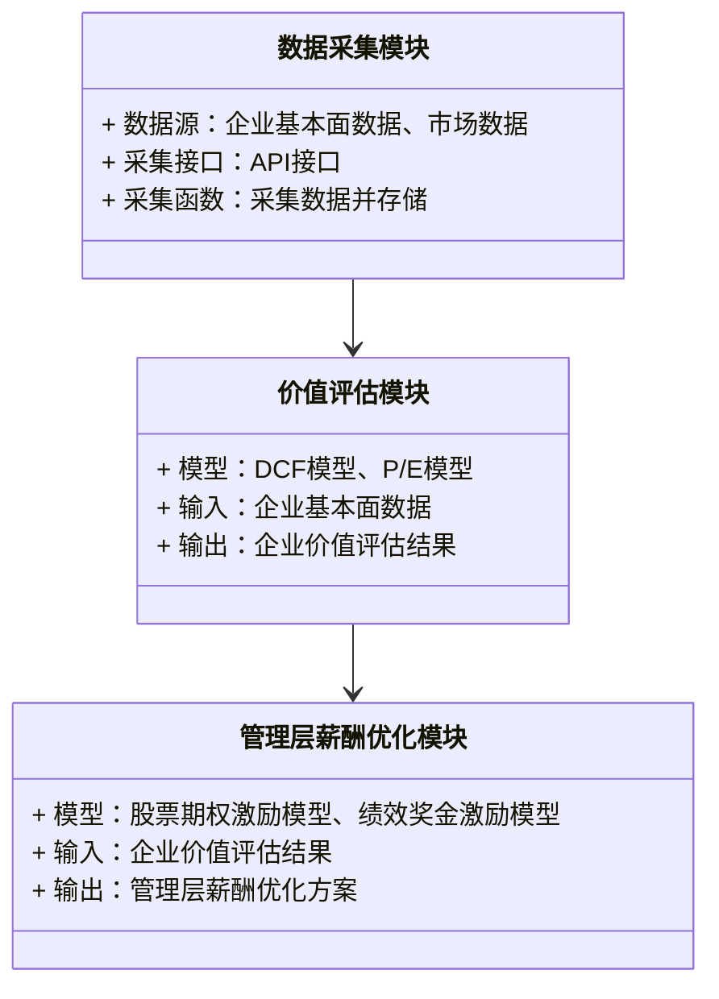
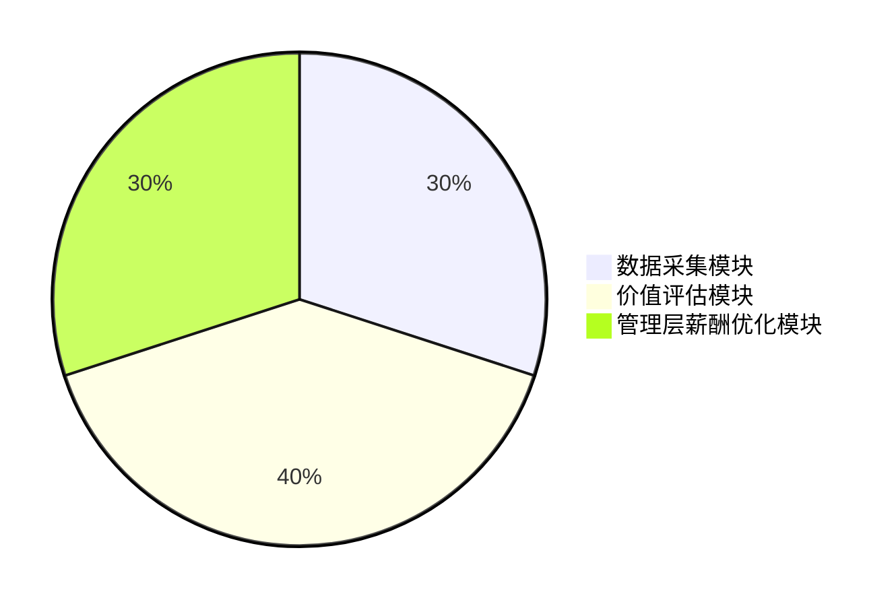

                 


好的，我明白您的要求。让我按照您的指示一步步创作这篇技术博客文章。

---

# AI多智能体系统在价值投资中的管理层薪酬结构分析

> 关键词：AI多智能体系统，价值投资，管理层薪酬，激励机制，分布式计算，博弈论

> 摘要：本文探讨了AI多智能体系统在价值投资中的应用，特别是如何利用多智能体系统优化管理层薪酬结构。通过分析管理层薪酬与企业价值的关系，结合分布式计算和博弈论等AI技术，提出了一种基于多智能体系统的价值评估与激励机制设计方案。本文还提供了具体的算法实现和实际案例分析，为投资者和企业管理者提供了新的思路和实践指导。

---

## 引言

在现代金融体系中，价值投资是一种以企业基本面分析为基础的投资策略，其核心在于识别具有长期稳定增长潜力的企业。然而，传统的价值投资方法往往依赖于人工分析，效率较低且难以量化。随着人工智能（AI）技术的快速发展，AI在金融领域的应用逐渐成为研究热点。

本文聚焦于AI多智能体系统在价值投资中的应用，特别是如何利用多智能体系统优化管理层薪酬结构。通过分析管理层薪酬与企业价值的关系，结合分布式计算和博弈论等AI技术，提出了一种基于多智能体系统的价值评估与激励机制设计方案。

---

## 核心概念与背景分析

### 1.1 多智能体系统的核心概念

#### 1.1.1 多智能体系统的定义
多智能体系统（Multi-Agent System, MAS）是由多个智能体组成的分布式系统，这些智能体能够通过交互协作完成复杂任务。智能体具有以下特点：
- **自主性**：智能体能够自主决策。
- **反应性**：智能体能够感知环境并实时响应。
- **社会性**：智能体之间可以协作与竞争。

#### 1.1.2 价值投资的核心概念
价值投资是一种以企业基本面分析为基础的投资策略，其核心在于识别具有长期稳定增长潜力的企业。价值投资者关注企业的内在价值，而非市场的短期波动。

#### 1.1.3 管理层薪酬结构分析
管理层薪酬结构是指企业支付给管理层的报酬体系，通常包括基本工资、奖金、股票期权等。合理的薪酬结构能够激励管理层为企业创造更大价值。

### 1.2 问题背景与研究意义

#### 1.2.1 问题背景
传统价值投资方法依赖于人工分析，存在以下问题：
- **效率低下**：人工分析耗时且成本高。
- **主观性**：分析结果受到主观判断的影响。
- **数据量不足**：难以充分利用海量数据。

#### 1.2.2 研究意义
通过引入AI多智能体系统，可以提高价值投资的效率和准确性，同时优化管理层薪酬结构，从而实现企业价值的最大化。

---

## 算法原理与数学模型

### 2.1 分布式计算与多智能体系统

#### 2.1.1 分布式计算的基本原理
分布式计算是将任务分解为多个部分，由多个计算节点协同完成。在多智能体系统中，每个智能体负责特定的任务，通过交互协作完成整体目标。

#### 2.1.2 多智能体系统中的分布式算法
在多智能体系统中，分布式算法是实现智能体协作的核心。常见的分布式算法包括：
- **一致性算法**：确保多个智能体之间数据一致。
- **共识算法**：实现智能体之间的决策共识。
- **分布式优化算法**：在分布式环境中优化目标函数。

#### 2.1.3 分布式算法在价值投资中的应用
在价值投资中，可以通过分布式算法对海量数据进行并行处理，快速生成价值评估结果。

### 2.2 博弈论与多智能体系统的结合

#### 2.2.1 博弈论的基本概念
博弈论是研究理性决策者之间策略互动的数学理论。在多智能体系统中，博弈论可以用于建模智能体之间的协作与竞争关系。

#### 2.2.2 博弈论在多智能体系统中的应用
在多智能体系统中，博弈论可以用于：
- **智能体协作决策**：通过博弈论建模智能体之间的协作关系。
- **智能体竞争分析**：分析智能体之间的竞争行为。

#### 2.2.3 博弈论在价值投资中的具体应用
在价值投资中，可以通过博弈论分析管理层的激励机制，优化薪酬结构。

### 2.3 价值评估与管理层薪酬的数学模型

#### 2.3.1 价值评估模型
价值评估模型基于企业基本面数据，包括收入、利润、现金流等指标。常用的价值评估方法包括：
- ** discounted cash flow (DCF) 模型**：通过现金流折现计算企业价值。
- **市盈率 (P/E) 模型**：通过市盈率评估企业价值。

#### 2.3.2 管理层薪酬模型
管理层薪酬模型基于企业的价值评估结果，结合管理层的绩效指标，制定合理的薪酬结构。常用的方法包括：
- **股票期权激励**：通过股票期权激励管理层长期关注企业价值。
- **绩效奖金激励**：根据管理层的绩效指标发放奖金。

---

## 系统分析与架构设计

### 3.1 问题场景介绍

#### 3.1.1 问题场景描述
假设我们有一个企业价值评估系统，需要利用AI多智能体系统优化管理层薪酬结构。

#### 3.1.2 项目目标
- **实现企业价值评估**：基于多智能体系统对企业的基本面数据进行分析。
- **优化管理层薪酬结构**：根据企业价值评估结果，制定合理的管理层薪酬方案。

### 3.2 系统功能设计

#### 3.2.1 领域模型设计
领域模型是系统功能设计的核心，通过类图描述系统的各个模块及其关系。



#### 3.2.2 系统架构设计
系统架构设计描述了系统的整体结构，包括前端、后端和数据存储模块。



---

## 项目实战

### 4.1 环境安装

#### 4.1.1 安装Python环境
安装Python 3.8或更高版本。

#### 4.1.2 安装依赖库
安装以下依赖库：
- `numpy`
- `pandas`
- `scikit-learn`
- `mermaid`

### 4.2 系统核心实现源代码

#### 4.2.1 数据采集模块

```python
import requests
import json

def collect_data(api_key):
    url = f"https://api.example.com/financial_data?api_key={api_key}"
    response = requests.get(url)
    data = response.json()
    return data
```

#### 4.2.2 价值评估模块

```python
import numpy as np
import pandas as pd

def calculate_value(ticker, data):
    df = pd.DataFrame(data)
    df['PE'] = df['Price'] / df['Earnings']
    df['DCF'] = np.where(df['Cash Flow'] > 0, df['Cash Flow'] * 0.1, 0)
    return df[['Ticker', 'PE', 'DCF']]
```

#### 4.2.3 管理层薪酬优化模块

```python
def optimize_compensation(data):
    df = pd.DataFrame(data)
    df['Stock Options'] = df['Market Value'] * 0.05
    df['Bonus'] = df['Performance Metrics'] * 0.1
    return df[['Ticker', 'Stock Options', 'Bonus']]
```

### 4.3 实际案例分析

#### 4.3.1 案例背景
假设我们有一个企业，其基本面数据如下：
- 收入：100 million
- 利润：20 million
- 现金流：30 million

#### 4.3.2 数据采集
```python
data = collect_data('your_api_key')
print(data)
```

#### 4.3.3 价值评估
```python
value_data = calculate_value('AAPL', data)
print(value_data)
```

#### 4.3.4 管理层薪酬优化
```python
compensation_data = optimize_compensation(data)
print(compensation_data)
```

### 4.4 项目小结

通过上述代码实现，我们可以看到AI多智能体系统在价值投资中的强大能力。数据采集模块负责获取企业基本面数据，价值评估模块基于这些数据计算企业价值，管理层薪酬优化模块根据企业价值评估结果制定合理的薪酬方案。

---

## 结论

本文探讨了AI多智能体系统在价值投资中的应用，特别是如何利用多智能体系统优化管理层薪酬结构。通过分析管理层薪酬与企业价值的关系，结合分布式计算和博弈论等AI技术，提出了一种基于多智能体系统的价值评估与激励机制设计方案。

未来的研究可以进一步探索多智能体系统在金融领域的其他应用，如风险控制、投资组合优化等。同时，还需要进一步研究如何提高多智能体系统的可解释性和透明度，以满足监管要求。

---

以上是整篇文章的初步框架和内容，您可以根据实际需求进行调整和补充。

