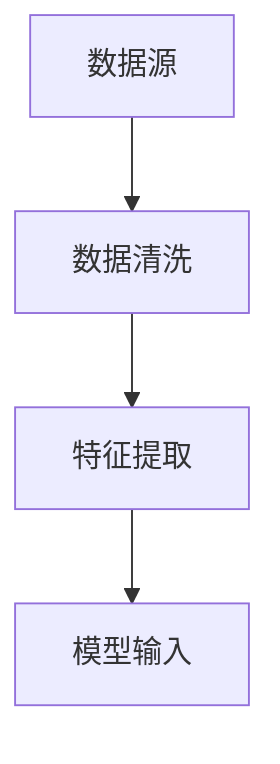
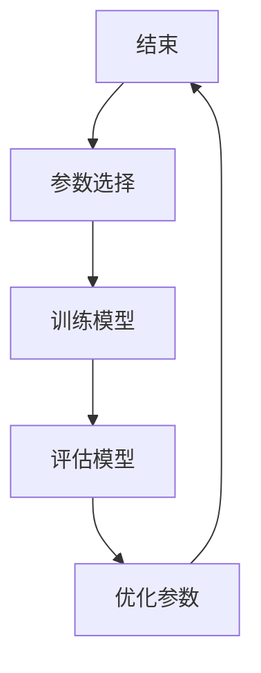
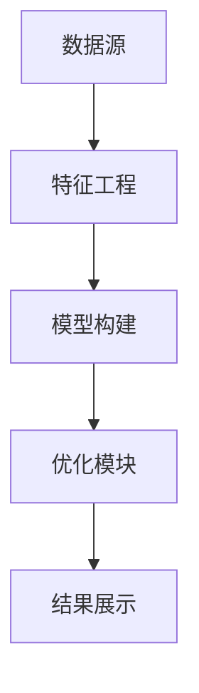

                 

# AI多智能体系统如何优化价值投资的税收筹划策略

> 关键词：AI、多智能体系统、价值投资、税收筹划策略、优化算法、金融数据分析

> 摘要：本文将探讨如何利用AI多智能体系统优化价值投资的税收筹划策略。通过分析多智能体系统的协同优化能力，结合价值投资的核心理念和税收筹划的基本原则，提出一种基于AI的多智能体协同优化模型，以实现投资收益的最大化和税务成本的最小化。本文将从背景与概念、系统设计、算法实现、案例分析和未来展望等方面展开详细论述，旨在为金融从业者和AI技术爱好者提供一种全新的视角和解决方案。

---

## 第一部分：AI多智能体系统的概述

### 第1章：AI多智能体系统的核心概念

#### 1.1 多智能体系统的基本定义

**多智能体系统（Multi-Agent System, MAS）**是由多个智能体（Agent）组成的分布式系统，每个智能体都是一个能够感知环境、自主决策的实体。智能体之间通过通信和协作完成复杂的任务，从而实现系统整体目标的优化。

- **智能体的定义**：智能体是一个能够感知环境、做出决策并采取行动的实体。它可以是一个软件程序、一个机器人或任何具有自主决策能力的系统。
- **多智能体系统的特征**：
  - 分布式：多个智能体协同工作，而非集中控制。
  - 协作性：智能体之间通过协作完成共同目标。
  - 反应式：智能体能够实时感知环境变化并做出反应。
  - 社会性：智能体之间存在社会关系，包括竞争与合作。

- **多智能体系统与单智能体系统的区别**：
  - **单智能体系统**：由一个中心化决策系统控制，决策过程集中，效率较高，但缺乏灵活性和容错性。
  - **多智能体系统**：多个智能体协同工作，具有更高的灵活性和容错性，但需要解决通信、协作和协调问题。

#### 1.2 AI在多智能体系统中的应用

**AI技术在多智能体系统中的应用**主要体现在以下几个方面：

- **智能体的自主决策**：通过机器学习和深度学习算法，智能体能够自主学习和优化决策策略。
- **智能体之间的协作与通信**：通过自然语言处理和强化学习技术，智能体能够实现高效的协作和通信。
- **复杂环境下的实时决策**：通过实时数据处理和分布式计算，智能体能够快速响应环境变化。

**价值投资与税收筹划的基本概念**：
- **价值投资**：以内在价值为导向，选择被市场低估的优质资产进行长期投资。
- **税收筹划**：通过合法的税务优化策略，降低税务成本，实现税后收益的最大化。

### 第2章：AI多智能体系统的背景与应用前景

#### 2.1 价值投资领域的痛点与挑战

**传统价值投资的局限性**：
- 市场波动的不确定性：传统价值投资依赖于对市场趋势的预测，但在复杂多变的市场环境中，预测的准确性难以保证。
- 税务成本的复杂性：传统价值投资忽视了税务成本对投资收益的影响，导致税后收益可能低于预期。
- 数据分析的局限性：传统方法依赖于人工分析，效率低且容易出错。

**税收筹划中的常见问题**：
- 税法的复杂性：不同地区的税法差异较大，税务优化需要考虑多种因素。
- 税务风险的不确定性：如何在合法合规的前提下实现税务优化是一个挑战。
- 税务成本与投资收益的平衡：如何在追求收益的同时最小化税务成本是一个复杂的问题。

#### 2.2 AI技术在金融领域的应用现状

**AI在金融数据分析中的应用**：
- **数据清洗与特征提取**：通过机器学习算法对金融数据进行清洗和特征提取，为后续分析提供高质量的数据支持。
- **市场趋势预测**：利用深度学习模型（如LSTM）预测股票价格走势，帮助投资者做出更明智的决策。
- **风险评估与管理**：通过AI技术评估投资组合的风险，帮助投资者规避潜在的市场风险。

**AI在投资决策中的应用**：
- **智能投顾**：通过AI技术为投资者提供个性化的投资建议，帮助投资者制定最优的投资策略。
- **量化交易**：利用算法交易技术，通过高频交易和大数据分析实现收益最大化。
- **情绪分析**：通过自然语言处理技术分析市场情绪，辅助投资决策。

#### 2.3 多智能体系统在金融领域的优势

**多智能体系统的协同优化能力**：
- 通过智能体之间的协作，实现投资组合的优化和税务成本的最小化。
- 多智能体系统能够同时考虑多个目标（如收益、风险、税务成本等），从而实现全局最优。

**多智能体系统在复杂决策中的优势**：
- 在复杂多变的市场环境中，多智能体系统能够快速响应环境变化，实现动态优化。
- 多智能体系统能够处理多个目标之间的冲突，找到最优的平衡点。

---

## 第二部分：价值投资与税收筹划的基本策略

### 第3章：价值投资的核心策略

#### 3.1 价值投资的基本原则

**质、值、量分析**：
- **质量分析**：选择具有竞争优势的公司，确保投资标的的长期盈利能力。
- **价值分析**：评估公司的内在价值，寻找被市场低估的投资标的。
- **量分析**：根据市场容量和流动性需求，确定合理的投资规模。

**长期投资与价值发现**：
- 长期投资的核心理念是关注公司的长期价值，而非短期价格波动。
- 通过持续的研究和分析，发现具有持续增长潜力的公司。

**市场波动与投资机会**：
- 在市场波动中寻找投资机会，利用短期价格波动实现收益最大化。
- 通过技术分析和基本面分析相结合，捕捉市场中的投资机会。

#### 3.2 税收筹划的基本策略

**税收筹划的合法性原则**：
- 税收筹划必须在法律允许的范围内进行，确保所有操作的合法性。
- 避免采用非法手段降低税务成本，如偷税漏税等。

**税收筹划的经济利益最大化原则**：
- 在合法合规的前提下，尽可能降低税务成本，实现税后收益的最大化。
- 通过合理的税务规划，优化投资结构，提高整体收益。

**税收筹划的时间与空间维度**：
- 时间维度：通过合理安排投资时间和退出时间，优化税务成本。
- 空间维度：利用不同地区的税收政策差异，实现税务优化。

### 第4章：价值投资与税收筹划的结合

#### 4.1 价值投资中的税务优化

**投资收益的税务影响**：
- 不同类型的投资收益（如股息、资本利得）的税务处理方式不同，需要在投资决策中充分考虑。
- 通过合理安排投资结构，降低资本利得税和股息税的负担。

**税收筹划对投资决策的影响**：
- 税收筹划会影响投资组合的构建，如选择免税债券或税收优惠产品。
- 税收筹划需要在投资决策中提前考虑，确保税务成本最小化。

**税后收益最大化的原则**：
- 在选择投资标的时，不仅要考虑其内在价值，还要考虑其税务成本。
- 通过综合分析，选择最优的投资组合，实现税后收益的最大化。

#### 4.2 税收筹划中的

---

## 第三部分：AI多智能体系统在价值投资中的应用

### 第5章：数据获取与特征工程

#### 5.1 数据获取与预处理

**金融数据的获取**：
- 从多种数据源获取金融数据，包括股票价格、财务报表、市场新闻等。
- 数据清洗：去除噪声数据，处理缺失值和异常值。

**特征工程的核心步骤**：
- **特征选择**：根据业务需求选择关键特征，如市盈率、市净率、ROE等。
- **特征提取**：通过数据挖掘技术提取潜在特征，如动量效应、反转效应等。
- **特征变换**：对特征进行标准化、归一化处理，确保模型输入的均衡性。

#### 5.2 数据流图

---

### 第6章：模型构建与优化

#### 6.1 模型构建的核心步骤

**模型选择**：
- 根据具体问题选择合适的模型，如回归模型、分类模型、强化学习模型等。
- 对比不同模型的性能，选择最优模型。

**模型训练与优化**：
- 使用训练数据对模型进行训练，调整模型参数，优化模型性能。
- 通过交叉验证等方法评估模型的泛化能力，防止过拟合。

#### 6.2 模型优化的实现

**模型优化算法**：
- **网格搜索**：遍历所有可能的参数组合，找到最优参数。
- **随机搜索**：随机选择参数组合，减少计算量。
- **贝叶斯优化**：基于概率模型优化参数。

**模型优化流程图**

---

## 第四部分：税收筹划策略的优化

### 第7章：税法分析与优化模型

#### 7.1 税法分析的核心步骤

**税法分析**：
- 研究相关税法，了解不同投资行为的税务处理方式。
- 确定税务优化的空间和范围，如资本利得税、股息税等。

**优化模型的设计**：
- 建立数学模型，描述投资收益与税务成本之间的关系。
- 通过优化算法，寻找最优的投资组合，实现税后收益的最大化。

#### 7.2 税收优化模型

**数学模型**：
$$ \text{最大化} \quad \sum_{i=1}^{n} w_i \times r_i - \sum_{i=1}^{n} w_i \times t_i $$
其中：
- \( w_i \) 表示第 \( i \) 个资产的投资权重。
- \( r_i \) 表示第 \( i \) 个资产的收益率。
- \( t_i \) 表示第 \( i \) 个资产的税务成本。

---

### 第8章：智能税务风险管理

#### 8.1 税务风险管理的核心步骤

**风险识别**：
- 识别可能的税务风险，如税务政策变化、税务合规性问题等。
- 通过实时监控，发现潜在的税务风险。

**风险评估与控制**：
- 评估税务风险的影响程度，制定相应的风险控制策略。
- 通过动态调整投资组合，降低税务风险。

---

## 第五部分：系统实现与案例分析

### 第9章：系统设计与实现

#### 9.1 系统设计的核心步骤

**系统功能设计**：
- **数据采集模块**：从多种数据源获取金融数据。
- **特征工程模块**：对数据进行清洗、特征提取和特征变换。
- **模型构建模块**：选择模型，训练模型，优化模型。
- **税收优化模块**：分析税法，建立优化模型，实现税务优化。
- **结果展示模块**：展示投资组合的优化结果和税务优化效果。

**系统架构设计**

---

## 第六部分：综合优化与策略执行

### 第10章：多目标优化与动态调整

#### 10.1 多目标优化的核心步骤

**多目标优化模型**：
- 建立多个目标函数，如最大化收益、最小化风险、最小化税务成本。
- 通过优化算法，寻找多个目标之间的最优平衡点。

**动态调整机制**：
- 根据市场环境的变化，动态调整投资组合。
- 通过反馈机制，实时优化投资策略。

---

## 第七部分：未来展望与挑战

### 第11章：未来展望与挑战

#### 11.1 未来的技术趋势

**技术趋势**：
- **AI技术的进一步发展**：深度学习、强化学习等技术的不断进步，将为多智能体系统提供更强大的支持。
- **多智能体系统的广泛应用**：随着计算能力的提升，多智能体系统将在更多领域得到应用。
- **数据隐私与安全**：随着数据量的增加，数据隐私和安全问题将更加重要。

#### 11.2 挑战与解决方案

**挑战**：
- **数据隐私与安全**：如何在保证数据隐私的前提下，实现数据的高效利用。
- **模型的可解释性**：如何提高AI模型的可解释性，增强用户对模型的信任。
- **系统的实时性**：如何在复杂多变的市场环境中，实现系统的实时优化。

**解决方案**：
- **数据加密与隐私保护**：采用加密技术，保护数据隐私。
- **模型可解释性增强**：通过可视化和解释性模型，提高模型的可解释性。
- **实时优化技术**：采用分布式计算和边缘计算技术，实现系统的实时优化。

---

## 参考文献

1. Russell, S. J., & Norvig, P. (2010). Artificial Intelligence: A Modern Approach.
2. Lint, J. C., & Merton, R. C. (1994). Theory of Asset Regulation.
3. Grinblatt, M., & Titman, S. (2002). Financial Markets and Corporate Strategy.
4.

