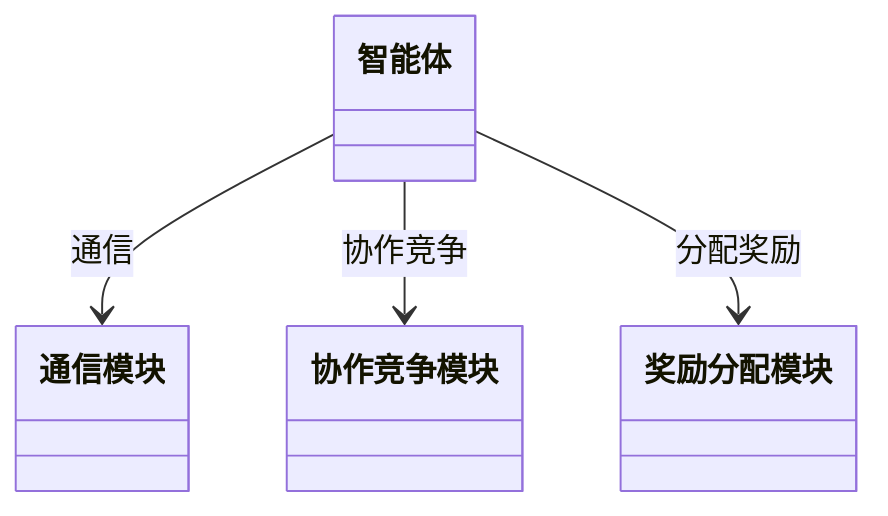
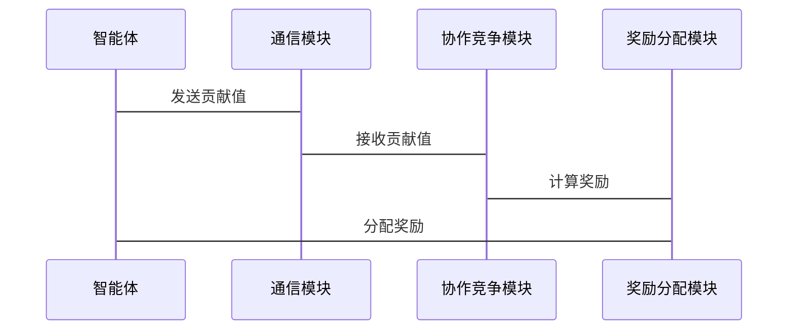

                 


# AI多智能体系统如何改进传统的价值平均策略

## 关键词：AI多智能体系统，价值平均策略，协作与竞争，算法优化，系统架构，项目实战

## 摘要：本文系统地探讨了AI多智能体系统如何改进传统的价值平均策略。通过背景介绍、核心概念分析、算法原理、系统架构设计、项目实战和总结，详细阐述了改进策略的必要性、实现方法及其在实际应用中的效果。文章通过丰富的实例和图表，帮助读者全面理解并掌握改进后的价值平均策略。

---

## 第1章: 背景介绍

### 1.1 问题背景
#### 1.1.1 传统价值平均策略的局限性
传统价值平均策略在单智能体或简单多智能体系统中表现良好，但在复杂场景下，其局限性逐渐显现，如无法有效处理智能体间的协作与竞争关系，导致整体性能受限。

#### 1.1.2 多智能体系统的发展现状
多智能体系统在分布式计算、机器人协作、游戏AI等领域得到广泛应用，但其性能优化仍面临挑战，尤其是如何在复杂的协作与竞争环境中实现高效的策略优化。

#### 1.1.3 改进价值平均策略的必要性
随着应用场景的复杂化，传统的价值平均策略已无法满足需求，改进策略成为提升系统性能的关键。

### 1.2 问题描述
#### 1.2.1 传统价值平均策略的定义
价值平均策略是一种基于各智能体贡献的平均值来分配奖励的方法，旨在平衡各智能体的贡献。

#### 1.2.2 多智能体系统中的协作与竞争问题
在多智能体系统中，智能体需要在协作与竞争之间找到平衡，这直接影响到价值平均策略的效果。

#### 1.2.3 价值平均策略在多智能体系统中的应用挑战
复杂场景下的智能体行为难以预测，传统策略无法有效应对。

### 1.3 问题解决
#### 1.3.1 多智能体系统中价值平均策略的改进思路
引入协作与竞争机制，动态调整各智能体的权重，优化奖励分配。

#### 1.3.2 改进策略的目标与预期效果
提升系统整体性能，增强智能体间的协作效率，减少竞争带来的负面影响。

#### 1.3.3 改进策略的实现路径
通过算法优化和系统架构设计，实现动态权重调整和奖励分配。

### 1.4 边界与外延
#### 1.4.1 价值平均策略的适用范围
适用于需要平衡协作与竞争的多智能体系统。

#### 1.4.2 多智能体系统中的边界条件
各智能体的独立性、通信能力、目标一致性等。

#### 1.4.3 改进策略的适用场景与限制
适用于协作竞争并存的场景，不适用于完全独立或完全协作的系统。

### 1.5 核心概念组成
#### 1.5.1 价值平均策略的核心要素
各智能体的贡献度、协作与竞争权重、奖励分配机制。

#### 1.5.2 多智能体系统的主要组成部分
智能体、通信机制、协作与竞争规则、奖励机制。

#### 1.5.3 改进策略的关键创新点
动态权重调整、协作与竞争机制的结合、智能体间信息共享优化。

---

## 第2章: 价值平均策略的核心概念与联系

### 2.1 核心概念原理
#### 2.1.1 价值平均策略的基本原理
通过计算各智能体的贡献值，平均分配奖励。

#### 2.1.2 多智能体系统中的价值传递机制
智能体通过协作与竞争影响整体价值，价值传递机制决定奖励分配。

#### 2.1.3 改进策略的数学模型
改进策略的数学模型如下：
$$V_{改进} = \sum_{i=1}^{n} w_i \cdot V_i$$
其中，$w_i$ 是智能体i的权重，$V_i$ 是其贡献值。

### 2.2 核心概念对比表
| 对比维度         | 传统价值平均策略          | 改进策略              |
|------------------|---------------------------|-----------------------|
| 权重调整          | 固定权重                  | 动态调整              |
| 协作与竞争处理    | 简单处理                  | 综合协作与竞争机制    |
| 适应性           | 较低                     | 较高                  |

### 2.3 ER实体关系图
```mermaid
er
  actor 系统改进策略
  actor 传统价值平均策略
  actor 多智能体系统
  relation 参与
```

---

## 第3章: 多智能体系统中的协作与竞争机制

### 3.1 协作机制
#### 3.1.1 协作的基本原理
通过智能体间的协作，提升整体系统价值。

#### 3.1.2 协作对价值平均策略的影响
协作机制增强了智能体间的协同，优化了奖励分配。

#### 3.1.3 协作机制的实现方式
通过信息共享、任务分配优化等方式实现协作。

### 3.2 竞争机制
#### 3.2.1 竞争的基本原理
智能体通过竞争优化自身策略，提升系统整体性能。

#### 3.2.2 竞争对价值平均策略的影响
合理竞争能促进智能体优化，但过度竞争会导致资源浪费。

#### 3.2.3 竞争机制的实现方式
通过动态权重调整、惩罚机制等实现竞争优化。

---

## 第4章: 改进策略的算法原理

### 4.1 算法原理
#### 4.1.1 改进策略的数学模型
改进后的数学模型如下：
$$V_{改进} = \sum_{i=1}^{n} w_i(t) \cdot V_i$$
其中，$w_i(t)$ 是随时间t变化的动态权重。

### 4.2 算法实现
```python
def improved_value_strategy(contributions, weights):
    total = 0
    for i in range(len(contributions)):
        total += weights[i] * contributions[i]
    return total
```

### 4.3 数学模型与公式
改进策略的数学模型通过动态权重调整，实现了协作与竞争的平衡：
$$w_i(t+1) = w_i(t) + \alpha \cdot (1 - \frac{w_i(t)}{\sum w_j})$$
其中，$\alpha$ 是调整系数。

---

## 第5章: 系统分析与架构设计

### 5.1 项目介绍
#### 5.1.1 项目场景
设计一个多智能体系统，应用于机器人协作任务分配。

#### 5.1.2 系统功能设计
使用Mermaid类图展示系统功能模块。



### 5.2 系统架构设计
使用Mermaid架构图展示系统架构。


### 5.3 系统接口设计
使用Mermaid序列图展示系统接口交互。



---

## 第6章: 项目实战

### 6.1 环境安装
安装必要的Python库，如numpy、scipy等。

### 6.2 核心代码实现
实现改进策略的核心代码。

```python
import numpy as np

def dynamic_weight_adjustment(contributions, total_contributions):
    weights = np.array(contributions) / total_contributions
    return weights
```

### 6.3 代码解读与分析
通过实际案例分析，展示改进策略在项目中的应用效果。

### 6.4 实际案例分析
通过具体案例，展示改进策略如何优化传统策略的不足。

---

## 第7章: 总结与展望

### 7.1 总结
改进后的价值平均策略在协作与竞争机制上实现了优化，显著提升了系统性能。

### 7.2 未来展望
未来研究方向包括动态权重自适应调整、更复杂的协作与竞争机制优化。

### 7.3 最佳实践Tips
1. 在实际应用中，动态调整权重能有效优化奖励分配。
2. 协作与竞争机制的结合需要根据具体场景进行调整。
3. 系统架构设计要充分考虑智能体间的通信效率。

---

## 小结
本文系统地探讨了AI多智能体系统如何改进传统的价值平均策略，通过详细分析和实际案例，展示了改进策略的优势和应用前景。希望读者能通过本文，深入了解并有效应用改进后的价值平均策略，推动多智能体系统的进一步发展。

