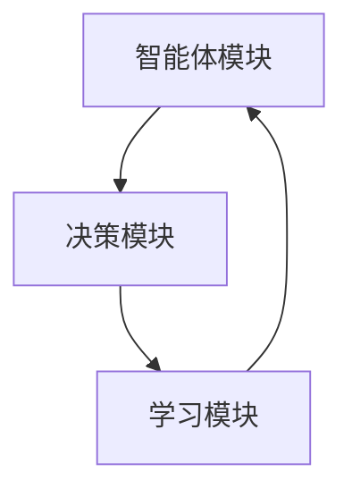

                 


# AI多智能体系统如何改进传统的价值投资师徒培养模式

## 关键词
- AI多智能体系统
- 价值投资
- 师徒培养模式
- 投资决策
- 知识传递

## 摘要
本文探讨了如何利用AI多智能体系统改进传统的价值投资师徒培养模式。通过分析传统模式的局限性，结合多智能体系统的核心优势，提出了一种创新的解决方案。文章详细介绍了多智能体系统在价值投资中的应用，包括算法原理、系统架构设计以及实际案例分析，展示了如何通过技术手段优化投资决策和知识传递过程。

---

## 第1章: 问题背景与核心概念

### 1.1 问题背景

#### 1.1.1 传统价值投资师徒培养模式的局限性
传统价值投资的师徒培养模式依赖于经验丰富的导师手把手传授知识，这种方式存在效率低、知识传递不系统、难以规模化等问题。具体表现在：
- **知识传递效率低**：一对一或一对少数的模式难以满足大量新手的需求。
- **经验固化**：传统模式难以捕捉市场变化，知识更新缓慢。
- **缺乏数据支持**：缺乏系统化数据支持，难以量化投资决策的优劣。

#### 1.1.2 AI技术在金融领域的应用现状
AI技术在金融领域的应用日益广泛，尤其是在投资决策、风险评估和市场预测方面。然而，现有的AI工具多聚焦于单点任务（如股票筛选），缺乏对投资决策过程的系统化支持。

#### 1.1.3 多智能体系统的核心优势
多智能体系统通过多个智能体之间的协作与竞争，能够更好地模拟复杂的金融市场环境，并为投资决策提供更全面的支持。其核心优势包括：
- **分布式计算能力**：能够处理大规模数据和复杂任务。
- **协作与竞争机制**：通过智能体之间的协作，模拟真实的投资决策过程。
- **动态适应性**：能够快速响应市场变化。

### 1.2 问题描述

#### 1.2.1 传统师徒培养模式的效率瓶颈
传统师徒培养模式效率低下，难以满足现代金融市场的快速变化需求。新手投资者需要长时间学习和实践，而导师的资源有限，导致培养效率难以提升。

#### 1.2.2 价值投资中的知识传递挑战
价值投资的知识传递不仅需要理论指导，还需要大量实践经验。传统师徒模式难以系统化地传递这些知识，导致新手投资者难以快速成长。

#### 1.2.3 现有AI工具在投资教育中的不足
现有的AI工具多专注于单一任务，缺乏对投资决策过程的系统化支持。它们难以模拟复杂的市场环境和多维度的投资决策过程。

### 1.3 问题解决与边界

#### 1.3.1 多智能体系统如何改进传统模式
通过构建一个多智能体系统，每个智能体可以代表一个投资者或投资决策的某个环节。这些智能体通过协作与竞争，模拟真实的投资环境，帮助新手投资者快速学习和成长。

#### 1.3.2 系统的边界与适用场景
系统的边界包括：
- **输入**：市场数据、历史投资案例、新手投资者的学习需求。
- **输出**：个性化的投资决策建议、学习路径优化。
- **限制**：目前主要适用于模拟投资环境，实际操作中仍需结合人类专家的判断。

#### 1.3.3 核心要素与组成结构
多智能体系统的组成包括：
- **智能体**：代表投资者或投资决策环节。
- **通信机制**：智能体之间的信息传递。
- **协作与竞争机制**：智能体之间的合作与竞争规则。
- **学习模块**：智能体的学习与优化机制。

---

## 第2章: 核心概念与联系

### 2.1 多智能体系统的核心原理

#### 2.1.1 多智能体系统的定义与特征
多智能体系统是由多个智能体组成的系统，每个智能体都有自己的目标和行为规则。其特征包括：
- **自主性**：智能体能够独立决策。
- **协作性**：智能体之间可以协作完成复杂任务。
- **反应性**：智能体能够实时响应环境变化。

#### 2.1.2 智能体之间的通信与协作机制
智能体之间的通信与协作是多智能体系统的核心。通过通信，智能体可以共享信息；通过协作，智能体可以共同完成任务。常见的协作机制包括：
- **分布式计算**：任务分解到多个智能体。
- **协商机制**：智能体通过协商分配任务。

#### 2.1.3 多智能体系统的分类与应用场景
多智能体系统可以分为集中式和分布式两类。在价值投资中，分布式系统更适用于模拟复杂的市场环境。

### 2.2 价值投资的系统化分析

#### 2.2.1 价值投资的基本原理
价值投资的核心在于寻找被市场低估的资产，并长期持有。其基本原理包括：
- **基本面分析**：分析企业的财务状况和行业地位。
- **安全边际**：购买价格低于内在价值。
- **长期投资**：避免短期市场波动的干扰。

#### 2.2.2 投资决策的关键因素
投资决策的关键因素包括：
- **市场数据**：如股票价格、财务报表。
- **行业趋势**：如行业周期、政策变化。
- **投资者心理**：如市场情绪、投资者风险偏好。

#### 2.2.3 系统化投资决策的优势
系统化投资决策的优势在于：
- **数据驱动**：基于大量数据进行决策。
- **减少人为错误**：通过系统化方法降低情绪干扰。
- **快速响应**：能够快速适应市场变化。

### 2.3 多智能体系统与价值投资的关联

#### 2.3.1 多智能体系统在投资决策中的作用
多智能体系统可以模拟多个投资者的行为，帮助新手投资者理解市场动态。例如：
- **模拟交易**：智能体可以模拟不同投资者的交易行为。
- **风险评估**：通过智能体的协作，评估不同投资组合的风险。

#### 2.3.2 多智能体系统如何优化知识传递
多智能体系统通过模拟投资环境，可以帮助新手投资者快速学习和成长。例如：
- **虚拟交易环境**：新手可以在虚拟环境中进行交易，降低风险。
- **实时反馈**：系统可以提供实时的反馈，帮助新手理解投资决策的后果。

#### 2.3.3 系统化决策与传统师徒模式的结合
系统化决策与传统师徒模式的结合可以通过以下方式实现：
- **理论与实践结合**：系统提供理论知识，导师提供实践指导。
- **个性化学习路径**：系统根据新手的学习情况，提供个性化的学习建议。

---

## 第3章: 算法原理与数学模型

### 3.1 多智能体系统的核心算法

#### 3.1.1 分布式计算与通信协议
分布式计算是多智能体系统的核心算法之一。通信协议用于智能体之间的信息传递。例如：
- **任务分配**：智能体通过通信协议协商任务。
- **信息共享**：智能体共享市场数据和投资策略。

#### 3.1.2 协作与竞争机制
协作与竞争机制是多智能体系统的关键。例如：
- **协作机制**：智能体通过协商共同完成任务。
- **竞争机制**：智能体之间通过竞争优化决策。

#### 3.1.3 自适应学习算法
自适应学习算法用于智能体的学习与优化。例如：
- **强化学习**：智能体通过奖励机制优化决策。
- **监督学习**：智能体通过历史数据学习投资策略。

### 3.2 价值投资决策的数学模型

#### 3.2.1 投资组合优化的数学表达
投资组合优化的目标是最大化收益并最小化风险。数学表达如下：
$$ \text{最大化} \quad \sum_{i=1}^{n} w_i r_i $$
$$ \text{约束} \quad \sum_{i=1}^{n} w_i = 1 $$
其中，\( w_i \) 是资产 \( i \) 的权重，\( r_i \) 是资产 \( i \) 的预期收益。

#### 3.2.2 风险评估与收益预测模型
风险评估可以使用方差来衡量投资组合的风险：
$$ \text{方差} = \sum_{i=1}^{n} w_i^2 \sigma_i^2 $$
其中，\( \sigma_i \) 是资产 \( i \) 的标准差。

#### 3.2.3 多目标优化的数学框架
多目标优化的目标是在多个目标之间找到平衡。例如：
- **最大化收益**：\( \text{最大化} \quad \sum_{i=1}^{n} w_i r_i \)
- **最小化风险**：\( \text{最小化} \quad \sum_{i=1}^{n} w_i^2 \sigma_i^2 \)

### 3.3 算法实现与案例分析

#### 3.3.1 算法实现的代码示例
以下是一个简单的强化学习算法实现：
```python
class Agent:
    def __init__(self, state_space, action_space):
        self.state_space = state_space
        self.action_space = action_space
        # 初始化策略参数
        self.theta = np.random.randn(state_space, action_space)

    def act(self, state):
        # 根据策略选择动作
        action_probs = softmax(self.theta[state])
        action = np.random.choice(self.action_space, p=action_probs)
        return action

    def update(self, state, action, reward):
        # 更新策略参数
        self.theta[state] += reward * (1 - np.mean(softmax(self.theta[state])))
```

#### 3.3.2 实际案例的详细分析
假设我们构建一个模拟股票交易的多智能体系统，每个智能体代表一个投资者。智能体通过强化学习不断优化自己的交易策略。通过模拟交易，新手投资者可以学习到如何在不同市场环境下做出最优决策。

#### 3.3.3 算法效果的评估与改进
算法效果可以通过以下几个指标进行评估：
- **收益**：投资组合的总收益。
- **风险**：投资组合的风险。
- **稳定性**：算法在不同市场环境下的稳定性。

---

## 第4章: 系统分析与架构设计

### 4.1 问题场景介绍

#### 4.1.1 传统师徒培养模式的痛点
传统师徒培养模式的痛点包括：
- **效率低**：一对一模式难以满足大量需求。
- **知识传递不系统**：难以系统化传递投资知识。
- **缺乏数据支持**：难以量化投资决策的优劣。

#### 4.1.2 AI多智能体系统的应用场景
AI多智能体系统可以应用于：
- **虚拟交易环境**：新手投资者可以在虚拟环境中进行交易，降低风险。
- **个性化学习路径**：根据新手的学习情况，提供个性化的学习建议。
- **实时反馈**：系统可以提供实时的反馈，帮助新手理解投资决策的后果。

#### 4.1.3 系统的目标与功能需求
系统的目标是通过多智能体系统模拟投资环境，帮助新手投资者快速学习和成长。功能需求包括：
- **虚拟交易环境**：支持新手进行虚拟交易。
- **实时反馈**：提供实时的投资决策反馈。
- **个性化学习路径**：根据新手的学习情况，提供个性化的学习建议。

### 4.2 系统功能设计

#### 4.2.1 多智能体协作模块
多智能体协作模块是系统的核心，负责智能体之间的协作与竞争。具体功能包括：
- **任务分配**：智能体通过通信协议协商任务。
- **信息共享**：智能体共享市场数据和投资策略。
- **协作机制**：智能体通过协商共同完成任务。

#### 4.2.2 价值投资决策模块
价值投资决策模块负责根据市场数据和智能体的决策，生成投资建议。具体功能包括：
- **基本面分析**：分析企业的财务状况和行业地位。
- **安全边际评估**：评估购买价格是否低于内在价值。
- **长期投资建议**：根据市场环境，提供长期投资建议。

#### 4.2.3 知识传递与学习模块
知识传递与学习模块负责将投资知识传递给新手投资者，并根据其学习情况，提供个性化的学习建议。具体功能包括：
- **理论知识传递**：通过系统传递价值投资的基本原理。
- **实践指导**：通过虚拟交易环境，指导新手进行实践。
- **个性化学习路径**：根据新手的学习情况，提供个性化的学习建议。

### 4.3 系统架构设计

#### 4.3.1 系统架构的总体设计
系统的总体架构包括以下几个部分：
- **智能体模块**：负责智能体的协作与竞争。
- **决策模块**：负责生成投资建议。
- **学习模块**：负责知识传递与学习。

#### 4.3.2 模块之间的交互关系
模块之间的交互关系可以通过以下流程图表示：



#### 4.3.3 系统的可扩展性与维护性
系统的可扩展性体现在：
- **模块化设计**：各模块独立，便于扩展。
- **灵活的通信机制**：支持多种通信协议，便于扩展。

---

## 第5章: 项目实战与实现

### 5.1 环境安装与配置

#### 5.1.1 开发环境的选择与安装
推荐使用Python作为开发语言，安装以下工具：
- **Python 3.x**
- **NumPy**
- **Matplotlib**
- **TensorFlow**

#### 5.1.2 依赖库的安装与配置
安装以下依赖库：
```bash
pip install numpy matplotlib tensorflow
```

#### 5.1.3 数据集的准备与预处理
数据集可以从金融数据提供商获取，预处理包括：
- **清洗数据**：处理缺失值和异常值。
- **特征工程**：提取有用的特征，如移动平均线、相对强弱指数等。

### 5.2 系统核心实现

#### 5.2.1 多智能体系统的实现代码
以下是多智能体系统的实现代码：

```python
import numpy as np
import matplotlib.pyplot as plt

class Agent:
    def __init__(self, state_space, action_space):
        self.state_space = state_space
        self.action_space = action_space
        self.theta = np.random.randn(state_space, action_space)

    def act(self, state):
        action_probs = softmax(self.theta[state])
        action = np.random.choice(self.action_space, p=action_probs)
        return action

    def update(self, state, action, reward):
        self.theta[state] += reward * (1 - np.mean(softmax(self.theta[state])))

def softmax(x):
    return np.exp(x) / np.sum(np.exp(x))
```

#### 5.2.2 价值投资决策模块的实现
以下是价值投资决策模块的实现代码：

```python
import numpy as np

def value_investment_decision(prices, state):
    # 计算移动平均线
    ma = np.mean(prices[-state:])
    # 计算相对强弱指数
    rsi = (prices[-1] - np.min(prices[-state:])) / (np.max(prices[-state:]) - np.min(prices[-state:]))
    # 判断是否买入
    if prices[-1] < ma and rsi < 30:
        return '买入'
    elif prices[-1] > ma and rsi > 70:
        return '卖出'
    else:
        return '持有'
```

#### 5.2.3 知识传递与学习模块的实现
以下是知识传递与学习模块的实现代码：

```python
def personalized_learning_path(student_progress, target_progress):
    # 根据学生的学习进度，生成个性化学习路径
    if student_progress < target_progress / 2:
        return '基础理论学习'
    elif student_progress < target_progress:
        return '案例分析与实践'
    else:
        return '高级策略学习'
```

### 5.3 代码应用解读与分析

#### 5.3.1 多智能体系统代码解读
多智能体系统的代码实现了智能体的协作与竞争。通过强化学习算法，智能体不断优化自己的决策策略。

#### 5.3.2 价值投资决策代码解读
价值投资决策模块的代码实现了基于移动平均线和相对强弱指数的价值投资策略。通过分析市场数据，生成买入、卖出或持有的决策。

#### 5.3.3 知识传递与学习代码解读
知识传递与学习模块的代码根据学生的学习进度，生成个性化的学习路径。这有助于学生根据自己的学习情况，制定合适的学习计划。

### 5.4 实际案例分析与详细讲解

#### 5.4.1 案例背景介绍
假设我们有10个新手投资者，希望通过多智能体系统进行价值投资学习。系统为每个投资者分配一个智能体，模拟真实的投资环境。

#### 5.4.2 案例实现步骤
1. **环境初始化**：初始化多智能体系统，分配任务。
2. **数据准备**：准备历史市场数据。
3. **智能体协作**：智能体通过协作与竞争，优化投资策略。
4. **决策生成**：根据市场数据，生成投资建议。
5. **学习反馈**：根据投资结果，提供学习反馈。

#### 5.4.3 案例分析与结果解读
通过多智能体系统的模拟，新手投资者可以在虚拟环境中进行交易，快速学习和成长。系统通过实时反馈，帮助投资者理解投资决策的后果。

### 5.5 项目小结

#### 5.5.1 系统性能与效果评估
系统性能可以通过以下几个指标进行评估：
- **收益**：投资组合的总收益。
- **风险**：投资组合的风险。
- **稳定性**：系统在不同市场环境下的稳定性。

#### 5.5.2 系统优化与改进方向
系统的优化方向包括：
- **算法优化**：进一步优化强化学习算法，提高决策效率。
- **系统扩展**：支持更多投资者和更复杂的市场环境。
- **用户界面优化**：提高系统的易用性，方便用户操作。

---

## 第6章: 总结与展望

### 6.1 总结

#### 6.1.1 核心内容回顾
本文探讨了如何利用AI多智能体系统改进传统的价值投资师徒培养模式。通过分析传统模式的局限性，结合多智能体系统的核心优势，提出了一种创新的解决方案。

#### 6.1.2 系统性总结
通过构建一个多智能体系统，每个智能体可以代表一个投资者或投资决策的某个环节。这些智能体通过协作与竞争，模拟真实的投资环境，帮助新手投资者快速学习和成长。

### 6.2 最佳实践 tips

#### 6.2.1 实践建议
- **理论与实践结合**：系统提供理论知识，导师提供实践指导。
- **个性化学习路径**：系统根据新手的学习情况，提供个性化的学习建议。
- **实时反馈**：系统提供实时的反馈，帮助新手理解投资决策的后果。

#### 6.2.2 技术实现 tips
- **模块化设计**：系统采用模块化设计，便于扩展和维护。
- **分布式计算**：通过分布式计算，提高系统的计算效率。
- **自适应学习**：通过自适应学习算法，优化系统的决策能力。

### 6.3 小结

#### 6.3.1 未来展望
未来，随着AI技术的不断发展，多智能体系统在价值投资中的应用将更加广泛。通过进一步优化算法和系统架构，可以实现更高效、更智能的投资决策。

#### 6.3.2 问题反思
本文提出的解决方案仍存在一些不足之处，例如：
- **系统复杂性**：多智能体系统的复杂性可能会影响系统的稳定性和效率。
- **数据依赖性**：系统高度依赖数据，数据质量直接影响系统的性能。

### 6.4 注意事项

#### 6.4.1 系统使用注意事项
- **数据安全**：系统需要确保数据的安全性，防止数据泄露。
- **系统稳定性**：系统需要确保稳定性，避免因系统故障导致投资损失。
- **用户隐私**：系统需要保护用户的隐私，避免用户信息泄露。

#### 6.4.2 技术实现注意事项
- **算法优化**：算法的优化需要考虑系统的实际需求，避免过度复杂化。
- **系统维护**：系统的维护需要定期进行，确保系统的稳定性和安全性。
- **用户反馈**：系统需要收集用户的反馈，不断优化系统功能和性能。

### 6.5 拓展阅读

#### 6.5.1 相关技术领域
- **强化学习**：强化学习是多智能体系统的核心技术之一。
- **分布式计算**：分布式计算是多智能体系统的重要组成部分。
- **价值投资**：价值投资是本文的核心应用领域。

#### 6.5.2 推荐读物
- **《强化学习入门》**：适合初学者阅读，了解强化学习的基本原理。
- **《分布式系统导论》**：适合技术人员阅读，了解分布式系统的原理和实现。
- **《价值投资实战指南》**：适合投资者阅读，了解价值投资的基本策略和实战技巧。

---

## 结语

通过本文的探讨，我们可以看到，AI多智能体系统在改进传统的价值投资师徒培养模式中具有重要的作用。通过系统化的知识传递和个性化的学习路径，可以帮助新手投资者快速学习和成长。未来，随着AI技术的不断发展，多智能体系统在价值投资中的应用将更加广泛，为投资者提供更高效、更智能的投资决策支持。

