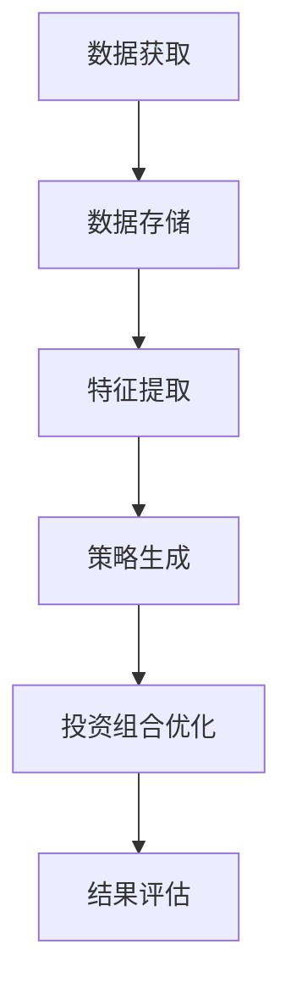
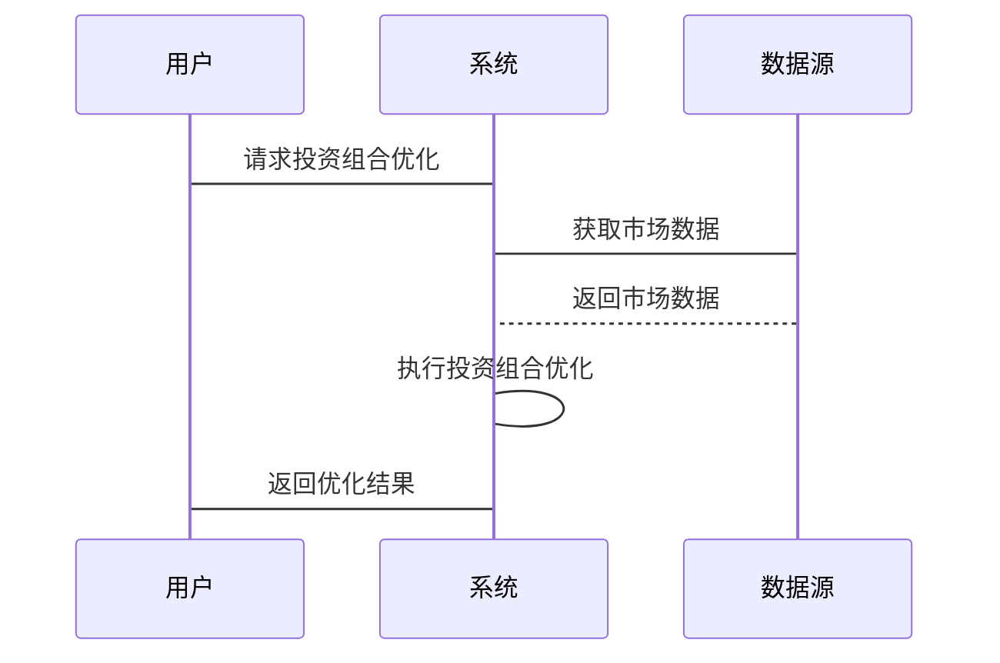

                 


# AI多智能体系统如何改进传统的价值投资组合构建方法

> 关键词：AI多智能体系统、价值投资组合、投资组合优化、深度强化学习、DRL算法

> 摘要：本文探讨了AI多智能体系统如何改进传统的价值投资组合构建方法。通过分析多智能体系统的核心概念、算法原理、系统架构设计以及实际案例，本文展示了如何利用AI多智能体系统的优势，解决传统投资组合构建中的复杂问题，提升投资组合的优化效果。文章内容涵盖背景介绍、理论基础、算法实现、系统设计、项目实战以及结论与展望。

---

# 第一部分: AI多智能体系统与价值投资组合构建的背景与基础

## 第1章: AI多智能体系统的概念与价值投资组合构建的背景

### 1.1 AI多智能体系统的概念

#### 1.1.1 多智能体系统的定义与特点

多智能体系统（Multi-Agent System, MAS）是由多个智能体（Agent）组成的系统，这些智能体能够通过协作或竞争完成复杂的任务。以下是多智能体系统的几个关键特点：

1. **分布式性**：多个智能体分布在不同的节点或位置，各自独立运行。
2. **协作性**：智能体之间通过通信和协作完成共同目标。
3. **自主性**：每个智能体都具备自主决策的能力。
4. **动态性**：系统运行过程中，智能体的状态和环境可能会动态变化。

#### 1.1.2 AI多智能体系统的核心要素

AI多智能体系统结合了人工智能和多智能体系统的特点，核心要素包括：

1. **智能体**：具备感知、决策和执行能力的个体。
2. **通信机制**：智能体之间通过某种方式交换信息。
3. **协作协议**：定义智能体之间的协作规则。
4. **任务分配**：智能体之间根据任务需求分配角色和职责。

#### 1.1.3 多智能体系统与传统单智能体算法的对比

| 对比维度 | 多智能体系统 | 单智能体算法 |
|----------|--------------|--------------|
| 决策中心 | 分散决策     | 集中决策     |
| 信息共享 | 高           | 低           |
| 任务处理 | 多任务协作   | 单任务处理   |
| 系统复杂度 | 高           | 低           |

### 1.2 价值投资组合构建的传统方法

#### 1.2.1 传统投资组合构建的理论基础

传统的价值投资组合构建方法主要基于现代投资组合理论（MPT），其核心思想是通过分散投资来降低风险。主要步骤包括：

1. **资产选择**：根据历史数据和风险偏好选择资产。
2. **权重分配**：确定各资产在组合中的权重。
3. **风险控制**：通过调整权重降低整体风险。

#### 1.2.2 传统方法的局限性与挑战

传统投资组合构建方法存在以下问题：

1. **复杂性**：在处理多资产、多目标的情况下，计算复杂度高。
2. **动态性**：市场环境动态变化，传统方法难以快速适应。
3. **信息利用**：难以充分利用非结构化数据（如新闻、社交媒体等）。

#### 1.2.3 价值投资组合构建的现状与未来趋势

随着人工智能和大数据技术的发展，投资组合构建正在向智能化、自动化方向发展。未来的趋势包括：

1. **智能化**：利用AI技术提高投资决策的效率和准确性。
2. **数据驱动**：基于海量数据进行分析和预测。
3. **多目标优化**：在风险、收益、流动性等多个目标之间找到平衡。

### 1.3 AI多智能体系统在投资组合构建中的应用前景

#### 1.3.1 AI多智能体系统的优势

1. **分布式计算能力**：多个智能体可以同时处理大量数据。
2. **协作能力**：智能体之间可以分工协作，提高决策效率。
3. **动态适应性**：能够快速适应市场环境的变化。

#### 1.3.2 投资组合构建中的复杂问题与多智能体系统的匹配性

投资组合构建中的复杂问题包括资产选择、权重分配、风险控制等，这些问题可以通过多智能体系统的协作能力得到较好解决。

#### 1.3.3 未来可能的应用场景与发展方向

未来，AI多智能体系统可以在以下几个方向进一步发展：

1. **多目标优化**：同时优化风险、收益、流动性等多个目标。
2. **非结构化数据处理**：利用自然语言处理技术分析新闻、社交媒体等非结构化数据。
3. **实时决策**：基于实时数据进行动态调整。

### 1.4 本章小结

本章主要介绍了AI多智能体系统的概念、价值投资组合构建的传统方法以及AI多智能体系统在投资组合构建中的应用前景。通过对比传统方法和多智能体系统的优缺点，为后续的算法设计和系统实现奠定了基础。

---

# 第二部分: AI多智能体系统的核心概念与价值投资组合构建的理论基础

## 第2章: 多智能体系统的数学模型与算法原理

### 2.1 多智能体系统的数学模型

#### 2.1.1 多智能体系统的状态空间与动作空间

多智能体系统的状态空间（State Space）由所有智能体的状态组成，动作空间（Action Space）则由所有智能体的可能动作组成。

#### 2.1.2 多智能体系统中的协作与竞争关系

智能体之间的关系可以是协作、竞争或混合关系。例如，在投资组合构建中，一个智能体负责资产选择，另一个负责权重分配。

#### 2.1.3 多智能体系统中的通信与信息共享机制

智能体之间的通信可以通过共享状态、交换信息或协同决策实现。

### 2.2 基于深度强化学习的多智能体协同算法

#### 2.2.1 强化学习的基本原理

强化学习（Reinforcement Learning, RL）通过智能体与环境的交互，逐步优化策略以获得最大化的累计奖励。

#### 2.2.2 多智能体强化学习的挑战与解决方案

多智能体强化学习的挑战包括：

1. **策略协调**：智能体之间需要协调策略。
2. **信息共享**：如何高效地共享信息。
3. **计算复杂度**：多智能体的计算复杂度高。

解决方案包括：

1. **分布式策略**：每个智能体独立学习。
2. **集中式策略**：通过集中式控制器协调各智能体。

#### 2.2.3 基于DRL的多智能体协同学习算法

深度强化学习（Deep Reinforcement Learning, DRL）通过深度神经网络近似策略函数。多智能体DRL算法包括：

1. **独立学习（Independent Learning）**：每个智能体独立学习。
2. **协作学习（Co-Learning）**：智能体之间协作学习。
3. **层次化学习（Hierarchical Learning）**：将任务分解为子任务。

---

### 2.3 价值投资组合构建的数学模型与优化目标

#### 2.3.1 投资组合优化的数学模型

投资组合优化的目标是最大化收益或最小化风险。常用的数学模型包括：

1. **均值-方差模型**：优化目标为最小化方差，约束条件为期望收益固定。
2. **风险-收益模型**：优化目标为最大化收益，约束条件为风险固定。

#### 2.3.2 基于风险-收益的优化目标

投资组合优化的目标可以表示为：

$$
\min_{w} \quad w^T \Sigma w
$$

$$
\text{s.t.} \quad w^T \mu = \text{target return}
$$

其中，\(w\) 是权重向量，\(\Sigma\) 是协方差矩阵，\(\mu\) 是收益向量。

#### 2.3.3 多目标优化问题的求解方法

多目标优化问题可以通过权重化方法（如加权最小二乘法）或 Pareto 优化方法求解。

---

### 2.4 本章小结

本章主要介绍了多智能体系统的数学模型、基于DRL的多智能体协同学习算法以及价值投资组合构建的数学模型与优化目标。这些内容为后续的投资组合优化算法设计奠定了理论基础。

---

## 第3章: 基于多智能体强化学习的投资组合优化算法

### 3.1 基于DRL的投资组合优化算法框架

#### 3.1.1 算法的整体框架

基于DRL的投资组合优化算法通常包括以下几个步骤：

1. **环境定义**：定义市场环境和智能体的角色。
2. **策略设计**：设计智能体的策略网络。
3. **奖励机制**：定义奖励函数。
4. **学习过程**：通过与环境交互，优化策略。

#### 3.1.2 各智能体的角色与任务分配

在投资组合优化中，智能体可以分为资产选择智能体和权重分配智能体。

#### 3.1.3 智能体之间的通信与协作机制

智能体之间的通信可以通过共享市场信息或协同决策实现。

### 3.2 多智能体强化学习的具体实现

#### 3.2.1 算法实现的数学模型

多智能体强化学习的数学模型可以表示为：

$$
V(s) = \max_{a} [ r + V(s', a') ]
$$

其中，\(s\) 是当前状态，\(a\) 是动作，\(r\) 是奖励，\(s'\) 是下一个状态。

#### 3.2.2 算法实现的步骤与流程

1. **初始化**：初始化智能体的参数和环境。
2. **交互**：智能体与环境交互，获取状态、动作和奖励。
3. **学习**：根据交互结果更新策略网络。
4. **优化**：不断迭代，优化投资组合。

#### 3.2.3 算法实现的代码示例

以下是一个简单的多智能体强化学习算法的Python代码示例：

```python
import numpy as np
import tensorflow as tf

class Agent:
    def __init__(self, state_space, action_space):
        self.state_space = state_space
        self.action_space = action_space
        self.model = self.build_model()

    def build_model(self):
        # 构建深度神经网络模型
        model = tf.keras.Sequential([
            tf.keras.layers.Dense(64, activation='relu'),
            tf.keras.layers.Dense(1, activation='linear')
        ])
        return model

    def act(self, state):
        # 根据当前状态选择动作
        prediction = self.model.predict(np.array([state]))
        action = np.argmax(prediction)
        return action

# 初始化智能体和环境
state_space = 10
action_space = 5
agent = Agent(state_space, action_space)

# 算法迭代
for episode in range(1000):
    state = env.reset()
    while not done:
        action = agent.act(state)
        next_state, reward, done, info = env.step(action)
        # 更新策略网络
        agent.model.fit(np.array([state]), np.array([reward]), epochs=1, verbose=0)
```

---

### 3.3 本章小结

本章详细介绍了基于DRL的投资组合优化算法的框架、实现步骤和代码示例。通过这些内容，读者可以理解如何利用多智能体强化学习算法优化投资组合。

---

## 第四部分: 系统分析与架构设计方案

### 第4章: 系统分析与架构设计方案

#### 4.1 系统功能设计

系统功能设计包括：

1. **数据获取**：从金融市场获取实时数据。
2. **特征提取**：提取有用的特征，如价格、成交量等。
3. **策略生成**：基于多智能体系统生成投资策略。
4. **结果评估**：评估投资组合的收益和风险。

#### 4.2 系统架构设计

系统架构设计包括：

1. **数据层**：负责数据的获取和存储。
2. **计算层**：负责特征提取和策略生成。
3. **决策层**：负责投资组合优化和结果评估。

以下是系统架构的Mermaid图：



#### 4.3 系统接口设计

系统接口设计包括：

1. **数据接口**：与金融市场数据源对接。
2. **用户接口**：供用户查看和调整投资组合。
3. **日志接口**：记录系统运行日志。

#### 4.4 系统交互设计

以下是系统交互的Mermaid序列图：



---

## 第五部分: 项目实战

### 第5章: 项目实战

#### 5.1 环境安装与配置

1. **安装Python**：确保安装了Python 3.8或更高版本。
2. **安装依赖库**：安装TensorFlow、Keras、NumPy等库。

#### 5.2 系统核心实现

以下是系统核心实现的代码示例：

```python
import numpy as np
import tensorflow as tf

class InvestmentPortfolio:
    def __init__(self, assets, initial_capital):
        self.assets = assets
        self.initial_capital = initial_capital
        self.current_capital = initial_capital

    def get_state(self):
        # 获取当前状态
        return self.current_capital

    def take_action(self, action):
        # 执行动作
        pass

# 初始化投资组合
assets = ['股票', '债券', '黄金']
initial_capital = 10000
portfolio = InvestmentPortfolio(assets, initial_capital)

# 算法迭代
for episode in range(1000):
    state = portfolio.get_state()
    action = agent.act(state)
    next_state, reward, done = portfolio.take_action(action)
    agent.model.fit(np.array([state]), np.array([reward]), epochs=1, verbose=0)
```

#### 5.3 代码应用解读与分析

1. **投资组合类**：定义了投资组合的基本属性和方法。
2. **智能体类**：实现了智能体的策略网络和动作选择。
3. **算法迭代**：通过与投资组合交互，不断优化策略。

#### 5.4 实际案例分析

通过实际案例分析，验证算法的有效性。例如，假设在股票市场中，算法能够通过多智能体协同学习，找到最优的投资组合。

---

## 第六部分: 结论与展望

### 第6章: 结论与展望

#### 6.1 本章总结

本文详细介绍了AI多智能体系统如何改进传统的价值投资组合构建方法。通过理论分析、算法设计和项目实战，展示了多智能体系统在投资组合优化中的优势。

#### 6.2 未来研究方向

1. **多目标优化**：进一步研究如何同时优化多个目标（如收益、风险、流动性）。
2. **非结构化数据处理**：探索如何利用自然语言处理技术分析新闻、社交媒体等非结构化数据。
3. **实时决策**：研究如何实现基于实时数据的投资组合动态调整。

#### 6.3 注意事项与最佳实践

1. **数据质量**：确保数据的准确性和完整性。
2. **模型调优**：根据实际情况调整模型参数。
3. **风险控制**：制定有效的风险控制策略。

---

## 参考文献

1. 现代投资组合理论（MPT）
2. 深度强化学习（DRL）相关论文
3. 多智能体系统（MAS）相关书籍

---

## 附录

1. 代码示例
2. 数据格式
3. 系统架构图

--- 

# END

