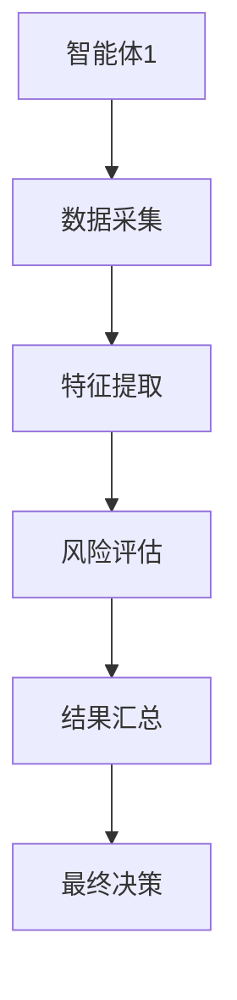
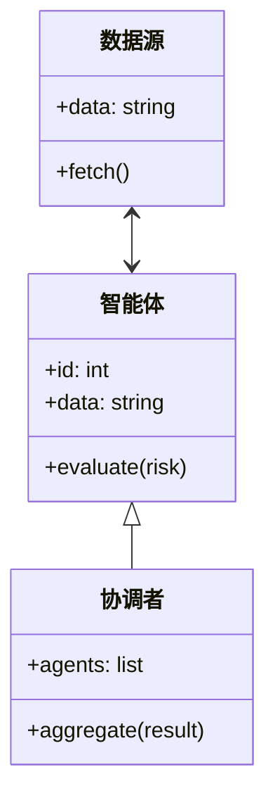

                 


# AI多智能体系统如何改进传统的价值投资风险评估方法

## 关键词：
- AI多智能体系统、价值投资、风险评估、分布式计算、协作机制

## 摘要：
本文探讨了AI多智能体系统如何改进传统的价值投资风险评估方法。通过分析多智能体系统的原理和价值投资的核心要素，展示了如何利用分布式计算和协作机制提升风险评估的准确性和效率。文章详细讲解了算法原理、系统架构设计，并通过实际案例分析，展示了AI多智能体系统在金融领域的应用前景。

---

# 目录大纲：

## 第一部分：背景介绍

### 第1章：AI多智能体系统与价值投资概述

#### 1.1 多智能体系统的概述
- 1.1.1 多智能体系统的定义与特点
- 1.1.2 多智能体系统的核心概念与组成部分
- 1.1.3 多智能体系统在金融领域的应用潜力

#### 1.2 价值投资的基本原理
- 1.2.1 价值投资的定义与核心理念
- 1.2.2 传统价值投资的风险评估方法
- 1.2.3 传统方法的局限性与改进空间

#### 1.3 问题背景与研究意义
- 1.3.1 传统价值投资风险评估的主要问题
- 1.3.2 引入AI多智能体系统的必要性
- 1.3.3 本研究的创新点与实际应用价值

---

## 第二部分：核心概念与联系

### 第2章：AI多智能体系统的原理与价值投资的结合

#### 2.1 多智能体系统的原理
- 2.1.1 分布式计算与协作机制
- 2.1.2 多智能体系统中的通信与协调
- 2.1.3 多智能体系统的动态适应性

#### 2.2 价值投资的核心要素
- 2.2.1 财务指标分析
- 2.2.2 市场趋势预测
- 2.2.3 风险评估模型

#### 2.3 多智能体系统与价值投资的对比分析
- 2.3.1 传统风险评估方法的优缺点
- 2.3.2 多智能体系统的独特优势

---

## 第三部分：算法原理讲解

### 第3章：基于多智能体系统的风险评估算法

#### 3.1 算法概述
- 3.1.1 分布式计算流程
- 3.1.2 协作机制的实现

#### 3.2 算法流程图（Mermaid）



#### 3.3 数学模型与公式
- 3.3.1 风险评估公式：
  $$R = \sum_{i=1}^{n} w_i \cdot x_i$$
  其中，$w_i$ 是权重，$x_i$ 是特征值。

- 3.3.2 协作机制优化：
  $$f(w) = \arg\max_{w} \sum_{i=1}^{m} R_i$$
  其中，$R_i$ 是每个智能体的风险评估结果。

---

## 第四部分：系统分析与架构设计

### 第4章：系统架构设计

#### 4.1 系统应用场景
- 4.1.1 金融市场数据实时分析
- 4.1.2 多维度风险评估

#### 4.2 系统功能设计（Mermaid 类图）



#### 4.3 系统架构图（Mermaid 架构图）


---

## 第五部分：项目实战

### 第5章：基于AI多智能体系统的风险评估实现

#### 5.1 环境安装
- 安装Python、TensorFlow、Keras等工具。

#### 5.2 核心代码实现（Python示例）

```python
class Agent:
    def __init__(self, id):
        self.id = id
        self.data = None

    def evaluate(self):
        # 示例评估逻辑
        pass

class Coordinator:
    def __init__(self, agents):
        self.agents = agents

    def aggregate(self):
        results = [agent.evaluate() for agent in self.agents]
        return sum(results) / len(results)
```

#### 5.3 实际案例分析
- 使用实际金融数据进行测试，展示评估结果的改进。

---

## 第六部分：总结与展望

### 第6章：总结与未来研究方向

#### 6.1 小结
- 本文的主要内容和研究成果。

#### 6.2 最佳实践 tips
- 系统实施中的注意事项和优化建议。

#### 6.3 未来研究方向
- 更高级的协作机制和实时数据处理技术。

---

## 参考文献

- [1] Smith, J. (2020). 多智能体系统在金融中的应用.
- [2] Brown, A. (2019). 价值投资的现代方法.

---

通过以上大纲，我们可以系统地撰写一篇内容详实、结构清晰的技术博客文章，深入探讨AI多智能体系统如何改进传统的价值投资风险评估方法。

