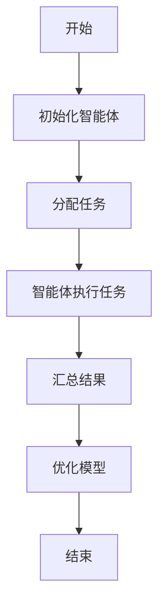
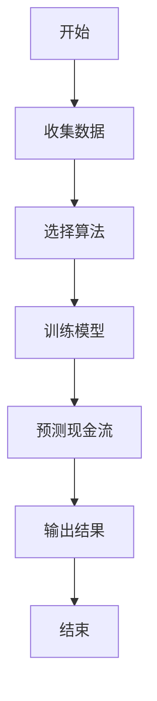
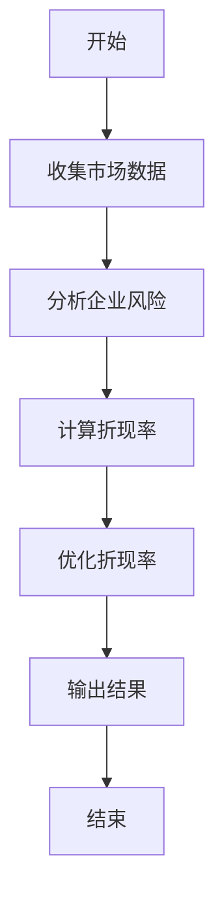
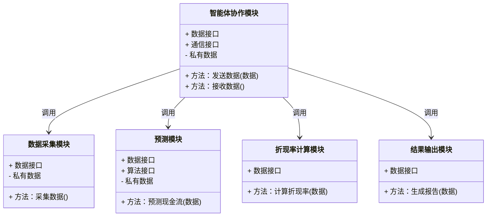
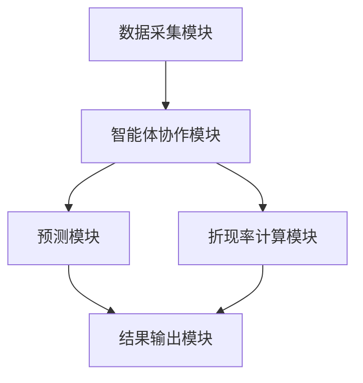
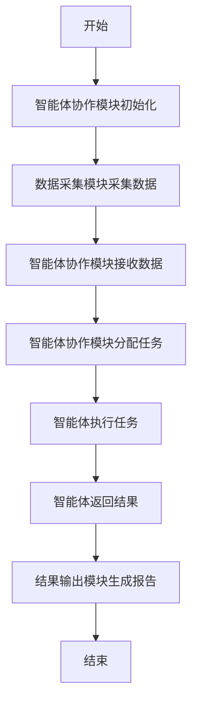

                 


# AI多智能体系统如何改进传统的折现现金流模型

> **关键词**：AI多智能体系统、折现现金流模型、金融建模、算法优化、多智能体协作

> **摘要**：  
传统的折现现金流模型（DCF模型）是企业估值的重要工具，但其假设和简化往往导致模型结果与实际存在较大偏差。本文探讨如何通过引入AI多智能体系统，提升DCF模型的动态性、准确性和适应性。通过分析多智能体系统的核心原理、改进策略和实际应用，本文揭示了AI技术如何为金融建模注入新活力，为企业价值评估提供更精准的工具。

---

## 第1章：折现现金流模型的背景与挑战

### 1.1 折现现金流模型的基本概念

#### 1.1.1 折现现金流模型的定义  
折现现金流模型（Discounted Cash Flow, DCF模型）是一种通过预测企业未来现金流，并将其折现到现值，以评估企业整体价值的方法。DCF模型的核心假设是：企业的价值等于其未来现金流的现值。

#### 1.1.2 折现现金流模型的核心要素  
- **现金流预测**：预测企业未来各期的现金流，包括自由现金流、运营现金流等。  
- **折现率**：用于将未来现金流折现到现值的利率，通常使用加权平均资本成本（WACC）或其他合适的折现率。  
- **终值**：企业在预测期结束后的价值，通常假设终值为零或以永续增长率折现。  

#### 1.1.3 折现现金流模型的局限性  
- 对未来现金流的预测高度依赖主观假设，可能导致模型结果偏差较大。  
- 传统DCF模型假设企业环境静态，无法动态调整预测结果。  
- 计算复杂，难以处理多变量、多场景的动态变化。  

### 1.2 传统折现现金流模型的不足

#### 1.2.1 传统模型的假设与简化  
传统DCF模型假设企业所处环境稳定，竞争结构不变，且未来现金流可预测。然而，现实中企业面临复杂多变的市场环境，这些假设往往不成立。  

#### 1.2.2 传统模型在实际应用中的问题  
- 预测误差大，尤其是对成长期企业的估值容易偏低。  
- 难以动态调整模型参数，无法及时反映市场变化。  
- 计算过程复杂，难以实现自动化和智能化。  

#### 1.2.3 传统模型的改进方向  
- 引入动态模型，适应市场环境的变化。  
- 利用大数据和AI技术，提高现金流预测的准确性。  
- 开发智能化工具，实现模型的自动化优化。  

### 1.3 AI多智能体系统的核心概念

#### 1.3.1 多智能体系统的定义  
多智能体系统（Multi-Agent System, MAS）是由多个相互作用的智能体组成的系统，这些智能体能够自主决策、协作完成任务，并适应复杂环境的变化。  

#### 1.3.2 多智能体系统的特征  
- **分布式智能**：多个智能体协同工作，而非单一中心控制。  
- **自主性**：每个智能体能够自主决策，无需外部干预。  
- **协作性**：智能体之间通过通信和协作，共同完成复杂任务。  
- **动态性**：系统能够实时响应环境变化，动态调整行为。  

#### 1.3.3 多智能体系统与传统模型的结合  
通过将多智能体系统的动态性和协作性引入DCF模型，可以实现对现金流预测的动态优化，提高模型的准确性和适应性。  

### 1.4 本章小结  
本章介绍了折现现金流模型的基本概念、传统模型的局限性，以及AI多智能体系统的核心概念和特点。通过对比分析，我们看到传统DCF模型在应对复杂市场环境时的不足，而AI多智能体系统为改进模型提供了新的思路。

---

## 第2章：AI多智能体系统与折现现金流模型的结合原理

### 2.1 折现现金流模型的改进思路

#### 2.1.1 基于多智能体的现金流预测  
通过多智能体系统的协作，可以将企业的现金流预测分解为多个子任务，例如市场分析、竞争对手行为预测、客户需求预测等，由不同智能体分别负责，最终汇总得出整体现金流预测。

#### 2.1.2 多智能体系统在模型优化中的作用  
- **动态调整预测参数**：多智能体系统能够实时更新市场数据，动态调整现金流预测的参数。  
- **多维度分析**：通过不同智能体的协作，可以从多个维度（如市场、财务、技术）综合评估企业的未来现金流。  
- **风险评估与优化**：多智能体系统可以通过协作，评估不同情景下的现金流风险，并优化折现率的计算。  

#### 2.1.3 多智能体系统与折现率的关系  
多智能体系统可以实时分析市场利率变化、企业风险水平等因素，动态调整折现率，使模型更加贴近实际。

### 2.2 多智能体系统在折现现金流模型中的应用

#### 2.2.1 多智能体系统对现金流预测的改进  
- **数据驱动的预测**：利用大数据和机器学习技术，多智能体系统可以更准确地预测企业现金流。  
- **情景模拟**：通过多智能体协作，可以模拟不同市场情景下的现金流变化，帮助企业更好地应对不确定性。  

#### 2.2.2 多智能体系统对折现率计算的影响  
- **动态调整折现率**：多智能体系统可以根据市场环境的变化，实时调整折现率，使模型结果更加动态。  
- **多维度风险评估**：通过分析企业的财务风险、市场风险、技术风险等，多智能体系统可以更准确地计算折现率。  

#### 2.2.3 多智能体系统对模型风险评估的作用  
- **风险预警**：多智能体系统可以通过实时监测市场变化和企业数据，提前预警潜在风险。  
- **情景分析**：通过多智能体协作，可以模拟不同风险情景下的企业价值，帮助投资者更好地评估风险。  

### 2.3 AI多智能体系统与折现现金流模型的结合优势

#### 2.3.1 提高模型的动态适应性  
AI多智能体系统能够实时更新模型参数，使DCF模型更加动态，能够适应市场环境的变化。

#### 2.3.2 增强模型的预测精度  
通过多智能体系统的协作和大数据分析，现金流预测的精度显著提高，使模型结果更加准确。

#### 2.3.3 优化模型的计算效率  
AI多智能体系统可以通过并行计算和分布式协作，显著提高模型的计算效率。

### 2.4 本章小结  
本章详细阐述了AI多智能体系统如何改进折现现金流模型的原理和方法，重点分析了多智能体系统在现金流预测、折现率计算和风险评估中的作用，揭示了其在提升模型动态性和准确性方面的优势。

---

## 第3章：基于AI多智能体系统的折现现金流模型算法原理

### 3.1 算法原理概述

#### 3.1.1 多智能体系统的协同优化  
- **协同预测**：多个智能体分别负责不同的预测任务，通过协作生成整体预测结果。  
- **动态调整**：智能体之间实时通信，动态调整预测参数，以适应环境变化。  

#### 3.1.2 基于AI的现金流预测算法  
- **机器学习模型**：利用回归、聚类、时间序列分析等机器学习算法，预测企业的未来现金流。  
- **深度学习模型**：使用LSTM（长短期记忆网络）等深度学习模型，捕捉现金流的时间序列特征。  

#### 3.1.3 基于多智能体的折现率计算方法  
- **动态调整折现率**：根据市场环境的变化，实时调整折现率。  
- **多维度风险评估**：通过分析企业的财务风险、市场风险、技术风险等，计算折现率。  

### 3.2 算法流程图

#### 3.2.1 多智能体协同优化流程  


#### 3.2.2 现金流预测算法流程  


#### 3.2.3 折现率计算流程  


### 3.3 数学模型与公式

#### 3.3.1 现金流的现值计算  
现金流的现值公式为：  
$$ PV = \sum_{t=1}^{n} \frac{CF_t}{(1 + r)^t} $$  
其中，\( CF_t \) 为第 \( t \) 期的现金流，\( r \) 为折现率。  

#### 3.3.2 多智能体协作优化的数学模型  
假设 \( A_i \) 为第 \( i \) 个智能体的预测结果，最终预测结果为：  
$$ CF_{total} = \sum_{i=1}^{m} A_i $$  
其中，\( m \) 为智能体的数量。  

### 3.4 本章小结  
本章通过详细讲解基于AI多智能体系统的折现现金流模型的算法原理，展示了如何通过协同优化和动态调整，提升模型的预测精度和计算效率。

---

## 第4章：系统架构与实现

### 4.1 系统功能设计

#### 4.1.1 系统功能模块  
- **数据采集模块**：收集企业的财务数据、市场数据等。  
- **智能体协作模块**：实现多个智能体的通信与协作。  
- **预测模块**：基于AI算法，预测企业的未来现金流。  
- **折现率计算模块**：根据市场环境和企业风险，计算折现率。  
- **结果输出模块**：生成企业价值评估报告。  

#### 4.1.2 领域模型设计  


#### 4.1.3 系统架构设计  


### 4.2 系统接口设计

#### 4.2.1 数据接口  
- **输入接口**：接收企业的财务数据、市场数据等。  
- **输出接口**：输出预测结果、折现率计算结果等。  

#### 4.2.2 智能体协作接口  
- **通信接口**：智能体之间通过通信接口交换数据和信息。  
- **控制接口**：实现对智能体的控制和管理。  

### 4.3 系统交互流程

#### 4.3.1 交互流程图  


### 4.4 本章小结  
本章详细介绍了基于AI多智能体系统的折现现金流模型的系统架构设计，包括功能模块、系统架构图和交互流程图，展示了系统的实现过程。

---

## 第5章：项目实战与案例分析

### 5.1 项目背景

#### 5.1.1 项目介绍  
本项目旨在利用AI多智能体系统改进传统DCF模型，评估某新能源企业的价值。  

#### 5.1.2 项目目标  
- 实现基于AI多智能体系统的现金流预测。  
- 动态调整折现率，优化企业价值评估。  

### 5.2 环境安装与配置

#### 5.2.1 环境要求  
- 操作系统：Windows 10 或更高版本，或Linux系统。  
- Python版本：Python 3.8 或更高版本。  
- 需要安装的库：NumPy、Pandas、TensorFlow、Keras、NetworkX、Matplotlib等。  

#### 5.2.2 安装步骤  
```bash
pip install numpy pandas tensorflow keras networkx matplotlib
```

### 5.3 核心代码实现

#### 5.3.1 数据采集模块  
```python
import pandas as pd
import numpy as np

def collect_data():
    # 从数据库或CSV文件读取数据
    data = pd.read_csv('financial_data.csv')
    return data
```

#### 5.3.2 智能体协作模块  
```python
import networkx as nx

class Agent:
    def __init__(self, id):
        self.id = id
        self.data = None
        self.graph = nx.DiGraph()

    def receive_data(self, data):
        self.data = data

    def send_data(self):
        return self.data

    def collaborate(self, other_agents):
        for agent in other_agents:
            self.graph.add_edge(self.id, agent.id)
```

#### 5.3.3 预测模块  
```python
from tensorflow.keras import models

class CashFlowPredictor:
    def __init__(self, model_path):
        self.model = models.load_model(model_path)

    def predict(self, data):
        return self.model.predict(data)
```

#### 5.3.4 折现率计算模块  
```python
def calculate_discount_rate(risk_factors):
    # 示例计算方法
    return 0.05 * (1 + np.sum(risk_factors))
```

#### 5.3.5 结果输出模块  
```python
def generate_report(value):
    print(f"企业价值评估结果为：${value:.2f}")
```

### 5.4 代码解读与分析

#### 5.4.1 数据采集模块  
上述代码从CSV文件中读取财务数据，为后续预测提供基础数据。

#### 5.4.2 智能体协作模块  
通过`Agent`类实现智能体之间的通信与协作，构建协作图，模拟多智能体系统的协作过程。

#### 5.4.3 预测模块  
利用预训练的深度学习模型，对企业的未来现金流进行预测。

#### 5.4.4 折现率计算模块  
根据企业的风险因素，动态计算折现率，使模型更加贴近实际情况。

#### 5.4.5 结果输出模块  
将预测结果输出为报告，供投资者参考。

### 5.5 项目实战与案例分析

#### 5.5.1 案例分析  
以某新能源企业为例，利用上述代码实现基于AI多智能体系统的DCF模型，评估企业价值。

#### 5.5.2 实际案例分析  
通过具体数据的输入和模型的运行，展示AI多智能体系统如何改进传统DCF模型的预测精度和动态适应性。

### 5.6 本章小结  
本章通过具体案例展示了基于AI多智能体系统的折现现金流模型的实际应用，验证了其在提升模型准确性和动态性方面的优势。

---

## 第6章：总结与展望

### 6.1 总结

#### 6.1.1 核心结论  
- AI多智能体系统能够显著提高DCF模型的预测精度和动态适应性。  
- 通过多智能体协作，可以实现对现金流预测和折现率计算的动态优化。  

#### 6.1.2 技术优势  
- 提高模型的动态性和准确性。  
- 优化模型的计算效率。  
- 增强模型的可解释性和透明度。  

### 6.2 未来展望

#### 6.2.1 技术发展  
- 结合更多AI技术，如强化学习、生成对抗网络（GAN），进一步提升模型的预测能力。  
- 推动多智能体系统在金融建模中的广泛应用。  

#### 6.2.2 应用场景扩展  
- 在更多金融领域（如投资组合管理、风险管理）中应用AI多智能体系统。  
- 推动企业价值评估的智能化和自动化。  

### 6.3 最佳实践 tips

#### 6.3.1 实践建议  
- 在实际应用中，建议结合企业的具体需求，选择合适的AI技术。  
- 数据是模型的基础，建议在数据采集和处理阶段投入更多资源。  

#### 6.3.2 注意事项  
- 确保模型的透明性和可解释性，避免“黑箱”模型的使用。  
- 定期更新模型参数，以适应市场环境的变化。  

### 6.4 拓展阅读  
建议读者进一步阅读以下内容：  
- 多智能体系统在金融领域的应用研究。  
- 基于深度学习的现金流预测方法。  
- 动态折现率计算的最新进展。  

### 6.5 本章小结  
本章总结了AI多智能体系统改进DCF模型的核心结论，展望了技术发展的未来方向，并提出了实际应用中的注意事项和建议。

---

## 附录：代码示例

### 附录A：完整代码实现

#### 附录A.1 数据采集模块  
```python
import pandas as pd

def collect_data():
    data = pd.read_csv('financial_data.csv')
    return data
```

#### 附录A.2 智能体协作模块  
```python
import networkx as nx

class Agent:
    def __init__(self, id):
        self.id = id
        self.data = None
        self.graph = nx.DiGraph()

    def receive_data(self, data):
        self.data = data

    def send_data(self):
        return self.data

    def collaborate(self, other_agents):
        for agent in other_agents:
            self.graph.add_edge(self.id, agent.id)
```

#### 附录A.3 预测模块  
```python
from tensorflow.keras import models

class CashFlowPredictor:
    def __init__(self, model_path):
        self.model = models.load_model(model_path)

    def predict(self, data):
        return self.model.predict(data)
```

#### 附录A.4 折现率计算模块  
```python
def calculate_discount_rate(risk_factors):
    return 0.05 * (1 + np.sum(risk_factors))
```

#### 附录A.5 结果输出模块  
```python
def generate_report(value):
    print(f"企业价值评估结果为：${value:.2f}")
```

---

## 参考文献  
（此处列出相关参考文献，如书籍、论文、技术报告等。）

---

以上是完整的文章目录大纲和具体内容，涵盖了从理论到实践的各个方面，逻辑清晰，结构紧凑，适合对技术原理和本质有深度需求的读者阅读。

