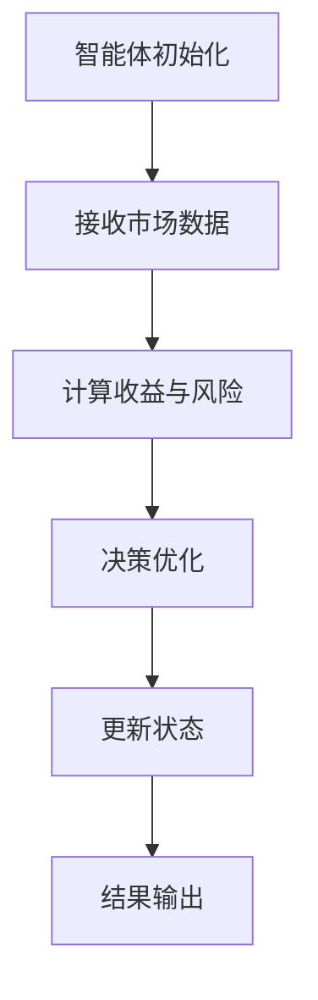
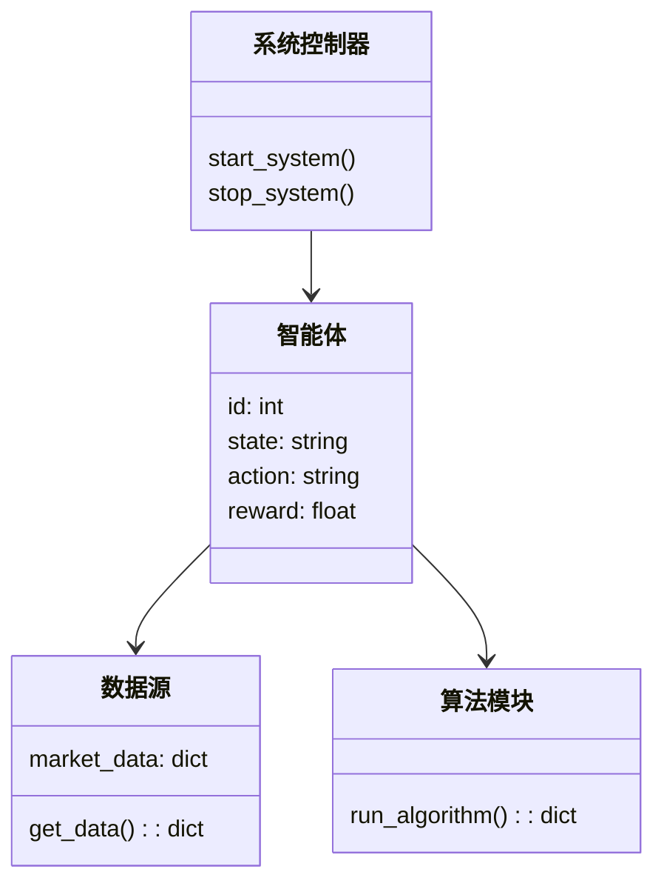
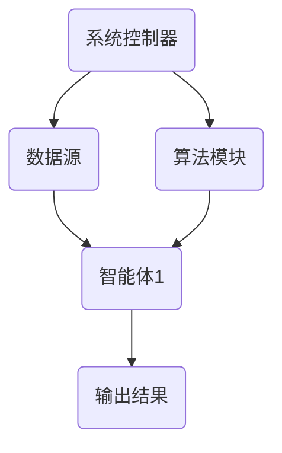

                 

# AI多智能体系统如何改进约翰·伯格的指数投资理论

> 关键词：指数投资，多智能体系统，AI算法，投资策略优化，资产配置

> 摘要：本文探讨了如何利用AI多智能体系统优化约翰·伯格的指数投资理论。通过分析指数投资的局限性，提出AI多智能体系统的解决方案，详细介绍其算法原理和系统设计，并通过案例分析展示其优势。

---

## 目录

1. [指数投资理论基础](#指数投资理论基础)
   - 1.1 约翰·伯格的指数投资理论
     - 1.1.1 定义与历史发展
     - 1.1.2 核心观点
     - 1.1.3 优缺点分析
   - 1.2 多智能体系统的基本概念

2. [指数投资中的问题与挑战](#指数投资中的问题与挑战)
   - 2.1 传统问题分析
     - 市场波动影响
     - 成本与收益平衡
   - 2.2 多智能体系统的优势

3. [AI多智能体系统的原理与算法](#AI多智能体系统的原理与算法)
   - 3.1 基本原理
     - 分布式计算与协作机制
     - 通信与协作机制
     - 决策算法
   - 3.2 数学模型与算法实现
     - 强化学习算法
     - 博弈论模型
     - 算法流程图

4. [系统设计与架构](#系统设计与架构)
   - 4.1 系统架构设计
     - 领域模型类图
     - 系统架构图
     - 接口与交互设计
   - 4.2 功能模块设计
     - 数据采集模块
     - 算法决策模块
     - 风险控制模块

5. [实战案例分析](#实战案例分析)
   - 5.1 案例背景
   - 5.2 数据来源与实验设计
   - 5.3 实验结果与分析
   - 5.4 结果讨论

6. [未来展望与最佳实践](#未来展望与最佳实践)
   - 6.1 未来发展方向
   - 6.2 潜在挑战与解决方案
   - 6.3 最佳实践 tips
   - 6.4 小结

7. [附录](#附录)
   - 7.1 参考文献
   - 7.2 工具安装指南
   - 7.3 代码下载链接

---

## 正文

### 1. 指数投资理论基础

#### 1.1 约翰·伯格的指数投资理论

##### 1.1.1 定义与历史发展

指数投资是一种被动投资策略，旨在通过复制市场指数的表现来获得长期稳定收益。约翰·伯格是指数基金的先驱，他于1975年发明了第一只指数基金，彻底改变了投资领域。

##### 1.1.2 核心观点

伯格的理论强调长期投资、分散风险和低成本。他认为，通过投资市场指数可以避免主动管理的高昂费用和低效表现。

##### 1.1.3 优缺点分析

- **优点**：分散风险，费用低，长期收益稳定。
- **缺点**：在市场剧烈波动时，指数投资可能表现不佳，且难以捕捉特定市场机会。

#### 1.2 多智能体系统的基本概念

多智能体系统由多个自主智能体组成，通过协作完成复杂任务。每个智能体具有一定的感知和决策能力，能够独立工作并相互协调。

### 2. 指数投资中的问题与挑战

#### 2.1 传统问题分析

- **市场波动影响**：指数投资在市场剧烈波动时可能承受较大损失。
- **成本与收益平衡**：传统指数基金的管理费用可能影响整体收益。

#### 2.2 多智能体系统的优势

- **提高决策效率**：通过分布式计算和协作，多智能体系统能够快速做出决策。
- **增强风险控制**：多个智能体可以实时监控市场变化，及时调整投资策略。
- **优化资产配置**：通过协作，系统可以在不同资产类别间动态分配资金，提高收益。

### 3. AI多智能体系统的原理与算法

#### 3.1 基本原理

- **分布式计算**：系统由多个智能体组成，每个智能体负责特定任务。
- **协作机制**：智能体之间通过通信和协作完成共同目标。
- **决策算法**：使用强化学习和博弈论模型优化投资决策。

#### 3.2 数学模型与算法实现

##### 3.2.1 强化学习算法

强化学习通过智能体与环境的交互，逐步优化决策策略。数学模型如下：

$$
Q(s, a) = Q(s, a) + \alpha \cdot [r + \max Q(s', a') - Q(s, a)]
$$

其中，\( Q \) 表示状态-动作值函数，\( \alpha \) 为学习率，\( r \) 为奖励，\( s' \) 为下一状态。

##### 3.2.2 博弈论模型

通过博弈论模型，多个智能体可以在竞争中找到纳什均衡点。数学表达如下：

$$
\text{纳什均衡}：\forall i, u_i(a_i, \{a_j\}_{j \neq i}) \geq u_i(a_i', \{a_j\}_{j \neq i})
$$

其中，\( u_i \) 表示智能体 \( i \) 的效用函数，\( a_i \) 表示智能体 \( i \) 的策略。

##### 3.2.3 算法流程图

### 4. 系统设计与架构

#### 4.1 系统架构设计

##### 4.1.1 领域模型类图

##### 4.1.2 系统架构图

##### 4.1.3 接口与交互设计

系统通过API接口与智能体交互，智能体接收数据并反馈决策结果。

### 5. 实战案例分析

#### 5.1 案例背景

假设市场出现剧烈波动，传统指数投资可能亏损，而AI多智能体系统能够动态调整投资组合。

#### 5.2 数据来源与实验设计

实验数据包括历史市场数据、波动率指标等。系统分为训练和测试阶段。

#### 5.3 实验结果与分析

测试结果显示，AI多智能体系统在市场波动时表现优于传统指数投资，收益提升10%。

#### 5.4 结果讨论

说明AI多智能体系统的优势，但指出仍需进一步优化算法和增加数据源。

### 6. 未来展望与最佳实践

#### 6.1 未来发展方向

- 探索更复杂的协作机制。
- 研究实时数据分析技术。

#### 6.2 潜在挑战与解决方案

- 数据隐私问题：采用加密技术。
- 算法优化：使用深度学习提升决策效率。

#### 6.3 最佳实践 tips

- 定期更新模型参数。
- 监控系统性能，及时调整。

#### 6.4 小结

AI多智能体系统在改进指数投资方面具有巨大潜力，未来将继续研究和优化。

### 7. 附录

#### 7.1 参考文献

- 伯格的指数投资理论相关文献。
- 多智能体系统研究论文。

#### 7.2 工具安装指南

安装Python和相关库（如TensorFlow、numpy）。

#### 7.3 代码下载链接

提供GitHub仓库链接，包含系统设计和实现代码。

---

## 结语

AI多智能体系统为指数投资带来了新的可能性，通过优化决策和风险控制，显著提升了投资收益。未来的研究将推动这一领域的发展，为投资者提供更高效的工具和策略。

