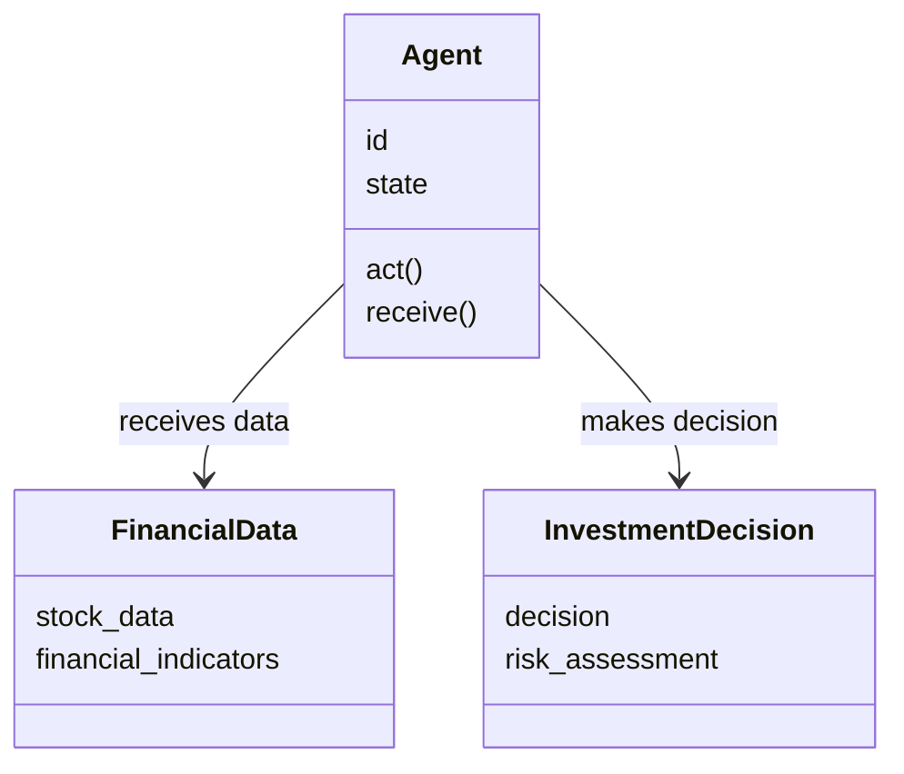
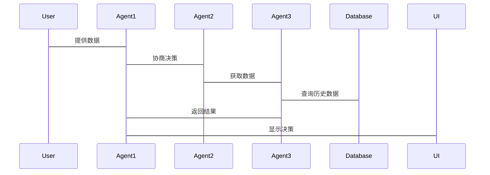

                 


# 《AI多智能体系统革新价值投资分析流程》

## 关键词：
- AI多智能体系统
- 价值投资分析
- 金融数据分析
- 协作学习
- 强化学习
- 系统架构设计
- 案例分析

## 摘要：
本文探讨了AI多智能体系统如何革新传统价值投资分析流程。通过分析多智能体系统的协作机制和强化学习算法，结合实际案例，展示了如何利用这些技术提升投资决策的效率和准确性。文章从背景、原理、系统设计到实战应用，全面解析了AI多智能体系统在金融领域的潜力和实现路径。

---

# 《AI多智能体系统革新价值投资分析流程》

## 第1章：AI多智能体系统的背景与价值投资分析基础

### 1.1 多智能体系统的定义与特点

#### 1.1.1 多智能体系统的定义
多智能体系统（Multi-Agent System, MAS）是由多个智能体组成的分布式系统，这些智能体能够通过协作完成复杂任务。与单智能体系统相比，MAS具有更高的灵活性和适应性。

#### 1.1.2 多智能体系统的属性特征对比

| 特性         | 单智能体系统        | 多智能体系统        |
|--------------|---------------------|---------------------|
| 结构         | 单一控制中心       | 分布式结构         |
| 通信         | 无或单向           | 支持双向通信       |
| 行为         | 单一决策           | 多决策协作         |
| 适应性       | 较低               | 较高               |

#### 1.1.3 多智能体系统的应用场景
- 分布式计算
- 机器人协作
- 金融投资分析

### 1.2 价值投资分析的基本原理

#### 1.2.1 价值投资的定义与核心要素
价值投资是一种以公司基本面分析为基础的投资策略，核心在于寻找被市场低估的股票。其核心要素包括：

1. 财务指标（如市盈率、ROE）
2. 行业地位
3. 管理团队
4. 市场前景

#### 1.2.2 传统价值投资分析流程
1. 数据收集
2. 财务分析
3. 行业分析
4. 估值判断
5. 投资决策

#### 1.2.3 价值投资分析的边界与外延
- 数据范围：仅限于财务数据
- 方法论：依赖人工经验
- 时间效率：耗时较长

### 1.3 AI多智能体系统与价值投资的结合

#### 1.3.1 多智能体系统在金融领域的应用潜力
- 提高数据分析效率
- 实现实时监控
- 优化投资决策

#### 1.3.2 价值投资分析流程的革新方向
- 自动化数据处理
- 智能化决策支持
- 高效协作机制

#### 1.3.3 多智能体系统对价值投资分析的优化作用
- 提高决策的准确性
- 减少人为错误
- 提升分析效率

---

## 第2章：AI多智能体系统的数学模型与算法原理

### 2.1 多智能体系统的核心算法

#### 2.1.1 多智能体协作算法
多智能体协作算法通过智能体之间的通信与协作，共同完成任务。常见的协作算法包括：

1. **分布式协作算法**：基于局部信息进行决策。
2. **协商算法**：通过协商达成一致。

#### 2.1.2 强化学习算法
强化学习是一种通过试错学习策略的方法。在多智能体系统中，强化学习用于优化决策过程。

#### 2.1.3 联合推理与决策算法
联合推理算法结合多个智能体的推理结果，形成最终的决策。

#### 2.1.4 实现代码示例
```python
class Agent:
    def __init__(self, id):
        self.id = id
        self.state = None
        self.reward = 0

    def receive(self, message):
        self.state = message

    def act(self):
        # 返回决策
        return f"Decision_{self.id}"
```

### 2.2 价值投资分析的数学模型

#### 2.2.1 财务指标分析模型
财务指标分析模型用于评估公司的财务状况，常见的指标包括：

- 市盈率（P/E）
- 净资产收益率（ROE）
- 营业利润率

#### 2.2.2 市场情绪分析模型
市场情绪分析模型通过自然语言处理技术，分析新闻和社交媒体的情绪，预测市场走势。

#### 2.2.3 风险评估模型
风险评估模型基于历史数据，评估投资的风险程度。

### 2.3 多智能体系统与价值投资分析的融合模型

#### 2.3.1 多智能体协同决策模型
多智能体协同决策模型通过智能体之间的协作，优化投资决策。

#### 2.3.2 基于强化学习的投资决策模型
强化学习模型通过不断试错，优化投资策略。

#### 2.3.3 联合推理与价值评估模型
联合推理模型结合多个智能体的推理结果，形成最终的价值评估。

---

## 第3章：系统分析与架构设计方案

### 3.1 问题场景介绍

#### 3.1.1 传统价值投资分析的痛点
- 数据处理效率低
- 分析依赖人工经验
- 决策过程缺乏协作

#### 3.1.2 多智能体系统在价值投资中的应用需求
- 实现自动化数据处理
- 提供智能化决策支持
- 优化投资组合

#### 3.1.3 系统的目标与范围
- 提供高效的金融数据分析工具
- 实现智能化的投资决策支持
- 优化投资组合管理

### 3.2 系统功能设计

#### 3.2.1 领域模型设计（Mermaid类图）


#### 3.2.2 系统架构设计（Mermaid架构图）


#### 3.2.3 系统接口设计
- 数据接口：接收和处理金融数据
- 用户接口：提供交互界面
- 决策接口：输出投资决策

#### 3.2.4 系统交互流程设计（Mermaid序列图）


### 3.3 系统实现细节

#### 3.3.1 数据预处理
- 数据清洗
- 特征提取

#### 3.3.2 算法实现
- 强化学习算法
- 协作学习算法

#### 3.3.3 系统优化
- 并行计算
- 模型调优

---

## 第4章：项目实战与案例分析

### 4.1 项目实战

#### 4.1.1 环境安装与配置
- 安装Python
- 安装依赖库（如NumPy、Pandas）

#### 4.1.2 核心代码实现
```python
import numpy as np
import pandas as pd

class Agent:
    def __init__(self, id):
        self.id = id
        self.data = None

    def process_data(self):
        if self.data is not None:
            return self.data.mean()
        return 0

agents = [Agent(i) for i in range(5)]
data = np.random.randn(5, 5)

for agent in agents:
    agent.data = data[agent.id]

for agent in agents:
    print(f"Agent {agent.id} result: {agent.process_data()}")
```

#### 4.1.3 代码解读与分析
- 代码实现了一个简单的多智能体系统，每个智能体处理不同的数据，并返回结果。

### 4.2 案例分析

#### 4.2.1 数据分析与解读
- 数据来源
- 数据处理
- 数据分析结果

#### 4.2.2 投资决策与策略优化
- 基于多智能体系统的决策优化
- 投资组合优化

#### 4.2.3 实际案例
- 某公司股票分析
- 投资决策过程
- 投资结果分析

### 4.3 项目小结

#### 4.3.1 项目成果
- 实现了多智能体系统
- 提升了投资分析效率

#### 4.3.2 经验总结
- 系统设计的重要性
- 算法优化的必要性

---

## 第5章：总结与展望

### 5.1 全文总结
- AI多智能体系统在价值投资分析中的应用潜力
- 系统设计的关键点
- 技术实现的核心要素

### 5.2 最佳实践 tips
- 系统设计要注重模块化
- 算法实现要注重效率
- 数据处理要注重准确性

### 5.3 展望
- 多智能体系统的进一步优化
- 新算法的引入
- 更广泛的应用场景

### 5.4 注意事项
- 数据隐私保护
- 系统稳定性保障
- 风险控制

### 5.5 拓展阅读
- 推荐书籍和论文
- 相关技术博客链接

---

# 结语

通过本文的详细分析和实战案例，我们可以看到AI多智能体系统在价值投资分析中的巨大潜力。未来，随着技术的不断进步，AI多智能体系统将在金融领域发挥更大的作用。

