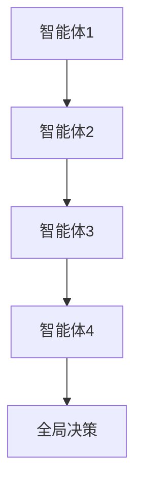
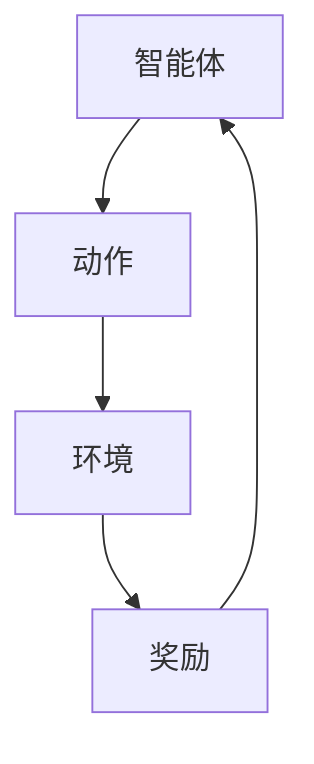
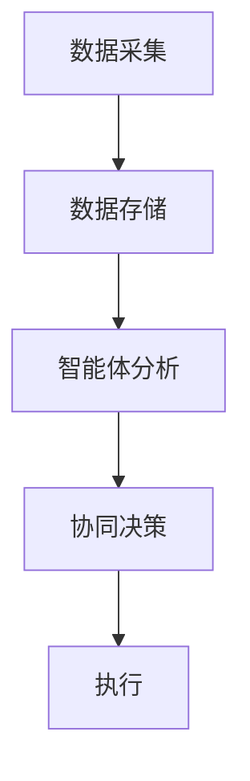
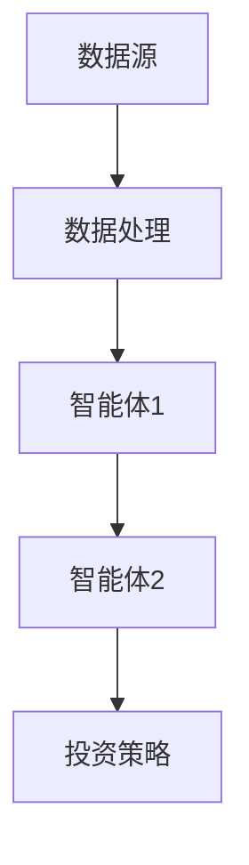

                 


# AI多智能体系统革新价值投资：传统与科技的完美融合

**关键词**：AI多智能体系统，价值投资，传统投资，科技融合，协同决策，数学模型，投资策略

**摘要**：  
随着人工智能技术的飞速发展，AI多智能体系统在金融领域的应用逐渐崭露头角。本文将从AI多智能体系统的定义、核心原理、算法设计、系统架构、项目实战等方面，详细探讨AI多智能体系统如何革新传统价值投资。通过对比传统投资方法与科技的融合，分析AI多智能体系统在价值投资中的潜力与优势，最终总结出一种传统与科技完美结合的新型投资模式。

---

## 第1章: AI多智能体系统的定义与背景

### 1.1 多智能体系统的定义
多智能体系统（Multi-Agent System, MAS）是由多个智能体（Agent）组成的分布式系统，这些智能体通过协同工作完成特定任务。智能体可以是软件程序、机器人或其他能够感知环境并采取行动的实体。

### 1.2 AI与多智能体系统的结合
AI技术赋予了多智能体系统更强的智能性和自主性。通过深度学习、强化学习等技术，智能体能够从数据中学习，优化决策策略，并与其它智能体协同工作。

### 1.3 价值投资的传统方法与挑战
传统价值投资依赖于人工分析和经验判断，存在效率低、主观性强、难以应对复杂市场环境等问题。AI多智能体系统的引入，为价值投资带来了新的可能性。

---

## 第2章: AI多智能体系统的算法原理

### 2.1 分布式计算与协同决策
AI多智能体系统的算法核心在于分布式计算和协同决策。智能体之间通过通信协议共享信息，实现全局最优决策。

**图2.1：分布式计算流程图**



### 2.2 基于强化学习的算法
强化学习是AI多智能体系统的重要算法之一。通过奖励机制，智能体不断优化自己的行为策略。

**图2.2：强化学习流程图**



---

## 第3章: 系统架构与设计

### 3.1 系统架构设计
AI多智能体系统的架构通常包括数据采集、分析、决策和执行四个模块。

**图3.1：系统架构图**



### 3.2 系统功能设计
系统功能包括数据采集、智能体协同、投资策略生成和实时监控。

**图3.2：系统功能图**



---

## 第4章: 项目实战与案例分析

### 4.1 项目环境搭建
以Python为例，搭建AI多智能体系统的开发环境，安装必要的库如TensorFlow、PyTorch等。

### 4.2 核心代码实现
以下是基于强化学习的协同决策算法代码示例：

```python
import numpy as np

class Agent:
    def __init__(self, state_space, action_space):
        self.state_space = state_space
        self.action_space = action_space
        # 初始化策略参数
        self.theta = np.random.randn(state_space, action_space)
    
    def act(self, state):
        # 根据策略生成动作
        return np.argmax(state @ self.theta)
    
    def update(self, gradient):
        # 更新策略参数
        self.theta += learning_rate * gradient

# 初始化智能体
agent = Agent(state_space=10, action_space=5)

# 训练过程
for _ in range(1000):
    state = np.random.randn(1, 10)
    action = agent.act(state)
    # 计算梯度并更新参数
    agent.update(gradient)
```

### 4.3 实际案例分析
以股票市场为例，分析AI多智能体系统如何通过协同决策优化投资策略。

---

## 第5章: 数学模型与公式

### 5.1 投资组合优化模型
投资组合优化的目标是最大化收益，同时最小化风险。

$$\text{目标函数：} \quad \max \sum_{i=1}^{n} w_i r_i - \lambda \sum_{i=1}^{n} \sum_{j=1}^{n} w_i w_j \sigma_{i,j}$$

其中，\(w_i\)是第\(i\)只股票的权重，\(r_i\)是预期收益，\(\sigma_{i,j}\)是股票\(i\)和\(j\)的协方差，\(\lambda\)是风险惩罚系数。

### 5.2 协同决策模型
智能体之间的协同可以通过以下公式表示：

$$\text{总收益} = \sum_{i=1}^{m} w_i r_i$$

其中，\(m\)是智能体的数量，\(w_i\)是智能体\(i\)的权重，\(r_i\)是智能体\(i\)的决策收益。

---

## 第6章: 未来展望与总结

### 6.1 未来展望
随着AI技术的不断进步，AI多智能体系统在价值投资中的应用将更加广泛。未来，可以通过增加智能体的数量和复杂性，进一步提升系统的决策能力。

### 6.2 总结
本文详细探讨了AI多智能体系统在价值投资中的应用，分析了其优势和潜力。通过传统与科技的融合，AI多智能体系统为价值投资带来了新的可能性。

---

通过以上内容，您可以逐步理解AI多智能体系统如何革新价值投资，以及传统与科技融合的完美结合如何为投资领域带来变革。

