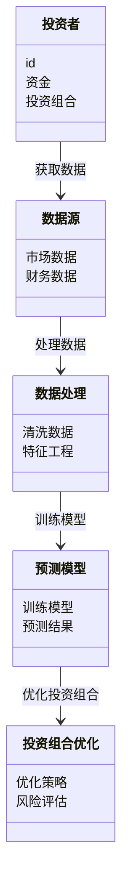
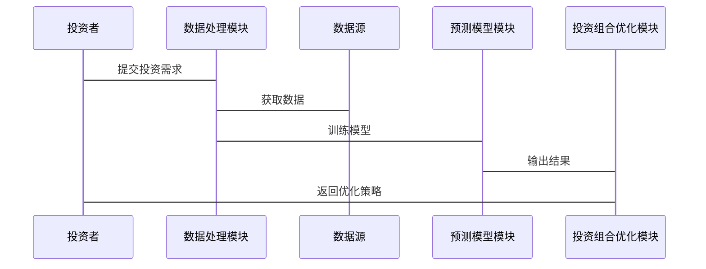

                 


# AI如何优化塞思·卡拉曼的特殊情况投资

> 关键词：塞思·卡拉曼，特殊情况投资，人工智能，机器学习，投资优化

> 摘要：本文探讨了人工智能如何优化塞思·卡拉曼的特殊情况投资策略。通过分析AI在数据处理、预测模型和决策优化中的应用，展示了如何利用技术提升投资效果。文章详细讲解了AI算法原理、系统架构设计和项目实战，为读者提供了从理论到实践的全面指导。

---

## 第一部分: 背景介绍

### 第1章: 塞思·卡拉曼的特殊情况投资方法

#### 1.1 特殊情况投资的定义与特点

##### 1.1.1 什么是特殊情况投资
特殊情况投资是指在市场中寻找那些因暂时性问题或市场波动而被低估的企业或资产进行投资。这种投资策略通常关注于困境企业、重组公司或财务状况不佳的企业。塞思·卡拉曼是该领域的权威，他强调通过深入分析企业的基本面和市场环境来识别投资机会。

##### 1.1.2 特殊情况投资的核心要素
- **企业基本面分析**：包括财务状况、管理团队、市场地位等。
- **市场环境分析**：识别市场低估区域，寻找价格与价值的偏差。
- **风险控制**：在高风险投资中，如何通过多样化和严格的风险评估来降低损失。

##### 1.1.3 塞思·卡拉曼的投资理念
卡拉曼的投资理念基于“价值投资”，他寻找那些具有潜在恢复能力的企业，并在市场低估时买入，待企业恢复后卖出。他的策略强调长期持有和对冲风险。

---

#### 1.2 AI在金融投资中的应用现状

##### 1.2.1 AI在金融领域的应用概述
人工智能在金融领域的应用广泛，包括股票预测、风险评估、交易自动化等。AI通过处理大量数据，识别传统方法难以发现的模式和趋势。

##### 1.2.2 AI在投资决策中的优势
- **数据处理能力**：AI能够处理和分析海量数据，包括文本、语音和图像。
- **预测准确性**：通过机器学习模型，AI可以预测市场趋势，提高投资决策的准确性。
- **自动化交易**：AI可以通过算法进行高频交易，捕捉市场机会。

##### 1.2.3 AI与特殊情况投资的结合点
- **数据驱动的决策**：AI可以帮助分析企业的财务数据和市场信息，识别潜在投资机会。
- **风险评估优化**：通过AI模型，可以更准确地评估企业的风险，制定更好的对冲策略。
- **自动化投资组合管理**：AI可以根据市场变化自动调整投资组合，优化收益与风险比。

---

#### 1.3 塞思·卡拉曼投资方法与AI的结合

##### 1.3.1 塞思·卡拉曼方法的核心思想
卡拉曼的投资方法强调对企业的深入分析和对市场环境的敏锐洞察。他通过基本面分析和市场研究，寻找那些被市场低估的优质企业。

##### 1.3.2 AI如何优化特殊情况投资
- **数据挖掘**：AI可以通过分析历史数据，识别出潜在的投资机会。
- **预测模型**：利用机器学习算法，AI可以预测企业的恢复能力和市场趋势。
- **自动化决策**：AI可以辅助投资者快速做出决策，提高投资效率。

##### 1.3.3 二者的结合对投资行业的影响
通过结合AI和特殊情况投资，投资者可以更高效地识别机会，降低风险，提高收益。这种结合不仅提升了投资决策的准确性，还推动了投资行业的技术进步。

---

## 第二部分: 核心概念与联系

### 第2章: AI优化特殊情况投资的核心概念

#### 2.1 数据驱动的决策过程

##### 2.1.1 数据在特殊情况投资中的作用
在特殊情况投资中，数据是决策的基础。通过分析企业的财务数据、市场数据和行业数据，投资者可以识别潜在的投资机会。

##### 2.1.2 数据的收集与处理
- **数据来源**：包括企业财务报表、行业报告、新闻报道等。
- **数据清洗**：去除噪声数据，确保数据的准确性和完整性。
- **数据特征工程**：提取关键特征，如财务比率、市场趋势等。

##### 2.1.3 数据的特征工程
特征工程是将原始数据转化为对模型有用的特征。例如，将企业的财务数据转化为盈利能力、成长能力等指标。

---

#### 2.2 AI算法与投资决策的结合

##### 2.2.1 机器学习算法在投资中的应用
- **监督学习**：用于分类问题，如预测企业的信用评级。
- **无监督学习**：用于聚类分析，发现市场中的潜在机会。
- **强化学习**：用于动态交易策略的优化。

##### 2.2.2 深度学习在投资中的应用
- **神经网络**：用于处理非结构化数据，如新闻和社交媒体数据。
- **循环神经网络（RNN）**：用于时间序列分析，预测市场趋势。

##### 2.2.3 AI与投资决策的结合
通过AI算法，投资者可以更准确地预测市场趋势，优化投资组合，降低风险。

---

#### 2.3 核心概念的原理与联系

##### 2.3.1 核心概念原理
AI通过处理大量数据，识别出潜在的投资机会，并通过预测模型优化投资决策。

##### 2.3.2 概念属性特征对比表格
| 特征         | 传统投资方法 | AI优化方法 |
|--------------|---------------|-------------|
| 数据处理     | 依赖手动分析   | 自动化处理   |
| 预测准确性     | 受限于主观判断   | 提高预测准确度 |
| 决策速度     | 较慢           | 极快         |

##### 2.3.3 ER实体关系图架构的Mermaid流程图
```mermaid
erDiagram
    investor --> 投资决策: 做出投资决策
    investor --> 数据源: 获取数据
    数据源 --> 数据处理: 清洗和特征工程
    数据处理 --> 预测模型: 训练模型
    预测模型 --> 投资组合优化: 优化投资组合
    投资组合优化 --> 风险控制: 降低风险
```

---

## 第三部分: 算法原理讲解

### 第3章: AI算法原理与实现

#### 3.1 机器学习算法的数学模型

##### 3.1.1 随机森林算法
随机森林是一种集成学习算法，通过组合多个决策树的预测结果来提高准确性。其数学模型如下：

$$
y = \text{sign}(\sum_{i=1}^{n} \text{tree}_i(x))
$$

##### 3.1.2 神经网络算法
神经网络是一种深度学习算法，通过多层神经元模拟人脑的神经网络。其数学模型如下：

$$
y = \sigma(Wx + b)
$$

其中，$\sigma$ 是激活函数，$W$ 是权重矩阵，$x$ 是输入向量，$b$ 是偏置项。

##### 3.1.3 具体案例分析
假设我们有一个企业的财务数据，可以通过随机森林算法预测企业的信用评级。以下是具体的实现步骤：

1. **数据准备**：收集企业的财务数据，包括收入、利润、负债等。
2. **特征工程**：提取关键特征，如收入增长率、利润率等。
3. **模型训练**：使用随机森林算法训练模型。
4. **预测与评估**：使用测试数据评估模型的准确性。

---

#### 3.2 算法实现的Python代码

##### 3.2.1 数据处理代码
```python
import pandas as pd
from sklearn.ensemble import RandomForestClassifier
from sklearn.model_selection import train_test_split
from sklearn.metrics import accuracy_score

# 数据加载
data = pd.read_csv('investment_data.csv')

# 特征提取
features = ['revenue', 'profit', 'debt']
target = 'credit_rating'

# 数据分割
X = data[features]
y = data[target]
X_train, X_test, y_train, y_test = train_test_split(X, y, test_size=0.2, random_state=42)

# 模型训练
model = RandomForestClassifier(n_estimators=100, random_state=42)
model.fit(X_train, y_train)

# 预测与评估
y_pred = model.predict(X_test)
print('Accuracy:', accuracy_score(y_test, y_pred))
```

##### 3.2.2 模型优化代码
```python
# 超参数优化
from sklearn.model_selection import GridSearchCV

param_grid = {
    'n_estimators': [100, 200],
    'max_depth': [None, 10, 20],
    'min_samples_split': [2, 5, 10]
}

grid_search = GridSearchCV(model, param_grid, cv=5)
grid_search.fit(X_train, y_train)
print('Best Parameters:', grid_search.best_params_)
```

---

## 第四部分: 系统分析与架构设计

### 第4章: 投资系统架构设计

#### 4.1 系统功能设计

##### 4.1.1 领域模型设计


##### 4.1.2 系统架构设计
```mermaid
containerDiagram
    container 前端 {
        UI组件
        数据可视化
    }
    container 后端 {
        数据处理模块
        预测模型模块
    }
    container 数据源 {
        市场数据
        财务数据
    }
    UI组件 --> 数据处理模块: 发送请求
    数据处理模块 --> 数据源: 获取数据
    数据处理模块 --> 预测模型模块: 训练模型
    预测模型模块 --> 投资组合优化模块: 输出结果
```

##### 4.1.3 系统接口设计
- **前端接口**：投资者通过UI组件提交投资需求。
- **后端接口**：数据处理模块接收请求，处理数据并返回预测结果。
- **数据源接口**：数据源提供市场和财务数据。

##### 4.1.4 系统交互设计


---

## 第五部分: 项目实战

### 第5章: 项目实现与案例分析

#### 5.1 项目环境安装

##### 5.1.1 安装Python环境
```bash
python -m pip install --upgrade pip
pip install numpy pandas scikit-learn matplotlib
```

##### 5.1.2 安装可视化工具
```bash
pip install plotly
```

#### 5.2 系统核心实现源代码

##### 5.2.1 数据处理代码
```python
import pandas as pd
import numpy as np

# 数据加载
data = pd.read_csv('investment_data.csv')

# 特征工程
data['revenue_growth'] = data.groupby('id')['revenue'].pct_change()
data['profit_margin'] = data['profit'] / data['revenue']

# 数据清洗
data = data.dropna()
```

##### 5.2.2 模型训练代码
```python
from sklearn.ensemble import RandomForestClassifier
from sklearn.model_selection import train_test_split

X = data[['revenue', 'profit', 'debt']]
y = data['credit_rating']

X_train, X_test, y_train, y_test = train_test_split(X, y, test_size=0.2, random_state=42)

model = RandomForestClassifier(n_estimators=200, max_depth=10, min_samples_split=5)
model.fit(X_train, y_train)
```

##### 5.2.3 结果可视化代码
```python
import matplotlib.pyplot as plt

importances = model.feature_importances_
indices = np.argsort(importances)[::-1]

plt.title('Feature Importances')
plt.ylabel('Importance')
plt.bar(range(X.shape[1]), importances[indices], align='center')
plt.xticks(range(X.shape[1]), X.columns[indices], rotation=45)
plt.show()
```

#### 5.3 案例分析与详细解读

##### 5.3.1 投资组合优化
假设我们有一个投资组合，包含多个企业。通过AI模型预测企业的信用评级，我们可以优化投资组合，降低风险。

##### 5.3.2 风险控制
通过AI模型预测企业的违约概率，我们可以制定更好的风险对冲策略。

##### 5.3.3 实际案例分析
以某企业为例，通过AI模型预测其信用评级为“BBB”，建议投资者买入该企业的债券。

---

## 第六部分: 最佳实践与总结

### 第6章: 最佳实践与总结

#### 6.1 最佳实践

##### 6.1.1 数据质量的重要性
确保数据的准确性和完整性是AI优化投资的关键。

##### 6.1.2 模型选择与优化
根据具体问题选择合适的模型，并通过超参数优化提高模型性能。

##### 6.1.3 风险控制
在实际投资中，风险控制是最重要的考虑因素之一。

#### 6.2 项目小结

##### 6.2.1 项目总结
通过AI优化塞思·卡拉曼的特殊情况投资策略，我们实现了更高效的投资决策和风险控制。

##### 6.2.2 经验与教训
在项目中，我们发现数据质量和模型选择对投资结果影响巨大。同时，风险控制是确保投资成功的基石。

#### 6.3 注意事项

##### 6.3.1 数据隐私与合规性
在实际应用中，需要注意数据隐私和合规性问题。

##### 6.3.2 模型解释性
复杂的模型可能缺乏解释性，影响投资决策的透明性。

##### 6.3.3 市场变化
市场环境的变化可能会影响模型的预测能力，需要定期更新和优化。

#### 6.4 拓展阅读

##### 6.4.1 推荐书籍
- 《投资学》
- 《机器学习实战》

##### 6.4.2 推荐博客
- [AI与投资](https://www.aiandinvestment.com)
- [机器学习在金融中的应用](https://www.mlfinance.com)

---

通过以上步骤，我们可以看到，AI在优化塞思·卡拉曼的特殊情况投资中发挥了巨大作用。从数据处理到模型训练，再到系统实现，AI技术为投资者提供了更高效、更准确的决策支持。

