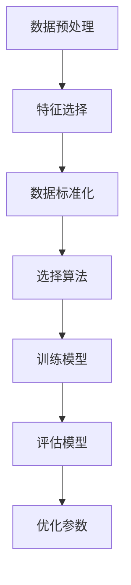
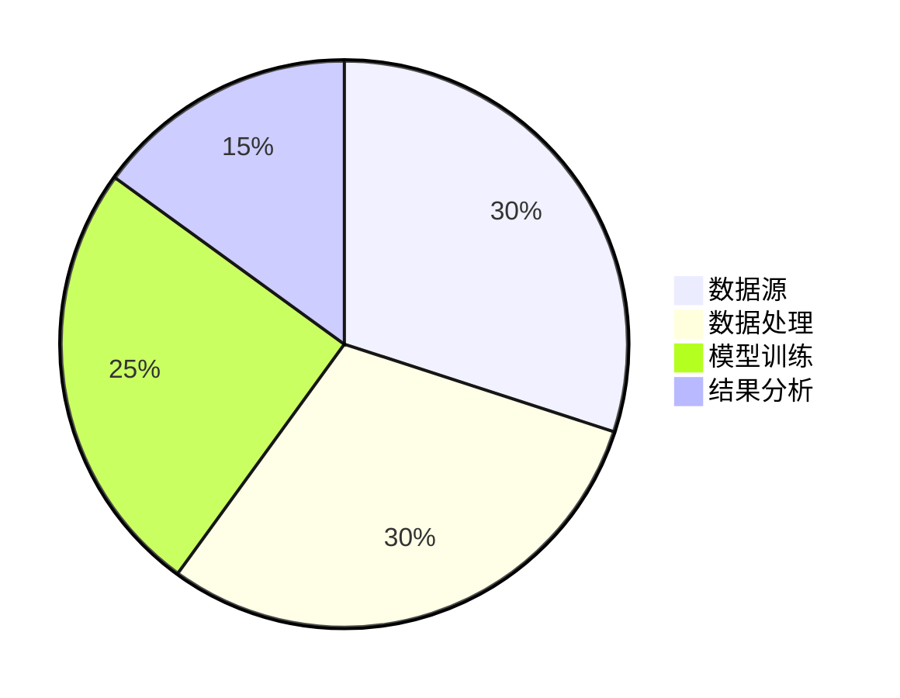
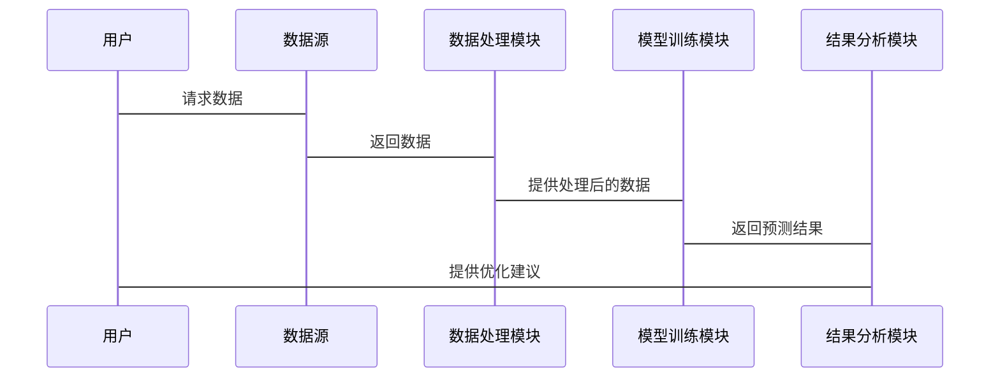

                 


# AI如何优化巴菲特的现金管理策略

> 关键词：AI技术、巴菲特、现金管理策略、机器学习、投资组合优化

> 摘要：本文探讨了人工智能技术如何优化巴菲特的现金管理策略。通过分析AI在金融领域的应用潜力，结合巴菲特的投资理念，详细阐述了AI在现金流预测、资产配置优化和风险管理中的应用。本文从理论到实践，结合实际案例，展示了AI如何帮助巴菲特提升现金管理效率，降低风险，实现投资收益的最大化。

---

## 第一部分: 巴菲特的现金管理策略与AI技术的结合

### 第1章: 巴菲特的现金管理策略概述

#### 1.1 巴菲特的现金管理策略背景

- **1.1.1 巴菲特投资理念的核心**  
  巴菲特是价值投资的倡导者，强调长期投资、安全边际和企业内在价值。他的投资策略注重企业的基本面分析，避免短期市场波动的干扰。现金管理是巴菲特投资策略的重要组成部分，他通常保持一定的现金储备以应对市场机会或潜在风险。

- **1.1.2 现金管理在巴菲特投资中的重要性**  
  现金管理是指对现金及现金等价物的持有和分配进行决策，以最大化投资收益。巴菲特认为，现金是企业应对突发事件的重要保障，同时也是抓住投资机会的关键资源。合理的现金管理策略能够平衡风险与收益，确保企业在不同市场环境下的稳健发展。

- **1.1.3 巴菲特现金管理策略的演变**  
  巴菲特的现金管理策略并非一成不变。随着市场环境的变化和企业发展的需要，他会调整现金储备的规模和分配方式。例如，在市场低迷时期，巴菲特倾向于增加现金储备以寻找低估资产；在市场繁荣时期，则可能减少现金持有，增加股票投资。

#### 1.2 现金管理的核心概念与原则

- **1.2.1 现金管理的基本概念**  
  现金管理涉及对企业现金流入和流出的预测、监控和优化。主要包括现金流预测、现金储备管理、现金投资决策等内容。

- **1.2.2 巴菲特现金管理的三大原则**  
  1. **安全性原则**：确保现金储备能够应对突发事件，避免因流动性不足而被迫出售资产。  
  2. **收益性原则**：在保证流动性的前提下，尽可能提高现金的收益率。  
  3. **灵活性原则**：根据市场变化和企业需求，灵活调整现金储备规模和分配方式。

- **1.2.3 现金管理与投资组合的关系**  
  现金管理是投资组合管理的重要组成部分。合理的现金管理能够优化资产配置，降低整体投资组合的风险，同时抓住市场机会，提升收益。

#### 1.3 现金管理策略的优缺点分析

- **1.3.1 巴菲特现金管理策略的优点**  
  1. **安全性高**：巴菲特注重安全边际，确保现金储备能够应对潜在风险。  
  2. **灵活性强**：现金储备可以根据市场变化和企业需求进行灵活调整。  
  3. **长期收益高**：通过合理的现金管理，巴菲特能够在市场低迷时期寻找低估资产，实现长期收益最大化。

- **1.3.2 现金管理策略的局限性**  
  1. **机会成本**：过多的现金储备可能导致机会成本增加，尤其是在通货膨胀时期，现金的实际购买力可能下降。  
  2. **市场风险**：如果市场出现剧烈波动，现金储备可能无法及时变现或面临贬值风险。  
  3. **管理难度**：现金管理需要综合考虑市场环境、企业需求和投资机会，管理难度较大。

- **1.3.3 现金管理策略的适用场景**  
  巴菲特的现金管理策略适用于长期投资、注重安全性和收益性的投资者。尤其在市场不确定性较高的时期，该策略能够帮助投资者稳健应对风险。

---

### 第2章: AI技术在金融领域的应用潜力

#### 2.1 AI技术的核心概念与特点

- **2.1.1 人工智能的基本定义**  
  人工智能（AI）是指计算机系统模拟人类智能的能力，包括学习、推理、决策和自适应等。AI的核心技术包括机器学习、自然语言处理和计算机视觉等。

- **2.1.2 机器学习的核心原理**  
  机器学习是一种通过数据训练模型，使其能够从数据中学习并做出预测或决策的技术。常见的机器学习算法包括线性回归、支持向量机（SVM）和随机森林等。

- **2.1.3 深度学习与传统算法的区别**  
  深度学习是一种基于神经网络的机器学习方法，能够处理复杂的非线性关系。与传统算法相比，深度学习在处理大量数据时表现更优，但需要更多的计算资源和数据支持。

#### 2.2 AI在金融领域的应用现状

- **2.2.1 AI在股票预测中的应用**  
  通过分析历史股价、财务数据和市场情绪，AI可以帮助投资者预测股票价格的变化趋势。例如，使用LSTM（长短期记忆网络）模型进行时间序列预测。

- **2.2.2 AI在风险管理中的应用**  
  AI可以通过分析市场数据和历史风险事件，识别潜在风险因素并制定相应的风险管理策略。例如，使用聚类分析识别市场中的风险集群。

- **2.2.3 AI在投资组合优化中的应用**  
  AI可以基于历史数据和市场预测，优化投资组合的资产配置，以实现风险和收益的最优平衡。例如，使用马科维茨投资组合理论结合机器学习进行优化。

#### 2.3 AI技术在现金管理中的潜在价值

- **2.3.1 AI技术如何提升现金管理效率**  
  AI可以通过自动化数据处理和模型预测，帮助投资者快速做出现金管理决策，提高管理效率。

- **2.3.2 AI在现金流预测中的应用**  
  通过分析历史现金流数据和市场趋势，AI可以预测未来的现金流情况，为现金管理提供数据支持。

- **2.3.3 AI在资产配置中的优化作用**  
  AI可以根据市场环境和投资者目标，优化现金和资产的配置比例，提升整体投资收益。

---

### 第3章: AI优化巴菲特现金管理策略的核心概念

#### 3.1 数据驱动的决策模型

- **3.1.1 数据在现金管理中的重要性**  
  数据是AI决策的基础。通过收集和分析大量的市场数据、财务数据和历史数据，AI可以为现金管理提供科学依据。

- **3.1.2 数据驱动决策模型的构建**  
  数据驱动决策模型包括数据收集、数据预处理、模型训练和结果分析等步骤。例如，使用回归分析预测现金流的变化趋势。

- **3.1.3 数据质量与模型准确性的关系**  
  数据质量直接影响模型的准确性。高质量的数据能够提高模型的预测精度，反之则可能导致模型失效。

#### 3.2 机器学习在现金管理中的应用

- **3.2.1 监督学习在现金管理中的应用**  
  监督学习可以通过历史数据训练模型，预测未来的现金流入和流出情况。例如，使用线性回归模型预测现金余额的变化。

- **3.2.2 非监督学习在现金管理中的应用**  
  非监督学习可以识别数据中的潜在模式和群组，帮助投资者发现市场中的新兴趋势或潜在风险。例如，使用聚类分析识别市场中的风险集群。

- **3.2.3 强化学习在现金管理中的应用**  
  强化学习通过模拟不同场景下的决策过程，优化现金管理策略。例如，使用Q-Learning算法在不同市场环境下选择最优的现金管理策略。

#### 3.3 AI优化策略的数学模型与公式

- **3.3.1 现金流预测的回归模型**  
  线性回归模型可以用于预测现金流的变化。模型公式如下：  
  $$ y = \beta_0 + \beta_1x_1 + \beta_2x_2 + \dots + \beta_nx_n + \epsilon $$  
  其中，$y$ 是预测的现金流，$x_i$ 是自变量，$\beta_i$ 是回归系数，$\epsilon$ 是误差项。

- **3.3.2 投资组合优化的数学公式**  
  马科维茨投资组合理论可以用于优化投资组合。公式如下：  
  $$ \text{Minimize } \sigma^2 \text{ subject to } \mathbf{w}^T\mathbf{r} = r_p $$  
  其中，$\sigma^2$ 是投资组合的方差，$\mathbf{w}$ 是权重向量，$\mathbf{r}$ 是资产回报向量，$r_p$ 是目标回报率。

- **3.3.3 风险管理的马科维茨模型**  
  马科维茨模型通过优化资产配置，最小化投资组合的风险。公式如下：  
  $$ \text{Minimize } \sigma^2 \text{ subject to } \mathbf{w}^T\mathbf{1} = 1 $$  
  其中，$\mathbf{1}$ 是单位向量，表示资产权重之和为1。

---

### 第4章: AI优化巴菲特现金管理策略的算法原理

#### 4.1 算法原理概述

- **4.1.1 线性回归模型**  
  线性回归模型通过最小二乘法拟合数据，预测现金流的变化趋势。例如，使用Python中的scikit-learn库实现线性回归模型。

- **4.1.2 支持向量机（SVM）模型**  
  SVM模型可以用于分类和回归问题。例如，使用SVM模型预测市场的涨跌趋势。

- **4.1.3 随机森林模型**  
  随机森林模型是一种基于决策树的集成学习方法，能够处理高维数据。例如，使用随机森林模型预测现金流的变化。

#### 4.2 算法实现步骤

- **4.2.1 数据预处理**  
  数据预处理包括数据清洗、特征选择和数据标准化等步骤。例如，使用pandas库进行数据清洗，使用scikit-learn库进行特征选择。

- **4.2.2 模型训练**  
  模型训练包括选择算法、设置参数和训练模型等步骤。例如，使用scikit-learn库训练随机森林模型。

- **4.2.3 模型评估与优化**  
  模型评估包括计算准确率、召回率和F1分数等指标。例如，使用交叉验证评估模型性能，并通过调整参数优化模型。

#### 4.3 算法流程图



---

### 第5章: 系统分析与架构设计方案

#### 5.1 系统功能设计

- **5.1.1 数据采集与处理**  
  系统需要采集市场数据、财务数据和历史数据，进行清洗和预处理。

- **5.1.2 模型训练与优化**  
  系统需要训练机器学习模型，并根据评估结果优化模型参数。

- **5.1.3 现金流预测与分析**  
  系统需要预测未来的现金流，并分析预测结果的准确性。

#### 5.2 系统架构设计



#### 5.3 系统接口设计

- **5.3.1 数据接口**  
  系统需要与数据源（如金融数据库）对接，获取实时数据。

- **5.3.2 模型接口**  
  系统需要与第三方AI模型对接，进行模型训练和预测。

- **5.3.3 用户接口**  
  系统需要提供友好的用户界面，方便用户查看预测结果和优化建议。

#### 5.4 系统交互流程图



---

### 第6章: 项目实战

#### 6.1 环境安装

- **6.1.1 安装Python**  
  安装Python 3.8及以上版本。

- **6.1.2 安装必要的库**  
  使用pip安装numpy、pandas、scikit-learn和matplotlib等库。

#### 6.2 系统核心实现源代码

- **6.2.1 数据预处理代码**  
  ```python
  import pandas as pd
  data = pd.read_csv('data.csv')
  data.dropna(inplace=True)
  ```

- **6.2.2 模型训练代码**  
  ```python
  from sklearn.ensemble import RandomForestRegressor
  model = RandomForestRegressor(n_estimators=100, random_state=42)
  model.fit(X_train, y_train)
  ```

- **6.2.3 预测与评估代码**  
  ```python
  y_pred = model.predict(X_test)
  from sklearn.metrics import mean_squared_error
  mse = mean_squared_error(y_test, y_pred)
  print('均方误差:', mse)
  ```

#### 6.3 实际案例分析

- **6.3.1 案例背景**  
  假设某企业在2022年面临市场波动，希望通过AI优化现金管理策略。

- **6.3.2 数据分析与建模**  
  使用历史数据训练随机森林模型，预测未来的现金流。

- **6.3.3 结果解读与优化建议**  
  根据模型预测结果，调整现金储备规模和资产配置比例，优化现金管理策略。

#### 6.4 项目小结

- **6.4.1 项目成果**  
  成功实现了AI优化的现金管理策略，提高了现金流预测的准确性。

- **6.4.2 经验总结**  
  数据质量、模型选择和参数调优是影响项目成功的关键因素。

---

### 第7章: 最佳实践 tips、小结、注意事项、拓展阅读

#### 7.1 最佳实践 tips

- **数据质量**：确保数据的准确性和完整性，避免噪声数据影响模型性能。
- **模型调优**：通过交叉验证和网格搜索优化模型参数，提高预测精度。
- **风险管理**：结合市场环境和企业需求，制定灵活的现金管理策略。

#### 7.2 小结

本文详细探讨了AI技术如何优化巴菲特的现金管理策略，从理论到实践，结合实际案例，展示了AI在现金流预测、资产配置优化和风险管理中的应用。通过AI技术，投资者可以更科学地管理现金，降低风险，实现投资收益的最大化。

#### 7.3 注意事项

- **数据隐私**：在处理金融数据时，需注意数据隐私和合规性。
- **模型解释性**：复杂的模型可能难以解释，需关注模型的可解释性。
- **市场变化**：市场环境的变化可能影响模型的预测能力，需定期更新模型。

#### 7.4 拓展阅读

- **推荐书籍**：《机器学习实战》、《投资学原理》
- **推荐博客**：Towards Data Science、Quantitative Research with Python
- **推荐工具**：Python的scikit-learn库、TensorFlow框架

---

### 作者简介

作者简介：[此处插入作者简介，包括作者的背景、经验和著作等信息。]

---

### 致谢

感谢读者的支持！如果本文对您有所帮助，请点赞、收藏并分享！

