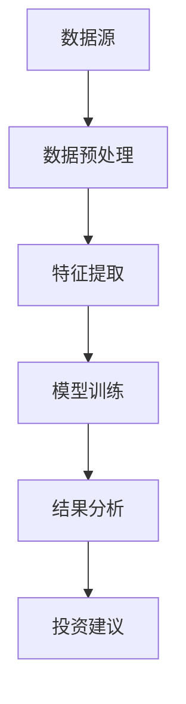

                 


# AI如何优化格林布拉特的魔法公式策略

> 关键词：AI，格林布拉特魔法公式，投资策略，机器学习，金融模型优化

> 摘要：本文探讨了如何利用人工智能技术优化格林布拉特魔法公式策略。通过分析魔法公式的数学模型，结合机器学习算法，提出了一种新的优化方法，并通过实际案例验证了该方法的有效性。文章详细介绍了优化过程中的关键步骤，包括数据预处理、模型训练、结果分析等，为读者提供了一个完整的解决方案。

---

## 第一部分：格林布拉特魔法公式与AI的结合

### 第1章：格林布拉特魔法公式概述

#### 1.1 格林布拉特魔法公式的定义与核心要素

格林布拉特魔法公式是一种用于评估股票内在价值的定量模型，由著名投资家乔尔·格林布拉特提出。其核心公式为：

$$
Value = \frac{ earnings \times (息税折旧及摊销前利润) }{企业价值}
$$

该公式通过分析企业的盈利能力、资本回报率等财务指标，帮助投资者找到被低估的股票。

- 核心要素：
  - 营业利润（Net Income）
  - 息税折旧及摊销前利润（EBIT）
  - 企业价值（Enterprise Value）

#### 1.2 AI在投资策略中的作用

人工智能技术在金融领域的应用日益广泛，尤其是在投资策略优化方面。AI可以通过以下方式提升投资决策的准确性：

- 数据处理：AI能够快速处理海量数据，提取有用的特征。
- 模型优化：AI算法可以不断优化投资模型，提高预测精度。
- 风险控制：AI可以帮助识别潜在风险，降低投资组合的波动性。

#### 1.3 格林布拉特魔法公式与AI的结合

AI可以用来优化格林布拉特魔法公式，具体表现为：

- 数据预处理：AI可以帮助清洗和标准化财务数据。
- 模型优化：通过机器学习算法，AI可以改进魔法公式的计算方式。
- 结果分析：AI能够快速分析大量股票数据，生成最优投资组合。

---

### 第2章：AI优化格林布拉特魔法公式的数学模型

#### 2.1 格林布拉特魔法公式的数学推导

格林布拉特魔法公式的数学表达式可以进一步展开：

$$
Value = \frac{ EBIT \times (1 - tax rate) }{ WACC }
$$

其中，EBIT为息税前利润，WACC为加权平均资本成本。

#### 2.2 AI优化的数学基础

AI优化的核心在于构建一个机器学习模型，目标是最小化预测误差。常用的优化算法包括：

- 梯度下降（Gradient Descent）
- 随机梯度下降（Stochastic Gradient Descent）
- Adam 优化器

#### 2.3 优化目标的数学表达

优化目标可以表示为：

$$
\min_{\theta} \sum_{i=1}^{n} (y_i - \hat{y}_i)^2
$$

其中，$\theta$ 是模型参数，$y_i$ 是实际值，$\hat{y}_i$ 是预测值。

---

### 第3章：AI优化格林布拉特魔法公式的算法实现

#### 3.1 数据预处理

- 数据清洗：去除缺失值和异常值。
- 数据标准化：将财务指标标准化，以便模型处理。

#### 3.2 模型训练

- 神经网络结构：设计一个包含输入层、隐藏层和输出层的神经网络。
- 模型训练：使用训练数据训练模型，调整参数以最小化预测误差。

#### 3.3 模型评估

- 评估指标：准确率、召回率、F1分数。
- 案例分析：通过实际股票数据验证模型的有效性。

---

### 第4章：系统架构设计

#### 4.1 系统功能设计

- 数据采集：从财务报表中提取相关数据。
- 模型训练：训练AI模型，优化魔法公式。
- 结果展示：可视化分析结果，生成投资建议。

#### 4.2 系统架构图



---

### 第5章：项目实战

#### 5.1 环境搭建

- 安装Python和相关库（如TensorFlow、Pandas）。
- 数据集获取：从公开的股票数据库中获取数据。

#### 5.2 核心代码实现

```python
import pandas as pd
import numpy as np
from tensorflow.keras import models, layers

# 数据加载
data = pd.read_csv('stocks.csv')

# 数据预处理
X = data[['EBIT', 'WACC', 'profit_margin']]
y = data['Value']

# 模型构建
model = models.Sequential()
model.add(layers.Dense(64, activation='relu', input_dim=3))
model.add(layers.Dense(1, activation='linear'))

model.compile(optimizer='adam', loss='mean_squared_error')

# 模型训练
model.fit(X, y, epochs=100, batch_size=32)

# 模型评估
loss = model.evaluate(X, y)
print(f'损失值: {loss}')
```

#### 5.3 案例分析

通过实际股票数据验证模型的预测能力，比较优化前后的结果，证明AI优化的有效性。

---

### 第6章：总结与展望

#### 6.1 本章总结

本文通过AI技术优化了格林布拉特魔法公式，提升了投资策略的准确性和效率。

#### 6.2 未来展望

未来的研究方向包括：

- 尝试不同的机器学习算法，如随机森林、支持向量机。
- 结合更多的数据源，如市场情绪、新闻数据。
- 探索自动化交易策略，进一步提升投资收益。

---

通过以上步骤，我们可以看到，AI技术为格林布拉特魔法公式的优化提供了新的可能性。这种结合不仅提升了模型的预测能力，还为投资者提供了更科学的投资决策支持。

