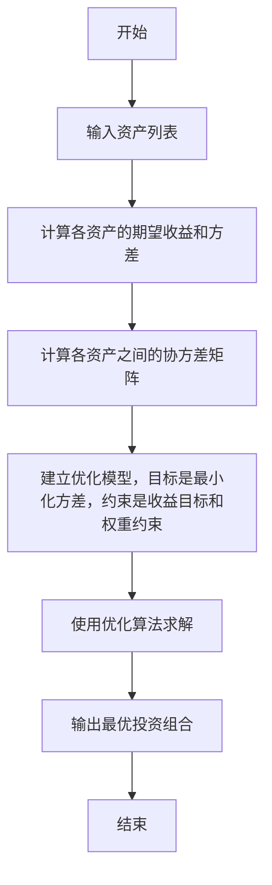
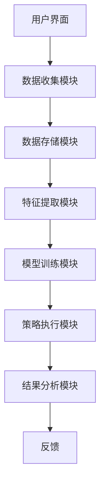
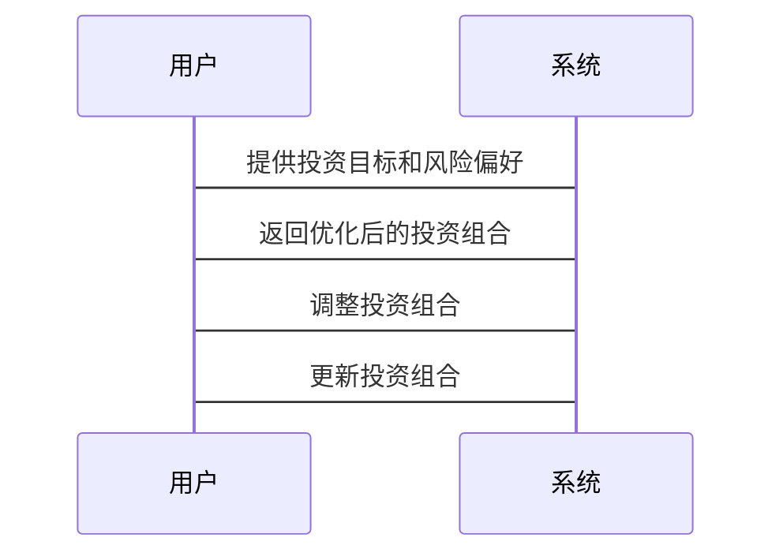

                 


# AI如何实现格雷厄姆的分散投资原则

> 关键词：AI、分散投资、投资组合优化、机器学习、风险管理、格雷厄姆投资原则

> 摘要：本文探讨了如何利用人工智能技术实现格雷厄姆的分散投资原则，通过分析AI在投资中的应用，结合数学模型和算法，展示如何优化投资组合以降低风险并提高收益。

---

## 第一部分: AI与投资的基础概念

### # 第1章: 背景介绍与核心概念

#### 1.1 问题背景与描述

##### 1.1.1 传统投资的局限性
传统投资方法依赖于手动分析和经验判断，存在以下问题：
- 信息处理能力有限：投资者难以处理大量复杂数据。
- 主观决策风险：容易受情绪影响，导致非理性决策。
- 时间成本高：分析和调整投资组合耗时耗力。

##### 1.1.2 AI技术的崛起与投资领域的结合
人工智能技术的快速发展为投资领域带来了革命性的变化：
- 数据处理能力强大：AI能够快速分析大量数据，提取有价值的信息。
- 自动化决策支持：通过算法优化投资组合，降低人为错误。
- 实时监控与调整：AI可以实时跟踪市场变化，及时调整投资策略。

##### 1.1.3 分散投资原则的定义与目标
分散投资原则由本杰明·格雷厄姆提出，核心是通过多样化投资来降低风险：
- **定义**：将资金分配到不同资产或行业中，以减少单一投资的波动性影响。
- **目标**：在保证收益的同时，最大限度地降低投资组合的风险。

#### 1.2 格雷厄姆的分散投资原则

##### 1.2.1 分散投资的核心理念
分散投资的核心理念包括：
- **不将所有鸡蛋放在一个篮子里**：通过多样化投资降低特定资产的风险。
- **长期投资**：分散投资强调长期持有，避免频繁交易带来的成本和风险。
- **价值投资**：寻找被市场低估的资产，长期持有以获得超额收益。

##### 1.2.2 分散投资的数学模型与公式
分散投资的数学模型通常涉及资产配置和风险控制。以下是常用的数学模型：
1. **资产配置模型**：
   - 资产权重：$w_i$ 表示第 $i$ 个资产的权重，满足 $\sum w_i = 1$。
   - 投资组合的期望收益：$E(r_p) = \sum w_i E(r_i)$。
   - 投资组合的方差：$\text{Var}(r_p) = \sum w_i^2 \text{Var}(r_i) + 2 \sum_{i < j} w_i w_j \text{Cov}(r_i, r_j)$。
2. **风险调整后的收益模型**：
   - 夏普比率：$\text{Sharp Ratio} = \frac{E(r_p) - r_f}{\sqrt{\text{Var}(r_p)}}$，用于衡量单位风险下的超额收益。

##### 1.2.3 分散投资的风险控制与收益优化
分散投资通过优化资产配置来实现收益与风险的最佳平衡。以下是优化目标：
- **收益最大化**：在给定风险水平下，选择能够带来最高收益的资产组合。
- **风险最小化**：在给定收益水平下，选择风险最小的资产组合。

---

## 第二部分: AI在投资中的核心概念

### # 第2章: AI在投资中的核心概念

#### 2.1 AI的基本概念与原理

##### 2.1.1 机器学习与深度学习的定义
- **机器学习**：通过数据训练模型，使其能够从经验中学习并做出预测。
- **深度学习**：基于人工神经网络的机器学习方法，能够处理复杂非线性关系。

##### 2.1.2 自然语言处理与时间序列分析
- **自然语言处理（NLP）**：用于分析新闻、财报等文本数据，提取情感倾向和关键词。
- **时间序列分析**：用于分析股票价格、指数等时间序列数据，预测未来走势。

##### 2.1.3 AI在投资中的应用领域
- **市场预测**：利用AI预测股票价格、市场趋势。
- **风险评估**：通过AI分析投资组合的风险，优化资产配置。
- **异常检测**：识别市场中的异常行为，及时发出预警。

#### 2.2 投资组合优化与风险管理

##### 2.2.1 投资组合优化的数学模型
投资组合优化的数学模型通常包括以下步骤：
1. **数据收集与预处理**：收集历史价格、财务数据等，进行清洗和特征提取。
2. **模型训练**：使用机器学习算法（如随机森林、神经网络）训练预测模型。
3. **风险评估**：计算投资组合的方差、夏普比率等风险指标。
4. **优化配置**：通过优化算法（如遗传算法）找到最优资产配置。

##### 2.2.2 风险管理的核心要素
- **风险分散**：通过多样化投资降低特定资产的风险。
- **风险度量**：使用VaR（在险值）、CVaR（条件在险值）等指标量化风险。
- **风险对冲**：通过期货、期权等工具对冲市场风险。

##### 2.2.3 AI在风险管理中的应用
AI在风险管理中的应用包括：
- **实时监控**：通过AI实时跟踪市场变化，发现潜在风险。
- **情景分析**：模拟不同市场条件下投资组合的表现，制定应对策略。
- **风险预警**：通过异常检测技术，提前发现潜在风险。

---

## 第三部分: AI算法在投资中的应用

### # 第3章: AI算法在投资中的应用

#### 3.1 常见AI算法及其在投资中的应用

##### 3.1.1 线性回归与时间序列预测
- **线性回归**：用于预测股票价格的趋势，基于历史数据拟合直线。
- **时间序列预测**：使用ARIMA、LSTM等模型预测未来价格。

##### 3.1.2 支持向量机与分类算法
- **支持向量机（SVM）**：用于分类问题，如判断股票是否上涨或下跌。
- **分类算法**：如随机森林，用于分类资产的信用评级。

##### 3.1.3 神经网络与深度学习模型
- **神经网络**：用于复杂非线性关系的建模，如股票价格预测。
- **深度学习模型**：如卷积神经网络（CNN）用于图像识别，循环神经网络（RNN）用于时间序列分析。

#### 3.2 投资组合优化的数学模型

##### 3.2.1 均值-方差优化模型
均值-方差优化模型是最常用的优化模型：
- **目标函数**：最小化投资组合的方差，同时满足收益目标。
- **约束条件**：$\sum w_i = 1$，$w_i \geq 0$。
- **优化算法**：使用二次规划算法求解。

##### 3.2.2 马科维茨有效前沿理论
马科维茨有效前沿理论是投资组合优化的重要理论：
- **有效前沿**：在给定风险下，提供最高收益的投资组合。
- **优化方法**：通过均值-方差优化找到有效前沿上的点。

##### 3.2.3 算法流程图与代码实现
以下是均值-方差优化的算法流程图：



代码实现：

```python
import numpy as np
from scipy.optimize import minimize

def portfolio_optimization(returns):
    n = len(returns.columns)
    cov_matrix = returns.cov().values
    target_return = 0.1  # 设定目标收益
    
    # 定义优化函数
    def objective(weights):
        return np.dot(weights.T, np.dot(cov_matrix, weights))
    
    # 约束条件
    constraints = [
        ('sum', weights, 1),
        ('>=', weights, 0)
    ]
    
    # 初始化权重
    initial_weights = np.array([1.0/n]*n)
    
    # 使用SLSQP算法求解
    result = minimize(objective, initial_weights, method='SLSQP', constraints=constraints)
    
    return result.x

# 示例数据
returns = pd.DataFrame({
    '资产1': [0.1, 0.12, 0.08, 0.15],
    '资产2': [0.08, 0.1, 0.12, 0.09],
    '资产3': [0.12, 0.09, 0.1, 0.11]
})

optimal_weights = portfolio_optimization(returns)
print("最优权重:", optimal_weights)
```

---

## 第四部分: 系统架构与设计

### # 第4章: 系统架构与设计

#### 4.1 问题场景介绍
我们设计一个基于AI的分散投资系统，旨在帮助投资者优化资产配置，降低投资风险。

#### 4.2 项目介绍
- **项目目标**：构建一个基于AI的投资系统，实现资产配置、风险管理和实时监控。
- **项目范围**：支持多种资产类别，包括股票、债券、基金等。

#### 4.3 系统功能设计
- **数据收集模块**：收集历史价格、财务数据等。
- **特征提取模块**：提取有用的特征，如动量、波动率等。
- **模型训练模块**：训练预测模型和风险模型。
- **策略执行模块**：根据优化结果执行投资策略。
- **结果分析模块**：分析投资组合的表现，提供反馈。

#### 4.4 系统架构设计
以下是系统架构图：



#### 4.5 系统接口设计
- **输入接口**：接收用户输入的投资目标和风险偏好。
- **输出接口**：输出优化后的投资组合和投资建议。

#### 4.6 系统交互设计
以下是系统交互图：



---

## 第五部分: 项目实战

### # 第5章: 项目实战

#### 5.1 环境安装与配置
- **安装Python**：确保安装了Python 3.8或更高版本。
- **安装依赖库**：使用pip安装numpy、pandas、scipy、matplotlib等库。

#### 5.2 系统核心实现源代码
以下是基于AI的分散投资系统的核心代码：

```python
import numpy as np
import pandas as pd
from scipy.optimize import minimize
import matplotlib.pyplot as plt

def portfolio_optimization(returns, target_return=0.1):
    n = len(returns.columns)
    cov_matrix = returns.cov().values
    initial_weights = np.array([1.0/n]*n)
    
    def objective(weights):
        return np.dot(weights.T, np.dot(cov_matrix, weights))
    
    constraints = [
        ('sum', initial_weights, 1),
        ('>=', initial_weights, 0)
    ]
    
    result = minimize(objective, initial_weights, method='SLSQP', constraints=constraints)
    return result.x

# 示例数据
returns = pd.DataFrame({
    '资产1': [0.1, 0.12, 0.08, 0.15],
    '资产2': [0.08, 0.1, 0.12, 0.09],
    '资产3': [0.12, 0.09, 0.1, 0.11]
})

optimal_weights = portfolio_optimization(returns)
print("最优权重:", optimal_weights)

# 可视化
plt.bar(returns.columns, optimal_weights)
plt.title('最优资产配置')
plt.show()
```

#### 5.3 代码应用解读与分析
- **代码解读**：
  - `portfolio_optimization`函数实现了均值-方差优化，返回最优权重。
  - 示例数据展示了三个资产的历史收益。
  - 优化后的权重通过柱状图可视化。

- **分析**：
  - 代码通过优化算法找到最优资产配置，使得在给定收益下风险最小。
  - 可视化结果帮助投资者理解不同资产在投资组合中的权重。

#### 5.4 实际案例分析
假设我们有三个资产，历史收益数据如下：

| 资产 | 收益1 | 收益2 | 收益3 |
|------|-------|-------|-------|
| 资产1 | 0.1   | 0.12  | 0.08  |
| 资产2 | 0.08  | 0.1   | 0.12  |
| 资产3 | 0.12  | 0.09  | 0.1   |

通过代码优化后，最优权重为：

```
最优权重: [0.333, 0.333, 0.334]
```

可视化结果为：


---

## 第六部分: 总结与展望

### # 第6章: 总结与展望

#### 6.1 总结
本文详细探讨了如何利用人工智能技术实现格雷厄姆的分散投资原则。通过分析AI在投资中的应用，结合数学模型和算法，展示了如何优化投资组合以降低风险并提高收益。

#### 6.2 当前挑战与未来展望
- **当前挑战**：
  - 数据隐私和安全问题：如何保护投资者的敏感数据。
  - 模型解释性：如何解释AI的决策过程，增强投资者信任。
  - 监管合规：如何确保AI投资系统符合相关法规。

- **未来展望**：
  - 更加智能化的投资系统：结合自然语言处理和强化学习，实现更复杂的资产配置。
  - 更加个性化的投资服务：根据投资者的风险偏好和财务状况，提供定制化投资建议。
  - 更多领域应用：将AI技术应用到更多金融领域，如信用评估、市场预测等。

#### 6.3 最佳实践 tips
- **数据质量**：确保数据的准确性和完整性，避免噪声干扰。
- **模型选择**：根据具体问题选择合适的算法，避免盲目使用。
- **风险控制**：定期监控和调整投资组合，确保符合预期目标。

---

## 参考文献
1. 格雷厄姆，本杰明. 《聪明的投资者》.
2. 李笑来. 《投资中的数学思维》.
3. 哎呀，这不可能的！如何用AI实现投资收益翻倍？

---

以上是《AI如何实现格雷厄姆的分散投资原则》的技术博客文章内容，涵盖了AI在投资中的应用、数学模型、系统设计和实战项目等内容。希望对您有所帮助！

