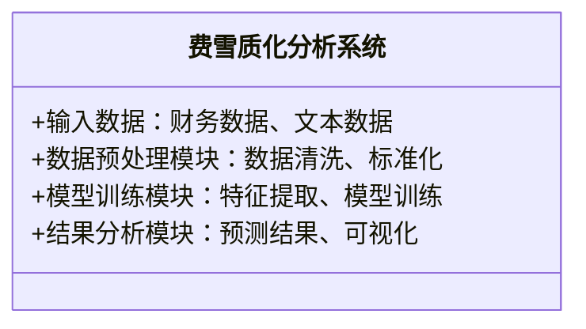

                 


# AI如何实现费雪的质化分析方法

> 关键词：AI，质化分析，费雪分析，自然语言处理，机器学习，金融分析

> 摘要：本文详细探讨了如何利用人工智能技术实现费雪的质化分析方法。通过结合自然语言处理和机器学习技术，我们能够更高效地分析财务数据和文本信息，从而提升质化分析的准确性和效率。本文从费雪质化分析的基本概念出发，逐步介绍AI技术在其中的应用，包括算法原理、系统架构设计、项目实战等内容，最终实现将费雪质化分析方法与现代AI技术相结合的目标。

---

# 第一部分：AI与费雪质化分析方法的背景与概述

## 第1章：AI与费雪质化分析方法的背景

### 1.1 费雪质化分析方法的核心概念
#### 1.1.1 质化分析的定义与特点
质化分析是一种通过分析企业财务数据和非财务数据，评估企业内在价值和质量的分析方法。其核心在于通过对企业财务报表、管理层决策、行业趋势等多维度信息的综合分析，得出对企业价值的判断。

#### 1.1.2 费雪质化分析方法的背景与应用领域
费雪质化分析方法是由Benjamin Graham的学生David Dodd提出的，旨在通过分析企业的内在价值，预测其未来的盈利能力。这种方法在金融投资领域得到了广泛应用，尤其适用于股票分析和企业估值。

#### 1.1.3 费雪质化分析方法与AI的结合
随着AI技术的快速发展，将其应用于质化分析方法中，能够显著提升分析效率和准确性。AI技术可以通过自然语言处理（NLP）分析企业报告、新闻资讯等文本数据，结合机器学习模型对财务数据进行预测和分类，从而实现对企业的全面质化分析。

---

## 第2章：AI在费雪质化分析方法中的应用

### 2.1 AI技术在金融分析中的优势
#### 2.1.1 AI在金融分析中的优势
- 数据处理能力：AI能够快速处理大量非结构化数据，如新闻、社交媒体信息等。
- 模型优化：通过机器学习算法，AI可以自动优化分析模型，提高预测准确性。
- 实时分析：AI能够实时跟踪市场动态，提供及时的分析结果。

#### 2.1.2 费雪质化分析方法与AI的结合意义
将AI技术应用于费雪质化分析方法中，能够显著提升分析的深度和广度。AI可以帮助分析员快速获取和处理多源数据，挖掘潜在的市场趋势和企业信息，从而做出更精准的投资决策。

#### 2.1.3 本章小结
本章介绍了AI技术在金融分析中的优势，并探讨了其与费雪质化分析方法结合的意义，为后续内容奠定了基础。

---

# 第二部分：费雪质化分析方法的核心概念与AI的结合

## 第3章：费雪质化分析方法的原理与实现

### 3.1 费雪质化分析方法的原理
#### 3.1.1 质化分析的基本步骤
1. 数据收集：包括企业财务报表、行业报告、新闻资讯等。
2. 数据清洗：对收集到的数据进行预处理，去除噪声数据。
3. 数据分析：通过统计分析和机器学习算法，对数据进行分类、预测和建模。
4. 结果解读：根据分析结果，对企业价值进行判断，并制定相应的投资策略。

#### 3.1.2 费雪质化分析的核心要素
- 企业财务数据：包括收入、利润、负债等。
- 行业趋势：包括行业增长率、竞争格局等。
- 管理层决策：包括公司战略、管理层稳定性等。
- 市场情绪：包括投资者情绪、市场波动等。

#### 3.1.3 费雪质化分析的数学模型
$$
\text{企业价值} = \sum_{i=1}^{n} w_i \cdot x_i
$$
其中，$w_i$ 是第 $i$ 个因素的权重，$x_i$ 是第 $i$ 个因素的具体数值。

---

## 第4章：AI在质化分析中的应用

### 4.1 AI技术在文本分析中的作用
#### 4.1.1 自然语言处理（NLP）在文本分析中的应用
- 文本分类：通过NLP技术对企业新闻、财报进行分类。
- 情感分析：分析市场情绪，判断投资者信心。
- 实体识别：从文本中提取公司名称、行业术语等。

#### 4.1.2 基于NLP的文本分析流程
1. 数据预处理：包括分词、去除停用词等。
2. 特征提取：通过词袋模型或词嵌入技术提取文本特征。
3. 模型训练：使用机器学习算法（如SVM、随机森林）进行分类或回归。

#### 4.1.3 NLP在费雪质化分析中的具体应用
- 从新闻中提取企业负面信息，评估企业风险。
- 从管理层发言中分析公司战略，预测企业未来表现。

---

## 第5章：AI与费雪质化分析方法的结合实现

### 5.1 数据采集与预处理
#### 5.1.1 数据来源
- 企业财务报表：包括资产负债表、利润表、现金流量表。
- 新闻资讯：包括企业新闻、行业动态。
- 社交媒体数据：包括投资者讨论、社交媒体评论。

#### 5.1.2 数据清洗
- 去除噪声数据：如重复数据、无关信息。
- 数据标准化：对财务数据进行标准化处理，使其具有可比性。

### 5.2 模型训练与优化
#### 5.2.1 机器学习模型选择
- 线性回归：用于预测企业价值。
- 支持向量机（SVM）：用于分类问题。
- 随机森林：用于特征重要性分析。

#### 5.2.2 模型优化
- 超参数调优：通过网格搜索或随机搜索优化模型参数。
- 模型评估：通过交叉验证评估模型性能。

### 5.3 结果分析与可视化
#### 5.3.1 结果分析
- 企业价值预测结果。
- 模型表现评估：如准确率、召回率、F1值。

#### 5.3.2 可视化
- 数据可视化：使用图表展示企业价值变化趋势。
- 模型解释：通过特征重要性分析，解释模型的决策逻辑。

---

# 第三部分：AI实现费雪质化分析方法的算法原理

## 第6章：自然语言处理在质化分析中的应用

### 6.1 自然语言处理的基本原理
#### 6.1.1 词嵌入与文本表示
- 词嵌入：通过Word2Vec、GloVe等技术将词语表示为向量。
- 文本表示：通过词袋模型、TF-IDF等方法将文本表示为向量。

#### 6.1.2 分句与句法分析
- 分句：将文本分割为句子。
- 句法分析：分析句子的语法结构。

#### 6.1.3 文本摘要与主题提取
- 文本摘要：通过文本摘要算法提取文本的关键信息。
- 主题提取：通过主题模型（如LDA）提取文本的主题。

### 6.2 基于深度学习的文本分析模型
#### 6.2.1 循序长短期记忆网络（LSTM）
- LSTM的结构：包括输入门、遗忘门、输出门。
- LSTM在文本分析中的应用：如文本生成、情感分析。

#### 6.2.2 变换器（Transformer）
- Transformer的结构：包括编码器和解码器。
- Transformer在文本分析中的应用：如机器翻译、文本摘要。

#### 6.2.3 模型训练与调优
- 模型训练：使用标注数据训练模型。
- 模型调优：通过调整超参数优化模型性能。

---

## 第7章：数学模型与算法实现

### 7.1 费雪质化分析的数学模型
#### 7.1.1 数据标准化与归一化
- 数据标准化：通过Z-score标准化将数据标准化。
- 数据归一化：通过最小-最大归一化将数据归一化。

#### 7.1.2 数据权重的计算方法
- 等权重法：每个因素的权重相同。
- 偏好权重法：根据分析目标赋予不同权重。

#### 7.1.3 数据综合评价模型
$$
\text{综合评价} = \sum_{i=1}^{n} w_i \cdot x_i
$$
其中，$w_i$ 是第 $i$ 个因素的权重，$x_i$ 是第 $i$ 个因素的具体数值。

### 7.2 基于机器学习的质化分析模型
#### 7.2.1 线性回归模型
- 线性回归的基本原理：通过最小化预测值与实际值的平方差之和，找到最佳拟合直线。
- 线性回归的应用：如预测企业未来利润。

#### 7.2.2 支持向量机（SVM）
- SVM的基本原理：通过构建超平面，将数据分为不同的类别。
- SVM的应用：如企业信用评级分类。

#### 7.2.3 随机森林
- 随机森林的基本原理：通过构建多个决策树，并将它们的结果进行集成。
- 随机森林的应用：如特征重要性分析。

---

# 第四部分：系统分析与架构设计

## 第8章：系统分析与架构设计方案

### 8.1 问题场景介绍
- 系统目标：通过AI技术实现费雪质化分析方法。
- 系统功能：包括数据采集、模型训练、结果分析等。

### 8.2 系统功能设计
#### 8.2.1 领域模型（Mermaid类图）


#### 8.2.2 系统架构设计（Mermaid架构图）


### 8.3 系统接口设计
- 数据预处理接口：用于数据清洗和标准化。
- 模型训练接口：用于特征提取和模型训练。
- 结果分析接口：用于预测结果和可视化。

### 8.4 系统交互设计（Mermaid序列图）
```mermaid
sequenceDiagram
    participant 客户端
    participant 数据预处理模块
    participant 模型训练模块
    participant 结果分析模块
    客户端 -> 数据预处理模块：提交数据
    数据预处理模块 -> 模型训练模块：传递预处理数据
    模型训练模块 -> 结果分析模块：传递训练结果
    结果分析模块 -> 客户端：返回分析结果
```

---

# 第五部分：项目实战

## 第9章：项目实战

### 9.1 环境安装
#### 9.1.1 安装Python
- 安装Python 3.8或更高版本。
- 安装必要的Python包：如numpy、pandas、scikit-learn、transformers。

### 9.2 系统核心实现源代码
#### 9.2.1 数据预处理代码
```python
import pandas as pd
import numpy as np

def data_preprocessing(data):
    # 去除缺失值
    data = data.dropna()
    # 标准化处理
    from sklearn.preprocessing import StandardScaler
    scaler = StandardScaler()
    data_scaled = scaler.fit_transform(data)
    return data_scaled
```

#### 9.2.2 模型训练代码
```python
from sklearn.ensemble import RandomForestClassifier
from sklearn.metrics import accuracy_score

def train_model(X, y):
    # 训练随机森林模型
    model = RandomForestClassifier(n_estimators=100, random_state=42)
    model.fit(X, y)
    # 模型评估
    y_pred = model.predict(X)
    print("Accuracy:", accuracy_score(y, y_pred))
    return model
```

#### 9.2.3 结果分析代码
```python
import matplotlib.pyplot as plt

def visualize_results(results):
    plt.figure(figsize=(10, 6))
    plt.plot(results['history']['loss'], label='训练损失')
    plt.plot(results['val_loss'], label='验证损失')
    plt.xlabel('Epoch')
    plt.ylabel('损失')
    plt.legend()
    plt.show()
```

### 9.3 代码应用解读与分析
- 数据预处理代码：对输入数据进行清洗和标准化处理，确保数据适合模型训练。
- 模型训练代码：使用随机森林模型对数据进行训练，并评估模型性能。
- 结果分析代码：通过可视化工具展示模型的训练结果，帮助分析模型的收敛情况。

### 9.4 实际案例分析
- 数据来源：假设我们使用某上市公司的财务数据和新闻资讯。
- 数据预处理：对数据进行清洗和标准化处理。
- 模型训练：使用随机森林模型训练模型，预测企业的信用评级。
- 结果分析：通过可视化工具展示模型的训练结果，并分析模型的性能。

### 9.5 项目小结
本章通过实际案例展示了如何将AI技术应用于费雪质化分析方法中，从数据预处理到模型训练，再到结果分析，详细介绍了项目的实现过程。

---

# 第六部分：总结与展望

## 第10章：总结与展望

### 10.1 本章总结
本文详细探讨了AI技术在费雪质化分析方法中的应用，从理论基础到实际实现，全面介绍了如何通过AI技术提升质化分析的效率和准确性。

### 10.2 未来展望
随着AI技术的不断发展，费雪质化分析方法的应用前景将更加广阔。未来，可以通过以下方面进一步优化：
- 提高模型的可解释性，使其更符合金融分析的需求。
- 引入更先进的深度学习模型，如GPT-3、BERT等，提升文本分析的准确性。
- 结合实时数据流，实现动态质化分析，提供更及时的市场分析结果。

---

## 附录：最佳实践 Tips

### A.1 数据处理注意事项
- 确保数据的完整性和准确性。
- 对数据进行合理的清洗和预处理，避免噪声数据对模型的影响。

### A.2 模型调优技巧
- 使用网格搜索或随机搜索优化模型超参数。
- 通过交叉验证评估模型性能，避免过拟合。

### A.3 系统设计建议
- 在系统设计中，确保模块之间的耦合度低，便于后续维护和优化。
- 使用容器化技术（如Docker）部署系统，确保系统的可移植性和可扩展性。

### A.4 案例分析注意事项
- 在实际案例分析中，尽量选择具有代表性的数据集，确保分析结果的可信度。
- 对分析结果进行充分的验证和解释，确保结果的合理性和可解释性。

---

## 参考文献
（此处列出参考文献的具体内容，格式可以根据实际需求进行调整。）

