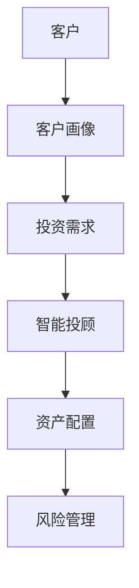

                 


# AI技术在私人银行业务中的应用前景分析

> 关键词：私人银行、人工智能、机器学习、投资组合优化、风险管理

> 摘要：本文深入分析了AI技术在私人银行业务中的应用前景，探讨了AI如何通过客户画像、智能投顾和风险管理等手段优化私人银行服务。文章从背景介绍、核心概念、算法原理、系统架构到项目实战，全面阐述了AI在私人银行中的应用，并通过实例分析和数学模型展示了其实际价值和未来发展方向。

---

## 第一部分: 私人银行业务与AI技术的背景介绍

### 第1章: 私人银行概述

#### 1.1 私人银行的基本概念
- **1.1.1 私人银行的定义与特点**  
  私人银行是指为高净值客户提供专属金融服务的机构，其特点包括定制化服务、资产规模大、服务范围广等。

- **1.1.2 私人银行的主要服务内容**  
  包括资产配置、投资管理、风险控制、税务规划等。

- **1.1.3 私人银行的客户群体分析**  
  高净值客户通常具有复杂的财务需求和多样化的投资目标。

#### 1.2 AI技术的基本概念
- **1.2.1 人工智能的基本定义**  
  AI是模拟人类智能的计算机系统，涵盖学习、推理、自适应等能力。

- **1.2.2 机器学习与深度学习的区别**  
  机器学习是通过数据训练模型，深度学习是基于神经网络的机器学习方法。

- **1.2.3 当前主流AI技术的应用领域**  
  计算机视觉、自然语言处理、语音识别等。

### 第2章: 私人银行业务中的问题与挑战

#### 2.1 私人银行业务的主要问题
- **2.1.1 客户需求的多样化**  
  高净值客户的需求复杂且个性化，难以用传统方法满足。

- **2.1.2 投资决策的复杂性**  
  市场波动和不确定性使得投资决策充满挑战。

- **2.1.3 风险管理的难度**  
  如何在复杂市场中有效控制风险是私人银行的核心问题。

#### 2.2 AI技术在私人银行业务中的应用前景
- **2.2.1 AI技术如何解决私人银行业务中的问题**  
  通过大数据分析和机器学习优化投资策略和风险管理。

- **2.2.2 AI技术在私人银行业务中的潜在应用场景**  
  客户画像、智能投顾、风险预警等。

- **2.2.3 AI技术在私人银行业务中的优势与劣势**  
  优势：高效、精准；劣势：数据依赖性强、模型解释性差。

---

## 第二部分: AI技术在私人银行业务中的核心概念与联系

### 第3章: AI技术在私人银行业务中的核心概念

#### 3.1 客户画像与需求分析
- **3.1.1 客户画像的构建方法**  
  通过聚类分析和特征工程提取客户特征。

- **3.1.2 基于AI的客户需求分析模型**  
  使用自然语言处理技术分析客户需求文本。

- **3.1.3 客户画像与投资策略的关系**  
  客户画像指导投资策略的制定。

#### 3.2 智能投顾与资产配置
- **3.2.1 智能投顾的基本原理**  
  基于客户画像和市场数据，自动化生成投资建议。

- **3.2.2 基于AI的资产配置优化模型**  
  使用强化学习优化投资组合。

- **3.2.3 智能投顾与传统投顾的区别**  
  智能投顾更高效但缺乏人性化。

#### 3.3 风险管理与预警系统
- **3.3.1 基于AI的风险评估模型**  
  使用时间序列分析预测市场风险。

- **3.3.2 风险预警系统的构建方法**  
  结合实时数据和机器学习模型进行风险预警。

- **3.3.3 AI在风险管理中的应用案例**  
  通过AI监控市场波动，提前预警风险。

### 第4章: 核心概念与联系

#### 4.1 核心概念原理
- **4.1.1 客户画像的构建原理**  
  使用聚类算法将客户分为不同类别。

- **4.1.2 智能投顾的算法原理**  
  基于强化学习优化投资组合。

- **4.1.3 风险管理的数学模型**  
  使用马可夫链模型预测市场风险。

#### 4.2 核心概念属性特征对比表格
| **核心概念** | **客户画像** | **智能投顾** | **风险管理** |
|--------------|--------------|--------------|--------------|
| **目标** | 分析客户特征 | 优化投资组合 | 监控市场风险 |
| **方法** | 聚类分析 | 强化学习 | 时间序列分析 |
| **输出** | 客户分群 | 投资建议 | 风险预警 |

#### 4.3 ER实体关系图架构


---

## 第三部分: AI技术在私人银行业务中的算法原理讲解

### 第5章: 算法原理与数学模型

#### 5.1 客户画像构建算法
- **5.1.1 基于聚类算法的客户分群**  
  使用K-means算法将客户分为不同群体。

- **5.1.2 基于决策树的客户特征分析**  
  使用ID3算法分析客户特征的重要性。

- **5.1.3 客户画像的数学模型**  
  $$ \text{客户画像} = f(\text{资产规模}, \text{投资偏好}, \text{风险承受能力}) $$

#### 5.2 智能投顾算法
- **5.2.1 基于强化学习的投资策略优化**  
  使用Q-learning算法优化投资组合。

- **5.2.2 基于遗传算法的资产配置优化**  
  使用遗传算法寻找最优资产配置。

- **5.2.3 智能投顾的数学模型**  
  $$ \text{最优投资组合} = \argmin_{w} \left( w^T \Sigma w \right) $$

#### 5.3 风险管理算法
- **5.3.1 基于时间序列分析的风险预测**  
  使用ARIMA模型预测市场风险。

- **5.3.2 风险预警系统的构建方法**  
  结合实时数据和阈值判断触发预警。

---

## 第四部分: 项目实战

### 第6章: 项目实战

#### 6.1 环境安装
- 安装Python、TensorFlow、Pandas等工具。

#### 6.2 核心实现代码
```python
import pandas as pd
from sklearn.cluster import KMeans

# 客户数据加载
data = pd.read_csv('clients.csv')

# 客户画像构建
model = KMeans(n_clusters=5)
model.fit(data[['资产规模', '投资偏好', '风险承受能力']])
clusters = model.predict(data[['资产规模', '投资偏好', '风险承受能力']])
data['客户分群'] = clusters
```

#### 6.3 代码解读与分析
- 使用K-means算法将客户分为5个群体，基于资产规模、投资偏好和风险承受能力进行分群。

#### 6.4 案例分析
- 以某高净值客户为例，分析其画像和投资建议。

#### 6.5 项目小结
- 总结项目实现的关键步骤和成果。

---

## 第五部分: 最佳实践与小结

### 第7章: 最佳实践

#### 7.1 实施建议
- 数据质量是关键，确保数据准确性和完整性。

#### 7.2 注意事项
- 模型解释性差，需结合人工审查。

#### 7.3 拓展阅读
- 推荐相关书籍和论文，深入学习AI技术。

### 第8章: 小结

本文全面探讨了AI技术在私人银行业务中的应用，从理论到实践，详细分析了客户画像、智能投顾和风险管理的核心概念与算法原理。通过实例分析和数学模型，展示了AI技术在优化私人银行服务中的巨大潜力。

---

# 结语

随着AI技术的不断进步，私人银行业务将迎来新的发展机遇。通过科学的应用和创新，AI将为客户和机构创造更大的价值。

