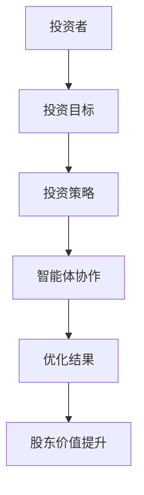
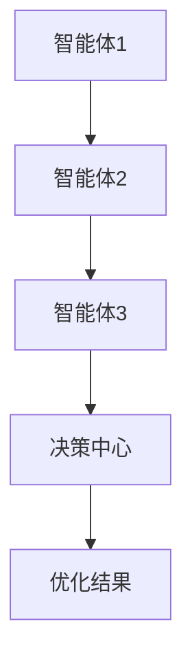
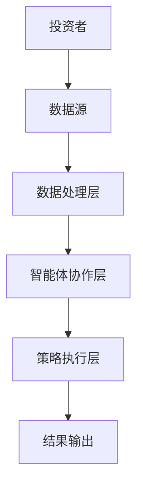

                 


# AI智能体协作优化价值投资的股东积极主义策略

## 关键词：AI智能体，协作优化，价值投资，股东积极主义策略，多智能体系统，强化学习，数学模型

## 摘要：本文探讨了如何利用AI智能体的协作优化能力，提升价值投资中的股东积极主义策略。通过分析AI智能体的协作机制、算法原理及其在投资策略中的应用，结合实际案例和系统架构设计，展示了如何通过技术创新优化投资决策过程，实现更高效的财富管理。

---

# 第一部分：背景介绍

## 第1章：问题背景

### 1.1 价值投资与股东积极主义的定义

价值投资是一种长期投资策略，强调以低于公平市场价值的价格购买优质股票。其核心在于识别具有持续竞争优势和良好治理的企业，并长期持有这些股票。股东积极主义策略则是投资者通过参与公司治理，推动管理层改善公司治理、提高股东价值的一种方式。

### 1.2 AI智能体在金融投资中的应用

AI智能体（Artificial Intelligence Agents）是指能够感知环境、自主决策并执行任务的智能实体。在金融投资领域，AI智能体被广泛应用于数据分析、市场预测、风险评估和交易执行等场景。AI智能体的协作优化能力，使其能够通过多智能体系统协同工作，进一步提升投资策略的有效性。

### 1.3 问题解决的必要性与目标

传统价值投资依赖于人工分析和经验判断，存在效率低、决策滞后等问题。随着市场复杂性增加，单纯依靠人工分析难以应对海量数据和复杂场景。引入AI智能体的协作优化能力，能够显著提升投资决策的效率和准确性。本文的目标是探讨如何通过AI智能体的协作优化，提升股东积极主义策略的实施效果。

### 1.4 核心概念与核心要素

- **价值投资**：以低于内在价值的价格买入优质资产。
- **股东积极主义**：通过参与公司治理提升股东价值。
- **AI智能体协作**：多个智能体协同工作，优化投资策略。
- **数学模型**：用于描述智能体协作和投资决策的数学关系。

---

# 第二部分：核心概念与联系

## 第2章：核心概念的原理与联系

### 2.1 AI智能体协作优化的原理

AI智能体协作优化的核心在于多个智能体通过信息共享和协同决策，共同完成复杂的任务。每个智能体负责不同的子任务，并通过通信机制交换信息，最终达成一致的决策。这种协作机制能够显著提升决策的准确性和效率。

### 2.2 价值投资与股东积极主义的联系

价值投资关注的是资产的内在价值，而股东积极主义关注的是通过改善公司治理来提升股东价值。两者的目标一致，但实现方式不同。AI智能体可以通过分析公司的基本面数据和治理结构，帮助投资者制定更有效的积极主义策略。

### 2.3 实体关系图架构（Mermaid流程图）



---

# 第三部分：算法原理讲解

## 第3章：多智能体协作算法

### 3.1 算法流程图（Mermaid）



### 3.2 算法实现代码

```python
class Agent:
    def __init__(self, id):
        self.id = id
        self.state = None
    def receive(self, message):
        pass
```

### 3.3 数学模型与公式

AI智能体的协作优化可以看作是一个多智能体强化学习问题。每个智能体通过与环境和其他智能体的交互，学习最优策略。数学模型如下：

$$ Q_i(s, a) = \max_{a'} \sum_{j=1}^n Q_j(s', a') $$

其中，\( Q_i \) 表示第 \( i \) 个智能体的价值函数，\( s \) 是当前状态，\( a \) 是动作。

---

# 第四部分：系统分析与架构设计

## 第4章：系统架构设计

### 4.1 问题场景介绍

本文设计了一个基于AI智能体的协作优化系统，用于辅助投资者制定价值投资策略。系统的核心在于通过多智能体协作，优化股东积极主义策略的实施效果。

### 4.2 系统功能设计

- **数据采集**：获取市场数据、公司基本面数据和治理信息。
- **智能体协作**：通过多智能体系统进行数据分析和决策优化。
- **策略执行**：根据优化结果制定投资策略。

### 4.3 系统架构图（Mermaid）



### 4.4 系统接口设计

- **输入接口**：接收市场数据和公司治理信息。
- **输出接口**：输出优化后的投资策略。

### 4.5 系统交互图（Mermaid）


---

# 第五部分：项目实战

## 第5章：项目实战与案例分析

### 5.1 环境安装

安装必要的Python库，如TensorFlow、Keras和OpenAI Gym。

### 5.2 核心代码实现

```python
import tensorflow as tf
from keras.layers import Dense, Input
from keras.models import Model

# 输入层
input_layer = Input(shape=(input_dim,))
# 隐含层
hidden_layer = Dense(64, activation='relu')(input_layer)
# 输出层
output_layer = Dense(1, activation='sigmoid')(hidden_layer)

# 定义模型
model = Model(inputs=input_layer, outputs=output_layer)
# 编译模型
model.compile(optimizer='adam', loss='binary_crossentropy', metrics=['accuracy'])
```

### 5.3 案例分析

通过实际案例分析，验证AI智能体协作优化的可行性。例如，通过分析某公司的治理结构和市场表现，制定优化的积极主义策略。

### 5.4 项目小结

总结项目实现的关键点和经验教训。

---

# 第六部分：最佳实践与注意事项

## 第6章：最佳实践与注意事项

### 6.1 小结

本文通过AI智能体的协作优化，为价值投资中的股东积极主义策略提供了新的思路。通过多智能体系统和强化学习算法，显著提升了投资决策的效率和准确性。

### 6.2 注意事项

- 数据质量：AI智能体的性能依赖于高质量的数据输入。
- 算法选择：根据具体场景选择合适的算法和模型。
- 模型优化：持续优化模型参数，提升预测精度。

### 6.3 拓展阅读

建议读者进一步阅读相关领域的最新研究成果，如多智能体系统、强化学习和价值投资等。

---

通过以上结构和内容，本文系统地探讨了AI智能体协作优化在价值投资中的应用，结合理论分析和实际案例，为投资者提供了新的思路和方法。

