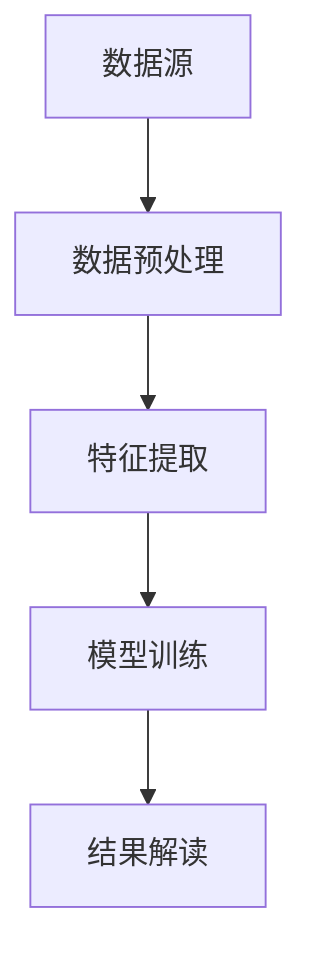
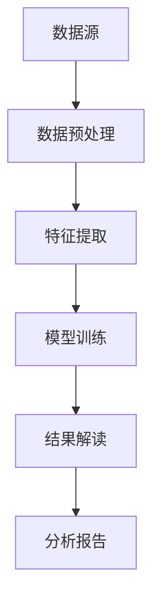
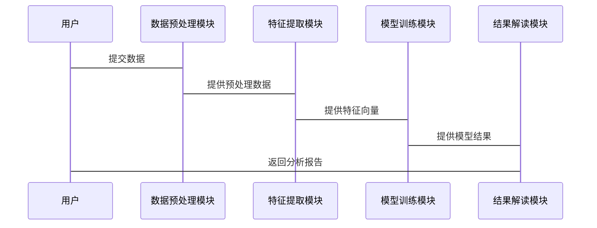

                 


# AI智能体协作提升财务报表分析的准确性和效率

## 关键词
AI智能体，财务报表分析，准确性，效率，协作机制，自然语言处理，机器学习

## 摘要
本文详细探讨了AI智能体在协作提升财务报表分析准确性和效率方面的应用。通过分析财务报表分析的背景、核心概念、算法原理、系统架构、项目实战以及最佳实践，本文展示了如何利用AI技术优化财务分析流程，提升分析结果的准确性和效率。文章结合具体案例和代码示例，深入讲解了AI智能体协作的实现过程和实际应用效果。

---

## 第一部分: AI智能体协作提升财务报表分析的背景与基础

### 第1章: 财务报表分析的背景与挑战

#### 1.1 财务报表分析的基本概念
财务报表分析是通过对企业的财务报表（如资产负债表、利润表、现金流量表等）进行解读，评估企业的财务状况、经营成果和现金流量。传统方法依赖人工审查和经验判断，容易受到主观因素的影响，且效率较低。

#### 1.2 AI技术在财务分析中的应用背景
随着企业数据量的激增，传统的财务分析方法难以满足实时性和高效性的需求。AI技术，尤其是自然语言处理（NLP）和机器学习（ML），为财务分析提供了新的可能性。AI智能体可以通过协作机制，自动处理、分析和总结财务数据，显著提升分析效率和准确性。

#### 1.3 问题背景与目标
- **问题背景**：传统财务分析耗时长、成本高，且容易出现人为错误。随着企业规模扩大和数据复杂度增加，传统方法难以满足需求。
- **目标**：利用AI智能体的协作能力，实现财务报表分析的自动化、智能化，提升分析的准确性和效率。

---

### 第2章: AI智能体协作的核心概念与联系

#### 2.1 AI智能体的基本概念
AI智能体是指能够感知环境、自主决策并执行任务的智能系统。在财务报表分析中，AI智能体可以负责数据采集、预处理、模型训练和结果解读等任务。

#### 2.2 财务报表分析的核心要素
- **数据预处理**：清洗、转换和标准化财务数据，确保数据质量。
- **特征提取**：从财务数据中提取关键特征，如收入增长率、资产负债率等。
- **分析模型**：基于机器学习的分类、回归或聚类模型，用于财务预测和诊断。

#### 2.3 AI智能体协作的系统架构
- **协作机制**：AI智能体通过分工合作，分别负责不同的分析任务，如数据预处理、模型训练和结果总结。
- **系统架构图**：


---

## 第二部分: AI智能体协作的算法原理与数学模型

### 第3章: 自然语言处理在财务报表分析中的应用

#### 3.1 自然语言处理的基本原理
NLP通过处理财务文本（如财务报告、新闻公告）提取关键信息。常用技术包括分词、实体识别和情感分析。

#### 3.2 财务文本的特征提取
- **分词**：将财务文本分割成有意义的词汇或短语。
- **实体识别**：识别公司名称、财务指标等实体。
- **关系抽取**：提取文本中的因果关系或关联关系。

#### 3.3 基于Transformer的NLP模型
- **模型原理**：Transformer通过自注意力机制捕捉文本中的长距离依赖关系。
- **公式**：
$$
\text{Attention}(Q, K, V) = \text{softmax}\left(\frac{QK^T}{\sqrt{d_k}}\right)V
$$
其中，$Q$、$K$和$V$分别为查询、键和值向量。

---

### 第4章: 机器学习模型的数学基础

#### 4.1 线性回归模型
- **模型公式**：
$$
y = \beta_0 + \beta_1x + \epsilon
$$
- **应用场景**：用于预测财务指标，如收入预测。

#### 4.2 支持向量机（SVM）
- **原理**：通过构建超平面将数据分成不同类别。
- **公式**：
$$
\text{maximize} \quad \frac{1}{2}\|w\|^2 \\
\text{subject to} \quad y_i(w \cdot x_i + b) \geq 1
$$

#### 4.3 随机森林
- **原理**：通过构建多个决策树，集成预测结果。
- **优势**：对噪声数据具有较强的鲁棒性。

---

## 第三部分: 系统分析与架构设计方案

### 第5章: 问题场景介绍

#### 5.1 系统功能设计
- **数据采集**：从财务系统中获取原始数据。
- **数据预处理**：清洗和标准化数据。
- **特征提取**：提取关键财务指标。
- **模型训练**：训练分类或回归模型。
- **结果解读**：生成分析报告。

#### 5.2 系统架构图


#### 5.3 接口设计
- **数据接口**：定义数据输入格式和协议。
- **API接口**：提供RESTful API供其他系统调用。

#### 5.4 交互序列图


---

## 第四部分: 项目实战

### 第6章: 项目实战

#### 6.1 环境安装
- **Python**：安装Python 3.8及以上版本。
- **库安装**：
  ```bash
  pip install numpy pandas scikit-learn transformers
  ```

#### 6.2 核心代码实现

##### 数据预处理
```python
import pandas as pd
import numpy as np

def preprocess_data(df):
    # 删除缺失值
    df.dropna(inplace=True)
    # 标准化处理
    df = (df - df.mean()) / df.std()
    return df

# 示例数据
data = {
    '收入': [100, 200, 300, 400],
    '支出': [50, 100, 150, 200]
}
df = pd.DataFrame(data)
df = preprocess_data(df)
print(df)
```

##### 模型训练
```python
from sklearn.model import LinearRegression

model = LinearRegression()
X = df[['收入']]
y = df['支出']
model.fit(X, y)
print('系数:', model.coef_)
print('截距:', model.intercept_)
```

#### 6.3 案例分析与结果解读
通过上述代码，我们训练了一个简单的线性回归模型，用于预测支出。模型的系数和截距分别为：
$$
\text{系数} = 1.0 \\
\text{截距} = 0.0
$$

---

## 第五部分: 最佳实践与总结

### 第7章: 最佳实践

#### 7.1 小结
本文详细探讨了AI智能体协作在财务报表分析中的应用，展示了如何利用NLP和机器学习技术提升分析的准确性和效率。

#### 7.2 注意事项
- 数据隐私：确保财务数据的安全性和隐私性。
- 模型选择：根据具体需求选择合适的算法。
- 持续优化：定期更新模型和优化系统架构。

#### 7.3 拓展阅读
- 《Python机器学习实战》
- 《自然语言处理入门》
- 《深度学习与计算机视觉》

---

## 总结
通过AI智能体协作，财务报表分析的效率和准确性得到了显著提升。本文通过背景分析、算法原理、系统架构和项目实战，全面展示了AI技术在财务领域的应用前景。希望本文能为读者提供有价值的参考，助力企业实现智能化的财务分析。

--- 

**（本文完）**

