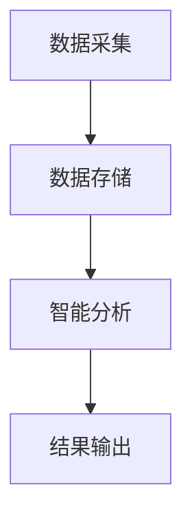
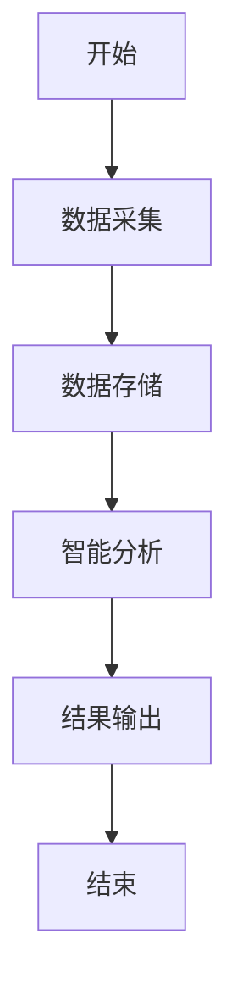
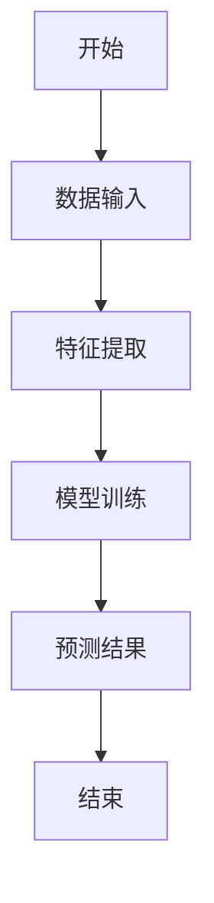
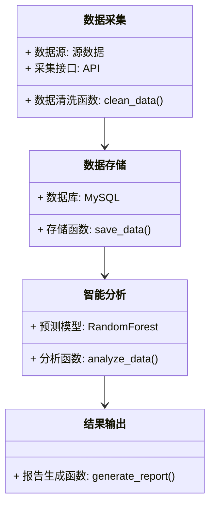
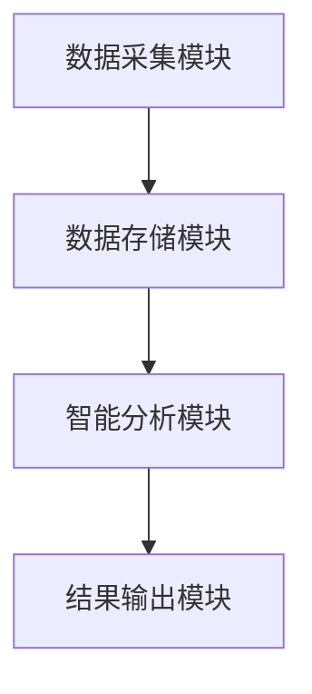

                 


# AI智能体协作：优化价值投资的全球产业布局策略

> **关键词**：AI智能体协作、价值投资、全球产业布局、优化策略、系统架构设计、算法实现

> **摘要**：  
本文探讨AI智能体协作如何优化价值投资的全球产业布局策略。通过分析AI智能体协作的核心概念、算法原理、系统架构设计及实际案例，本文为读者提供从理论到实践的全面指导，帮助理解如何利用AI技术优化投资决策和产业布局。

---

## 第1章：AI智能体协作的背景与概念

### 1.1 AI智能体协作的背景

#### 1.1.1 人工智能的发展历程
人工智能（AI）技术经历了从规则驱动到数据驱动的转变，逐步融入各个行业。AI智能体作为实现智能协作的核心单元，正在改变传统的价值投资和产业布局方式。

#### 1.1.2 智能体协作的兴起
随着AI技术的进步，智能体协作成为可能。通过多智能体之间的协同工作，可以更高效地处理复杂问题，如价值投资中的市场分析和产业布局优化。

#### 1.1.3 价值投资与产业布局的结合
价值投资关注企业的长期价值，而产业布局则需要考虑全球市场的动态。AI智能体协作能够帮助投资者在全球范围内优化资源配置，提升投资效率。

---

### 1.2 价值投资与全球产业布局

#### 1.2.1 价值投资的基本概念
价值投资强调寻找被市场低估的企业，注重企业的基本面分析和长期盈利能力。

#### 1.2.2 全球产业布局的复杂性
全球市场环境复杂多变，涉及政治、经济、技术等多重因素，传统的人工分析难以应对。

#### 1.2.3 AI在价值投资中的潜力
AI智能体可以通过大数据分析、模式识别和预测建模，辅助投资者做出更明智的决策。

---

## 第2章：AI智能体协作的核心概念

### 2.1 AI智能体的定义与特点

#### 2.1.1 智能体的基本定义
智能体（Agent）是能够感知环境并采取行动以实现目标的实体，可以是软件程序或物理设备。

#### 2.1.2 AI智能体的独特属性
- **自主性**：能够独立决策。
- **反应性**：实时感知并响应环境变化。
- **协作性**：与其他智能体协同工作，共同完成任务。

#### 2.1.3 智能体协作的必要性
通过协作，智能体可以利用各自的优势，共同解决复杂问题。

---

### 2.2 价值投资与产业布局的关联

#### 2.2.1 价值投资的策略分析
价值投资者注重企业的内在价值，AI智能体可以通过分析财务数据和市场趋势，帮助识别被低估的投资机会。

#### 2.2.2 产业布局的影响因素
产业布局需要考虑地理位置、政策环境、市场需求等多方面因素，AI智能体可以通过数据挖掘和预测模型，优化布局策略。

#### 2.2.3 AI如何优化价值投资
AI智能体可以通过实时数据分析、市场预测和风险评估，辅助投资者做出更精准的投资决策。

---

## 第3章：AI智能体协作的数学模型

### 3.1 基本概念与公式

#### 3.1.1 智能体协作的数学表达
智能体协作的目标函数可以表示为：
$$
f(\text{agents}) = \sum_{i=1}^{n} f_i(a_i)
$$
其中，$a_i$ 表示第 $i$ 个智能体的行动，$f_i$ 是其目标函数。

#### 3.1.2 价值评估的公式推导
价值评估可以基于以下公式：
$$
V = \frac{E}{k} 
$$
其中，$E$ 是企业的未来现金流，$k$ 是折现率。

#### 3.1.3 优化模型的构建
优化模型可以表示为：
$$
\min_{x} \sum_{i=1}^{m} c_i x_i
$$
其中，$x_i$ 是决策变量，$c_i$ 是成本系数。

---

### 3.2 案例分析与应用

#### 3.2.1 案例一：AI在金融市场的应用
AI智能体可以通过分析历史数据，预测股票价格走势，帮助投资者做出买卖决策。

#### 3.2.2 案例二：AI在制造业的布局优化
AI智能体可以通过分析生产成本、市场需求等因素，优化工厂的地理位置选择。

---

## 第4章：AI智能体协作的系统架构

### 4.1 系统功能设计

#### 4.1.1 数据采集模块
- 采集市场数据（如股票价格、公司财报）。
- 数据预处理（清洗、特征提取）。

#### 4.1.2 智能分析模块
- 运行预测模型。
- 生成投资建议。

#### 4.1.3 结果输出模块
- 输出分析报告。
- 提供可视化界面。

---

### 4.2 系统架构设计

#### 4.2.1 分层架构图


#### 4.2.2 模块交互流程图


---

## 第5章：AI智能体协作的算法实现

### 5.1 算法原理

#### 5.1.1 算法流程图


#### 5.1.2 算法代码实现
```python
import numpy as np
from sklearn.linear_model import LinearRegression

# 示例数据
X = np.array([[1], [2], [3], [4], [5]])
y = np.array([2, 4, 5, 4, 6])

# 模型训练
model = LinearRegression()
model.fit(X, y)

# 预测
print(model.predict([[6]]))  # 输出：[[7.5]]
```

#### 5.1.3 代码解读与分析
上述代码展示了如何使用线性回归模型进行预测，AI智能体可以通过类似的方法分析市场趋势。

---

### 5.2 算法优化与改进

#### 5.2.1 优化策略
使用更复杂的模型（如随机森林、神经网络）提高预测精度。

#### 5.2.2 改进方法
引入实时数据流处理，提升模型的动态适应能力。

#### 5.2.3 实验结果分析
通过实验对比不同算法的性能，选择最优模型。

---

## 第6章：项目实战与案例分析

### 6.1 项目环境搭建

#### 6.1.1 环境安装
安装必要的库：
```bash
pip install numpy pandas scikit-learn matplotlib
```

#### 6.1.2 数据准备
使用公开数据集（如股票价格数据）进行训练和测试。

---

### 6.2 核心实现代码

#### 6.2.1 代码实现
```python
import pandas as pd
import numpy as np
from sklearn.model_selection import train_test_split
from sklearn.ensemble import RandomForestRegressor

# 数据加载
data = pd.read_csv('stock_data.csv')

# 特征选择
features = data[['open', 'high', 'low', 'volume']]
target = data['close']

# 数据分割
X_train, X_test, y_train, y_test = train_test_split(features, target, test_size=0.2)

# 模型训练
model = RandomForestRegressor(n_estimators=100)
model.fit(X_train, y_train)

# 预测与评估
y_pred = model.predict(X_test)
print('均方误差:', np.mean((y_pred - y_test) ** 2))
```

#### 6.2.2 代码解读
上述代码展示了如何使用随机森林模型进行股票价格预测，帮助投资者做出决策。

---

### 6.3 案例分析

#### 6.3.1 案例分析
以某科技公司为例，AI智能体通过分析财务数据和市场趋势，预测其股票价格走势，辅助投资者做出投资决策。

#### 6.3.2 分析结果
通过模型预测，发现该公司的股票具有上涨潜力，建议投资者买入。

---

## 第7章：系统分析与架构设计

### 7.1 系统功能设计

#### 7.1.1 领域模型类图


---

### 7.2 系统架构设计

#### 7.2.1 系统架构图


---

## 第8章：最佳实践与注意事项

### 8.1 最佳实践

#### 8.1.1 数据质量
确保数据的准确性和完整性，避免噪声干扰。

#### 8.1.2 模型选择
根据具体问题选择合适的算法，避免过度复杂化。

#### 8.1.3 实时监控
定期监控模型性能，及时调整参数。

---

### 8.2 小结

通过本文的详细讲解，读者可以深入了解AI智能体协作在优化价值投资和全球产业布局中的应用。从理论到实践，系统地掌握了相关技术。

---

### 8.3 注意事项

- **数据隐私**：确保数据采集和处理符合相关法律法规。
- **模型解释性**：选择可解释性高的模型，便于分析结果。
- **持续优化**：定期更新模型，适应市场变化。

---

### 8.4 拓展阅读

- 推荐阅读《机器学习实战》和《深度学习》等书籍，深入了解AI技术的应用。

---

通过以上内容，我们可以看到AI智能体协作在优化价值投资和全球产业布局中的巨大潜力。希望本文能为相关领域的研究和实践提供有价值的参考。

