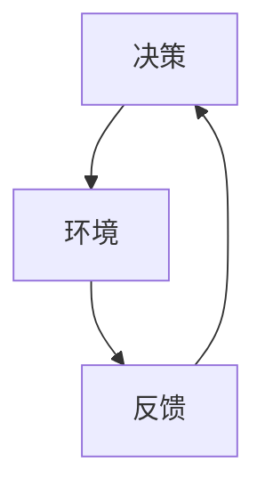
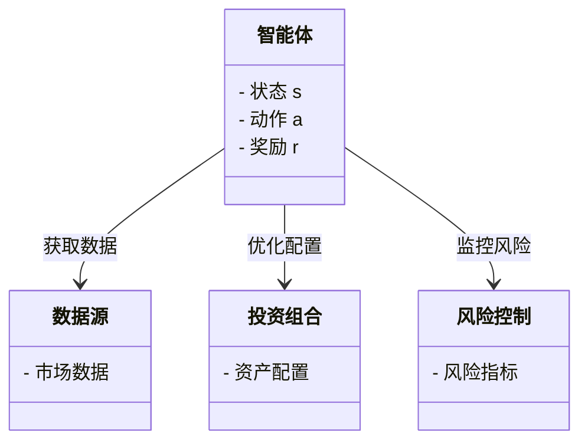

                 


# AI智能体协作：优化价值投资的全球资产配置策略

> 关键词：AI智能体协作，价值投资，全球资产配置，优化策略，投资决策，资产分配，风险管理

> 摘要：本文探讨了AI智能体协作在优化价值投资全球资产配置中的应用。通过分析多智能体协作的基本原理，结合实际案例，详细阐述了如何利用AI技术实现资产配置的智能化和高效化。文章从背景介绍、核心概念、算法实现、系统架构到项目实战，层层深入，为读者提供了一套完整的解决方案。

---

## 第一部分：AI智能体协作与价值投资的背景

### 第1章：AI智能体协作与价值投资的背景

#### 1.1 问题背景
- **智能体协作的定义**：智能体是具有感知环境和自主决策能力的实体，协作智能体是指多个智能体通过信息共享和协同决策完成共同目标的过程。
- **价值投资的核心理念**：价值投资强调以低于内在价值的价格买入优质资产，长期持有，获得超额收益。
- **全球资产配置的挑战**：全球经济波动、市场风险、政策变化等因素使得全球资产配置面临复杂多变的环境。

#### 1.2 问题描述
- **传统资产配置的局限性**：依赖人工判断，主观性强，难以应对复杂多变的市场环境。
- **AI技术的优势**：通过数据分析、模式识别和智能决策，AI能够帮助投资者更准确地捕捉市场机会，降低投资风险。
- **智能体协作的应用场景**：在价值投资中，智能体协作可以用于多资产类别配置、风险控制、市场趋势预测等方面。

#### 1.3 问题解决
- **智能体协作如何优化资产配置**：
  - 通过多智能体协同决策，实现资产配置的动态优化。
  - 利用AI技术分析海量数据，发现潜在投资机会。
  - 基于实时市场反馈调整投资策略。

#### 1.4 边界与外延
- **边界**：智能体协作仅用于辅助投资决策，不替代人工判断。
- **外延**：智能体协作技术可扩展至其他领域，如供应链优化、资源分配等。

#### 1.5 核心要素
- **智能体**：具有感知和决策能力的个体或系统。
- **协作机制**：智能体之间通过信息共享和协同决策完成任务。
- **目标函数**：最大化投资收益，最小化投资风险。

---

## 第二部分：AI智能体协作的核心概念与联系

### 第2章：AI智能体协作的核心原理

#### 2.1 核心概念分析
- **智能体协作的核心原理**：
  - **感知环境**：通过数据采集和分析，智能体能够感知市场环境和投资机会。
  - **决策制定**：基于感知到的信息，智能体制定投资策略。
  - **协同优化**：通过智能体之间的协作，优化整体投资组合。

#### 2.2 核心概念对比
| 概念 | 定义 | 优势 | 局限性 |
|------|------|------|--------|
| 单智能体 | 单个智能体独立决策 | 简单易实现 | 难以应对复杂环境 |
| 多智能体协作 | 多个智能体协同决策 | 提高决策效率和准确性 | 实现复杂，需要高效通信机制 |

#### 2.3 ER实体关系图
```mermaid
erd
  投资者 -> 智能体: 委托投资
  智能体 -> 数据源: 获取市场数据
  智能体 -> 投资组合: 优化配置
  智能体 -> 风险控制: 实时监控
```

---

## 第三部分：AI智能体协作的算法原理

### 第3章：算法实现的详细推导

#### 3.1 强化学习模型


#### 3.2 数学模型
- **价值函数**：
  $$ V(s) = \max_a Q(s,a) $$
- **策略函数**：
  $$ \pi(a|s) = \arg\max_a Q(s,a) $$

#### 3.3 算法实现代码
```python
def collaborative_algorithm():
    # 初始化智能体
    agents = initialize_agents()
    # 定义协作目标
    target = define_target()
    # 选择算法模型
    model = select_model(agents, target)
    # 训练模型
    model.train(agents, target)
    # 验证结果
    results = model.test(agents, target)
    return results
```

---

## 第四部分：系统分析与架构设计

### 第4章：系统架构设计方案

#### 4.1 系统功能设计
- **数据采集**：获取市场数据、公司财务数据等。
- **智能体协作**：多个智能体协同决策，优化投资组合。
- **风险控制**：实时监控投资组合的风险，调整配置。

#### 4.2 领域模型类图


#### 4.3 系统架构图


---

## 第五部分：项目实战与案例分析

### 第5章：项目实战

#### 5.1 环境安装
```bash
pip install numpy pandas scikit-learn
```

#### 5.2 核心代码实现
```python
class InvestmentAgent:
    def __init__(self, data_source):
        self.data_source = data_source
        self.target = None
        self.model = None

    def set_target(self, target):
        self.target = target

    def train(self):
        # 训练模型
        pass

    def test(self):
        # 测试模型
        pass
```

#### 5.3 案例分析
- **案例背景**：假设一个投资者希望在美股和港股之间进行资产配置。
- **智能体协作**：两个智能体分别负责美股和港股的数据分析和投资决策。
- **结果分析**：通过协作，智能体能够发现两个市场的相关性，优化投资组合，降低整体风险。

---

## 第六部分：总结与展望

### 第6章：总结与展望

#### 6.1 最佳实践
- **数据质量**：确保数据的准确性和及时性。
- **模型选择**：根据具体场景选择合适的算法模型。
- **风险管理**：建立有效的风险控制机制。

#### 6.2 小结
本文详细探讨了AI智能体协作在优化价值投资全球资产配置中的应用，通过理论分析和实际案例，展示了AI技术在金融领域的巨大潜力。

#### 6.3 注意事项
- **模型过拟合**：避免模型在训练数据上表现优异，但在测试数据上效果不佳。
- **数据隐私**：确保数据的安全性和隐私性。

#### 6.4 拓展阅读
- 推荐阅读《机器学习实战》和《算法导论》，深入理解AI算法的实现原理。

---

通过以上步骤，我们可以看到，AI智能体协作在优化价值投资的全球资产配置中具有重要的应用价值。通过多智能体的协作，投资者可以更高效地捕捉市场机会，降低投资风险，实现资产的最优配置。

