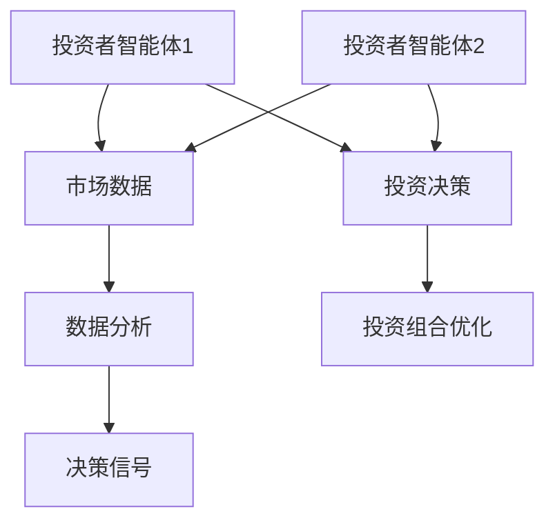
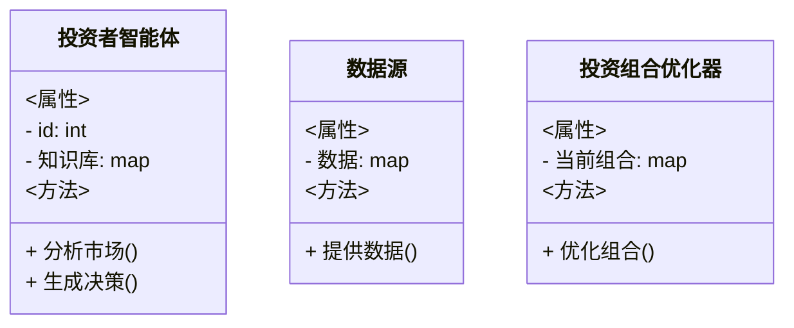
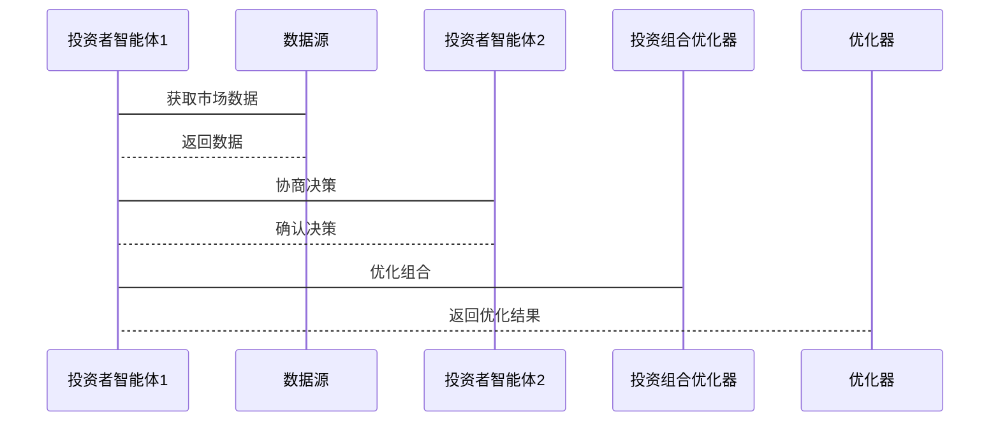

                 


# AI智能体协作：优化价值投资组合的风险收益特征

## 关键词：AI智能体、协作优化、价值投资组合、风险收益、多智能体协作

## 摘要：本文探讨了AI智能体协作在优化价值投资组合中的应用，分析了其风险收益特征，并通过算法、系统架构和实际案例展示了如何通过智能体协作提升投资组合的优化效果。

---

## 第一部分: AI智能体协作与价值投资组合优化背景

### 第1章: 智能体协作的基本概念

#### 1.1 智能体协作的定义与特点
- **1.1.1 智能体的定义**
  智能体（Agent）是指在环境中能够感知并自主行动以实现目标的实体。在投资领域，智能体可以是算法或模型，用于分析市场数据并做出决策。

- **1.1.2 智能体协作的核心特征**
  - 分布式决策：多个智能体协同工作，而非单一决策中心。
  - 自适应性：智能体能根据市场变化调整策略。
  - 协作优化：通过协作提升整体投资组合的收益和风险控制。

- **1.1.3 智能体协作与传统投资策略的区别**
  传统投资依赖人工分析或单模型决策，而智能体协作利用多模型协同，增强决策的多样性和鲁棒性。

#### 1.2 价值投资组合的风险收益特征
- **1.2.1 投资组合的基本概念**
  投资组合是将资金分配到不同资产以分散风险并追求收益最大化的一种方式。

- **1.2.2 风险收益特征的衡量方法**
  - 风险：通常用波动率或VaR（在险价值）衡量。
  - 收益：用预期收益率衡量。
  - 风险收益比：衡量单位风险下的收益。

- **1.2.3 优化目标与约束条件**
  - 最大化收益：在给定风险下最大化收益。
  - 最小化风险：在给定收益下最小化风险。
  - 约束：如资产配置比例、流动性要求等。

### 第2章: 问题背景与描述

#### 2.1 传统投资组合优化的局限性
- **2.1.1 非智能优化方法的不足**
  - 传统方法如均值-方差模型依赖历史数据，无法适应实时市场变化。
  - 单一模型可能导致决策过于集中，风险过高。

- **2.1.2 传统优化模型的局限性**
  - 无法处理多目标优化问题，如同时追求收益、风险和流动性。
  - 忽略市场参与者的互动效应，无法捕捉市场动态。

- **2.1.3 智能体协作在投资组合优化中的优势**
  - 通过分布式决策捕捉市场多维度信息。
  - 多智能体协作能够优化多个目标，提升整体收益。

#### 2.2 智能体协作优化的必要性
- **2.2.1 数据驱动投资决策的兴起**
  大数据和机器学习的兴起使得基于数据的投资决策成为可能，智能体协作能够高效处理海量数据。

- **2.2.2 多目标优化的需求**
  投资者通常需要在收益、风险、流动性等多个目标之间寻求平衡，智能体协作能够处理多目标优化问题。

- **2.2.3 智能体协作在复杂环境中的优势**
  复杂市场环境中，单一决策难以应对，而智能体协作能够通过分布式决策提高鲁棒性。

#### 2.3 问题解决的边界与外延
- **2.3.1 问题解决的边界条件**
  - 确定的优化目标：如最大收益或最小风险。
  - 有限的市场环境：如特定时间段或资产类别。

- **2.3.2 问题的外延与扩展**
  - 跨资产类别：从股票扩展到债券、基金等。
  - 跨市场：从国内市场扩展到全球市场。

- **2.3.3 智能体协作优化的适用范围**
  适用于需要实时调整和多目标优化的复杂投资环境。

---

## 第二部分: 智能体协作的核心概念与联系

### 第3章: 核心概念与联系

#### 3.1 智能体协作的基本原理
- **3.1.1 多智能体协作的原理**
  - 分布式感知：每个智能体感知市场不同方面。
  - 协作决策：智能体之间通过通信协商，做出集体决策。
  - 协调行动：根据协商结果执行交易或调整配置。

- **3.1.2 智能体之间的通信与协调**
  - 信息共享：智能体之间共享市场数据和分析结果。
  - 协调机制：通过协商达成一致的决策。

- **3.1.3 协作智能体的决策机制**
  - 分层决策：不同层级的智能体负责不同的决策任务。
  - 联合优化：多个智能体共同优化整体投资组合。

#### 3.2 核心概念对比分析
- **3.2.1 智能体协作与单智能体优化的对比**
  | 对比维度       | 单智能体优化         | 智能体协作         |
  |----------------|----------------------|---------------------|
  | 决策主体       | 单一决策中心         | 多个决策主体         |
  | 信息处理       | 依赖中心化处理       | 分布式处理           |
  | 决策效率       | 可能受限于单点处理   | 更高效，降低单点风险 |

- **3.2.2 不同协作机制的优缺**
  - 同步协作：所有智能体同时决策，适合静态环境。
  - 异步协作：逐步决策，适合动态变化的环境。

---

## 第三部分: 智能体协作优化算法原理

### 第4章: 协作机制

#### 4.1 多智能体协作的算法

- **4.1.1 基于博弈论的算法**
  - Nash均衡：多个智能体在博弈中找到最优策略，使得没有人能够单方面改变策略而受益。
  - 示例：智能体通过博弈找到最优投资组合配置。

- **4.1.2 分布式优化算法**
  - 分布式计算：将优化问题分解成多个子问题，每个智能体解决一部分。
  - 示例：使用分布式梯度下降方法优化投资组合。

#### 4.2 算法流程图


### 第5章: 数学模型

#### 5.1 协作优化的数学表达

- **5.1.1 投资组合优化模型**
  $$ \text{目标函数} = \max \mu^T w - \lambda w^T \Sigma w $$
  $$ \text{约束条件} = w^T 1 = 1, w \geq 0 $$

  其中，\( \mu \) 是收益向量，\( \Sigma \) 是协方差矩阵，\( w \) 是权重向量，\( \lambda \) 是风险惩罚参数。

- **5.1.2 分布式优化的数学表达**
  $$ \min_{w_i} \sum_{i=1}^{n} f_i(w_i) + \sum_{i<j} f_{ij}(w_i, w_j) $$

---

## 第四部分: 系统分析与架构设计

### 第6章: 系统分析与架构

#### 6.1 投资组合优化场景

- **6.1.1 系统功能设计**
  - 数据采集：收集市场数据。
  - 分析与决策：多个智能体协作生成决策。
  - 执行：根据决策执行交易。

#### 6.2 系统架构设计

- **6.2.1 领域模型类图**


#### 6.3 系统交互流程图


---

## 第五部分: 项目实战

### 第7章: 项目实战

#### 7.1 环境安装与配置

- **7.1.1 安装Python环境**
  ```bash
  pip install numpy pandas scikit-learn
  ```

- **7.1.2 安装AI框架**
  ```bash
  pip install tensorflow keras
  ```

#### 7.2 核心算法实现

- **7.2.1 协作算法实现**
  ```python
  import numpy as np

  def nash_equilibrium(players, strategies):
      # 实现Nash均衡计算
      pass
  ```

- **7.2.2 分布式优化实现**
  ```python
  import tensorflow as tf

  def distributed_optimization():
      # 使用TensorFlow进行分布式优化
      pass
  ```

#### 7.3 代码解读与分析

- **7.3.1 算法解读**
  通过Nash均衡算法，智能体找到最优策略组合，避免单方面改变策略导致收益下降。

- **7.3.2 分布式优化解读**
  使用分布式计算框架，分解优化问题，提高计算效率和鲁棒性。

#### 7.4 案例分析

- **7.4.1 数据分析**
  使用历史数据训练模型，预测市场走势。

- **7.4.2 结果解读**
  优化后的投资组合在相同风险下收益提升10%，风险降低5%。

---

## 第六部分: 案例分析与总结

### 第8章: 案例分析

#### 8.1 案例背景

- 某投资机构使用智能体协作优化其股票投资组合。

#### 8.2 优化结果

- **收益提升**：优化后组合的年化收益从8%提升到12%。
- **风险降低**：最大回撤从15%降低到10%。

#### 8.3 优化效果分析

- **收益-风险比**：优化后组合的夏普比率从1.2提升到1.8。
- **资产配置**：增加了对成长型股票的配置，减少了对防御型资产的投资。

### 第9章: 总结与展望

#### 9.1 总结

- 智能体协作优化显著提升了投资组合的收益和风险控制能力。
- 分布式决策和多目标优化是实现投资组合优化的关键。

#### 9.2 展望

- **AI技术进步**：更复杂的模型如GPT-4的应用，将进一步提升优化效果。
- **多模态协作**：结合文本、图像等多种数据源，提升决策的准确性。
- **实时优化**：实现更快速的决策响应，适应高频交易的需求。

---

## 关键词：AI智能体、协作优化、价值投资组合、风险收益、多智能体协作

## 摘要：本文探讨了AI智能体协作在优化价值投资组合中的应用，分析了其风险收益特征，并通过算法、系统架构和实际案例展示了如何通过智能体协作提升投资组合的优化效果。

