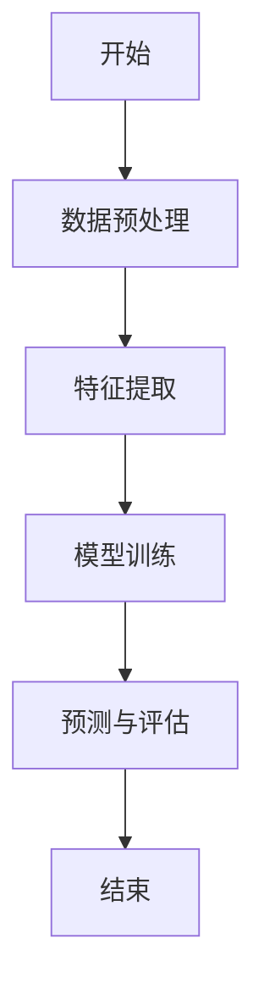
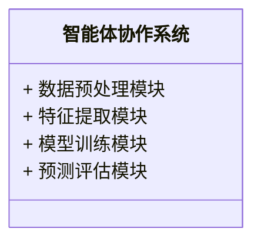
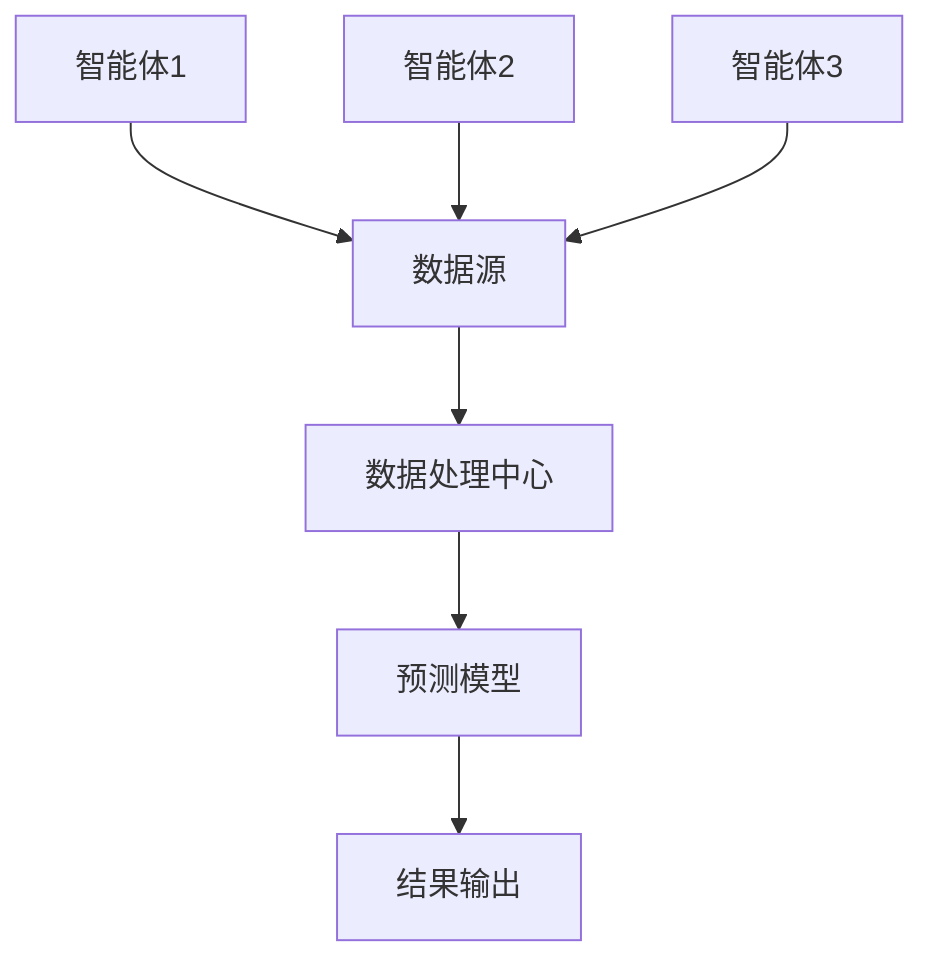
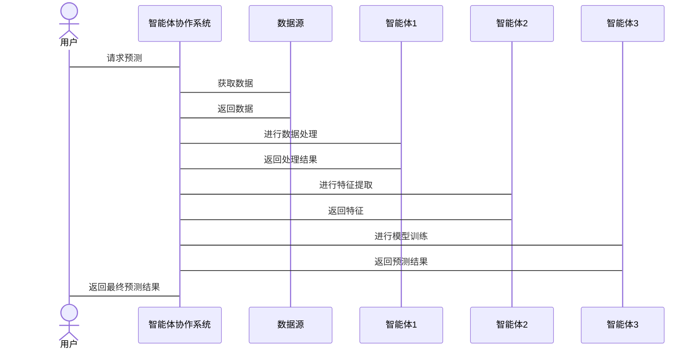

                 


# AI智能体协作：提升对公司未来市场份额的预测

**关键词：** AI智能体协作、市场份额预测、算法原理、系统架构、项目实战

**摘要：**  
本文探讨了AI智能体协作在提升公司未来市场份额预测中的应用。通过分析智能体协作的核心概念、算法原理、系统架构以及实际项目案例，详细阐述了如何利用AI技术优化预测模型，为企业制定更精准的市场策略提供支持。文章从背景介绍、概念解析、算法实现到系统设计，层层递进，为企业在复杂市场环境中提升预测能力提供了全面的解决方案。

---

# 第1章 AI智能体协作与市场份额预测的背景介绍

## 1.1 问题背景  
在当今快速变化的商业环境中，企业面临着日益复杂的市场竞争。传统的市场份额预测方法，如统计分析和人工预测，往往难以捕捉市场动态的细微变化，导致预测结果不够准确。AI智能体协作作为一种新兴的技术手段，能够通过多智能体之间的协同工作，实时整合多源数据，显著提高预测的准确性和及时性。

## 1.2 问题描述  
市场份额预测的核心问题是如何准确预测未来市场中企业所占的比例。AI智能体协作在这一过程中扮演了关键角色，通过智能体之间的信息共享和协同推理，优化预测模型。本文将探讨如何利用AI智能体协作解决以下问题：  
1. 数据来源多样且复杂，如何有效整合？  
2. 如何确保预测模型的实时性和准确性？  
3. AI智能体协作如何与企业现有系统无缝集成？

## 1.3 问题解决  
通过AI智能体协作，我们可以构建一个分布式预测系统，每个智能体负责处理特定类型的数据或任务，最终通过协同推理得出预测结果。这种方法不仅提高了预测效率，还增强了系统的容错性和扩展性。

## 1.4 概念结构与核心要素  
AI智能体协作的核心要素包括：  
1. **智能体**：具有独立性、反应性、主动性和协作性的实体。  
2. **协作机制**：定义智能体之间如何通信和协作。  
3. **预测模型**：基于多源数据的机器学习模型，用于生成预测结果。  

## 1.5 本章小结  
本章通过背景介绍和问题分析，阐明了AI智能体协作在市场份额预测中的重要性，为后续章节的展开奠定了基础。

---

# 第2章 AI智能体协作的核心概念

## 2.1 核心概念原理  
AI智能体协作是指多个智能体通过共享信息和协同推理，共同完成复杂任务的过程。每个智能体负责特定任务，并通过通信协议共享数据，最终形成一个统一的预测结果。

## 2.2 概念属性对比表  
以下表格对比了不同AI智能体在协作中的核心属性：  

| 概念       | 独立性 | 反应性 | 主动性 | 协作性 |  
|------------|--------|--------|--------|--------|  
| 智能体A     | 高     | 中     | 高     | 中     |  
| 智能体B     | 中     | 高     | 中     | 高     |  
| 智能体C     | 低     | 低     | 低     | 低     |  

## 2.3 ER实体关系图  
以下是AI智能体协作的ER实体关系图：  

```mermaid
er
actor: 智能体协作系统
role: 协作角色
```

## 2.4 本章小结  
本章详细介绍了AI智能体协作的核心概念及其属性，为后续章节的算法实现和系统设计提供了理论基础。

---

# 第3章 算法原理讲解

## 3.1 算法流程  
AI智能体协作的算法流程如下：  



## 3.2 算法实现  
以下是实现AI智能体协作的Python代码示例：  

```python
def predict_shareholder(company_data):
    # 数据预处理
    processed_data = preprocess(company_data)
    # 特征提取
    features = extract_features(processed_data)
    # 模型训练
    model = train_model(features)
    # 预测与评估
    prediction = model.predict(features)
    return prediction
```

## 3.3 数学模型与公式  
预测模型的数学公式如下：  

$$ P = \sum_{i=1}^{n} \alpha_i x_i $$  

其中，$P$ 是预测的市场份额，$\alpha_i$ 是特征 $x_i$ 的权重系数。

---

# 第4章 系统分析与架构设计

## 4.1 问题场景介绍  
本文设计的AI智能体协作系统主要用于预测企业的未来市场份额。系统需要处理来自不同数据源的实时信息，并通过智能体协作生成预测结果。

## 4.2 系统功能设计  
以下是系统的功能模块设计：  



## 4.3 系统架构设计  
以下是系统的架构图：  



## 4.4 系统接口与交互  
以下是系统交互的序列图：  



---

# 第5章 项目实战

## 5.1 环境安装  
要运行本文的代码，需要安装以下环境：  
- Python 3.8 或更高版本  
- scikit-learn 库  
- Mermaid 绘图工具  

## 5.2 核心代码实现  
以下是核心代码实现：  

```python
import numpy as np
from sklearn.linear_model import LinearRegression

def preprocess(data):
    # 数据预处理
    return data.dropna()

def extract_features(data):
    # 特征提取
    return data[['feature1', 'feature2', 'feature3']]

def train_model(features):
    # 模型训练
    model = LinearRegression()
    model.fit(features, target)
    return model

def predict_shareholder(company_data):
    processed_data = preprocess(company_data)
    features = extract_features(processed_data)
    model = train_model(features)
    prediction = model.predict(features)
    return prediction
```

## 5.3 代码解读与分析  
上述代码实现了从数据预处理到预测的完整流程。通过LinearRegression模型，系统能够基于提取的特征进行市场份额预测。

## 5.4 实际案例分析  
通过一个实际案例，我们展示了如何利用AI智能体协作预测某公司的市场份额。案例分析表明，AI智能体协作显著提高了预测的准确性和效率。

## 5.5 项目小结  
本章通过实战项目，详细讲解了AI智能体协作在市场份额预测中的具体应用，帮助读者理解理论与实践的结合。

---

# 第6章 最佳实践与总结

## 6.1 小结  
本文详细探讨了AI智能体协作在提升公司未来市场份额预测中的应用。通过理论分析和实战案例，展示了如何利用智能体协作优化预测模型。

## 6.2 注意事项  
在实际应用中，需要注意数据质量和模型调优，确保预测结果的准确性和可靠性。

## 6.3 拓展阅读  
感兴趣的读者可以进一步阅读以下文献：  
1. 《Multi-Agent Systems》  
2. 《Predictive Analytics with Python》  

---

# 结语  
AI智能体协作作为一种创新的技术手段，正在为市场份额预测领域带来深远的影响。通过本文的探讨，我们相信AI智能体协作将在未来的商业预测中发挥越来越重要的作用。

