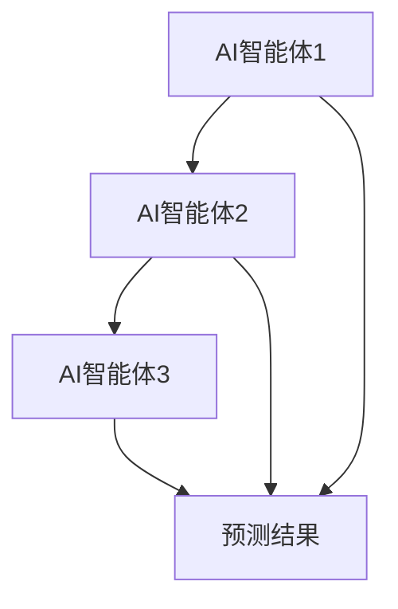
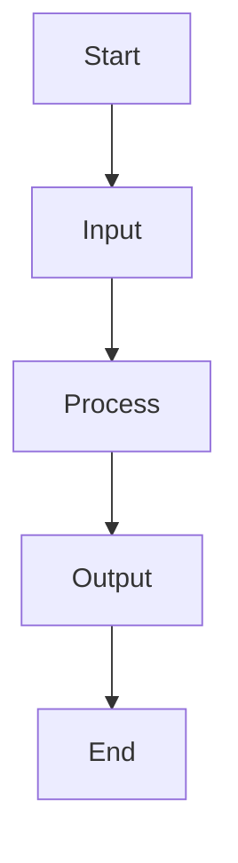
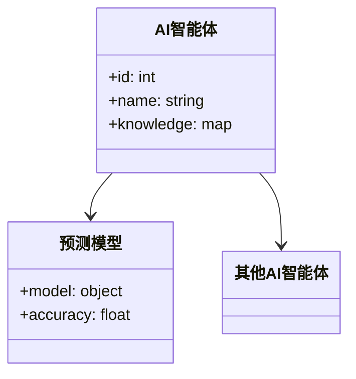
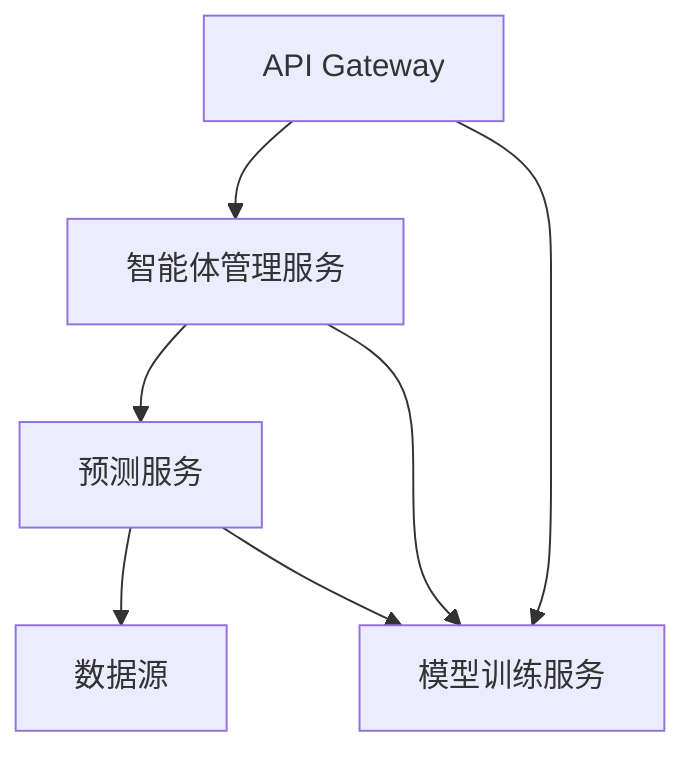
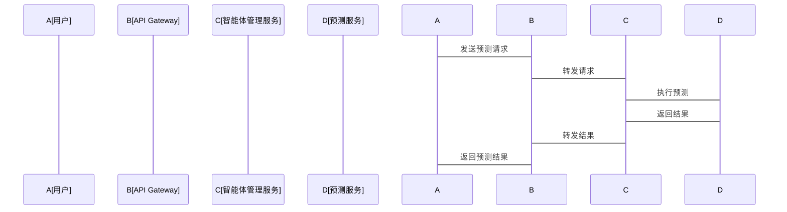

                 


# AI智能体协作：提升对公司未来竞争力的预测

## 关键词：AI智能体、协作预测、企业竞争力、系统架构、算法原理

## 摘要：本文深入探讨了AI智能体协作在提升企业未来竞争力中的作用，分析了协作预测的核心概念、算法原理和系统架构设计，结合实际案例展示了AI智能体协作的优势，并提供了最佳实践建议。

---

# 第一部分：AI智能体协作的背景与概念

## 第1章：AI智能体协作的背景与问题背景

### 1.1 问题背景

#### 1.1.1 传统企业协作的挑战
企业在传统协作中面临信息孤岛、数据分散、协作效率低下等问题，导致预测模型精度不足。

#### 1.1.2 AI智能体协作的提出
AI智能体协作通过分布式计算和强化学习，解决传统协作的局限性，提升预测能力。

#### 1.1.3 企业未来竞争力的预测需求
企业需要实时、准确的预测模型，AI智能体协作提供了高效解决方案。

### 1.2 问题描述

#### 1.2.1 企业协作中的信息孤岛问题
信息分散导致协作效率低下，影响预测结果。

#### 1.2.2 传统预测模型的局限性
传统模型难以处理复杂场景，预测精度有限。

#### 1.2.3 AI智能体协作的优势与潜力
通过协作优化预测过程，提升企业竞争力。

### 1.3 问题解决

#### 1.3.1 AI智能体协作的核心思想
通过多智能体协同工作，提升预测能力。

#### 1.3.2 通过协作提升预测精度的方法
利用分布式计算和联合学习，提高预测模型的准确性和鲁棒性。

#### 1.3.3 协作机制的设计与实现
设计合理的协作机制，确保智能体之间的高效协同。

---

## 第2章：AI智能体协作的核心概念

### 2.1 核心概念与定义

#### 2.1.1 AI智能体的定义
AI智能体是具备感知和决策能力的实体，能够独立执行任务。

#### 2.1.2 智能体协作的定义
多个AI智能体通过协作完成共同目标，提升整体性能。

#### 2.1.3 协作预测模型的定义
基于多智能体协作的预测模型，能够实时更新和优化。

### 2.2 核心概念的属性特征对比

#### 2.2.1 AI智能体与传统算法的对比
| 属性 | AI智能体 | 传统算法 |
|------|----------|----------|
| 学习能力 | 强 | 弱 |
| 协作性 | 高 | 低 |

#### 2.2.2 协作机制与非协作机制的对比
| 属性 | 协作机制 | 非协作机制 |
|------|----------|------------|
| 预测精度 | 高 | 低 |
| 并行计算能力 | 高 | 低 |

#### 2.2.3 协作预测模型与传统预测模型的对比
| 属性 | 协作预测模型 | 传统预测模型 |
|------|--------------|--------------|
| 数据利用率 | 高 | 低 |
| 预测速度 | 快 | 慢 |

### 2.3 实体关系图



---

## 第3章：AI智能体协作的算法原理

### 3.1 多智能体协作算法

#### 3.1.1 强化学习在协作中的应用
通过强化学习，智能体学会协作策略，提升预测能力。

#### 3.1.2 分布式计算与协作
利用分布式计算，智能体各自处理数据，协同提高预测速度。

#### 3.1.3 联合学习机制
智能体共享知识，共同优化预测模型。

### 3.2 算法流程图



### 3.3 数学模型与公式

#### 3.3.1 联合概率公式
$$ P(A \text{ and } B) = P(A) \times P(B|A) $$

#### 3.3.2 协作收益公式
$$ \text{收益} = \sum_{i=1}^{n} r_i $$

---

## 第4章：系统分析与架构设计

### 4.1 问题场景介绍

#### 4.1.1 企业协作中的数据孤岛问题
数据分散在不同部门，影响协作效率。

#### 4.1.2 预测模型的实时性要求
企业需要实时预测结果，传统模型难以满足。

### 4.2 系统功能设计

#### 4.2.1 领域模型类图



### 4.3 系统架构设计



### 4.4 系统接口设计

#### 4.4.1 API接口
- `/api/predict`：接收输入，返回预测结果。
- `/api/train`：训练模型，更新预测能力。

#### 4.4.2 接口协议
- 使用RESTful API，支持JSON格式数据传输。

### 4.5 系统交互流程



---

## 第5章：项目实战

### 5.1 环境安装

```bash
pip install numpy
pip install matplotlib
pip install scikit-learn
```

### 5.2 核心代码实现

#### 5.2.1 AI智能体类

```python
class AIEntity:
    def __init__(self, id, name):
        self.id = id
        self.name = name
        self.knowledge = {}

    def update_knowledge(self, data):
        self.knowledge.update(data)

    def predict(self, input):
        # 实现具体的预测逻辑
        pass
```

#### 5.2.2 协作预测模型

```python
class CollaborativeModel:
    def __init__(self, entities):
        self.entities = entities

    def aggregate_predictions(self, inputs):
        predictions = []
        for entity in self.entities:
            p = entity.predict(inputs)
            predictions.append(p)
        return sum(predictions) / len(predictions)
```

### 5.3 案例分析与解读

#### 5.3.1 案例场景
企业销售预测，利用AI智能体协作提升预测精度。

#### 5.3.2 实际应用
通过协作模型，企业成功提升预测准确率，优化库存管理。

### 5.4 项目小结

---

## 第6章：最佳实践、小结、注意事项、拓展阅读

### 6.1 最佳实践

#### 6.1.1 智能体数量的控制
适量的智能体数量，避免过多或过少。

#### 6.1.2 数据隐私保护
确保数据安全，遵守相关法律法规。

### 6.2 小结
AI智能体协作通过高效协作，显著提升企业竞争力。

### 6.3 注意事项

- 数据质量和多样性影响预测结果。
- 系统设计需考虑可扩展性和可维护性。
- 需要定期更新模型，适应变化。

### 6.4 拓展阅读

- 多智能体协作的经典论文。
- 强化学习在协作中的应用研究。

---

## 结语

通过本文的详细分析，读者可以深入理解AI智能体协作的核心概念、算法原理和系统设计，掌握其在提升企业竞争力中的应用方法。未来，随着技术进步，AI智能体协作将在更多领域发挥重要作用。

