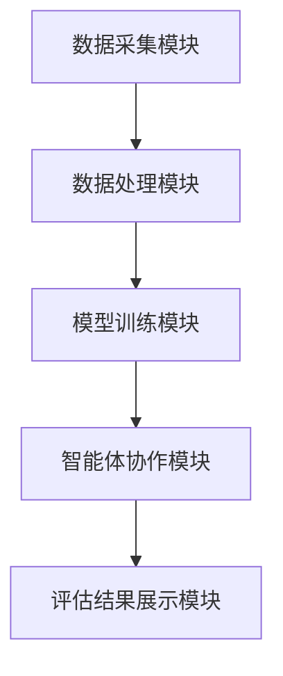
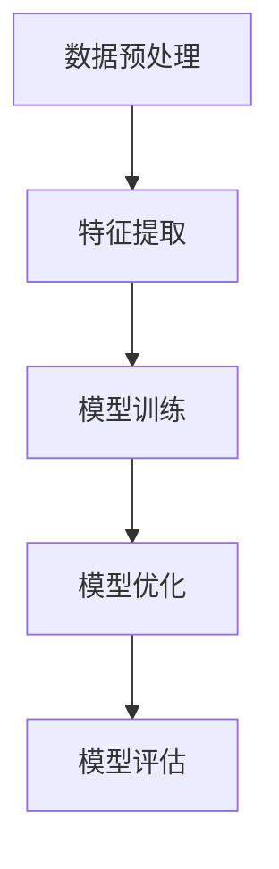

                 


# AI智能体协作：提升对公司财务健康状况的评估

> 关键词：AI智能体协作，财务健康评估，多智能体系统，机器学习，系统架构

> 摘要：本文探讨了如何利用AI智能体协作技术提升对公司财务健康状况的评估。通过分析财务健康评估的核心指标、AI智能体协作的理论基础、系统架构设计以及实际项目案例，详细阐述了AI技术在财务评估中的应用，展示了如何通过智能化协作优化财务分析流程，提高评估的准确性和效率。

---

## 第1章：AI智能体协作与财务健康评估概述

### 1.1 AI智能体协作的定义与背景

AI智能体（Artificial Intelligence Agent）是指能够感知环境并采取行动以实现目标的智能实体。AI智能体协作是指多个AI智能体通过协同工作，共同完成复杂任务的能力。在财务健康评估中，AI智能体协作可以通过分工合作，分别处理不同的数据源和评估维度，从而提高整体评估的准确性和效率。

### 1.2 财务健康评估的现状与挑战

传统的财务健康评估主要依赖于财务报表分析和人工判断，这种方法存在效率低、主观性强、难以处理海量数据等问题。随着企业规模的扩大和数据的爆炸式增长，传统的评估方法已难以满足现代企业的需求。

### 1.3 AI技术在财务评估中的应用

AI技术，尤其是机器学习和自然语言处理技术，能够从大量非结构化数据中提取有用信息，帮助财务人员更全面地评估企业的财务状况。通过AI智能体协作，可以实现对财务数据的实时监控、风险预警和决策支持。

---

## 第2章：AI智能体协作的核心概念与理论基础

### 2.1 多智能体系统的基本原理

多智能体系统（Multi-Agent System, MAS）由多个智能体组成，每个智能体都有自己的目标和行为规则。通过智能体之间的协作，可以完成单个智能体无法完成的任务。

### 2.2 分布式计算与协作机制

在AI智能体协作中，分布式计算是实现智能体间通信和协调的基础。通过分布式计算，智能体可以在不同的节点上并行处理任务，提高整体计算效率。

### 2.3 智能体协作的通信与协调

智能体协作需要高效的通信机制和协调算法。通过定义明确的通信协议和协作规则，可以确保智能体之间的有效合作。

---

## 第3章：财务健康评估的AI解决方案

### 3.1 财务健康评估的核心指标

财务健康评估通常包括以下几个核心指标：
1. **流动性比率**：衡量企业的短期偿债能力。
2. **杠杆比率**：衡量企业的财务杠杆和偿债能力。
3. **盈利能力**：衡量企业的经营效率和盈利能力。

### 3.2 数据预处理与特征提取

在AI驱动的财务评估中，数据预处理是关键步骤。通过清洗数据、处理缺失值和标准化数据，可以提高模型的准确性和稳定性。

---

## 第4章：系统架构与设计

### 4.1 系统模块划分

AI智能体协作系统通常包括以下几个模块：
1. 数据采集模块：负责收集企业的财务数据。
2. 数据处理模块：对数据进行清洗和特征提取。
3. 模型训练模块：基于机器学习算法训练评估模型。
4. 智能体协作模块：实现多个智能体的协作和任务分配。

### 4.2 系统架构设计

通过Mermaid图展示系统的架构设计：



---

## 第5章：算法原理与数学模型

### 5.1 评估模型的构建

基于机器学习的财务健康评估模型通常采用逻辑回归或随机森林算法。以下是逻辑回归的数学模型：

$$ P(y=1) = \frac{e^{\beta_0 + \beta_1x_1 + \cdots + \beta_nx_n}}{1 + e^{\beta_0 + \beta_1x_1 + \cdots + \beta_nx_n}} $$

### 5.2 模型训练与优化

通过训练数据优化模型参数，提高模型的预测准确率。以下是训练过程的流程图：



---

## 第6章：项目实战

### 6.1 环境安装与配置

安装所需的Python库：

```bash
pip install pandas numpy scikit-learn
```

### 6.2 核心代码实现

以下是基于逻辑回归的财务健康评估代码示例：

```python
from sklearn.linear_model import LogisticRegression
from sklearn.metrics import accuracy_score
import pandas as pd

# 加载数据
data = pd.read_csv('financial_data.csv')

# 数据预处理
X = data.drop('target', axis=1)
y = data['target']

# 训练模型
model = LogisticRegression()
model.fit(X, y)

# 模型评估
predictions = model.predict(X)
print("准确率：", accuracy_score(y, predictions))
```

### 6.3 案例分析与结果解读

通过实际案例分析，展示AI智能体协作在财务健康评估中的应用效果。例如，通过模型预测企业的财务风险等级，并提供风险预警。

---

## 第7章：总结与展望

### 7.1 总结

本文详细探讨了AI智能体协作在财务健康评估中的应用，通过理论分析、系统设计和项目实战，展示了如何利用AI技术提高财务评估的效率和准确性。

### 7.2 未来展望

随着AI技术的不断发展，AI智能体协作在财务健康评估中的应用将更加广泛。未来的研究方向包括优化协作算法、引入更复杂的机器学习模型以及实现实时财务监控。

---

通过以上内容，我们详细介绍了AI智能体协作在财务健康评估中的应用，为企业的财务管理和决策提供了新的思路和方法。

