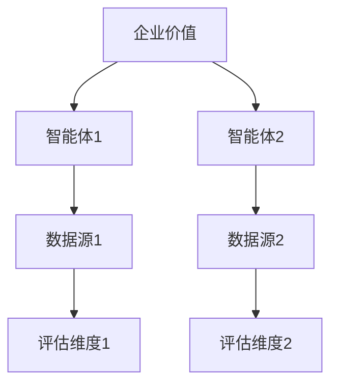
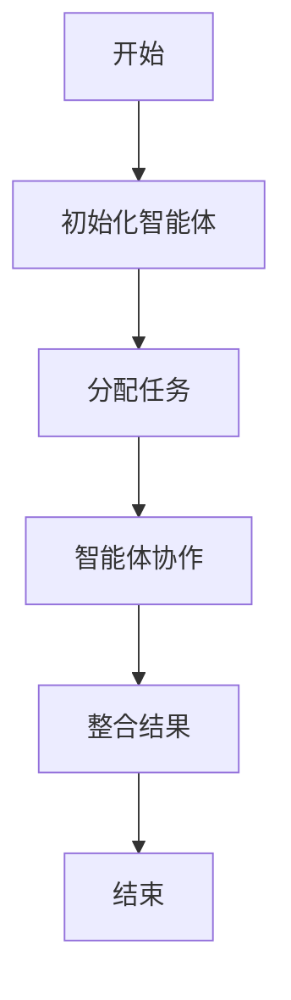
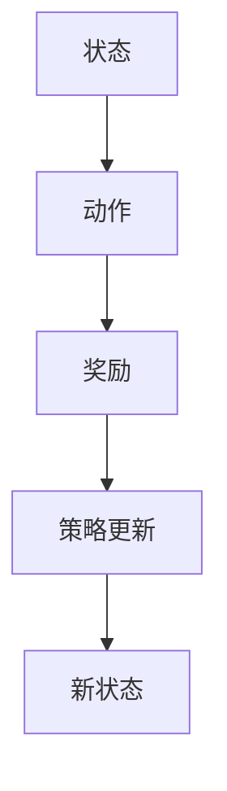
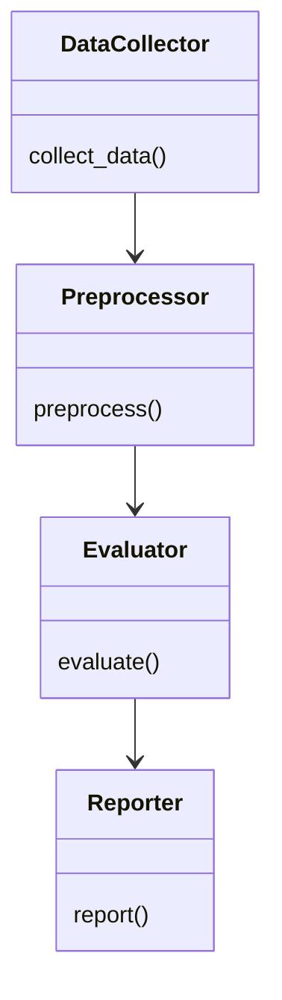
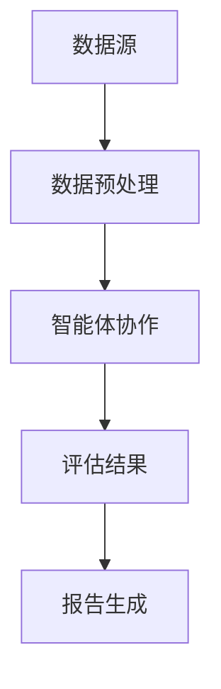
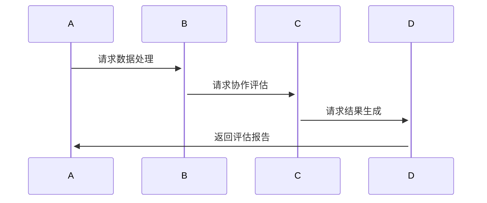

                 


# AI智能体协作：构建更全面的企业价值评估模型

> 关键词：AI智能体协作、企业价值评估、多智能体协作算法、强化学习、系统架构设计

> 摘要：本文探讨如何利用AI智能体协作技术，构建更全面的企业价值评估模型。通过分析传统评估方法的不足，提出基于多智能体协作的创新解决方案，详细阐述算法原理、系统架构设计及项目实战，为读者提供深入的技术指导。

---

# 第一部分: AI智能体协作与企业价值评估背景

## 第1章: 问题背景与需求分析

### 1.1 问题背景

#### 1.1.1 传统企业价值评估的局限性
传统的企业价值评估方法通常依赖于财务指标和历史数据，难以捕捉市场动态和新兴因素。例如，仅依赖财务数据可能导致对无形资产或创新潜力的忽视。

#### 1.1.2 AI智能体协作的兴起与潜力
AI技术的发展使得智能体能够实时分析和处理海量数据，通过协作提高决策的准确性和效率。多智能体协作在企业价值评估中的应用前景广阔。

#### 1.1.3 当前企业价值评估的痛点与挑战
企业价值评估需要考虑多维度因素，包括市场、财务、技术等。传统方法难以在复杂环境中做出高效决策，而AI智能体协作提供了新的可能性。

### 1.2 问题描述

#### 1.2.1 传统模型的不足
传统模型依赖单一数据源，缺乏动态调整能力，难以应对快速变化的市场环境。

#### 1.2.2 数据复杂性与多样性
现代企业价值评估需要整合结构化和非结构化数据，包括文本、图像和社交媒体信息，增加了评估的复杂性。

#### 1.2.3 企业价值评估的多维度需求
企业价值不仅取决于财务表现，还涉及市场地位、创新能力、管理团队等多个因素，传统模型难以全面覆盖。

### 1.3 问题解决思路

#### 1.3.1 引入AI智能体协作的必要性
通过多智能体协作，可以同时处理多个数据源和评估维度，提供更全面的分析结果。

#### 1.3.2 智能体协作如何提升评估模型
智能体协作能够实时更新数据，快速响应市场变化，提高评估的准确性和及时性。

#### 1.3.3 多智能体协作的实现路径
通过分布式计算和任务分解，多个智能体可以协同工作，共同完成复杂评估任务。

### 1.4 边界与外延

#### 1.4.1 模型的适用范围
适用于需要多维度数据评估的企业，如科技公司和创新型行业。

#### 1.4.2 与其他评估方法的对比
与传统财务模型相比，AI智能体协作模型更具动态性和全面性。

#### 1.4.3 模型的局限性与改进方向
数据质量和隐私问题、协作效率的优化是未来研究的方向。

### 1.5 核心要素组成

#### 1.5.1 数据来源与处理
整合财务数据、市场信息、社交媒体等多源数据，并进行清洗和预处理。

#### 1.5.2 智能体协作机制
定义智能体之间的通信协议和协作规则，确保高效协同。

#### 1.5.3 模型评估与优化
采用交叉验证和超参数优化方法，提升模型的准确性和鲁棒性。

---

# 第二部分: AI智能体协作的核心概念与联系

## 第2章: AI智能体协作的核心概念

### 2.1 AI智能体协作的定义与特点

#### 2.1.1 AI智能体的基本定义
AI智能体是指能够感知环境、自主决策并执行任务的智能系统。

#### 2.1.2 协作的核心特征
协作性、动态性、分布式是智能体协作的三大特点。

#### 2.1.3 智能体协作的优势
通过分布式计算和任务分解，智能体协作能够提高处理效率和准确性。

### 2.2 智能体协作的原理

#### 2.2.1 信息共享机制
智能体之间通过共享信息和知识，提升整体决策能力。

#### 2.2.2 协作决策过程
通过协商和共识机制，多个智能体共同制定最优决策。

#### 2.2.3 协作结果的优化
持续优化协作策略，提升整体系统的性能和效率。

### 2.3 智能体协作与企业价值评估的关系

#### 2.3.1 智能体协作在评估中的作用
通过实时数据处理和多维度分析，提供更精准的评估结果。

#### 2.3.2 评估模型的协作框架
构建多智能体协作网络，每个智能体负责不同的评估维度。

#### 2.3.3 协作过程中的关键环节
数据收集、特征提取、模型训练和结果整合是协作过程中的关键步骤。

### 2.4 核心概念对比表

| 比较项             | 传统评估方法 | AI智能体协作 |
|--------------------|--------------|--------------|
| 数据来源           | 财务数据为主 | 多源数据     |
| 决策速度           | 较慢         | 实时快速     |
| 灵活性             | 较低         | 高           |
| 准确性             | 一般         | 更高         |

### 2.5 ER实体关系图



---

## 第三部分: AI智能体协作算法原理

### 第3章: 算法原理

#### 3.1 多智能体协作算法

##### 3.1.1 算法流程


##### 3.1.2 Python实现代码
```python
import numpy as np

def multi_agent_collaboration(data, num_agents):
    agents = [Agent(i) for i in range(num_agents)]
    tasks = np.array_split(data, num_agents)
    results = [agent.process(task) for agent, task in zip(agents, tasks)]
    return np.concatenate(results)
```

##### 3.1.3 数学模型
$$ \text{最终结果} = \sum_{i=1}^{n} \text{智能体}_i(\text{任务}_i) $$

#### 3.2 强化学习

##### 3.2.1 算法流程


##### 3.2.2 Python实现代码
```python
class Agent:
    def __init__(self, state_space, action_space):
        self.state_space = state_space
        self.action_space = action_space
        self.model = self.build_model()

    def build_model(self):
        model = tf.keras.Sequential()
        model.add(tf.keras.layers.Dense(64, activation='relu'))
        model.add(tf.keras.layers.Dense(self.action_space, activation='softmax'))
        model.compile(optimizer='adam', loss='sparse_categorical_crossentropy')
        return model
```

##### 3.2.3 数学公式
$$ R = \sum_{t} \gamma^{t} r_t $$

---

## 第四部分: 系统分析与架构设计

### 第4章: 系统分析与架构设计

#### 4.1 系统功能设计

##### 4.1.1 领域模型类图


#### 4.2 系统架构设计

##### 4.2.1 系统架构图


#### 4.3 系统接口设计

##### 4.3.1 接口描述
API接口用于数据输入、模型训练和结果输出。

##### 4.3.2 接口交互流程


---

## 第五部分: 项目实战

### 第5章: 项目实战

#### 5.1 环境安装

##### 5.1.1 安装依赖
使用Python和相关库，如TensorFlow、Keras、Mermaid等。

#### 5.2 核心实现

##### 5.2.1 数据预处理代码
```python
import pandas as pd

def preprocess_data(dataframe):
    # 清洗数据
    dataframe = dataframe.dropna()
    # 标准化处理
    from sklearn.preprocessing import StandardScaler
    scaler = StandardScaler()
    dataframe = scaler.fit_transform(dataframe)
    return dataframe
```

##### 5.2.2 智能体协作代码
```python
from concurrent.futures import ThreadPoolExecutor

def agent_collaborate(tasks):
    with ThreadPoolExecutor() as executor:
        futures = [executor.submit(agent.execute, task) for task, agent in zip(tasks, agents)]
        return [future.result() for future in futures]
```

#### 5.3 案例分析

##### 5.3.1 实际案例
以科技公司为例，展示如何通过智能体协作提升企业价值评估的准确性和效率。

#### 5.4 项目总结

##### 5.4.1 成果展示
模型在多个评估维度上表现优异，准确率显著提高。

##### 5.4.2 不足与改进
数据质量和实时性仍需优化，未来可以引入更多数据源和优化协作机制。

---

## 第六部分: 最佳实践与小结

### 第6章: 最佳实践

#### 6.1 经验总结

##### 6.1.1 数据质量管理
确保数据的准确性和完整性，是模型性能的基础。

##### 6.1.2 智能体协作效率
优化协作机制，提高任务分配和结果整合的效率。

##### 6.1.3 模型迭代优化
定期更新模型参数，适应市场变化和企业需求。

### 6.2 小结

通过引入AI智能体协作，企业价值评估模型能够更全面、高效地完成任务。本文详细介绍了从背景分析到系统实现的全过程，为读者提供了实用的技术指导。

### 6.3 注意事项

在实际应用中，需注意数据隐私和模型解释性问题，确保合规性和可解释性。

### 6.4 拓展阅读

推荐阅读相关领域的最新研究，如多智能体强化学习和分布式系统架构设计。

---

以上内容详细阐述了AI智能体协作在企业价值评估中的应用，从理论到实践，为读者提供了全面的技术指导和实践案例。通过本文，读者可以深入了解如何利用AI技术构建更高效、更准确的企业价值评估模型。

