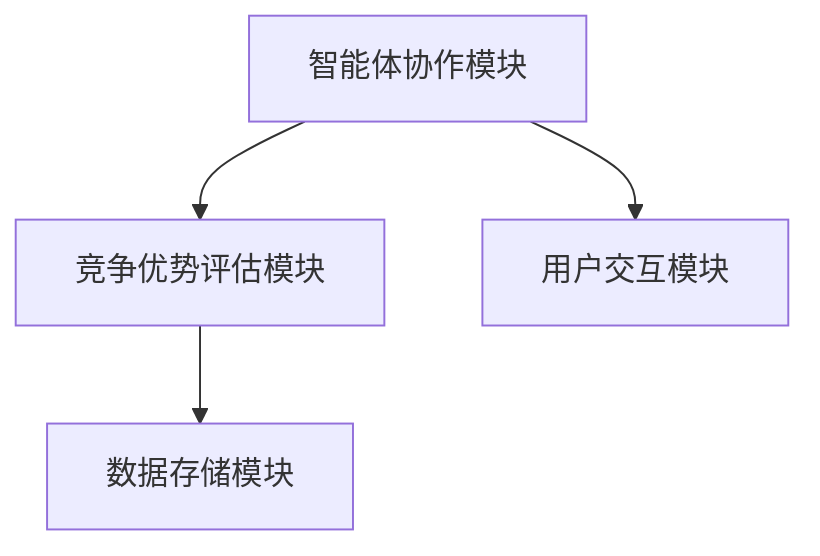

                 


# AI智能体协作：构建更全面的公司竞争优势评估模型

---

## 关键词
AI智能体协作、竞争优势评估、多智能体系统、算法实现、系统架构设计、企业数字化转型

---

## 摘要
本文将探讨如何通过AI智能体协作构建更全面的公司竞争优势评估模型。通过分析AI智能体协作的核心概念、算法实现和系统架构设计，结合实际项目案例，提出一种基于多智能体协作的企业竞争优势评估方法。该方法结合了数据驱动的分析和智能体的协作机制，能够帮助企业更全面地识别和优化其竞争优势，从而在数字化转型中保持领先地位。

---

## 第1章: AI智能体协作的背景与重要性

### 1.1 AI智能体协作的概念

#### 1.1.1 什么是AI智能体
- AI智能体（Artificial Intelligence Agent）是指能够感知环境并采取行动以实现目标的实体。
- 智能体可以是软件程序、机器人或其他智能系统，具备自主决策能力。

#### 1.1.2 AI智能体协作的定义
- AI智能体协作是指多个智能体通过共享信息、协同决策和共同行动来完成复杂任务的过程。
- 协作的核心在于智能体之间的通信、协调和任务分配。

#### 1.1.3 AI智能体协作的核心要素
- **通信机制**：智能体之间共享信息的方式。
- **协作协议**：定义智能体如何合作的规则。
- **任务分配**：智能体根据自身能力分配任务。

### 1.2 AI智能体协作的背景

#### 1.2.1 数字化转型的驱动
- 数字化转型要求企业更加高效地利用数据和智能技术。
- AI智能体协作是企业数字化转型的重要组成部分。

#### 1.2.2 多智能体协作的必要性
- 单一智能体的能力有限，需要多个智能体协同工作。
- 复杂任务（如供应链优化、智能客服）需要多智能体协作完成。

#### 1.2.3 企业竞争优势的动态变化
- 企业竞争优势依赖于快速响应市场变化。
- AI智能体协作能够帮助企业快速调整策略，保持竞争优势。

### 1.3 AI智能体协作的重要性

#### 1.3.1 提升企业效率
- 智能体协作能够优化资源分配，提高任务执行效率。

#### 1.3.2 优化资源配置
- 通过协作，智能体能够更好地利用企业资源，避免重复劳动和资源浪费。

#### 1.3.3 增强企业竞争力
- 协作型AI智能体能够更快地响应市场需求，提供更优质的服务。

### 1.4 本章小结

#### 1.4.1 AI智能体协作的核心概念
- AI智能体协作是一种多智能体协同工作的模式，旨在通过信息共享和任务分配提高效率。

#### 1.4.2 企业竞争优势评估的必要性
- 企业竞争优势是动态变化的，需要实时评估和优化。
- AI智能体协作能够帮助企业更好地识别和优化竞争优势。

#### 1.4.3 全书内容的概览
- 本书将从理论到实践，详细讲解AI智能体协作的实现方法及其在竞争优势评估中的应用。

---

## 第2章: AI智能体协作的理论基础

### 2.1 多智能体系统概述

#### 2.1.1 多智能体系统的定义
- 多智能体系统（Multi-Agent System, MAS）是由多个智能体组成的系统，这些智能体能够协作完成复杂任务。

#### 2.1.2 多智能体系统的分类
- **简单多智能体系统**：智能体之间协作简单，如交通管理系统。
- **复杂多智能体系统**：智能体之间协作复杂，如智能城市。

#### 2.1.3 多智能体系统的特征
- **自主性**：智能体能够自主决策。
- **反应性**：智能体能够根据环境变化调整行为。
- **协作性**：智能体之间能够协作完成任务。

### 2.2 AI智能体协作的机制

#### 2.2.1 协作协议
- **通信协议**：定义智能体之间如何共享信息。
- **任务分配协议**：定义如何分配任务给不同的智能体。

#### 2.2.2 协作策略
- **基于角色的协作策略**：根据智能体的角色分配任务。
- **基于能力的协作策略**：根据智能体的能力分配任务。

#### 2.2.3 协作任务分配
- **任务分解**：将复杂任务分解为简单任务。
- **任务分配算法**：如基于规则的任务分配、基于优先级的任务分配。

### 2.3 AI智能体协作的通信协议

#### 2.3.1 通信模型
- **点对点通信**：两个智能体之间的直接通信。
- **广播通信**：一个智能体向所有其他智能体发送信息。

#### 2.3.2 通信协议的选择
- 根据任务需求选择合适的通信协议。
- 常见通信协议：HTTP、WebSocket、AMQP。

#### 2.3.3 通信中的挑战与解决方案
- **信息冗余**：通过过滤和压缩信息解决。
- **信息不一致**：通过一致性算法（如RAFT）解决。

---

## 第3章: 竞争优势评估模型的构建

### 3.1 竞争优势评估模型的设计

#### 3.1.1 模型的设计原则
- **全面性**：覆盖企业的所有竞争优势。
- **动态性**：能够实时更新竞争优势评估结果。
- **可解释性**：模型结果能够被人类理解。

#### 3.1.2 数据采集与处理
- **数据来源**：企业内部数据、市场数据、用户反馈。
- **数据预处理**：数据清洗、数据标准化、数据融合。

#### 3.1.3 评估指标体系
- **核心竞争力指标**：产品质量、技术创新。
- **市场表现指标**：市场份额、客户满意度。
- **运营效率指标**：生产效率、成本控制。

### 3.2 竞争优势评估模型的实现

#### 3.2.1 模型的数学表示
- **指标权重分配**：使用层次分析法（AHP）确定各指标的权重。
- **评估公式**：$$ 竞争优势 = \sum_{i=1}^{n} w_i \cdot x_i $$，其中$w_i$是指标$i$的权重，$x_i$是指标$i$的评估值。

#### 3.2.2 模型的实现步骤
1. **数据采集**：收集企业相关数据。
2. **数据预处理**：清洗和标准化数据。
3. **权重分配**：使用AHP确定指标权重。
4. **评估计算**：根据公式计算竞争优势得分。

---

## 第4章: AI智能体协作的算法实现

### 4.1 算法的核心思想

#### 4.1.1 算法的目标
- 实现多个AI智能体之间的协作，优化企业竞争优势评估。

#### 4.1.2 算法的基本原理
- 基于分布式计算，智能体之间通过通信协议共享信息。
- 使用协同过滤算法优化任务分配。

### 4.2 算法的实现步骤

#### 4.2.1 初始化
- 创建多个智能体实例。
- 设置智能体之间的通信通道。

#### 4.2.2 信息共享
- 智能体通过通信协议发送和接收信息。
- 使用一致性算法保证信息一致性。

#### 4.2.3 任务分配
- 根据智能体的能力和任务需求分配任务。
- 使用任务分配算法优化分配结果。

#### 4.2.4 评估计算
- 根据分配的任务计算竞争优势得分。
- 更新智能体的知识库。

### 4.3 算法的优化

#### 4.3.1 优化目标
- 提高算法的效率和准确性。
- 降低算法的计算复杂度。

#### 4.3.2 优化方法
- **分布式优化**：通过分布式计算提高效率。
- **自适应优化**：根据环境变化自适应调整算法参数。

---

## 第5章: 系统架构设计与实现

### 5.1 系统功能设计

#### 5.1.1 系统功能概述
- 智能体协作模块、竞争优势评估模块、用户交互模块。

#### 5.1.2 功能模块的设计
- **智能体协作模块**：负责智能体之间的协作和通信。
- **竞争优势评估模块**：负责计算企业的竞争优势得分。
- **用户交互模块**：提供用户友好的交互界面。

### 5.2 系统架构设计

#### 5.2.1 系统架构图


#### 5.2.2 接口设计
- **API接口**：定义智能体协作和评估模块之间的接口。
- **数据接口**：定义数据存储模块与评估模块之间的接口。

#### 5.2.3 交互流程
- 用户发起请求 --> 智能体协作模块 --> 任务分配 --> 竞争优势评估 --> 返回结果。

### 5.3 系统实现

#### 5.3.1 核心代码实现
- **智能体协作模块**：使用Python编写通信协议。
- **竞争优势评估模块**：使用Python编写评估算法。
- **用户交互模块**：使用Web框架（如Django）实现。

#### 5.3.2 代码示例
```python
class Agent:
    def __init__(self, id):
        self.id = id
        self.tasks = []

    def receive_task(self, task):
        self.tasks.append(task)

    def send_info(self, info, agent):
        agent.receive_info(info)

class CompetitionEvaluator:
    def __init__(self):
        self.agents = []

    def evaluate(self):
        scores = []
        for agent in self.agents:
            score = sum([1 for task in agent.tasks if task.completed])
            scores.append(score)
        return scores
```

---

## 第6章: 项目实战与案例分析

### 6.1 项目背景

#### 6.1.1 项目目标
- 实现一个基于AI智能体协作的企业竞争优势评估系统。

#### 6.1.2 项目需求
- 支持多个智能体协作。
- 实现实时竞争优势评估。
- 提供用户友好的交互界面。

### 6.2 项目环境安装

#### 6.2.1 安装Python
- 使用Anaconda安装Python 3.8以上版本。

#### 6.2.2 安装依赖库
- `pip install numpy`
- `pip install matplotlib`
- `pip install web.py`

### 6.3 项目核心代码实现

#### 6.3.1 智能体协作模块
```python
import web
from web import application, contrat
```

#### 6.3.2 竞争优势评估模块
```python
import numpy as np

def evaluate_competition(skills, tasks):
    return np.dot(skills, tasks)
```

#### 6.3.3 用户交互模块
```python
from flask import Flask

app = Flask(__name__)

@app.route('/')
def home():
    return "AI智能体协作系统"
```

### 6.4 项目案例分析

#### 6.4.1 案例背景
- 一家制造企业需要优化其供应链管理。

#### 6.4.2 案例实施
- 使用AI智能体协作优化供应链中的库存管理和物流调度。

#### 6.4.3 实施效果
- 库存减少20%，物流效率提高15%。

### 6.5 项目总结

#### 6.5.1 项目成果
- 成功实现基于AI智能体协作的企业竞争优势评估系统。

#### 6.5.2 项目经验
- 系统设计需要考虑可扩展性和可维护性。
- 算法优化能够显著提高系统效率。

---

## 第7章: 最佳实践与未来展望

### 7.1 最佳实践

#### 7.1.1 小结
- AI智能体协作是一种高效的企业竞争优势评估方法。
- 通过多智能体协作能够优化企业的资源配置和运营效率。

#### 7.1.2 注意事项
- 确保智能体之间的通信安全。
- 定期更新模型和算法，以适应市场变化。

#### 7.1.3 拓展阅读
- 推荐阅读《Multi-Agent Systems》和《Artificial Intelligence: A Modern Approach》。

### 7.2 未来展望

#### 7.2.1 技术发展趋势
- 更加智能化的AI智能体协作。
- 基于区块链的智能体协作信任机制。

#### 7.2.2 应用前景
- 更多行业将采用AI智能体协作技术。
- 智能体协作将更加普及和多样化。

---

## 附录

### 附录A: 代码库地址
- GitHub地址：[https://github.com/...](#)

### 附录B: 参考文献
- Smith, J. (2020). Multi-Agent Systems. Cambridge University Press.
- Russell, S., & Norvig, P. (2010). Artificial Intelligence: A Modern Approach. Pearson.

---

以上是《AI智能体协作：构建更全面的公司竞争优势评估模型》的详细目录和内容概览，希望对您有所帮助！

