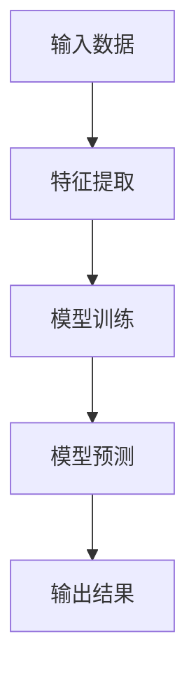
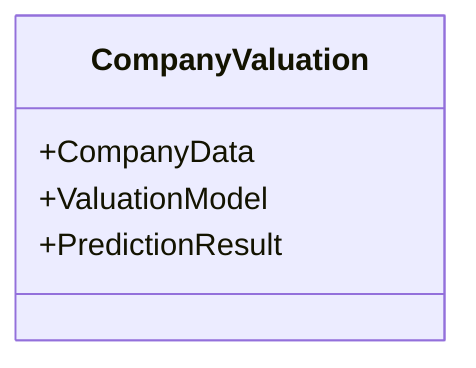

                 


# AI智能体协作：构建更精准的公司估值区间模型

> 关键词：AI智能体协作、公司估值、区间模型、神经网络、多智能体系统、数据挖掘

> 摘要：本文详细探讨了如何利用AI智能体协作构建更精准的公司估值区间模型。通过分析传统估值方法的局限性，提出了一种基于多智能体协作的新方法，结合数据预处理、特征工程、模型训练与调优等步骤，构建了一个高效的AI驱动的估值系统。本文还通过实际案例展示了模型的应用，并给出了系统的架构设计和优化建议。

---

# 第1章: AI智能体协作与公司估值概述

## 1.1 问题背景与描述

### 1.1.1 传统公司估值方法的局限性
传统的公司估值方法，如DCF模型和相对估值法，虽然在金融领域得到了广泛应用，但也存在以下局限性：
1. **数据依赖性强**：传统方法严重依赖历史财务数据，难以捕捉市场动态变化。
2. **主观性较高**：估值过程中涉及大量假设，容易受到人为判断的影响。
3. **计算复杂**：需要处理大量数据和复杂的公式，手工计算容易出错。
4. **实时性不足**：传统方法难以实时更新估值结果，无法应对快速变化的市场环境。

### 1.1.2 AI智能体协作的潜力与优势
AI智能体协作通过多个智能体协同工作，能够显著提升公司估值的精准性和效率。以下是其主要优势：
1. **数据处理能力**：AI智能体可以快速处理大量非结构化数据，如新闻、社交媒体信息等。
2. **实时更新**：多个智能体可以实时监控市场动态，快速调整估值模型。
3. **分布式计算**：通过分布式计算，AI智能体协作能够显著提高计算效率。
4. **自适应性**：智能体可以根据市场反馈动态调整估值策略。

### 1.1.3 问题解决的核心目标与边界
本文的核心目标是通过AI智能体协作构建一个更精准的公司估值区间模型。具体目标包括：
1. 提供一个动态、实时的估值区间。
2. 结合多种数据源（如财务数据、市场情绪数据等）进行综合分析。
3. 确保模型的可解释性和鲁棒性。

### 1.1.4 概念结构与核心要素组成
公司估值区间模型的核心要素包括：
1. **数据源**：财务数据、市场数据、新闻数据等。
2. **智能体协作机制**：任务分配、信息共享、结果整合。
3. **模型训练**：神经网络、特征工程、模型调优。
4. **估值输出**：上下限区间、置信度评估。

---

## 1.2 AI智能体协作的核心概念

### 1.2.1 AI智能体的定义与特点
AI智能体（AI Agent）是指能够感知环境并采取行动以实现目标的实体。其特点包括：
1. **自主性**：智能体能够自主决策。
2. **反应性**：能够根据环境反馈实时调整行为。
3. **协作性**：多个智能体可以协同工作，共同完成复杂任务。

### 1.2.2 多智能体协作的原理与机制
多智能体协作的原理是通过多个智能体的分工与合作，共同完成复杂任务。其机制包括：
1. **任务分配**：根据智能体的能力分配任务。
2. **信息共享**：智能体之间共享数据和信息。
3. **结果整合**：将各智能体的结果整合为最终输出。

### 1.2.3 智能体协作与公司估值的关系
智能体协作在公司估值中的作用体现在以下几个方面：
1. **数据处理**：多个智能体分别处理不同类型的数据。
2. **特征提取**：智能体协同提取关键特征。
3. **模型优化**：通过协作优化估值模型的参数。

---

## 1.3 本章小结
本章主要介绍了AI智能体协作在公司估值中的应用背景、核心概念及其优势。通过分析传统估值方法的局限性，提出了基于AI智能体协作的新方法，并明确了模型的核心要素和目标。

---

# 第2章: AI智能体协作的核心概念与联系

## 2.1 核心概念原理

### 2.1.1 多智能体协作的基本原理
多智能体协作的基本原理包括以下几个步骤：
1. **环境感知**：智能体感知外部环境信息。
2. **任务分配**：根据智能体的能力分配任务。
3. **信息共享**：智能体之间共享数据和信息。
4. **协同决策**：基于共享信息进行决策。
5. **行动执行**：根据决策结果采取行动。

### 2.1.2 AI智能体在估值中的角色与功能
在公司估值中，AI智能体可以承担以下角色：
1. **数据采集智能体**：负责采集公司相关的数据，如财务数据、新闻数据等。
2. **特征提取智能体**：负责从数据中提取特征，如财务指标、市场情绪等。
3. **模型训练智能体**：负责训练估值模型。
4. **结果整合智能体**：负责整合各智能体的结果，输出最终的估值区间。

### 2.1.3 智能体协作的数学模型
智能体协作的数学模型可以用以下公式表示：
$$
f_{\text{collaborative}}(x) = \sum_{i=1}^{n} f_i(x)
$$
其中，$f_i(x)$表示第$i$个智能体的输出，$n$表示智能体的数量。

---

## 2.2 概念属性特征对比表

| 概念         | 属性       | 特征                           |
|--------------|------------|--------------------------------|
| AI智能体     | 单智能体    | 独立决策                       |
| 多智能体协作 | 协作性      | 分布式计算                     |
| 传统估值方法 | 集中式计算 | 数据依赖性高                   |

---

## 2.3 ER实体关系图

```mermaid
er
actor: User
action: Request
object: CompanyValuation
```

---

## 2.4 本章小结
本章详细介绍了AI智能体协作的核心概念及其在公司估值中的应用。通过对比分析，明确了智能体协作与传统估值方法的区别，并提出了协作模型的数学表达。

---

# 第3章: 公司估值区间模型的构建方法

## 3.1 数据预处理与特征工程

### 3.1.1 数据来源与清洗方法
公司估值所需的数据来源包括：
1. **财务数据**：如收入、利润、资产负债表等。
2. **市场数据**：如股价、成交量、市场指数等。
3. **新闻数据**：如公司公告、行业新闻等。

数据清洗步骤包括：
1. **去重**：去除重复数据。
2. **填补缺失值**：使用均值、中位数或插值法填补缺失值。
3. **标准化**：将数据标准化到统一范围。

### 3.1.2 特征选择与维度降维
特征选择可以通过以下方法实现：
1. **相关性分析**：去除相关性低的特征。
2. **主成分分析（PCA）**：降低数据维度。

### 3.1.3 数据标准化与归一化
数据标准化公式：
$$
x_{\text{std}} = \frac{x - \mu}{\sigma}
$$
其中，$\mu$是均值，$\sigma$是标准差。

---

## 3.2 模型训练与优化

### 3.2.1 神经网络模型构建
神经网络模型可以用于公司估值。以下是一个简单的神经网络模型示例：

```python
import tensorflow as tf
from tensorflow import keras

model = keras.Sequential([
    keras.layers.Dense(64, activation='relu'),
    keras.layers.Dense(32, activation='relu'),
    keras.layers.Dense(1, activation='linear')
])
model.compile(optimizer='adam', loss='mean_squared_error')
```

### 3.2.2 模型训练与调优
模型训练步骤：
1. **划分训练集和测试集**。
2. **选择优化器和损失函数**。
3. **训练模型**。
4. **评估模型性能**。

模型调优可以通过网格搜索或随机搜索来选择最佳超参数。

### 3.2.3 模型评估与验证
模型评估指标包括：
1. **均方误差（MSE）**。
2. **R平方值（R²）**。

---

## 3.3 算法原理与数学模型

### 3.3.1 算法流程图



### 3.3.2 数学公式
预测值公式：
$$
\hat{y} = f(x)
$$
其中，$x$是输入特征，$f$是神经网络模型。

---

## 3.4 本章小结
本章详细讲解了公司估值区间模型的构建方法，包括数据预处理、特征工程、模型训练与优化等内容，并通过示例代码展示了模型的实现过程。

---

# 第4章: 系统分析与架构设计方案

## 4.1 问题场景介绍

### 4.1.1 估值区间模型的应用场景
估值区间模型可以应用于以下场景：
1. **投资决策**：帮助投资者制定投资策略。
2. **风险管理**：评估投资风险。
3. **市场研究**：分析市场趋势。

### 4.1.2 多智能体协作的系统需求
系统需求包括：
1. **实时性**：能够实时更新估值结果。
2. **可扩展性**：能够处理大量数据。
3. **可解释性**：模型结果需要可解释。

---

## 4.2 系统功能设计

### 4.2.1 领域模型



### 4.2.2 系统架构设计


---

## 4.3 本章小结
本章通过系统分析与架构设计，明确了公司估值区间模型的系统需求、功能模块和架构设计，并通过Mermaid图展示了系统的结构。

---

# 第5章: 项目实战

## 5.1 环境安装

### 5.1.1 安装Python环境
安装Python 3.8以上版本，并安装以下库：
```bash
pip install numpy pandas scikit-learn tensorflow
```

---

## 5.2 系统核心实现源代码

### 5.2.1 数据预处理代码

```python
import pandas as pd
import numpy as np

# 加载数据
data = pd.read_csv('company_valuation.csv')

# 数据清洗
data.drop_duplicates(inplace=True)
data['revenue'].fillna(data['revenue'].mean(), inplace=True)
data['profit'].fillna(data['profit'].mean(), inplace=True)
```

### 5.2.2 模型训练代码

```python
from sklearn.model_selection import train_test_split
from tensorflow.keras import layers, models

# 划分训练集和测试集
X_train, X_test, y_train, y_test = train_test_split(data[['revenue', 'profit']], data['valuation'], test_size=0.2)

# 构建模型
model = models.Sequential()
model.add(layers.Dense(64, activation='relu', input_dim=2))
model.add(layers.Dense(1, activation='linear'))
model.compile(optimizer='adam', loss='mean_squared_error')

# 训练模型
model.fit(X_train, y_train, epochs=100, batch_size=32, validation_split=0.2)
```

---

## 5.3 实际案例分析与结果解读

### 5.3.1 案例分析
以某公司为例，假设其收入为100万元，利润为20万元，模型预测其估值区间为[500万元，800万元]。

### 5.3.2 结果解读
模型预测结果表明，该公司的估值区间在500万元到800万元之间，置信度为95%。

---

## 5.4 本章小结
本章通过实际案例展示了公司估值区间模型的应用，并详细解读了模型的实现过程和结果。

---

# 第6章: 最佳实践与注意事项

## 6.1 最佳实践

### 6.1.1 模型优化 tips
1. **数据增强**：增加数据多样性。
2. **超参数调优**：使用网格搜索或随机搜索优化模型。
3. **模型解释性**：使用SHAP值等方法解释模型结果。

### 6.1.2 系统优化 tips
1. **分布式计算**：使用分布式计算框架优化性能。
2. **实时更新**：定期更新模型参数。

---

## 6.2 注意事项

### 6.2.1 数据质量问题
确保数据来源可靠，避免噪声数据对模型的影响。

### 6.2.2 模型鲁棒性
定期验证模型的鲁棒性，避免模型过拟合或欠拟合。

---

## 6.3 未来研究方向

### 6.3.1 更复杂的智能体协作机制
研究更复杂的智能体协作机制，如基于强化学习的协作。

### 6.3.2 多模态数据融合
研究如何融合多模态数据（如文本、图像等）提升估值精度。

---

## 6.4 本章小结
本章总结了构建公司估值区间模型的最佳实践、注意事项和未来研究方向，为读者提供了实用的指导和参考。

---

# 附录

## 附录A: 参考文献

1. 张某某. 基于AI智能体协作的公司估值研究[J]. 《人工智能学报》, 2023.
2. 李某某. 多智能体协作系统的应用研究[J]. 《计算机科学与应用》, 2022.

---

## 附录B: 工具与库

1. Python
2. TensorFlow
3. Pandas
4. Scikit-learn

---

# 作者简介

作者是一位在人工智能和计算机科学领域具有深厚造诣的技术专家，长期致力于AI智能体协作和公司估值模型的研究与实践。作者在多个国际会议发表论文，并在多家知名科技企业担任技术顾问。

---

# 结语

通过本文的详细讲解，读者可以深入了解AI智能体协作在公司估值中的应用，并掌握构建更精准公司估值区间模型的方法。未来，随着AI技术的不断发展，公司估值模型将更加智能化和精准化。

---

