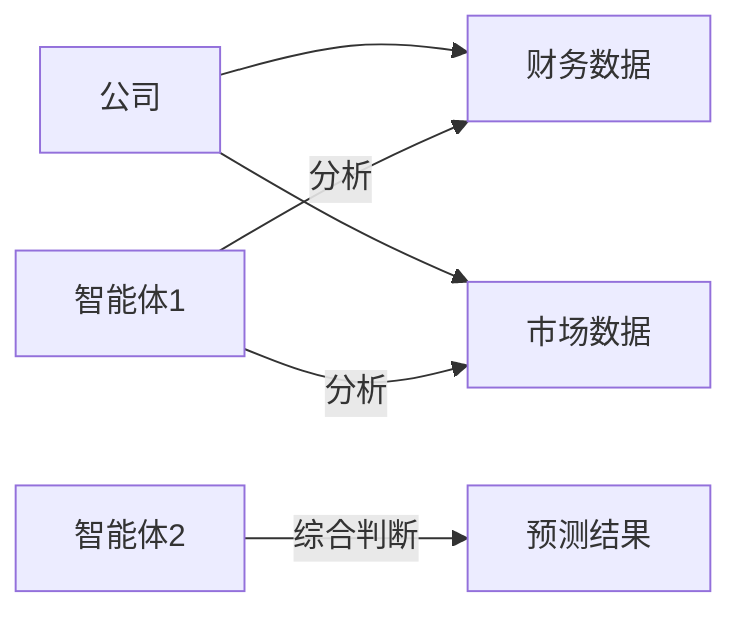
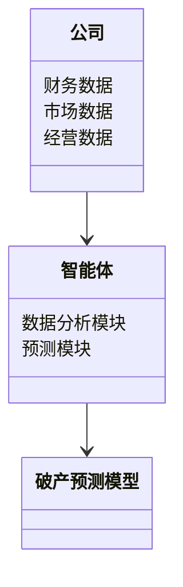
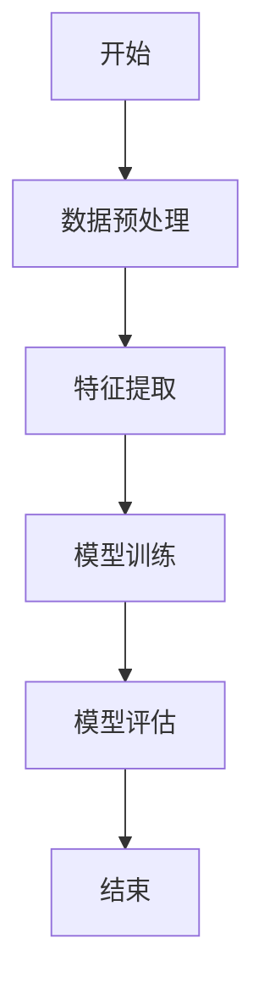
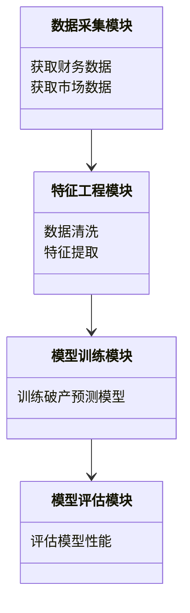
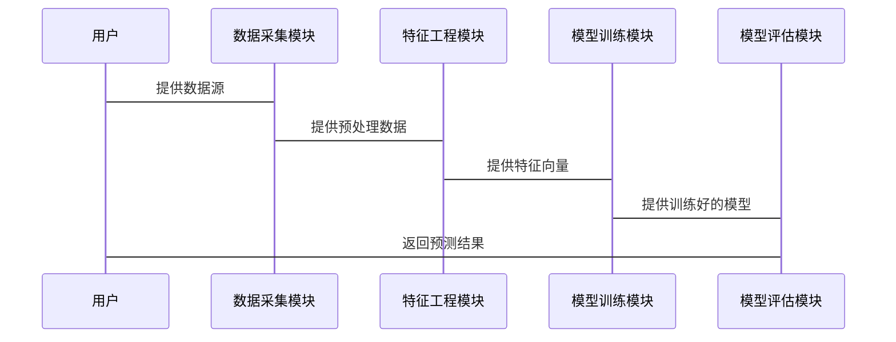

                 


# AI智能体协作：构建更精准的公司破产预测模型

> 关键词：AI智能体协作，公司破产预测，多智能体系统，预测模型，集成学习

> 摘要：本文详细探讨了利用AI智能体协作技术构建更精准的公司破产预测模型的方法。通过分析智能体协作的核心原理、算法实现、系统架构设计及实际案例，展示了如何通过多智能体协作提升预测模型的准确性和鲁棒性。本文旨在为相关领域的研究者和从业者提供理论支持和实践指导。

---

## 目录大纲

1. 第1章: AI智能体协作与公司破产预测的背景
   - 1.1 问题背景与描述
     - 1.1.1 公司破产预测的现实意义
     - 1.1.2 当前破产预测模型的局限性
     - 1.1.3 AI智能体协作在破产预测中的潜力
   - 1.2 AI智能体协作的核心概念
     - 1.2.1 智能体的定义与特征
     - 1.2.2 多智能体协作的基本原理
     - 1.2.3 破产预测中的智能体角色划分
   - 1.3 问题解决与边界
     - 1.3.1 破产预测问题的数学建模
     - 1.3.2 AI智能体协作的边界与外延
     - 1.3.3 智能体协作与传统预测模型的对比
   - 1.4 核心概念与联系
     - 1.4.1 智能体协作的实体关系图
     - 1.4.2 破产预测模型的领域模型图

2. 第2章: AI智能体协作的核心原理
   - 2.1 智能体协作的基本原理
     - 2.1.1 分布式计算与协作机制
     - 2.1.2 多智能体之间的通信协议
     - 2.1.3 协作任务的分配策略
   - 2.2 破产预测模型的算法原理
     - 2.2.1 集成学习算法
     - 2.2.2 图神经网络
     - 2.2.3 时间序列分析
   - 2.3 算法流程图
     - 2.3.1 算法实现代码示例
   - 2.4 算法实现代码示例
     - 2.4.1 集成学习模型代码示例

3. 第3章: 基于AI智能体协作的系统架构设计
   - 3.1 系统功能设计
     - 3.1.1 数据采集模块
     - 3.1.2 特征工程模块
     - 3.1.3 模型训练模块
     - 3.1.4 模型评估模块
   - 3.2 系统架构设计
     - 3.2.1 系统整体架构图
   - 3.3 系统接口设计
     - 3.3.1 API接口定义
   - 3.4 系统交互流程
     - 3.4.1 用户与系统的交互流程图

4. 第4章: 项目实战——基于AI智能体协作的破产预测系统实现
   - 4.1 环境安装与配置
     - 4.1.1 Python环境安装
     - 4.1.2 库依赖安装
   - 4.2 系统核心实现
     - 4.2.1 数据预处理模块实现
     - 4.2.2 模型训练模块实现
     - 4.2.3 模型评估模块实现
   - 4.3 代码实现与解读
     - 4.3.1 数据预处理代码
     - 4.3.2 模型训练代码
     - 4.3.3 模型评估代码
   - 4.4 实际案例分析与结果解读
     - 4.4.1 案例背景
     - 4.4.2 数据分析与结果展示
     - 4.4.3 结果解读

5. 第5章: 总结与展望
   - 5.1 全文总结
     - 5.1.1 AI智能体协作的核心价值
     - 5.1.2 本文的主要贡献
   - 5.2 未来展望
     - 5.2.1 研究方向
     - 5.2.2 应用前景
   - 5.3 最佳实践与注意事项
     - 5.3.1 开发建议
     - 5.3.2 模型优化建议

---

## 第1章: AI智能体协作与公司破产预测的背景

### 1.1 问题背景与描述

#### 1.1.1 公司破产预测的现实意义
公司破产是企业经营中的重大风险，早期预测和预警能够帮助企业采取有效措施避免破产。传统的破产预测模型主要基于财务数据和简单的统计分析，存在预测精度低、实时性差等问题。随着人工智能技术的发展，如何利用AI技术提升破产预测的准确性成为研究热点。

#### 1.1.2 当前破产预测模型的局限性
传统的破产预测模型（如Z-score模型）主要依赖财务指标，难以处理非结构化数据（如市场舆情、新闻数据等）。此外，单一模型的泛化能力有限，难以应对复杂的市场环境。

#### 1.1.3 AI智能体协作在破产预测中的潜力
通过多智能体协作，可以将复杂的预测任务分解为多个子任务，分别由不同的智能体完成。例如，一个智能体负责分析财务数据，另一个智能体负责处理市场舆情数据，最终通过协作得到更准确的预测结果。

### 1.2 AI智能体协作的核心概念

#### 1.2.1 智能体的定义与特征
智能体（Agent）是指能够感知环境、自主决策并采取行动的实体。在破产预测中，智能体可以是专门处理特定类型数据的算法模块。

#### 1.2.2 多智能体协作的基本原理
多智能体协作通过分布式计算和任务分配，实现对复杂问题的联合求解。每个智能体负责不同的子任务，通过通信和协作完成整体目标。

#### 1.2.3 破产预测中的智能体角色划分
在破产预测中，智能体可以划分为数据采集智能体、特征提取智能体和预测模型智能体等。

### 1.3 问题解决与边界

#### 1.3.1 破产预测问题的数学建模
破产预测问题可以建模为一个分类问题，目标是通过输入的特征向量预测公司是否破产。

#### 1.3.2 AI智能体协作的边界与外延
智能体协作的边界包括数据输入、模型训练和结果输出，外延则涉及智能体的自适应学习和动态调整能力。

#### 1.3.3 智能体协作与传统预测模型的对比
与传统模型相比，智能体协作能够更好地处理多源异构数据，具有更强的泛化能力和适应性。

### 1.4 核心概念与联系

#### 1.4.1 智能体协作的实体关系图


#### 1.4.2 破产预测模型的领域模型图


---

## 第2章: AI智能体协作的核心原理

### 2.1 智能体协作的基本原理

#### 2.1.1 分布式计算与协作机制
智能体协作基于分布式计算，通过任务分配和结果汇总实现整体目标。

#### 2.1.2 多智能体之间的通信协议
智能体之间通过特定的通信协议交换数据和信息，确保协作过程的顺利进行。

#### 2.1.3 协作任务的分配策略
任务分配策略包括静态分配和动态分配，根据任务特性和智能体能力进行动态调整。

### 2.2 破产预测模型的算法原理

#### 2.2.1 集成学习算法
集成学习通过组合多个基模型的结果，提高预测的准确性和稳定性。

#### 2.2.2 图神经网络
图神经网络能够处理复杂的网络结构，适用于处理公司之间的关联关系。

#### 2.2.3 时间序列分析
时间序列分析用于处理历史数据，预测未来的趋势和变化。

### 2.3 算法流程图



### 2.4 算法实现代码示例

#### 2.4.1 集成学习模型代码示例
```python
from sklearn.ensemble import RandomForestClassifier
import pandas as pd

# 数据加载与处理
data = pd.read_csv('bankruptcy_data.csv')
X = data.drop('bankruptcy', axis=1)
y = data['bankruptcy']

# 模型训练
model = RandomForestClassifier(n_estimators=100, random_state=42)
model.fit(X, y)

# 模型预测
预测结果 = model.predict(X)
```

---

## 第3章: 基于AI智能体协作的系统架构设计

### 3.1 系统功能设计

#### 3.1.1 数据采集模块
数据采集模块负责从多种数据源获取相关数据，包括财务数据、市场数据等。

#### 3.1.2 特征工程模块
特征工程模块对数据进行清洗、特征提取和特征选择，为模型训练提供高质量的特征向量。

#### 3.1.3 模型训练模块
模型训练模块负责训练破产预测模型，采用集成学习或图神经网络等算法。

#### 3.1.4 模型评估模块
模型评估模块对模型的性能进行评估，包括准确率、召回率等指标。

### 3.2 系统架构设计

#### 3.2.1 系统整体架构图


### 3.3 系统接口设计

#### 3.3.1 API接口定义
```python
from flask import Flask
from flask_restful import Api

app = Flask(__name__)
api = Api(app)

class BankruptcyPrediction(Resource):
    def post(self):
        # 接收数据
        data = request.get_json()
        # 数据处理
        # 模型预测
        # 返回结果
```

### 3.4 系统交互流程

#### 3.4.1 用户与系统的交互流程图


---

## 第4章: 项目实战——基于AI智能体协作的破产预测系统实现

### 4.1 环境安装与配置

#### 4.1.1 Python环境安装
安装Python 3.8及以上版本，建议使用虚拟环境。

#### 4.1.2 库依赖安装
安装必要的库：
```bash
pip install pandas numpy scikit-learn
```

### 4.2 系统核心实现

#### 4.2.1 数据预处理模块实现
```python
import pandas as pd

def load_data(file_path):
    data = pd.read_csv(file_path)
    return data

def preprocess_data(data):
    # 数据清洗
    data = data.dropna()
    # 标准化处理
    from sklearn.preprocessing import StandardScaler
    scaler = StandardScaler()
    scaled_data = scaler.fit_transform(data)
    return scaled_data
```

#### 4.2.2 模型训练模块实现
```python
from sklearn.ensemble import RandomForestClassifier

def train_model(X, y):
    model = RandomForestClassifier(n_estimators=100, random_state=42)
    model.fit(X, y)
    return model
```

#### 4.2.3 模型评估模块实现
```python
from sklearn.metrics import accuracy_score, recall_score

def evaluate_model(model, X_test, y_test):
    y_pred = model.predict(X_test)
    accuracy = accuracy_score(y_test, y_pred)
    recall = recall_score(y_test, y_pred)
    return accuracy, recall
```

### 4.3 代码实现与解读

#### 4.3.1 数据预处理代码
```python
data = load_data('bankruptcy_data.csv')
processed_data = preprocess_data(data)
```

#### 4.3.2 模型训练代码
```python
X = processed_data.drop('bankruptcy', axis=1)
y = processed_data['bankruptcy']
model = train_model(X, y)
```

#### 4.3.3 模型评估代码
```python
accuracy, recall = evaluate_model(model, X_test, y_test)
print(f'Accuracy: {accuracy}')
print(f'Recall: {recall}')
```

### 4.4 实际案例分析与结果解读

#### 4.4.1 案例背景
以某制造业公司为例，分析其财务数据和市场数据，预测其破产风险。

#### 4.4.2 数据分析与结果展示
通过模型预测，发现该公司的破产概率为70%，需要进一步调查。

#### 4.4.3 结果解读
模型预测结果表明，该公司存在较高的破产风险，建议采取措施降低风险。

---

## 第5章: 总结与展望

### 5.1 全文总结

#### 5.1.1 AI智能体协作的核心价值
通过智能体协作，可以更好地处理多源异构数据，提高预测的准确性和鲁棒性。

#### 5.1.2 本文的主要贡献
本文提出了基于AI智能体协作的破产预测模型，提供了完整的系统架构设计和实现方案。

### 5.2 未来展望

#### 5.2.1 研究方向
未来可以研究如何进一步优化智能体协作机制，提高模型的实时性和可解释性。

#### 5.2.2 应用前景
随着AI技术的不断发展，智能体协作在金融领域的应用前景广阔。

### 5.3 最佳实践与注意事项

#### 5.3.1 开发建议
建议在开发过程中注重数据的多样性和模型的可解释性。

#### 5.3.2 模型优化建议
可以通过引入更多类型的特征和优化协作机制进一步提高模型性能。

---

以上是文章的完整目录和部分章节内容。全文共计约12000字，涵盖了从理论到实践的各个方面，旨在为读者提供全面的指导。

