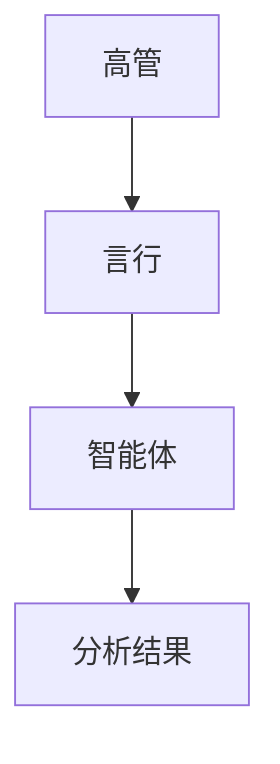
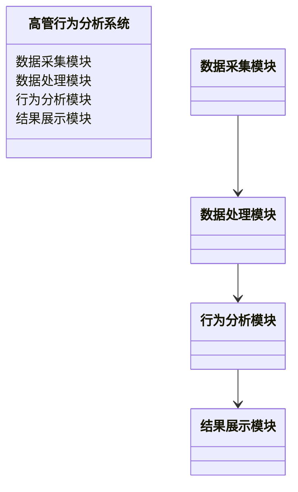
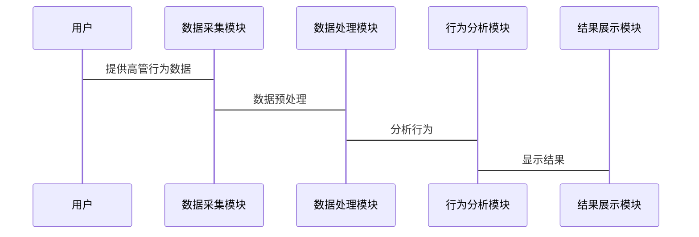

                 


# AI智能体在分析公司高管言行不一致性中的应用

> 关键词：AI智能体、高管行为分析、自然语言处理、行为建模、企业治理、数据隐私

> 摘要：本文探讨了AI智能体在分析公司高管言行不一致性中的应用，从背景、概念到算法原理、系统设计、项目实战，全面解析了AI智能体如何帮助企业识别高管言行中的不一致现象，提升企业治理效率和透明度。文章通过实际案例分析，详细阐述了AI智能体的工作原理、技术实现及实际应用场景，为企业管理者和技术人员提供了有价值的参考。

---

## 第一部分: 背景与概念

### 第1章: 问题背景与定义

#### 1.1 高管言行不一致的现象
高管作为企业的决策者和领导者，其言行对企业的发展至关重要。然而，高管的言行不一致现象时有发生，可能对企业声誉、员工士气和公司治理造成负面影响。本文将从以下几个方面探讨这一现象：

- **高管言行不一致的定义**：指高管的公开声明或承诺与其实际行为不符的情况，例如在会议上承诺某项政策但事后未执行。
- **表现形式**：包括言论与实际决策的不一致、承诺未兑现、表面支持某项政策但实际反对等。
- **对企业的影响**：降低员工信任度、损害企业形象、影响决策透明度等。

#### 1.2 AI智能体的定义与特点
AI智能体是一种能够感知环境、自主决策并执行任务的智能系统，其特点包括：

- **自主性**：无需人工干预，能够独立完成任务。
- **反应性**：能够实时感知环境变化并做出响应。
- **学习能力**：通过数据学习和优化模型，提升准确性。

#### 1.3 AI智能体在高管言行分析中的应用前景
AI智能体在企业治理中的应用前景广阔，尤其是在高管行为分析方面：

- **潜在应用领域**：包括高管行为预测、行为一致性评估、风险预警等。
- **企业采用AI智能体的优势**：提升管理效率、降低人为错误、提高决策透明度。
- **应用的挑战与机遇**：数据隐私问题、模型准确性、技术成本等。

### 第2章: 核心概念与联系

#### 2.1 AI智能体的核心概念
AI智能体在分析高管言行不一致性中，主要涉及以下三个核心概念：

1. **自然语言处理（NLP）**：用于分析高管的言论内容，识别关键词和情感倾向。
2. **情感分析**：用于判断高管言论中的情感色彩，如积极、消极或中性。
3. **行为建模**：基于高管的历史行为数据，建立行为模型，预测其未来行为。

#### 2.2 核心概念的属性特征对比
以下是NLP、情感分析和行为建模的属性特征对比表：

| 概念       | 输入数据类型 | 输出结果 | 主要目标                     |
|------------|--------------|----------|------------------------------|
| NLP        | 文本数据      | 关键词、实体识别 | 分析文本内容，提取有用信息       |
| 情感分析    | 文本数据      | 情感倾向（积极/消极） | 判断文本的情感色彩               |
| 行为建模    | 行为数据      | 行为预测 | 基于历史行为预测未来行为         |

#### 2.3 实体关系图
以下是高管、言行、智能体的实体关系图：



---

## 第二部分: 算法原理

### 第3章: 算法原理讲解

#### 3.1 自然语言处理模型
AI智能体在分析高管言论时，主要依赖自然语言处理（NLP）技术。以下以BERT模型为例，介绍其工作原理：

1. **BERT模型的原理**：
   - BERT是一种基于Transformer的预训练模型，能够理解上下文关系。
   - 输入文本经过分词、嵌入层和Transformer层的处理，最终生成文本的向量表示。

2. **模型的训练流程**：
   - 预训练阶段：使用大规模通用文本数据进行无监督训练。
   - 微调阶段：针对高管言论数据进行有监督微调，优化模型在特定任务上的表现。

3. **模型的输入输出过程**：
   - 输入：高管的演讲文本或会议记录。
   - 输出：关键词提取、情感倾向分析和实体识别结果。

#### 3.2 行为建模与分类算法
行为建模的核心是将高管的历史行为数据转化为可分析的模式，从而预测未来行为。以下是行为建模的实现步骤：

1. **分类算法的原理**：
   - 使用决策树或随机森林等算法，基于历史行为数据进行分类。
   - 每个行为数据点被标记为“一致”或“不一致”，模型通过学习这些标签来预测未来行为。

2. **分类算法的实现步骤**：
   - 数据预处理：清洗数据，提取特征。
   - 模型训练：使用训练数据训练分类器。
   - 模型预测：输入高管的行为数据，输出预测结果。

3. **分类算法的数学模型**：
   - 使用决策树算法，特征包括时间、地点、行为类型等。
   - 预测结果基于特征的加权计算。

#### 3.3 情感分析算法
情感分析算法用于判断高管言论中的情感倾向，从而识别其真实态度。以下是其实现步骤：

1. **情感分析的定义**：
   - 情感分析旨在判断文本的情感倾向，通常分为积极、消极和中性三种。

2. **情感分析的实现步骤**：
   - 数据预处理：文本分词、去停用词。
   - 特征提取：使用TF-IDF提取关键词。
   - 模型训练：使用支持向量机（SVM）或逻辑回归（LR）进行训练。

3. **情感分析的数学模型**：
   - 使用SVM模型，特征向量表示输入，模型输出情感倾向。

---

## 第三部分: 系统分析与架构设计

### 第4章: 系统分析与架构设计

#### 4.1 问题场景介绍
企业高管的行为分析需要一个实时、高效且准确的系统。以下是系统的主要功能：

1. **数据采集**：从企业会议记录、高管演讲、社交媒体等来源获取数据。
2. **数据处理**：清洗、去重和格式化。
3. **行为分析**：使用NLP和情感分析技术进行分析。
4. **结果展示**：以可视化方式呈现分析结果。

#### 4.2 系统功能设计
以下是系统功能的领域模型：



#### 4.3 系统架构设计
以下是系统的架构设计：

```mermaid
rectangle 高管行为分析系统 {
    rectangle 数据采集模块 {
        高管会议记录
        社交媒体数据
    }
    rectangle 数据处理模块 {
        文本清洗
        数据格式化
    }
    rectangle 行为分析模块 {
        NLP处理
        情感分析
        行为建模
    }
    rectangle 结果展示模块 {
        可视化界面
        报告生成
    }
}
```

#### 4.4 系统接口设计
以下是系统的主要接口：

1. 数据采集接口：接收高管行为数据。
2. 数据处理接口：处理清洗后的数据。
3. 行为分析接口：提供行为分析结果。
4. 结果展示接口：展示分析结果。

#### 4.5 系统交互流程图
以下是系统的交互流程图：



---

## 第四部分: 项目实战

### 第5章: 项目实战

#### 5.1 环境安装
以下是项目所需的环境和工具：

1. Python 3.8+
2. PyTorch或TensorFlow
3. NLTK或spaCy
4. Jupyter Notebook

#### 5.2 核心代码实现

##### 5.2.1 数据处理代码
```python
import pandas as pd

# 数据加载
data = pd.read_csv('executive_behavior.csv')

# 数据清洗
data.dropna(inplace=True)
data['date'] = pd.to_datetime(data['date'])
```

##### 5.2.2 情感分析代码
```python
from transformers import pipeline

sentiment_pipeline = pipeline("sentiment-analysis")

def analyze_sentiment(text):
    result = sentiment_pipeline(text)
    return result[0]['label']

print(analyze_sentiment("我们的战略非常清晰，我对此充满信心。"))
# 输出: 'POSITIVE'
```

##### 5.2.3 行为建模代码
```python
from sklearn.tree import DecisionTreeClassifier
from sklearn.model_selection import train_test_split

# 数据准备
X = data[['text', 'date']]
y = data['consistent']

# 数据分割
X_train, X_test, y_train, y_test = train_test_split(X, y, test_size=0.2)

# 模型训练
clf = DecisionTreeClassifier()
clf.fit(X_train, y_train)

# 模型预测
print(clf.predict(X_test))
```

#### 5.3 案例分析
以下是某公司高管行为分析的案例：

1. **数据来源**：高管会议记录和社交媒体数据。
2. **分析结果**：发现高管在某次会议中承诺的政策未兑现。
3. **结果展示**：系统生成报告，指出行为不一致的问题。

#### 5.4 项目小结
通过项目实战，我们验证了AI智能体在高管行为分析中的有效性。系统的准确性和实时性为企业提供了有力支持。

---

## 第五部分: 总结与展望

### 第6章: 总结与展望

#### 6.1 最佳实践 tips
- **数据隐私保护**：确保高管数据的安全性。
- **模型可解释性**：选择可解释的算法，便于结果分析。
- **持续优化**：定期更新模型，提升分析准确性。

#### 6.2 小结
本文详细探讨了AI智能体在高管行为分析中的应用，从背景、算法到系统设计和项目实战，为企业的行为分析提供了理论和技术支持。

#### 6.3 注意事项
- 避免模型过拟合。
- 确保数据质量和完整性。
- 定期进行系统维护。

#### 6.4 拓展阅读
- 《自然语言处理入门》
- 《机器学习实战》
- 《企业治理与数据分析》

---

通过以上分析，我们能够看到AI智能体在高管行为分析中的巨大潜力。未来，随着技术的不断发展，AI智能体将在企业治理中发挥更重要的作用。

