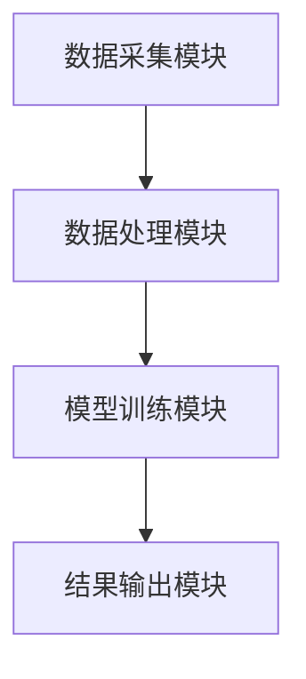
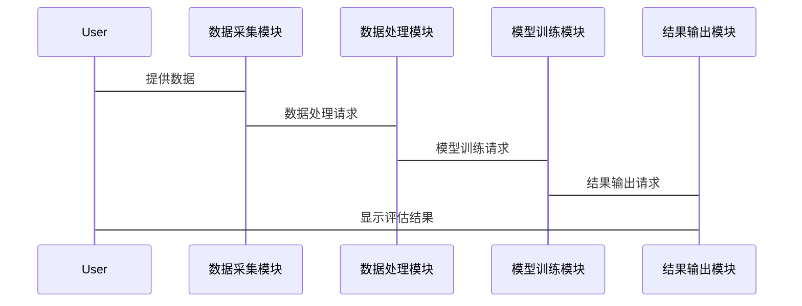

                 


# AI智能体在评估公司无形资产价值中的创新方法

## 关键词：AI智能体，无形资产，资产评估，机器学习，深度学习

## 摘要：随着人工智能技术的迅速发展，AI智能体在公司无形资产评估中的应用日益广泛。本文详细探讨了AI智能体在评估无形资产中的创新方法，分析了传统评估方法的局限性，并提出了基于机器学习和深度学习的新型评估模型。文章从背景介绍、核心概念、算法原理、系统架构设计、项目实战等方面进行了深入分析，并结合具体案例，展示了AI智能体在无形资产评估中的实际应用和优势。通过本文的研究，读者可以全面了解AI智能体在无形资产评估中的创新方法及其在企业中的应用前景。

---

# 第1章: 无形资产与AI智能体的背景介绍

## 1.1 无形资产的基本概念

### 1.1.1 无形资产的定义

无形资产是指企业拥有或控制的，没有实物形态的长期资产，通常包括专利权、商标权、版权、商誉、特许经营权等。这些资产的价值往往难以通过简单的财务指标来衡量，且受到市场环境、企业战略和管理等多种因素的影响。

### 1.1.2 无形资产的分类

无形资产可以分为以下几类：
- 知识产权类：包括专利权、商标权、版权等。
- 技术类：包括技术诀窍、技术秘密等。
- 商誉类：包括企业声誉、客户关系等。
- 其他类：如特许经营权、 franchise rights 等。

### 1.1.3 无形资产在企业中的重要性

无形资产是企业核心竞争力的重要组成部分，尤其是在高科技行业和服务业中，无形资产的价值往往远超过有形资产。无形资产的合理评估可以帮助企业制定科学的并购决策、优化资产配置、提高资本运作效率。

## 1.2 无形资产评估的传统方法

### 1.2.1 收益法

收益法是通过预测无形资产在未来带来的经济收益，折现后计算其现值的一种方法。其公式为：
$$
\text{无形资产价值} = \sum_{t=1}^{n} \frac{\text{未来收益}}{(1 + r)^t}
$$
其中，\( r \) 为折现率，\( n \) 为收益期限。

### 1.2.2 市场法

市场法是通过比较类似资产的市场交易价格，确定无形资产价值的一种方法。其核心是找到与被评估资产相似的交易案例，并进行适当的调整。

### 1.2.3 成本法

成本法是通过估算无形资产的重置成本，减去其贬值部分来确定其价值的一种方法。其公式为：
$$
\text{无形资产价值} = \text{重置成本} - \text{贬值}
$$

### 1.2.4 传统评估方法的局限性

传统评估方法通常依赖于历史数据和主观判断，难以捕捉无形资产的动态变化，尤其是在数据量大、复杂性高的情况下，传统方法往往显得力不从心。

---

# 第2章: AI智能体的基本概念

## 2.1 AI智能体的核心原理

AI智能体是一种能够感知环境、做出决策并采取行动的智能系统。其核心特点包括：
- **自主性**：能够自主决策，无需人工干预。
- **反应性**：能够实时感知环境变化并做出响应。
- **学习能力**：能够通过数据和经验不断优化自身的评估模型。

## 2.2 AI智能体在无形资产评估中的应用前景

### 2.2.1 数据驱动的优势

AI智能体能够处理海量数据，发现传统方法难以察觉的模式和趋势。例如，可以通过自然语言处理技术分析企业新闻、社交媒体数据等，评估企业的商誉价值。

### 2.2.2 高效性和准确性

AI智能体可以通过机器学习算法快速训练模型，实现对无形资产的精准评估。与传统方法相比，AI智能体的评估结果更加客观和准确。

---

# 第3章: AI智能体在无形资产评估中的创新方法

## 3.1 数据预处理与特征工程

### 3.1.1 数据清洗与标准化

在评估无形资产时，首先需要对数据进行清洗和标准化处理。例如，去除异常值、填充缺失值，并将数据归一化或标准化。

### 3.1.2 特征提取与降维

通过主成分分析（PCA）等技术，可以将高维数据降维，提取最具代表性的特征。

## 3.2 机器学习模型的选择与训练

### 3.2.1 线性回归模型

线性回归模型适用于线性关系较强的场景。其目标函数为：
$$
\text{最小化} \sum_{i=1}^{n} (y_i - \hat{y}_i)^2
$$

### 3.2.2 支持向量机（SVM）

支持向量机适用于非线性分类和回归问题。其核心思想是通过构建超平面将数据点分隔开。

### 3.2.3 神经网络模型

神经网络模型适用于复杂的非线性关系。其结构包括输入层、隐藏层和输出层，可以通过反向传播算法进行训练。

## 3.3 深度学习模型的应用

### 3.3.1 卷积神经网络（CNN）

卷积神经网络适用于图像和文本数据的处理，可以用于分析企业的新闻、专利等文本数据，提取潜在的价值信息。

### 3.3.2 循环神经网络（RNN）

循环神经网络适用于时间序列数据的处理，可以用于分析企业的财务数据和市场趋势。

---

# 第4章: 系统架构设计与实现

## 4.1 系统功能设计

### 4.1.1 数据采集模块

数据采集模块负责收集企业的财务数据、市场数据、专利数据等。

### 4.1.2 数据处理模块

数据处理模块负责对采集到的数据进行清洗、转换和特征提取。

### 4.1.3 模型训练模块

模型训练模块负责选择合适的机器学习模型，并进行训练和优化。

### 4.1.4 结果输出模块

结果输出模块负责将评估结果以可视化的方式呈现。

## 4.2 系统架构设计

### 4.2.1 系统架构图



### 4.2.2 系统交互图



---

# 第5章: 项目实战与案例分析

## 5.1 环境安装与配置

### 5.1.1 安装Python环境

需要安装Python 3.8及以上版本，并安装以下库：
```
pip install numpy pandas scikit-learn tensorflow
```

### 5.1.2 数据集准备

数据集包括企业的财务数据、市场数据和专利数据等。

## 5.2 核心代码实现

### 5.2.1 数据预处理代码

```python
import pandas as pd
import numpy as np

# 读取数据
data = pd.read_csv('assets.csv')

# 数据清洗
data.dropna(inplace=True)
data = data[~data['value'].isnull()]

# 特征提取
X = data.drop('value', axis=1)
y = data['value']
```

### 5.2.2 模型训练代码

```python
from sklearn.model_selection import train_test_split
from sklearn.ensemble import RandomForestRegressor
from sklearn.metrics import mean_squared_error

# 数据分割
X_train, X_test, y_train, y_test = train_test_split(X, y, test_size=0.2)

# 模型训练
model = RandomForestRegressor()
model.fit(X_train, y_train)

# 模型评估
y_pred = model.predict(X_test)
print(mean_squared_error(y_test, y_pred))
```

## 5.3 案例分析

以某科技公司为例，通过AI智能体评估其专利价值。首先收集企业的专利数据、财务数据和市场数据，然后进行数据清洗和特征提取，最后训练随机森林回归模型，预测专利价值。

---

# 第6章: 最佳实践与小结

## 6.1 最佳实践

- 数据质量是评估结果的关键，需要确保数据的准确性和完整性。
- 在选择模型时，应根据具体场景和数据特点进行选择。
- 定期更新模型，以适应市场环境的变化。

## 6.2 小结

本文详细探讨了AI智能体在评估公司无形资产价值中的创新方法，分析了传统评估方法的局限性，并提出了基于机器学习和深度学习的新型评估模型。通过具体的案例分析和系统架构设计，展示了AI智能体在无形资产评估中的实际应用和优势。

---

通过本文的研究，读者可以全面了解AI智能体在无形资产评估中的创新方法，为企业在无形资产管理中提供有价值的参考。

