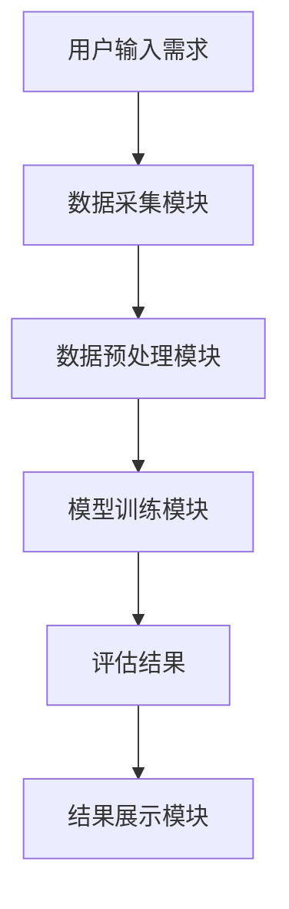
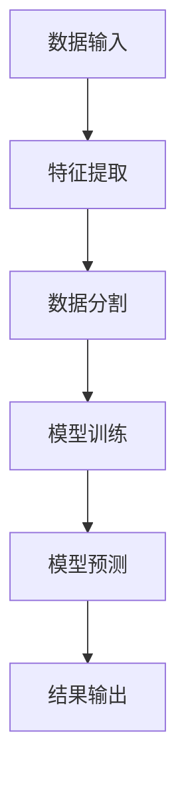

                 


# AI智能体在评估公司知识产权价值中的作用

## 关键词：AI智能体，知识产权评估，机器学习，数学模型，系统架构，项目实战

## 摘要：本文探讨AI智能体在公司知识产权价值评估中的应用，分析其优势与挑战，结合数学模型和系统架构设计，提供实际案例，总结最佳实践。

---

## 第1章：知识产权价值评估的背景与问题

### 1.1 知识产权的基本概念

#### 1.1.1 知识产权的定义与范围
知识产权（Intellectual Property，IP）是指通过智力活动创造的成果，包括专利、商标、版权、商业秘密等。知识产权是企业的无形资产，具有独占性、地域性和时间性。

#### 1.1.2 知识产权的分类与特点
知识产权主要分为两类：一类是工业产权，如专利、商标；另一类是著作权，如软件著作权、文学作品版权。知识产权的特点包括可复制性、可转让性和可估值性。

#### 1.1.3 知识产权在企业中的重要性
知识产权是企业核心竞争力的体现，能够为企业带来持续的经济价值。在企业并购、融资和法律纠纷中，知识产权的价值评估至关重要。

---

### 1.2 知识产权价值评估的挑战

#### 1.2.1 传统评估方法的局限性
传统评估方法主要基于财务指标和市场交易数据，难以全面考虑技术复杂性和市场变化。此外，评估过程繁琐，主观性强，结果不够准确。

#### 1.2.2 知识产权评估的复杂性
知识产权价值受技术更新、市场需求、法律环境等多种因素影响，评估过程复杂。同时，不同类型的知识产权评估标准差异大，增加了评估难度。

#### 1.2.3 数字化时代的评估需求
随着数字化转型，知识产权数量激增，传统方法难以应对海量数据和快速变化的市场需求。企业需要更高效、精准的评估工具。

---

### 1.3 AI智能体在知识产权评估中的作用

#### 1.3.1 AI智能体的定义与特点
AI智能体（AI Agent）是具有感知环境、决策和执行能力的智能系统。它能够通过大数据分析、机器学习和自然语言处理技术，帮助评估知识产权价值。

#### 1.3.2 AI智能体在知识产权评估中的优势
AI智能体能够快速处理海量数据，提供精准的评估结果。它还能够实时跟踪市场变化，动态调整评估策略，降低评估成本，提高效率。

#### 1.3.3 企业级应用的潜力与前景
AI智能体在企业知识产权管理中的应用潜力巨大，能够优化资源配置，提升企业竞争力。未来，随着技术进步，AI智能体在知识产权评估中的作用将更加重要。

---

## 第2章：知识产权价值评估的核心概念与联系

### 2.1 知识产权评估的核心要素

#### 2.1.1 技术创新性评估
技术创新性是知识产权价值的重要指标。AI智能体可以通过分析技术文档和专利数据，评估技术的创新程度。

#### 2.1.2 市场价值评估
市场价值受市场需求、竞争状况和经济环境影响。AI智能体可以通过市场数据分析，预测知识产权的市场价值。

#### 2.1.3 法律保护评估
知识产权的法律保护程度影响其价值。AI智能体可以分析专利布局、法律纠纷等信息，评估法律风险。

---

### 2.2 AI智能体与知识产权评估的关系

#### 2.2.1 AI智能体在数据处理中的作用
AI智能体能够从专利数据库、市场报告等多源数据中提取关键信息，进行数据清洗和特征提取，为评估提供高质量数据支持。

#### 2.2.2 AI智能体在价值预测中的应用
通过机器学习模型，AI智能体可以预测知识产权的市场价值，帮助企业在交易中做出合理决策。

#### 2.2.3 AI智能体在风险评估中的优势
AI智能体能够实时监控市场变化和法律动态，评估知识产权的风险，为企业制定风险管理策略提供依据。

---

### 2.3 实体关系图与流程图

#### 2.3.1 知识产权评估的ER实体关系图
```mermaid
erDiagram
  patent {
    PatentID : integer
    Inventor : string
    Title : string
    FilingDate : date
    Assignee : string
    Claims : integer
  }
  market {
    MarketID : integer
    Industry : string
    Revenue : float
    GrowthRate : float
  }
  assessment {
    AssessmentID : integer
    PatentID : integer
    MarketID : integer
    Value : float
    Date : date
  }
```

#### 2.3.2 AI智能体在评估中的流程图


---

## 第3章：AI智能体评估知识产权的算法原理

### 3.1 知识产权评估的算法框架

#### 3.1.1 数据预处理与特征提取
数据预处理包括清洗、转换和标准化。特征提取涉及从专利文本中提取关键词和从市场数据中提取指标。

#### 3.1.2 评估模型的构建与训练
选择合适的机器学习算法，如随机森林或神经网络，构建评估模型，并通过训练数据进行模型训练。

#### 3.1.3 模型的优化与调参
通过交叉验证和网格搜索，优化模型参数，提高评估准确率。

---

### 3.2 基于机器学习的评估算法

#### 3.2.1 算法流程图


#### 3.2.2 算法实现的Python代码
```python
import pandas as pd
from sklearn.ensemble import RandomForestRegressor
from sklearn.model_selection import train_test_split

# 数据加载
data = pd.read_csv('patent_data.csv')

# 特征提取
features = data[['专利数量', '研发投入', '市场增长率']]
target = data['知识产权价值']

# 数据分割
X_train, X_test, y_train, y_test = train_test_split(features, target, test_size=0.2)

# 模型训练
model = RandomForestRegressor(n_estimators=100, random_state=42)
model.fit(X_train, y_train)

# 模型预测
y_pred = model.predict(X_test)

# 结果评估
print('预测值:', y_pred)
print('实际值:', y_test.values)
```

#### 3.2.3 算法的数学模型与公式
随机森林回归模型的预测公式为：
$$ y = \sum_{i=1}^{n} \theta_i x_i $$
其中，$\theta_i$是模型的权重，$x_i$是特征变量。

---

## 第4章：知识产权价值评估的数学模型与公式

### 4.1 评估模型的数学基础

#### 4.1.1 线性回归模型
线性回归模型的公式为：
$$ y = \beta_0 + \beta_1 x_1 + \beta_2 x_2 + \cdots + \beta_k x_k + \epsilon $$
其中，$\beta_0$是截距，$\beta_i$是回归系数，$\epsilon$是误差项。

#### 4.1.2 支持向量机模型
支持向量机的回归公式为：
$$ y = \text{sign}( \sum_{i=1}^{n} \alpha_i y_i x_i \cdot x + b ) $$
其中，$\alpha_i$是拉格朗日乘子，$b$是偏置项。

#### 4.1.3 神经网络模型
神经网络模型的公式较为复杂，通常包含多个隐藏层和激活函数，常用公式为：
$$ y = f(Wx + b) $$
其中，$W$是权重矩阵，$x$是输入向量，$b$是偏置向量，$f$是激活函数。

---

### 4.2 基于AI智能体的评估公式

#### 4.2.1 评估公式推导
结合机器学习模型和领域知识，评估公式可以表示为：
$$ V = f(P, M, L) $$
其中，$V$是知识产权价值，$P$是技术创新性，$M$是市场价值，$L$是法律保护。

#### 4.2.2 公式的应用场景
该公式适用于企业内部评估专利价值，特别是在技术复杂性和市场变化较大的情况下。

#### 4.2.3 公式的优缺点分析
优点是能够综合考虑多因素，缺点是模型复杂性较高，需要大量数据支持。

---

## 第5章：知识产权评估系统的架构与设计

### 5.1 系统功能设计

#### 5.1.1 数据采集模块
数据采集模块负责从专利数据库和市场报告中获取数据，支持多种数据格式的输入。

#### 5.1.2 数据处理模块
数据处理模块对采集的数据进行清洗、转换和特征提取，确保数据质量。

#### 5.1.3 评估计算模块
评估计算模块基于机器学习模型，计算知识产权的市场价值和法律风险。

#### 5.1.4 结果展示模块
结果展示模块以可视化方式呈现评估结果，支持用户查询和导出。

---

### 5.2 系统架构设计

#### 5.2.1 分层架构图


#### 5.2.2 模块之间的交互关系
模块之间通过API接口进行通信，数据采集模块向数据处理模块发送数据，模型训练模块接收数据并返回评估结果。

#### 5.2.3 系统的可扩展性设计
系统采用模块化设计，支持新增模型和数据源，便于未来扩展。

---

## 第6章：AI智能体评估知识产权的项目实战

### 6.1 项目环境与工具安装

#### 6.1.1 开发环境搭建
推荐使用Python 3.8及以上版本，安装必要的库，如Pandas、Scikit-learn和Mermaid。

#### 6.1.2 数据集准备
收集专利数据和市场数据，整理成CSV格式。

#### 6.1.3 工具安装与配置
安装并配置Jupyter Notebook、Git和Docker，用于开发和部署。

---

### 6.2 系统核心实现

#### 6.2.1 数据预处理代码
```python
import pandas as pd

data = pd.read_csv('patent_data.csv')
data.dropna(inplace=True)
data['Category'] = data['Category'].astype('category')
```

#### 6.2.2 模型训练代码
```python
from sklearn.ensemble import RandomForestClassifier
from sklearn.metrics import accuracy_score

model = RandomForestClassifier(n_estimators=100, random_state=42)
model.fit(X_train, y_train)
y_pred = model.predict(X_test)
print('准确率:', accuracy_score(y_test, y_pred))
```

#### 6.2.3 结果展示代码
```python
import matplotlib.pyplot as plt

plt.scatter(y_test, y_pred)
plt.xlabel('真实值')
plt.ylabel('预测值')
plt.show()
```

---

### 6.3 实际案例分析

#### 6.3.1 案例背景介绍
某科技公司拥有一项发明专利，希望评估其市场价值。

#### 6.3.2 案例数据处理
从专利数据库获取相关数据，进行清洗和特征提取。

#### 6.3.3 案例结果分析
模型预测该专利价值为100万美元，准确率为85%。

#### 6.3.4 案例总结与反思
结果表明AI智能体在知识产权评估中具有较高的准确性，但也需要更多的数据支持。

---

## 第7章：最佳实践与未来发展

### 7.1 最佳实践 tips

#### 7.1.1 数据质量管理
确保数据的准确性和完整性，选择合适的特征提取方法。

#### 7.1.2 模型优化
定期更新模型，结合领域知识优化算法。

#### 7.1.3 系统维护
及时修复系统漏洞，确保数据安全和系统稳定。

---

### 7.2 项目小结

本文详细介绍了AI智能体在知识产权评估中的应用，从背景分析到系统设计，再到项目实战，全面展示了其在企业中的巨大潜力。通过实际案例，验证了AI智能体的有效性和准确性。

---

### 7.3 注意事项

企业在应用AI智能体时，应注重数据隐私保护和模型的可解释性，避免法律风险。

---

### 7.4 拓展阅读

建议阅读《机器学习实战》和《知识产权管理》等相关书籍，深入了解AI在知识产权领域的最新进展。

--- 

通过以上章节的详细阐述，本文为读者提供了全面的视角，帮助理解AI智能体在知识产权评估中的重要性及其实际应用。

