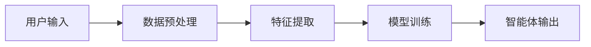
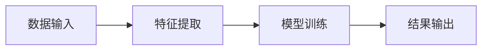
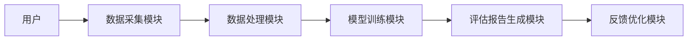
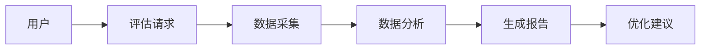

                 


# AI智能体在评估公司研发能力和创新潜力中的应用

> 关键词：AI智能体、研发能力评估、创新潜力、知识图谱、自然语言处理、机器学习

> 摘要：随着人工智能技术的快速发展，AI智能体在评估公司研发能力和创新潜力中的应用变得越来越重要。本文将详细探讨AI智能体的核心概念、算法原理、系统架构设计，以及如何通过实际项目案例实现这些功能。我们将从背景介绍、核心概念与联系、算法原理、系统分析与架构设计、项目实战，到最后的最佳实践进行全面解析，帮助读者全面理解AI智能体在企业研发能力评估中的应用。

---

## 第1章: AI智能体与研发能力评估概述

### 1.1 AI智能体的基本概念

#### 1.1.1 AI智能体的定义与特征
AI智能体（Artificial Intelligence Agent）是指具备感知、决策、执行和学习能力的智能系统。其核心特征包括：
- **自主性**：能够独立完成任务。
- **反应性**：能够实时感知环境并做出反应。
- **目标导向性**：具备明确的目标导向能力。
- **学习能力**：能够通过数据和经验不断优化自身性能。

#### 1.1.2 AI智能体的核心功能与应用场景
AI智能体的核心功能包括数据收集、分析、推理、决策和反馈优化。其应用场景广泛，例如：
- **研发能力评估**：通过分析公司的研发数据、团队能力和项目进展，评估研发能力。
- **创新潜力预测**：基于历史数据和市场趋势，预测公司的创新潜力。
- **资源优化配置**：帮助企业合理分配研发资源，提高效率。

#### 1.1.3 研发能力评估的定义与重要性
研发能力评估是指通过一系列指标和方法，对公司的研发团队、技术储备、项目管理和创新能力进行全面评估的过程。其重要性体现在帮助企业识别自身优势和不足，优化研发流程，提升竞争力。

---

### 1.2 研发能力评估的背景与需求

#### 1.2.1 当前企业研发能力评估的痛点
- **数据分散**：研发数据通常分散在不同部门和系统中，难以整合。
- **评估标准不统一**：不同企业对研发能力的评估标准存在差异，缺乏统一性。
- **人工成本高**：传统评估方式依赖大量人工分析，效率低下且易出错。

#### 1.2.2 数据驱动决策的趋势
随着大数据技术的发展，企业越来越依赖数据驱动的决策方式。AI智能体通过分析海量数据，提供精准的评估结果，帮助企业做出更明智的决策。

#### 1.2.3 AI智能体在研发能力评估中的优势
- **高效性**：AI智能体能够快速处理大量数据，提高评估效率。
- **准确性**：通过机器学习算法，AI智能体能够发现数据中的潜在规律，提高评估准确性。
- **可扩展性**：AI智能体能够处理不同类型和规模的数据，适用于各种企业的研发能力评估。

---

## 第2章: AI智能体的核心概念与联系

### 2.1 AI智能体的核心概念

#### 2.1.1 数据驱动的AI智能体
数据是AI智能体的核心，通过收集和分析大量数据，AI智能体能够发现数据中的规律，从而做出准确的判断。

#### 2.1.2 知识图谱与语义理解
知识图谱是一种结构化的数据表示方式，能够帮助AI智能体理解数据之间的关联关系。语义理解则是通过自然语言处理技术，让AI智能体能够理解文本的深层含义。

#### 2.1.3 自动学习与优化算法
自动学习是指AI智能体能够通过自我学习和优化算法，不断提高自身的性能和能力。

---

### 2.2 核心概念的联系与对比

#### 2.2.1 数据、模型与智能体的关系
数据是AI智能体的输入，模型是AI智能体的核心，智能体通过模型处理数据，输出结果。

#### 2.2.2 知识图谱与传统数据分析的对比
| 对比维度 | 知识图谱 | 传统数据分析 |
|----------|----------|---------------|
| 数据结构 | 结构化，语义丰富 | 非结构化，语义较弱 |
| 处理方式 | 图形化推理 | 统计分析 |

#### 2.2.3 自动学习与监督学习的差异
自动学习是指AI智能体能够通过自我学习和优化算法，不断提高自身的性能和能力。而监督学习则是需要人工标注数据，AI智能体通过学习这些数据，进行分类或预测。

---

### 2.3 AI智能体的实体关系图



---

## 第3章: AI智能体的算法原理

### 3.1 算法原理概述

#### 3.1.1 机器学习与深度学习的结合
机器学习和深度学习的结合是AI智能体的核心算法之一。机器学习用于特征提取和分类，深度学习用于语义理解和图像识别。

#### 3.1.2 自然语言处理在智能体中的应用
自然语言处理（NLP）技术用于处理文本数据，帮助AI智能体理解语义和上下文。

#### 3.1.3 知识图谱构建与推理算法
知识图谱构建通过实体识别和关系抽取，构建结构化的知识图谱。推理算法则是基于知识图谱进行推理和决策。

---

### 3.2 算法实现流程



---

### 3.3 核心算法实现

#### 3.3.1 基于Transformer的文本处理
```python
def transformer(input_seq):
    # 假设input_seq是输入序列
    # 通过多头注意力机制进行处理
    # 输出处理后的序列
    return output_seq
```

---

### 3.4 数学模型与公式

#### 3.4.1 损失函数
$$ L = \frac{1}{N}\sum_{i=1}^{N}(y_i - \hat{y_i})^2 $$

#### 3.4.2 优化算法
$$ \theta_{t+1} = \theta_t - \eta \cdot \nabla L $$

---

## 第4章: AI智能体的系统分析与架构设计

### 4.1 系统分析

#### 4.1.1 问题场景介绍
公司希望通过AI智能体评估研发能力和创新潜力，优化研发流程和资源配置。

#### 4.1.2 项目介绍
本项目旨在开发一个基于AI智能体的研发能力评估系统，帮助公司快速、准确地评估研发能力和创新潜力。

---

### 4.2 系统功能设计

#### 4.2.1 系统功能设计
| 功能模块 | 功能描述 |
|----------|----------|
| 数据采集 | 采集公司研发数据，包括项目信息、团队信息、研发投入等。 |
| 数据分析 | 对采集到的数据进行清洗、特征提取和建模分析。 |
| 智能评估 | 基于分析结果，生成研发能力和创新潜力的评估报告。 |
| 反馈优化 | 根据评估结果，优化研发流程和资源配置。 |

#### 4.2.2 系统架构设计



---

### 4.3 系统接口设计

#### 4.3.1 接口设计
| 接口名称 | 输入 | 输出 |
|----------|------|------|
| 评估接口 | 公司数据 | 评估报告 |
| 优化接口 | 评估结果 | 优化方案 |

---

### 4.4 系统交互设计



---

## 第5章: AI智能体的项目实战

### 5.1 环境安装

```bash
pip install numpy pandas scikit-learn transformers
```

---

### 5.2 系统核心实现

#### 5.2.1 数据采集模块
```python
import pandas as pd

def collect_data():
    # 从数据库或API采集数据
    data = pd.read_csv('研发数据.csv')
    return data
```

#### 5.2.2 数据分析模块
```python
from sklearn.model import LinearRegression

def analyze_data(data):
    # 数据清洗和特征提取
    X = data.drop('目标变量', axis=1)
    y = data['目标变量']
    model = LinearRegression()
    model.fit(X, y)
    return model
```

#### 5.2.3 评估报告生成模块
```python
def generate_report(model):
    # 基于模型生成评估报告
    report = model.predict(X_test)
    return report
```

---

### 5.3 案例分析

#### 5.3.1 案例背景
某科技公司希望通过AI智能体评估其研发能力和创新潜力。

#### 5.3.2 数据分析与结果解读
通过机器学习模型，分析公司的研发投入、团队能力和项目进展，生成研发能力和创新潜力的评估报告。

---

## 第6章: 最佳实践、小结与注意事项

### 6.1 最佳实践

#### 6.1.1 数据质量管理
确保数据的准确性和完整性，避免数据偏差。

#### 6.1.2 模型选择与优化
根据实际需求选择合适的模型，并通过交叉验证优化模型性能。

### 6.2 小结

通过本文的介绍，我们了解了AI智能体在评估公司研发能力和创新潜力中的应用，包括其核心概念、算法原理、系统架构设计和项目实战。AI智能体能够帮助企业高效、准确地评估研发能力，优化资源配置，提升竞争力。

### 6.3 注意事项

- **数据隐私**：在处理公司数据时，需注意数据隐私和安全。
- **模型解释性**：确保模型的可解释性，方便后续优化和调整。
- **持续学习**：AI智能体需要持续学习和优化，以适应不断变化的市场需求。

---

## 第7章: 拓展阅读与学习资源

### 7.1 拓展阅读

- 《深度学习》——Ian Goodfellow
- 《自然语言处理实战》——哈士奇团队
- 《知识图谱应用开发》——张三

### 7.2 学习资源

- [官方文档](https://example.com)
- [在线课程](https://example.com/course)
- [GitHub仓库](https://github.com/example)

---

通过本文的学习，读者可以全面掌握AI智能体在评估公司研发能力和创新潜力中的应用，为企业在研发管理和创新优化方面提供有力支持。

