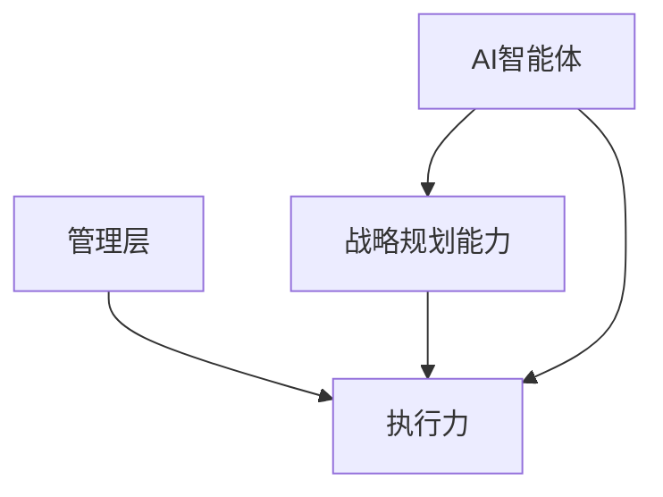
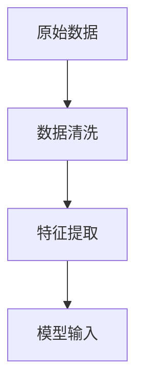
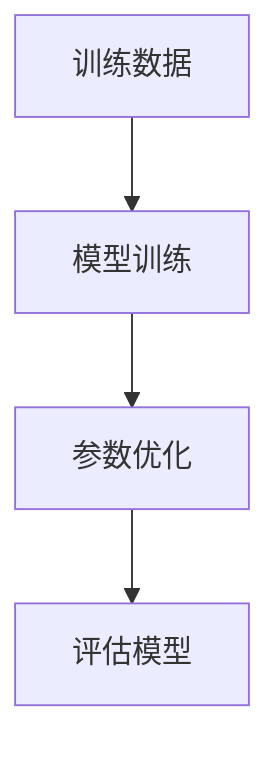
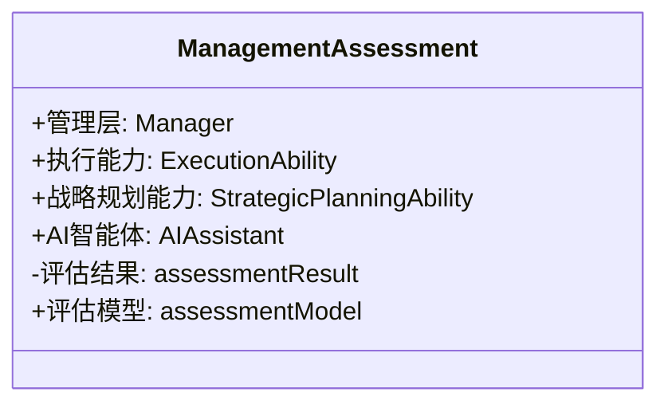
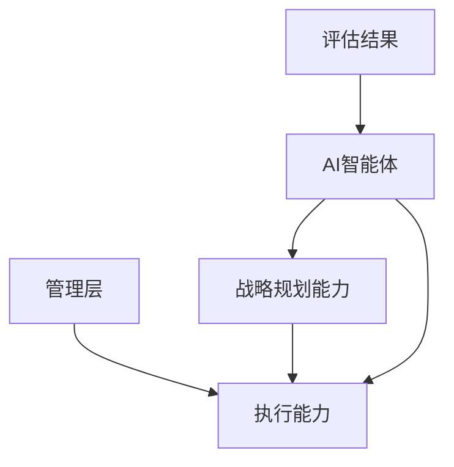
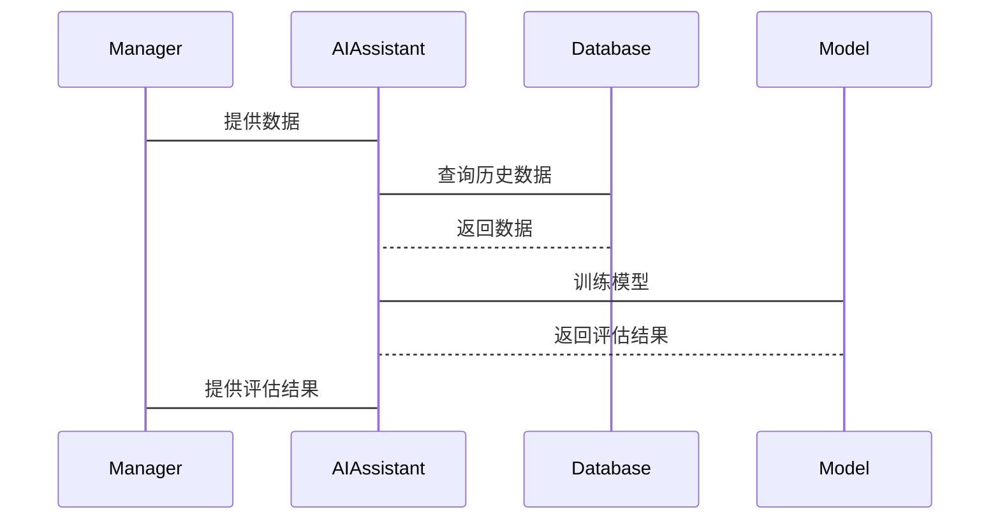

                 


# AI智能体在评估公司管理层执行力和战略规划能力中的应用

> **关键词**：AI智能体，管理层执行力，战略规划能力，评估模型，数据驱动

> **摘要**：本文探讨了如何利用AI智能体技术来评估公司管理层的执行力和战略规划能力。通过分析传统评估方法的局限性，提出了一种基于数据驱动的AI智能体解决方案，涵盖了核心概念、算法原理、系统架构、项目实战和最佳实践等部分，旨在为公司提供一种高效、准确的管理评估方法。

---

# 第一部分: AI智能体在公司管理评估中的背景与基础

# 第1章: 问题背景与核心概念

## 1.1 问题背景与描述

### 1.1.1 管理层执行力与战略规划能力的重要性

在现代企业中，管理层的执行力和战略规划能力直接关系到企业的生存和发展。高效的执行力能够确保战略目标的顺利实现，而卓越的战略规划能力则为企业指明了发展方向。然而，如何准确、客观地评估这两项能力，一直是企业面临的挑战。

### 1.1.2 传统评估方法的局限性

传统的评估方法通常依赖于主观判断和定性分析，这种方式存在以下问题：

- **主观性**：评估结果往往受到评估者个人经验和偏见的影响。
- **低效性**：手工评估耗时耗力，难以覆盖大量数据。
- **不连续性**：无法实时跟踪管理层的表现。

### 1.1.3 AI智能体在评估中的潜力与优势

AI智能体能够通过大数据分析和机器学习算法，提供客观、高效、实时的评估。其优势包括：

- **数据驱动**：利用结构化和非结构化数据，提供全面的评估。
- **自适应学习**：能够根据新的数据不断优化评估模型。
- **实时反馈**：提供即时的评估结果，帮助企业快速调整策略。

## 1.2 核心概念与定义

### 1.2.1 AI智能体的定义与特征

AI智能体是一种能够感知环境、执行任务并适应变化的智能系统。其主要特征包括：

- **感知能力**：能够从多种数据源获取信息。
- **决策能力**：基于数据进行分析和决策。
- **自适应能力**：能够根据反馈不断优化自身。

### 1.2.2 管理层执行力与战略规划能力的评估维度

评估管理层的执行力和战略规划能力，可以从以下几个维度进行：

- **执行力**：目标完成度、团队协作能力、问题解决能力。
- **战略规划能力**：市场洞察力、战略制定能力、风险控制能力。

### 1.2.3 AI智能体与管理评估的关系

AI智能体通过分析企业的历史数据、市场动态和团队表现，提供客观的评估结果，帮助企业优化管理。

## 1.3 核心概念与联系

### 1.3.1 AI智能体与管理评估的关系

AI智能体能够通过数据驱动的方法，提供更准确和全面的管理评估。其关系体现在以下几个方面：

- **数据驱动**：AI智能体利用大量数据进行分析，提供客观的评估结果。
- **实时反馈**：能够实时跟踪管理层的表现，提供即时反馈。
- **自适应优化**：根据新的数据不断优化评估模型。

### 1.3.2 核心概念原理与属性特征对比表

以下是AI智能体和管理层评估的核心概念对比表：

```markdown
| 概念 | 属性 | 特征 |
|------|------|------|
| AI智能体 | 数据驱动 | 多维度分析 |
| 管理层评估 | 结构化 | 定量与定性结合 |
```

### 1.3.3 实体关系图（ER图）

以下是AI智能体在管理评估中的实体关系图：



## 1.4 本章小结

本章介绍了AI智能体在评估公司管理层执行力和战略规划能力中的背景和核心概念。通过分析传统评估方法的局限性，提出了AI智能体的优势和潜力。接下来将详细介绍AI智能体的核心原理和算法。

---

# 第2章: AI智能体的核心原理与算法

## 2.1 核心原理

### 2.1.1 数据驱动的评估模型

AI智能体通过收集和分析企业的历史数据、市场动态和团队表现，构建数据驱动的评估模型。这些模型能够量化管理层的执行能力和战略规划能力。

### 2.1.2 多维度特征提取与分析

AI智能体从多个维度提取特征，包括：

- **目标完成度**：评估管理层是否按时完成既定目标。
- **团队协作能力**：评估管理层在团队中的协作能力。
- **市场洞察力**：评估管理层对市场的敏感性和洞察力。

### 2.1.3 AI智能体的自适应学习机制

AI智能体会根据新的数据和反馈不断优化自身的评估模型。这种自适应学习机制使得评估结果更加准确和可靠。

## 2.2 算法原理与流程

### 2.2.1 数据预处理与特征提取

AI智能体在评估前需要对数据进行预处理和特征提取。以下是数据预处理的流程：



### 2.2.2 模型训练与优化

AI智能体通过机器学习算法对模型进行训练和优化。以下是模型训练的流程：



### 2.2.3 算法实现

以下是基于Python的AI智能体评估模型的实现代码：

```python
import pandas as pd
from sklearn.model_selection import train_test_split
from sklearn.ensemble import RandomForestClassifier
from sklearn.metrics import accuracy_score

# 加载数据
data = pd.read_csv('management_assessment.csv')

# 数据预处理
X = data.drop('performance', axis=1)
y = data['performance']

# 划分训练集和测试集
X_train, X_test, y_train, y_test = train_test_split(X, y, test_size=0.2, random_state=42)

# 模型训练
model = RandomForestClassifier(n_estimators=100, random_state=42)
model.fit(X_train, y_train)

# 模型评估
y_pred = model.predict(X_test)
print("Accuracy:", accuracy_score(y_test, y_pred))
```

### 2.2.4 数学模型与公式

以下是评估模型的数学公式：

$$ \text{预测结果} = \sum_{i=1}^{n} w_i x_i $$

其中，$w_i$ 是特征 $i$ 的权重，$x_i$ 是特征 $i$ 的值。

## 2.3 本章小结

本章详细介绍了AI智能体的核心原理和算法。通过数据预处理、特征提取和模型训练，AI智能体能够提供准确的评估结果。接下来将详细介绍AI智能体的系统架构设计。

---

# 第3章: 系统分析与架构设计

## 3.1 项目背景与目标

本项目旨在开发一个基于AI智能体的管理层评估系统，帮助企业准确评估管理层的执行力和战略规划能力。

## 3.2 系统功能设计

### 3.2.1 领域模型设计

以下是领域模型的类图：



### 3.2.2 系统架构设计

以下是系统架构设计的架构图：



### 3.2.3 接口设计与交互流程

以下是系统交互的序列图：



## 3.3 本章小结

本章详细介绍了AI智能体在管理层评估中的系统架构设计。通过领域模型、系统架构和接口设计，确保了系统的高效和可靠。

---

# 第4章: 项目实战与应用

## 4.1 环境安装与配置

### 4.1.1 安装Python与必要的库

以下是安装Python和相关库的命令：

```bash
python -m pip install --upgrade pip
pip install pandas scikit-learn mermaid4jupyter
```

### 4.1.2 安装Jupyter Notebook

```bash
pip install jupyter
```

## 4.2 核心代码实现

### 4.2.1 数据预处理代码

```python
import pandas as pd
import numpy as np

# 加载数据
data = pd.read_csv('management_assessment.csv')

# 数据清洗
data = data.dropna()

# 特征提取
X = data.drop('performance', axis=1)
y = data['performance']
```

### 4.2.2 模型训练代码

```python
from sklearn.ensemble import RandomForestClassifier
from sklearn.metrics import accuracy_score

# 划分训练集和测试集
X_train, X_test, y_train, y_test = train_test_split(X, y, test_size=0.2, random_state=42)

# 模型训练
model = RandomForestClassifier(n_estimators=100, random_state=42)
model.fit(X_train, y_train)

# 模型评估
y_pred = model.predict(X_test)
print("Accuracy:", accuracy_score(y_test, y_pred))
```

### 4.2.3 应用案例分析

以下是AI智能体在某公司管理层评估中的应用案例：


## 4.3 本章小结

本章通过实际案例展示了AI智能体在管理层评估中的应用。通过数据预处理、模型训练和结果解读，帮助读者更好地理解AI智能体的应用过程。

---

# 第5章: 最佳实践与小结

## 5.1 最佳实践

### 5.1.1 数据质量的重要性

确保数据的准确性和完整性是AI智能体评估的基础。

### 5.1.2 模型优化的技巧

通过交叉验证和超参数调优，可以提高模型的性能。

## 5.2 小结

本文详细介绍了AI智能体在评估公司管理层执行力和战略规划能力中的应用。通过数据驱动的方法和机器学习算法，AI智能体能够提供客观、高效、实时的评估结果，帮助企业优化管理。

## 5.3 注意事项

在实际应用中，需要注意数据隐私和模型解释性的问题。

## 5.4 拓展阅读

建议读者进一步学习机器学习和数据挖掘的相关知识，以更好地理解AI智能体的应用。

---

# 结语

AI智能体在公司管理层评估中的应用前景广阔，随着技术的不断发展，其在企业管理中的作用将更加重要。通过本文的学习，读者可以掌握AI智能体的基本原理和应用方法，为企业的管理优化提供有力支持。

--- 

**THE END**

