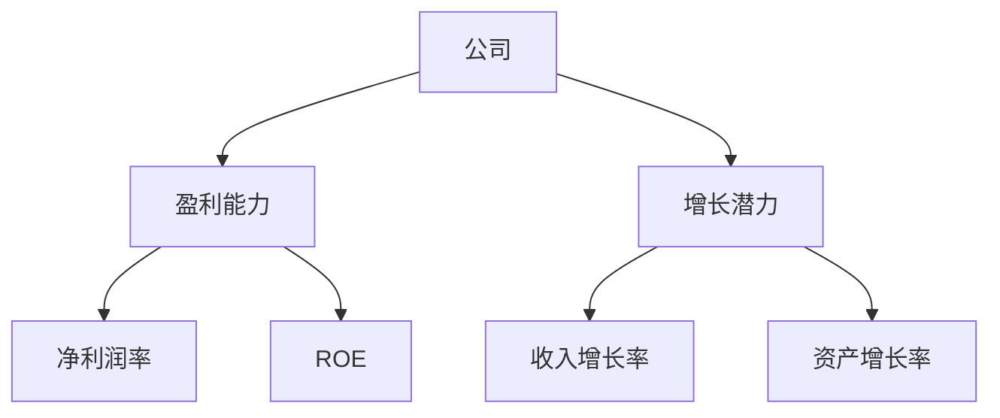
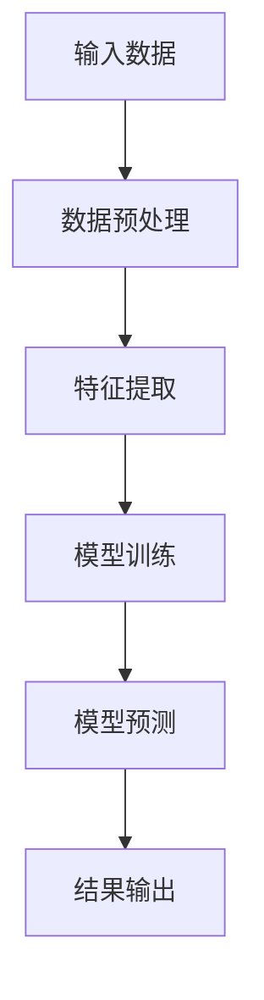
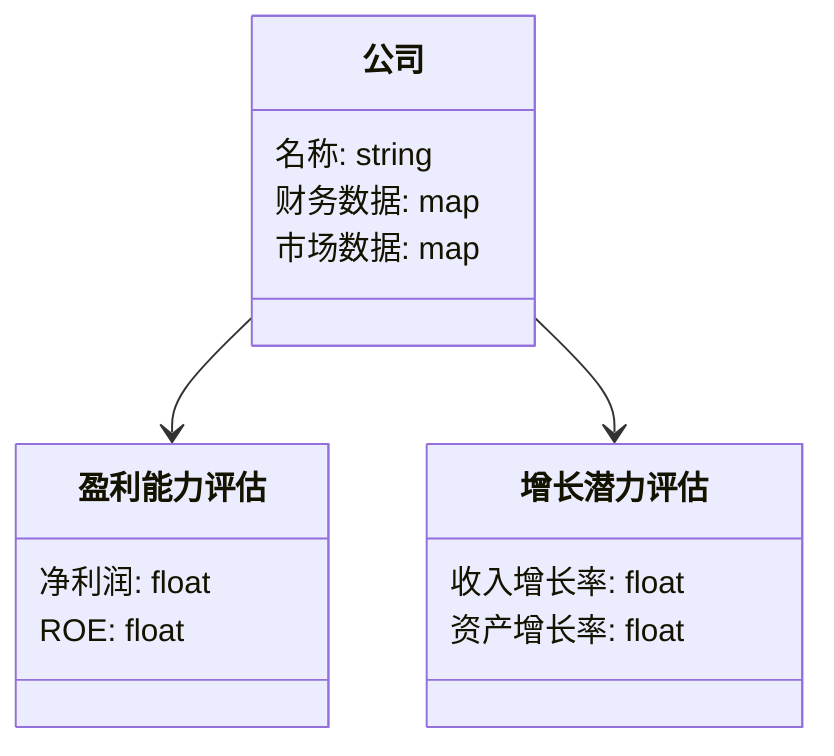
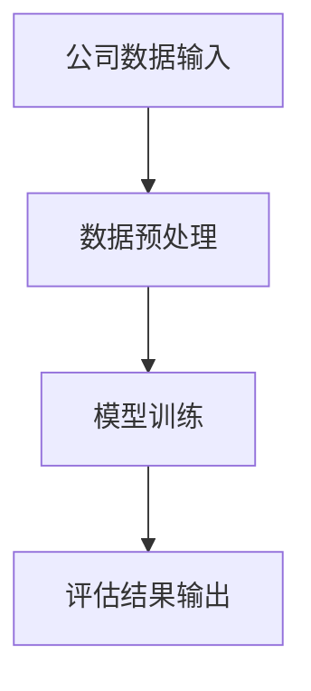
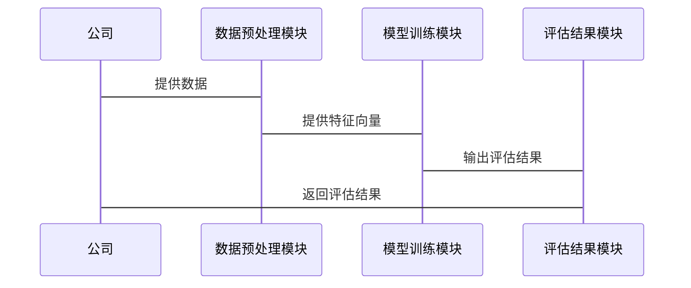

                 


# AI智能体在评估公司长期盈利能力和增长潜力中的应用

## 关键词：AI智能体，长期盈利能力，增长潜力，公司评估，机器学习，数据驱动

## 摘要：  
本文探讨了AI智能体在评估公司长期盈利能力和增长潜力中的应用，分析了其在传统评估方法中的优势与挑战，详细阐述了基于机器学习的评估模型和算法原理，并通过实际案例展示了AI智能体在公司评估中的实际应用价值。

---

# 第1章: AI智能体与公司评估概述

## 1.1 AI智能体的基本概念

### 1.1.1 AI智能体的定义  
AI智能体（Artificial Intelligence Agent）是指能够感知环境、做出决策并采取行动以实现目标的智能系统。它具备学习、推理、规划和自适应能力，能够在复杂环境中优化决策过程。

### 1.1.2 AI智能体的核心特征  
- **自主性**：能够独立感知环境并采取行动。  
- **反应性**：能够实时响应环境变化。  
- **目标导向性**：以特定目标为导向进行决策。  
- **可扩展性**：能够处理不同规模和复杂度的任务。  

### 1.1.3 AI智能体与传统评估方法的区别  
传统的公司评估方法依赖于财务数据和人工分析，而AI智能体能够整合多维度数据（如市场趋势、行业动态、财务指标等），并通过机器学习模型进行预测和优化。

---

## 1.2 公司长期盈利能力与增长潜力的评估背景

### 1.2.1 传统公司评估方法的局限性  
传统评估方法主要依赖财务报表分析，存在以下问题：  
- 数据维度有限，难以捕捉市场动态。  
- 人工分析耗时且容易受到主观因素影响。  
- 无法实时更新和优化评估结果。  

### 1.2.2 长期盈利能力与增长潜力的定义  
- **长期盈利能力**：公司在未来较长时期内持续创造利润的能力。  
- **增长潜力**：公司未来收入或资产规模的增长空间。  

### 1.2.3 AI智能体在公司评估中的优势  
- 提供实时、动态的评估结果。  
- 能够整合非结构化数据（如新闻、社交媒体数据）进行分析。  
- 通过机器学习模型发现潜在的市场机会和风险。  

---

## 1.3 AI智能体在公司评估中的应用前景

### 1.3.1 AI智能体的潜在应用场景  
- 风险评估与预警。  
- 竞争对手分析与市场趋势预测。  
- 投资决策优化。  

### 1.3.2 企业采用AI智能体的优势  
- 提高评估效率和准确性。  
- 降低人工成本。  
- 增强企业的数据驱动决策能力。  

### 1.3.3 AI智能体应用的挑战与机遇  
- **挑战**：数据隐私问题、模型可解释性问题、技术门槛较高。  
- **机遇**：推动企业数字化转型，提升竞争力。  

---

## 1.4 本章小结  
本章介绍了AI智能体的基本概念及其在公司评估中的应用背景，分析了传统评估方法的局限性，并探讨了AI智能体在公司评估中的优势和挑战。

---

# 第2章: AI智能体的核心概念与联系

## 2.1 核心概念原理

### 2.1.1 AI智能体的决策机制  
AI智能体通过感知环境数据、构建决策模型并执行行动来优化目标实现。例如，使用强化学习算法优化投资组合。

### 2.1.2 数据驱动的评估模型  
AI智能体依赖于高质量的数据输入，包括财务数据、市场数据、行业数据等，构建多维度的评估模型。

### 2.1.3 多维度评估指标的整合  
AI智能体会整合多个评估指标（如净利润率、ROE、收入增长率等）进行综合评估。

---

## 2.2 核心概念属性特征对比

| 特性         | AI智能体评估 | 传统评估方法 |
|--------------|--------------|--------------|
| 数据来源     | 多源数据     | 单一数据源   |
| 处理速度     | 实时处理     | 周期性处理   |
| 模型可解释性 | 较低         | 较高         |
| 精确性       | 较高         | 较低         |

---

## 2.3 ER实体关系图架构  



---

## 2.4 本章小结  
本章分析了AI智能体的核心概念及其与传统评估方法的对比，通过ER实体关系图展示了评估指标之间的关系。

---

# 第3章: AI智能体的算法原理

## 3.1 算法原理概述

### 3.1.1 基于机器学习的评估模型  
常用的机器学习算法包括线性回归、随机森林、支持向量机（SVM）和神经网络等。

### 3.1.2 神经网络在公司评估中的应用  
神经网络能够处理非线性关系，适合复杂的市场预测任务。

### 3.1.3 时间序列分析与预测  
时间序列分析（如ARIMA、LSTM）适用于预测公司未来盈利能力。

---

## 3.2 算法流程图  



---

## 3.3 算法实现代码  

```python
import pandas as pd
from sklearn.model import Model
# 数据预处理
data = pd.read_csv('company_data.csv')
X = data.drop('target', axis=1)
y = data['target']
# 特征提取
```

---

## 3.4 数学公式与模型解读

### 3.4.1 线性回归模型  
$$ y = \beta_0 + \beta_1x_1 + \beta_2x_2 + \ldots + \beta_nx_n $$

### 3.4.2 神经网络模型  
$$ y = \sigma(w_1x_1 + w_2x_2 + \ldots + w_nx_n) $$  
其中，$\sigma$ 是激活函数（如ReLU、sigmoid）。

---

## 3.5 本章小结  
本章详细讲解了AI智能体的算法原理，包括机器学习模型和时间序列分析，并通过流程图和代码示例展示了实现过程。

---

# 第4章: 系统分析与架构设计方案

## 4.1 问题场景介绍  
我们需要设计一个AI智能体系统，用于实时评估公司的长期盈利能力和增长潜力。

---

## 4.2 系统功能设计  

### 4.2.1 领域模型设计  



---

## 4.3 系统架构设计  



---

## 4.4 系统接口设计  
API接口设计：  
- 输入：公司数据（JSON格式）。  
- 输出：评估结果（JSON格式）。  

---

## 4.5 系统交互设计  



---

## 4.6 本章小结  
本章通过系统分析和架构设计，展示了AI智能体在公司评估中的具体实现方案。

---

# 第5章: 项目实战

## 5.1 环境安装  
安装必要的库：  
```bash
pip install numpy pandas scikit-learn
```

---

## 5.2 核心代码实现  

```python
import pandas as pd
from sklearn.ensemble import RandomForestRegressor
from sklearn.metrics import mean_absolute_error

# 数据加载
data = pd.read_csv('company_data.csv')

# 特征工程
X = data.drop('target', axis=1)
y = data['target']

# 模型训练
model = RandomForestRegressor()
model.fit(X, y)

# 预测与评估
y_pred = model.predict(X)
print(mean_absolute_error(y, y_pred))
```

---

## 5.3 案例分析  
以某科技公司为例，分析其盈利能力与增长潜力。  

### 5.3.1 数据准备  
加载财务数据和市场数据，进行特征提取。  

### 5.3.2 模型训练与预测  
使用随机森林模型进行训练和预测。  

### 5.3.3 结果解读  
根据预测结果，评估公司的长期盈利能力和增长潜力。

---

## 5.4 本章小结  
本章通过项目实战展示了AI智能体的具体实现过程，从数据准备到模型训练再到结果解读，帮助读者理解其实际应用。

---

# 第6章: 最佳实践、小结、注意事项与拓展阅读

## 6.1 最佳实践 Tips  
- 确保数据质量，进行充分的数据清洗和特征工程。  
- 定期更新模型，以适应市场变化。  
- 结合领域知识，优化模型性能。  

---

## 6.2 小结  
本文详细探讨了AI智能体在公司评估中的应用，从理论到实践，为读者提供了全面的指导。

---

## 6.3 注意事项  
- 数据隐私和安全问题需要重点关注。  
- 模型的可解释性需要在实际应用中进行优化。  
- 需要结合业务场景选择合适的算法和模型。  

---

## 6.4 拓展阅读  
- 推荐阅读《机器学习实战》和《深度学习》等书籍。  
- 关注最新的AI技术进展，如大语言模型在公司评估中的应用。  

---

# 结语  
通过本文的学习，读者可以深入了解AI智能体在公司评估中的应用，并掌握实际操作的方法。未来，随着技术的不断进步，AI智能体将在公司评估中发挥越来越重要的作用。

---

# 参考文献  
（此处列出参考文献）

