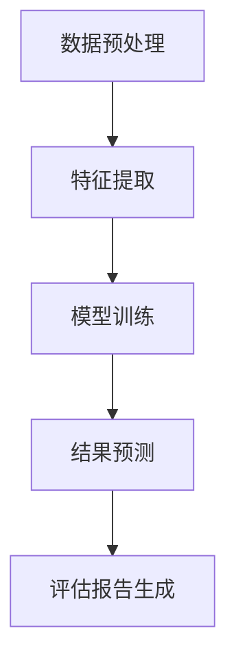
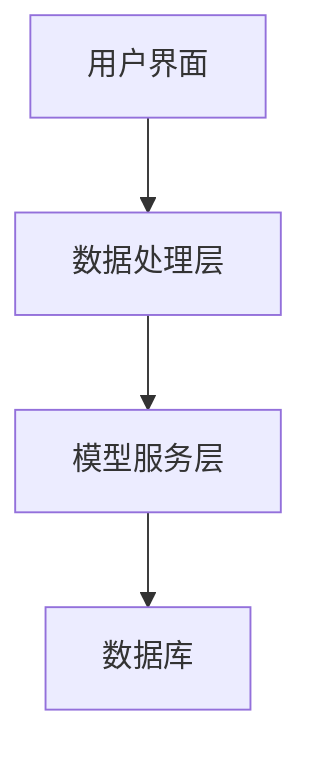
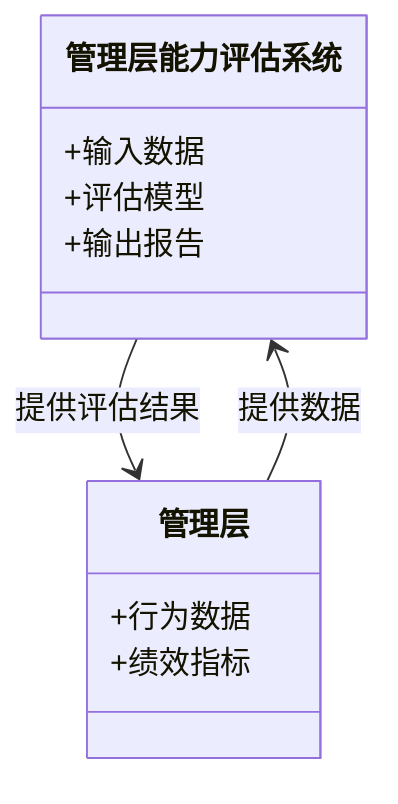
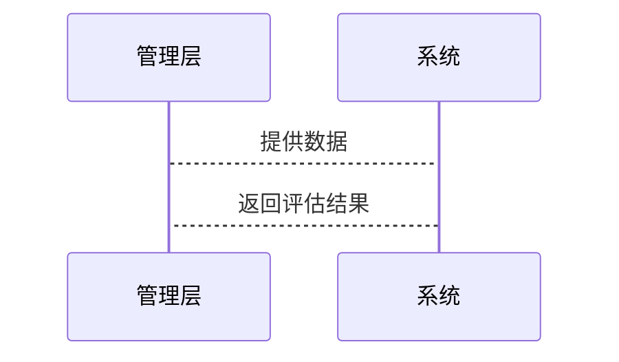

                 


# AI智能体在评估管理层能力中的作用

## 关键词：
- AI智能体
- 管理层能力评估
- 人工智能
- 管理决策
- 技术应用

## 摘要：
本文探讨AI智能体在评估管理层能力中的作用，分析其在管理决策中的应用价值和潜力。通过详细阐述AI智能体的核心概念、算法原理、系统架构以及实际项目案例，本文为读者提供从理论到实践的全面解读，展示AI技术如何革新传统的管理层能力评估方式。

---

# 第一部分: AI智能体与管理层能力评估的背景介绍

## 第1章: AI智能体与管理层能力评估的背景

### 1.1 问题背景
#### 1.1.1 管理层能力评估的重要性
管理层能力评估是企业决策和组织优化的关键环节，直接影响企业的战略执行和绩效表现。传统评估方法依赖主观判断，存在效率低下、结果不一致等问题。

#### 1.1.2 AI智能体在管理决策中的作用
AI智能体通过数据驱动的分析能力，能够提供客观、实时的评估结果，帮助企业在复杂环境中做出更明智的决策。

#### 1.1.3 当前管理层能力评估的挑战
传统评估方法依赖人工经验，难以量化和标准化。同时，数据孤岛和信息不透明的问题限制了评估的准确性和效率。

### 1.2 问题描述
#### 1.2.1 管理层能力评估的复杂性
管理层能力涉及多维度，包括领导力、决策能力、团队协作等，传统方法难以全面覆盖。

#### 1.2.2 传统评估方法的局限性
主观性高、效率低、难以量化，且难以适应动态变化的商业环境。

#### 1.2.3 AI智能体在评估中的潜在优势
AI智能体能够处理海量数据，快速生成评估结果，支持实时反馈和动态优化。

### 1.3 问题解决
#### 1.3.1 AI智能体如何辅助评估
通过自然语言处理、机器学习等技术，AI智能体能够分析文本、行为数据，提取关键指标，生成评估报告。

#### 1.3.2 从传统评估到AI智能体评估的转变
AI智能体评估能够提高评估的客观性和效率，同时降低成本和时间。

#### 1.3.3 AI智能体评估的可行性分析
基于现有技术的成熟度和数据可用性，AI智能体评估在许多场景中是可行的。

### 1.4 边界与外延
#### 1.4.1 管理层能力评估的边界
AI智能体评估主要关注可量化的指标，难以完全替代人类的主观判断。

#### 1.4.2 AI智能体评估的适用范围
适用于数据丰富的场景，如企业绩效评估、团队协作能力评估等。

#### 1.4.3 相关概念的外延
包括数据挖掘、机器学习、自然语言处理等技术，以及组织行为学、管理学等学科。

### 1.5 核心要素组成
#### 1.5.1 管理层能力的关键维度
- 领导力
- 决策能力
- 沟通能力
- 团队协作
- 创新能力

#### 1.5.2 AI智能体的核心功能
- 数据收集与处理
- 模型训练与预测
- 结果可视化与反馈

#### 1.5.3 评估模型的构建要素
- 数据来源
- 模型算法
- 评估指标
- 反馈机制

---

# 第二部分: AI智能体与管理层能力评估的核心概念

## 第2章: AI智能体与管理层能力评估的核心概念

### 2.1 核心概念原理
#### 2.1.1 AI智能体的定义与分类
AI智能体是能够感知环境、自主决策并执行任务的智能系统，分为基于规则、基于模型和基于学习的智能体。

#### 2.1.2 管理层能力评估的维度与方法
评估维度包括认知能力、社交能力、决策能力和执行力，传统方法包括问卷调查、访谈和观察法。

#### 2.1.3 AI智能体在评估中的应用原理
通过数据驱动的分析，AI智能体能够识别模式、预测趋势并提供实时反馈。

### 2.2 概念属性对比表格
#### 表2-1: AI智能体与传统评估方法的对比

| **属性**          | **AI智能体评估**              | **传统评估方法**          |
|-------------------|-----------------------------|--------------------------|
| 数据来源          | 结构化和非结构化数据         | 主要依赖主观判断          |
| 评估效率          | 高效、实时                   | 低效、耗时               |
| 结果准确性          | 客观、可量化                 | 主观性较高               |
| 适应性            | 能够动态调整                 | 静态、难以快速变化        |
| 成本              | 降低长期成本                | 高昂的人员和时间成本      |

### 2.3 ER实体关系图
```mermaid
er
  actor: 管理层
  attribute: 能力维度
  relation: 评估结果
  actor -|> attribute: 属性评估
  actor -|> relation
  attribute --> relation
```

---

## 第3章: AI智能体评估的算法原理

### 3.1 算法原理概述
AI智能体评估管理层能力的核心算法包括自然语言处理（NLP）、机器学习（ML）和深度学习（DL）。

### 3.2 算法流程图


### 3.3 核心算法实现
#### 3.3.1 算法选择与优化
选择适合的算法（如随机森林、支持向量机）并进行参数调优。

#### 3.3.2 算法代码实现
```python
from sklearn.ensemble import RandomForestClassifier
from sklearn.metrics import accuracy_score

# 数据预处理
X = ...  # 特征向量
y = ...  # 标签

# 模型训练
model = RandomForestClassifier()
model.fit(X, y)

# 预测与评估
y_pred = model.predict(X_test)
print("准确率:", accuracy_score(y_test, y_pred))
```

#### 3.3.3 算法数学模型
随机森林的数学模型：
$$
\text{预测结果} = \sum_{i=1}^{n} \text{决策树}_i(\text{输入特征})
$$

---

## 第4章: 系统分析与架构设计方案

### 4.1 系统架构设计


### 4.2 系统功能设计
#### 4.2.1 领域模型


### 4.3 接口设计
- 输入接口：接收管理层的行为数据和绩效指标。
- 输出接口：生成评估报告并反馈给管理层。

### 4.4 交互设计


---

## 第5章: 项目实战

### 5.1 环境安装
- 安装Python、TensorFlow、Scikit-learn等工具。

### 5.2 核心代码实现
```python
import pandas as pd
from sklearn.model_selection import train_test_split
from sklearn.metrics import classification_report

# 加载数据
data = pd.read_csv('manager_data.csv')

# 数据预处理
X = data.drop('label', axis=1)
y = data['label']

# 划分训练集和测试集
X_train, X_test, y_train, y_test = train_test_split(X, y, test_size=0.2)

# 模型训练
from sklearn.ensemble import RandomForestClassifier
model = RandomForestClassifier()
model.fit(X_train, y_train)

# 模型预测
y_pred = model.predict(X_test)

# 评估结果
print(classification_report(y_test, y_pred))
```

### 5.3 案例分析
以某企业为例，分析AI智能体如何评估其管理层能力，并提供改进建议。

### 5.4 项目总结
通过项目实战，验证了AI智能体在评估管理层能力中的有效性和优势。

---

## 第6章: 最佳实践与小结

### 6.1 小结
AI智能体评估管理层能力的应用前景广阔，能够显著提升评估的效率和准确性。

### 6.2 注意事项
- 数据质量和隐私保护是关键。
- 结合人类专家的判断，避免AI决策的片面性。

### 6.3 拓展阅读
推荐相关书籍和论文，深入探讨AI在管理决策中的应用。

---

## 附录
### A. 术语表
- AI智能体：具备感知和决策能力的智能系统。
- 评估模型：用于预测和判断管理层能力的数学模型。

### B. 工具安装指南
- Python安装：使用Anaconda或pip安装。
- 模型训练工具：TensorFlow、Scikit-learn。

### C. 代码示例
完整的AI智能体评估系统代码实现，包括数据预处理、模型训练和结果可视化。

### D. 参考文献
- 《人工智能：一种现代的方法》
- 相关学术论文和研究报告。

---

通过以上目录，读者可以系统地了解AI智能体在评估管理层能力中的作用，从理论到实践，逐步掌握相关技术和方法。

