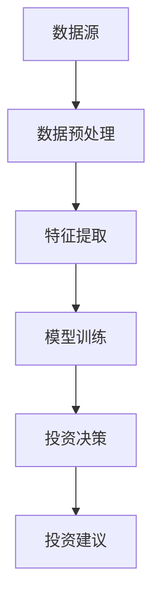

                 


# AI智能体在识别价值股与成长股融合机会中的作用

## 关键词：AI智能体，价值股，成长股，投资机会，算法原理，系统架构

## 摘要：本文探讨AI智能体如何识别价值股与成长股的融合投资机会，分析其在股票投资中的应用，包括算法原理、系统架构设计、项目实战及最佳实践。

---

# 第1章：AI智能体在金融投资中的应用

## 1.1 价值股与成长股的基本概念

### 1.1.1 价值股的定义与特征
- **价值股**：低市盈率、低市净率，通常被认为是被市场低估的股票。其核心特征包括：
  - **市盈率（P/E）**：低于行业平均水平。
  - **市净率（P/B）**：低于行业平均水平。
  - **股息率**：较高，通常用于分红。

### 1.1.2 成长股的定义与特征
- **成长股**：高增长潜力，通常市盈率较高。其核心特征包括：
  - **收入增长率**：高于行业平均水平。
  - **净利润增长率**：高于行业平均水平。
  - **营业利润率**：较高。

### 1.1.3 价值股与成长股的对比分析
- 价值股注重当前估值，成长股注重未来增长。
- 两者在不同市场周期中表现不同，融合两者的优势可能带来超额收益。

## 1.2 AI在金融投资中的应用背景

### 1.2.1 传统股票投资方法的局限性
- 传统方法依赖经验和直觉，难以处理海量数据。
- 市场波动快，传统方法反应滞后。

### 1.2.2 AI技术在金融领域的优势
- 处理海量数据能力强。
- 可快速识别复杂模式。
- 实现自动化交易和风险管理。

### 1.2.3 价值股与成长股融合投资的潜力
- 结合低估值和高增长，寻找被低估的成长股。
- 在市场波动中，融合策略可能更稳定。

## 1.3 AI智能体的基本原理

### 1.3.1 强化学习的基本概念
- **强化学习**：通过试错和奖励机制优化决策。
- **Q-learning**算法：用于状态-动作价值函数的更新。
  $$ Q(s, a) = r + \gamma \max_{a'} Q(s', a') $$

### 1.3.2 监督学习与无监督学习的区别
- **监督学习**：基于标记数据，适用于分类和回归任务。
- **无监督学习**：基于未标记数据，适用于聚类和降维任务。

### 1.3.3 AI智能体在金融决策中的应用案例
- 自动化交易系统：基于强化学习的智能体进行实时交易决策。
- 风险管理：通过无监督学习识别市场风险。

## 1.4 本章小结
本章介绍了AI智能体的基本原理及其在金融投资中的应用，重点分析了价值股和成长股的特征，为后续章节奠定了基础。

---

# 第2章：价值股与成长股的特征分析

## 2.1 价值股的特征分析

### 2.1.1 市盈率与市净率的计算方法
- 市盈率（P/E）= 股价 / 每股收益。
- 市净率（P/B）= 股价 / 每股净资产。

### 2.1.2 股息率与股息支付率的分析
- 股息率 = 每股股息 / 股价。
- 股息支付率 = 股息支付 / 净利润。

## 2.2 成长股的特征分析

### 2.2.1 收入增长率与净利润增长率的对比
- 收入增长率 = (本期收入 - 上期收入) / 上期收入。
- 净利润增长率 = (本期净利润 - 上期净利润) / 上期净利润。

## 2.3 价值股与成长股的融合特征

### 2.3.1 低估值与高增长的结合
- 低市盈率和高收入增长率。
- 低市净率和高净利润增长率。

## 2.4 本章小结
本章详细分析了价值股和成长股的特征，并探讨了它们的融合机会，为后续的AI模型设计提供了依据。

---

# 第3章：AI智能体的算法原理

## 3.1 强化学习算法的基本原理

### 3.1.1 Q-learning算法的数学模型
$$ Q(s, a) = r + \gamma \max_{a'} Q(s', a') $$

### 3.1.2 Deep Q-Networks (DQN) 的工作原理
- 使用深度神经网络近似Q函数。
- 通过经验回放和目标网络减少方差。

## 3.2 监督学习与无监督学习的结合
### 3.2.1 监督学习在股票分类中的应用
- 使用历史数据训练分类模型，预测股票类别。

### 3.2.2 无监督学习在异常检测中的应用
- 使用聚类算法识别异常市场行为。

## 3.3 算法实现的数学模型
### 3.3.1 DQN的网络结构
- 输入层：股票特征向量。
- 隐藏层：多个全连接层。
- 输出层：动作空间。

## 3.4 本章小结
本章详细讲解了AI智能体的算法原理，重点分析了强化学习在股票投资中的应用。

---

# 第4章：系统架构设计

## 4.1 问题场景介绍
- 目标：识别价值股与成长股的融合机会。
- 输入：股票数据、市场数据。
- 输出：投资建议。

## 4.2 系统功能设计
### 4.2.1 数据收集模块
- 数据来源：股票数据库、财经网站。
- 数据类型：价格、成交量、财务指标。

### 4.2.2 特征提取模块
- 从数据中提取价值股和成长股的特征。

### 4.2.3 策略选择模块
- 使用AI智能体选择最优投资组合。

## 4.3 系统架构图


## 4.4 接口设计
- 数据接口：连接数据库。
- 模型接口：调用AI模型。

## 4.5 本章小结
本章设计了系统的架构，详细描述了各模块的功能和交互流程。

---

# 第5章：项目实战

## 5.1 环境安装
- 安装Python、TensorFlow、Pandas等库。

## 5.2 核心代码实现
### 5.2.1 数据收集
```python
import pandas as pd
data = pd.read_csv('stock_data.csv')
```

### 5.2.2 模型训练
```python
import tensorflow as tf
model = tf.keras.Sequential([...])
model.compile(optimizer='adam', loss='mse')
model.fit(...)
```

## 5.3 代码解读与分析
- 数据预处理：归一化处理。
- 模型训练：使用DQN算法训练智能体。

## 5.4 案例分析
- 以某段时间的股票数据为例，展示模型识别价值股和成长股的过程。

## 5.5 本章小结
本章通过实际案例展示了AI智能体在识别价值股和成长股中的应用。

---

# 第6章：最佳实践与注意事项

## 6.1 风险管理
- 设置止损点。
- 分散投资组合。

## 6.2 模型优化
- 调整超参数。
- 优化网络结构。

## 6.3 伦理问题
- 避免市场操纵。
- 保护用户隐私。

## 6.4 本章小结
本章总结了实际应用中的注意事项和最佳实践。

---

# 第7章：总结与展望

## 7.1 总结
- AI智能体在识别价值股与成长股融合机会中具有重要作用。
- 算法和系统设计是关键。

## 7.2 展望
- 更复杂的强化学习算法。
- 结合其他投资策略。

## 7.3 本章小结
本章总结了全文，并展望了未来的研究方向。

---

通过以上步骤，本文系统地探讨了AI智能体在识别价值股与成长股融合机会中的作用，从理论到实践，为投资者提供了新的思路。

