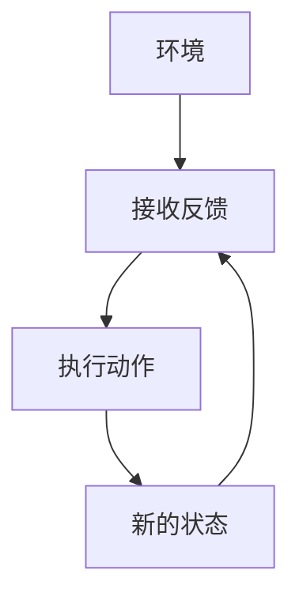
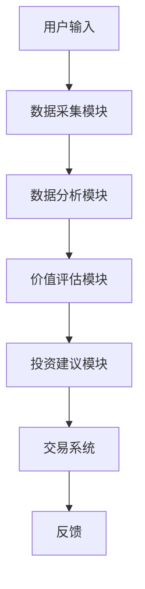

                 


# AI智能体在识别价值陷阱和价值机会中的作用

## 关键词：AI智能体，价值陷阱，价值机会，市场分析，强化学习，数据驱动

## 摘要：  
本文探讨了AI智能体在识别市场中的价值陷阱和价值机会中的作用。通过分析AI智能体的原理、算法、系统架构以及实际应用案例，本文详细阐述了AI如何帮助投资者和企业识别潜在风险和机会，从而做出更明智的决策。文章结构清晰，内容涵盖从理论到实践的各个方面，帮助读者全面理解AI智能体在价值识别中的应用。

---

## 第一部分: 背景介绍

### 第1章: 问题背景

#### 1.1 价值陷阱与价值机会的定义  
- **价值陷阱**：指表面上看似有吸引力但实际上存在隐藏风险或不合理的投资机会。例如，一家公司可能有高增长的表象，但其财务状况或市场环境可能存在问题。  
- **价值机会**：指被市场低估或忽视，但具有长期潜力的投资机会。例如，新兴行业中的某个公司可能尚未被市场充分认识到其潜在价值。

#### 1.2 当前市场分析中的挑战  
- **信息过载**：金融市场数据庞大，传统方法难以高效处理和分析。  
- **主观因素影响**：人为分析容易受到情绪、经验等主观因素的影响，导致判断失误。  
- **动态变化**：市场环境瞬息万变，传统静态分析方法难以捕捉动态变化。

#### 1.3 AI技术在市场分析中的优势  
- **数据处理能力**：AI能够快速处理大量数据，发现隐藏的模式和趋势。  
- **自动化分析**：通过算法自动识别价值陷阱和机会，减少人为干预。  
- **实时性**：AI能够实时分析市场数据，捕捉短期波动和长期趋势。

### 第2章: 问题描述

#### 2.1 价值陷阱的特征  
- **低效定价**：市场对某些资产的定价与实际价值不符。  
- **负面新闻或谣言**：市场可能因负面信息而过度反应，导致资产价格被低估。  
- **结构性问题**：某些行业或市场因结构性问题导致部分资产成为价值陷阱。

#### 2.2 价值机会的识别难点  
- **识别早期信号**：价值机会通常在早期阶段不易被发现，需要高度敏感的分析能力。  
- **长期潜力评估**：需要综合考虑技术、市场、政策等多个因素，评估长期潜力。  
- **竞争激烈**：价值机会往往吸引大量投资者，导致竞争激烈，难以获取超额收益。

#### 2.3 AI智能体在市场分析中的应用潜力  
- **多维度分析**：AI智能体能够从文本、图像、时间序列等多种数据源中提取信息，进行多维度分析。  
- **实时监控**：通过实时数据流分析，快速识别市场变化中的价值机会或陷阱。  
- **动态调整**：根据市场反馈动态调整分析策略，提高识别准确率。

---

## 第二部分: 核心概念与联系

### 第3章: AI智能体的定义与原理

#### 3.1 智能体的基本概念  
- **智能体**：能够感知环境、做出决策并采取行动的实体。  
- **强化学习**：通过与环境交互，智能体通过试错学习，逐步优化决策策略。  
- **监督学习**：基于标记数据，智能体学习输入与输出之间的映射关系，用于分类或预测任务。

#### 3.2 基于强化学习的智能体  
- **感知模块**：通过传感器或数据输入获取环境信息。  
- **决策模块**：基于当前状态和历史经验，选择最优行动方案。  
- **行动模块**：执行决策并输出结果，影响环境状态。

#### 3.3 智能体的感知、决策与行动模块  
- **感知模块**：从市场数据中提取特征，如价格、成交量、市场情绪等。  
- **决策模块**：基于感知数据，分析判断是否为价值陷阱或机会。  
- **行动模块**：输出投资建议或触发交易指令。

### 第4章: 核心概念对比表

#### 表4.1: 不同类型AI智能体的特征对比  
| 类型          | 数据来源       | 决策机制       | 适用场景               | 优缺点                   |
|---------------|----------------|----------------|------------------------|--------------------------|
| 基于规则的智能体 | 结构化数据       | 预定义规则       | 简单市场分析           | 易实现，但灵活性差         |
| 基于学习的智能体 | 多模态数据       | 强化学习/监督学习 | 复杂市场分析           | 高灵活性，但需要大量数据   |
| 混合型智能体     | 结构化+非结构化数据 | 综合规则+学习 | 复杂且动态的市场环境   | 综合优势，但实现复杂       |

### 第5章: ER实体关系图

#### 图5.1: 价值识别系统的实体关系图  
```mermaid
er
    entity 市场数据 {
        key: id
        attribute: 时间戳, 价格, 交易量, 市场情绪
    }
    entity 价值评估 {
        key: id
        attribute: 价值评分, 价值类型(陷阱/机会)
    }
    entity AI智能体 {
        key: id
        attribute: 模型参数, 状态
    }
    entity 交易系统 {
        key: id
        attribute: 用户ID, 交易记录
    }
    市场数据 --> 价值评估: 生成
    AI智能体 --> 价值评估: 训练和评估
    AI智能体 --> 交易系统: 下达交易指令
    交易系统 --> AI智能体: 反馈市场变化
```

---

## 第三部分: 算法原理讲解

### 第6章: 算法原理

#### 6.1 强化学习算法流程图  


#### 6.2 算法实现代码示例  
```python
import numpy as np
import random

class AI智能体:
    def __init__(self, 状态空间, 动作空间):
        self.状态空间 = 状态空间
        self.动作空间 = 动作空间
        self.参数 = np.random.random()

    def 感知(self, 状态):
        return self.参数 * 状态

    def 决策(self, 状态):
        return random.choice(self.动作空间)

    def 学习(self, 状态, 动作, 奖励):
        self.参数 += (奖励 / 状态)
```

#### 6.3 数学模型和公式  
- **收益预测模型**：  
  $$ 收益 = \alpha \cdot 价格 + \beta \cdot 交易量 + \gamma \cdot 市场情绪 $$  
- **风险评估模型**：  
  $$ 风险 = \sigma (市场波动率) $$  
  其中，$\sigma$ 表示标准差，用于衡量市场波动风险。

---

## 第四部分: 系统分析与架构设计

### 第7章: 系统架构设计

#### 7.1 问题场景介绍  
- **金融市场的价值识别**：通过分析股票、基金等金融资产的历史数据和实时数据，识别价值陷阱和机会。

#### 7.2 系统功能设计  
- **数据采集模块**：从多个数据源获取市场数据。  
- **数据分析模块**：对数据进行清洗、特征提取和建模分析。  
- **决策模块**：基于分析结果，生成价值评估和投资建议。

#### 7.3 系统架构图  


---

## 第五部分: 项目实战

### 第8章: 项目实现

#### 8.1 环境安装  
- **Python**：安装Python 3.x  
- **库**：安装numpy、pandas、scikit-learn等库。

#### 8.2 核心代码实现  
```python
import pandas as pd
from sklearn.model_selection import train_test_split
from sklearn.tree import DecisionTreeClassifier

# 数据加载
data = pd.read_csv('market_data.csv')
X = data[['价格', '交易量', '市场情绪']]
y = data['价值类型']

# 数据分割
X_train, X_test, y_train, y_test = train_test_split(X, y, test_size=0.2)

# 模型训练
model = DecisionTreeClassifier()
model.fit(X_train, y_train)

# 模型预测
预测 = model.predict(X_test)
print(预测)
```

#### 8.3 实际案例分析  
- **案例1**：某股票因负面新闻股价暴跌，但其基本面良好，AI智能体识别其为价值机会。  
- **案例2**：某行业因政策变化，部分公司面临价值陷阱，AI智能体提前识别并发出预警。

---

## 第六部分: 最佳实践

### 第9章: 小结

- **总结**：AI智能体通过强大的数据处理能力和算法模型，能够有效识别价值陷阱和机会，帮助投资者和企业做出更明智的决策。

### 第10章: 注意事项

- **数据质量**：确保数据来源可靠，避免噪声干扰。  
- **模型选择**：根据具体场景选择合适的算法，避免过度复杂化。  
- **结果验证**：定期验证模型性能，及时调整和优化。

### 第11章: 拓展阅读

- **推荐书籍**：《机器学习实战》、《深度学习》  
- **推荐网站**：Kaggle、GitHub上的AI项目

---

## 结语

通过本文的详细讲解，读者可以全面了解AI智能体在识别价值陷阱和价值机会中的作用。从理论到实践，从算法到系统设计，本文为读者提供了丰富的知识和实用的指导。希望本文能够帮助读者更好地理解和应用AI技术，提升市场分析能力。

