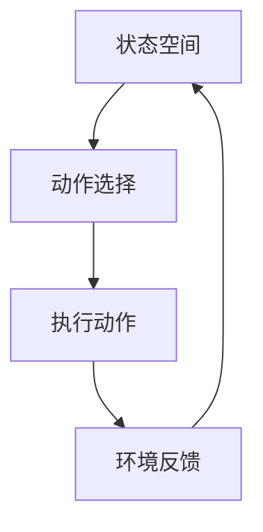
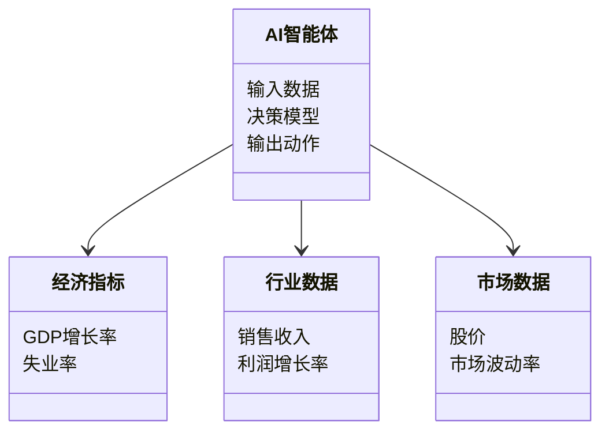

                 


# AI智能体在识别周期性行业投资机会中的应用

## 关键词：AI智能体，周期性行业，投资机会，强化学习，时间序列分析，聚类分析

## 摘要

本文探讨AI智能体在识别周期性行业投资机会中的应用，从核心概念、算法原理到系统设计和项目实战，全面解析AI在投资领域的潜力。通过强化学习和时间序列分析，AI智能体能够有效捕捉周期性行业的波动规律，为投资者提供数据驱动的决策支持。

---

# 第一部分：AI智能体在周期性行业投资中的背景与基础

## 第1章：AI智能体与周期性行业的基本概念

### 1.1 AI智能体的基本概念

#### 1.1.1 AI智能体的定义与特点

AI智能体是一种能够感知环境、做出决策并执行动作的智能系统，具有以下特点：

- **自主性**：能够自主决策，无需人工干预。
- **反应性**：能够实时感知环境变化并做出响应。
- **学习能力**：通过数据和经验不断优化决策模型。
- **适应性**：能够适应不同环境和变化。

#### 1.1.2 周期性行业的定义与特征

周期性行业是指其业绩表现与经济周期高度相关的行业，例如：

- **制造业**：受宏观经济波动影响较大。
- **房地产**：与经济周期密切相关。
- **能源行业**：需求受经济波动影响显著。

周期性行业的波动性特征包括：

- **波动性**：收入和利润呈现周期性波动。
- **相关性**：与宏观经济指标高度相关。
- **不确定性**：市场波动较大，投资风险较高。

#### 1.1.3 AI智能体在周期性行业中的应用背景

AI智能体的应用背景主要体现在以下几个方面：

- **数据驱动决策**：利用历史数据和实时数据进行预测和决策。
- **自动化交易**：通过算法自动执行交易策略。
- **风险管理**：识别潜在风险，优化投资组合。

### 1.2 问题背景与问题描述

#### 1.2.1 周期性行业投资机会识别的难点

周期性行业投资机会识别面临以下难点：

- **数据复杂性**：涉及多维度数据，包括经济指标、行业数据和市场数据。
- **市场波动性**：市场波动频繁，投资机会难以捕捉。
- **模型鲁棒性**：模型需要具备较强的鲁棒性以应对市场变化。

#### 1.2.2 AI智能体在投资机会识别中的优势

AI智能体在投资机会识别中的优势包括：

- **数据处理能力**：能够处理和分析海量数据，提取有价值的信息。
- **实时响应**：能够实时感知市场变化，快速做出决策。
- **自我优化**：通过强化学习不断优化决策策略。

#### 1.2.3 问题的边界与外延

问题的边界与外延包括：

- **边界**：主要关注周期性行业的投资机会识别，不涉及其他行业的分析。
- **外延**：AI智能体的应用可以扩展到其他领域，如股票交易、风险管理等。

### 1.3 核心概念与联系

#### 1.3.1 AI智能体的核心原理

AI智能体的核心原理包括：

- **感知环境**：通过传感器或数据接口感知外部环境。
- **决策制定**：基于感知信息和历史数据制定决策。
- **执行动作**：根据决策结果执行相应的动作。

#### 1.3.2 周期性行业投资机会识别的关键要素

周期性行业投资机会识别的关键要素包括：

- **经济指标**：如GDP增长率、失业率等。
- **行业数据**：如行业销售收入、利润增长率等。
- **市场数据**：如股价、市场波动率等。

#### 1.3.3 核心概念之间的关系与对比表格

以下是核心概念之间的关系对比表：

| **核心概念** | **定义** | **与周期性行业的关系** |
|--------------|----------|-------------------------|
| AI智能体     | 智能决策系统 | 提供数据驱动的投资决策支持 |
| 经济周期     | 经济波动阶段 | 影响周期性行业的业绩表现 |
| 数据分析     | 数据处理与建模 | 用于识别投资机会和风险 |

---

## 第2章：AI智能体的核心原理

### 2.1 AI智能体的核心原理

#### 2.1.1 强化学习与决策树模型

强化学习是一种通过试错机制优化决策策略的算法，而决策树模型是一种基于树状结构进行分类和回归的算法。两者结合可以提高投资决策的准确性。

#### 2.1.2 聚类分析与特征提取

聚类分析是一种无监督学习算法，用于将数据分成不同的类别。特征提取则是从数据中提取有用的特征，用于后续的分析和预测。

#### 2.1.3 时间序列分析与预测

时间序列分析是一种用于预测未来趋势的算法，广泛应用于金融市场的波动分析和预测。

---

### 2.2 算法原理讲解

#### 2.2.1 强化学习算法的流程图



#### 2.2.2 聚类分析的数学模型

$$
\text{目标函数} = \sum_{i=1}^{n} \sum_{j=1}^{k} w_{ij}d_{ij}
$$

其中，$w_{ij}$为样本i属于簇j的概率，$d_{ij}$为样本i与簇j的中心点的距离。

---

## 第3章：AI智能体在周期性行业中的应用

### 3.1 系统功能设计

#### 3.1.1 领域模型（Mermaid类图）



### 3.2 系统架构设计

#### 3.2.1 系统架构（Mermaid架构图）

```mermaid
container 系统架构 {
    AI智能体
    数据源（经济指标、行业数据、市场数据）
    决策模块
    执行模块
}
```

### 3.3 接口设计

#### 3.3.1 API接口

- **输入接口**：接收经济指标、行业数据和市场数据。
- **输出接口**：输出投资决策和交易指令。

---

## 第4章：项目实战

### 4.1 环境安装

安装Python、TensorFlow、Keras等必要的库。

### 4.2 核心实现代码

```python
import numpy as np
import pandas as pd
from sklearn.cluster import KMeans
from sklearn.preprocessing import StandardScaler

# 数据预处理
data = pd.read_csv('周期性行业数据.csv')
scaler = StandardScaler()
scaled_data = scaler.fit_transform(data)

# 聚类分析
kmeans = KMeans(n_clusters=3, random_state=0)
clusters = kmeans.fit_predict(scaled_data)

# 时间序列分析
from statsmodels.tsa.arima_model import ARIMA

model = ARIMA(train_data, order=(5,1,0))
model_fit = model.fit()
```

### 4.3 结果分析

通过聚类分析和时间序列分析，识别出周期性行业的投资机会，并进行实时监控和调整。

---

## 第5章：总结与展望

### 5.1 小结

AI智能体在周期性行业投资机会识别中的应用具有重要意义，能够提高投资决策的准确性和效率。

### 5.2 注意事项

- 数据质量和完整性影响模型的准确性。
- 模型需要定期更新和优化。

### 5.3 拓展阅读

建议读者进一步学习强化学习和时间序列分析的相关知识，深入了解AI在金融领域的应用。

---

通过本文的分析，我们可以看到AI智能体在周期性行业投资机会识别中的巨大潜力。结合强化学习、时间序列分析和聚类分析等算法，AI智能体能够为投资者提供有力的数据支持和决策依据。未来，随着技术的不断发展，AI在金融领域的应用将更加广泛和深入。

