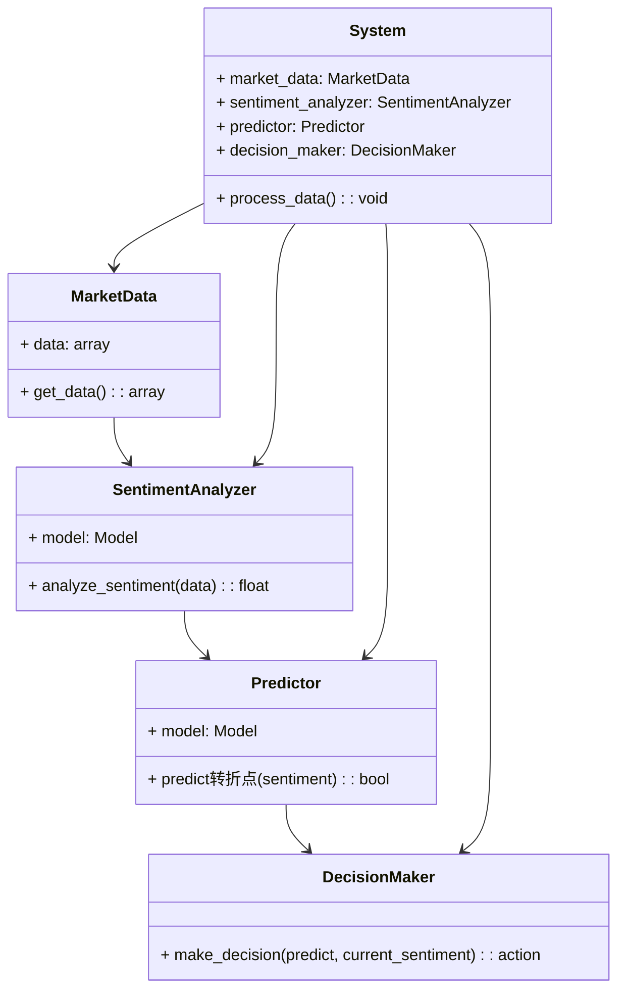
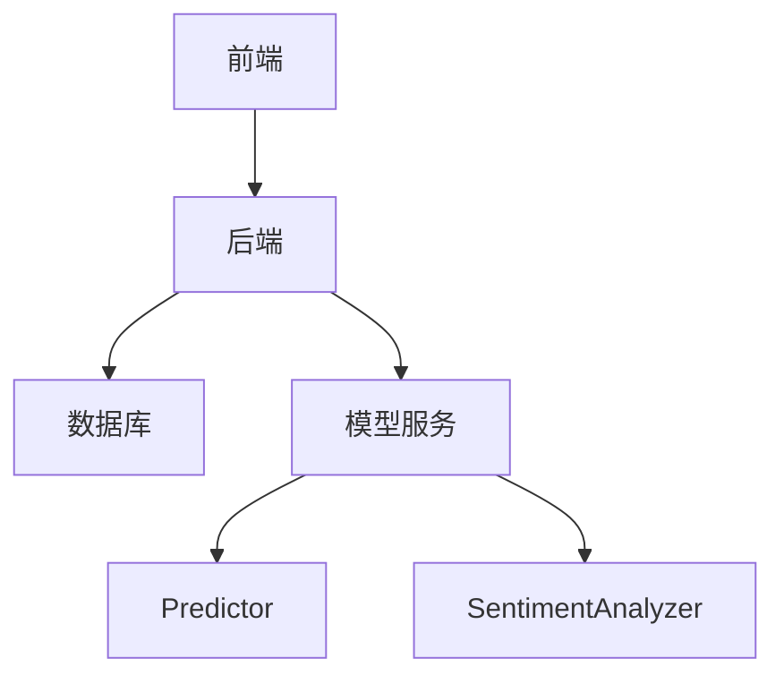
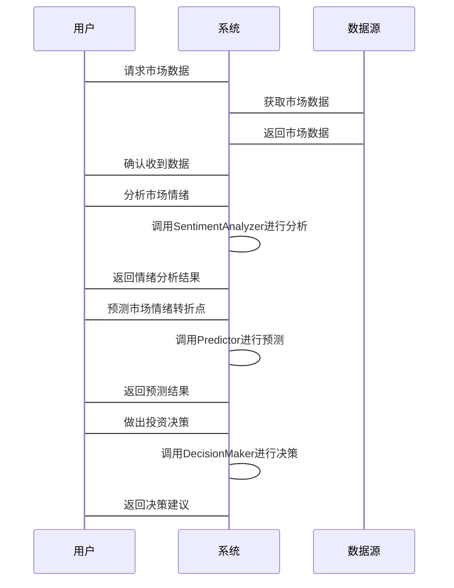

                 


# AI智能体在识别市场情绪转折点中的作用

> 关键词：AI智能体、市场情绪、转折点识别、金融数据分析、机器学习、深度学习

> 摘要：本文探讨了AI智能体在识别市场情绪转折点中的作用，从市场情绪的定义、AI智能体的核心算法、系统架构设计到项目实战，详细分析了如何利用AI技术预测市场情绪变化。通过深度学习模型和强化学习算法，本文展示了AI智能体在金融市场中的潜力和应用。

---

## 第1章: AI智能体与市场情绪转折点的背景

### 1.1 市场情绪与转折点的定义

#### 1.1.1 市场情绪的定义
市场情绪指的是投资者在金融市场中的整体心理状态，通常表现为乐观、悲观、贪婪或恐惧。市场情绪的变化直接影响着市场的买卖行为，进而影响资产价格的变化。

#### 1.1.2 市场情绪转折点的特征
市场情绪转折点是指市场情绪从一个状态（如乐观）转向另一个状态（如悲观）的关键时刻。转折点通常伴随着市场行为的变化，如成交量的突然变化、价格波动加剧等。

#### 1.1.3 市场情绪与市场走势的关系
市场情绪与市场走势密切相关。例如，当市场情绪从乐观转向悲观时，可能会引发市场下跌；反之，当市场情绪从悲观转向乐观时，可能会引发市场上涨。

### 1.2 AI智能体的定义与特点

#### 1.2.1 AI智能体的基本概念
AI智能体是一种能够感知环境、自主决策并执行任务的智能系统。它具备学习、推理和自适应能力，能够在复杂环境中做出最优决策。

#### 1.2.2 AI智能体的核心特点
- **自主性**：能够独立决策。
- **反应性**：能够实时感知环境变化。
- **学习能力**：能够通过数据学习和优化。
- **适应性**：能够根据环境变化调整行为。

#### 1.2.3 AI智能体与传统算法的区别
传统算法通常基于固定的规则和逻辑，而AI智能体具备学习和自适应能力，能够根据数据动态调整行为。AI智能体更适合处理复杂、动态和不确定的环境。

### 1.3 AI智能体在金融市场的应用前景

#### 1.3.1 金融市场的复杂性与不确定性
金融市场受多种因素影响，包括经济指标、政策变化、市场情绪等。市场的复杂性和不确定性使得传统方法难以有效预测市场走势。

#### 1.3.2 AI智能体在金融市场中的优势
AI智能体能够通过大数据分析和深度学习，识别市场中的复杂模式和潜在机会。其自主决策和实时反应能力使其在金融市场中具有显著优势。

#### 1.3.3 市场情绪转折点识别的挑战与机遇
市场情绪转折点的识别是金融市场中的重要问题。AI智能体通过分析海量数据，能够更准确地预测市场情绪的变化，为投资者提供决策支持。

---

## 第2章: AI智能体与市场情绪转折点的关联

### 2.1 市场情绪的多维度分析

#### 2.1.1 市场情绪的多维度特征
市场情绪可以从多个维度进行分析，包括投资者情绪、市场参与者行为、市场指标（如成交量、价格波动）等。多维度分析能够更全面地捕捉市场情绪的变化。

#### 2.1.2 市场情绪的量化方法
市场情绪可以通过多种指标量化，例如：
- **情绪指数**：通过新闻、社交媒体等数据计算的情绪指数。
- **市场指标**：如成交量、价格波动率等。

#### 2.1.3 市场情绪的时间序列分析
时间序列分析是研究市场情绪变化的重要方法。通过分析历史数据，可以识别市场情绪的变化趋势和周期性特征。

### 2.2 AI智能体在市场情绪分析中的作用

#### 2.2.1 AI智能体的实时数据处理能力
AI智能体能够实时处理市场数据，快速捕捉市场情绪的变化。通过实时分析新闻、社交媒体等数据，AI智能体可以及时识别市场情绪的变化。

#### 2.2.2 AI智能体的模式识别能力
AI智能体具备强大的模式识别能力，能够从历史数据中识别出市场情绪变化的模式和特征。这些模式可以用于预测未来的市场情绪变化。

#### 2.2.3 AI智能体的预测与决策能力
AI智能体能够基于当前市场情绪和历史数据，预测未来市场情绪的变化，并据此做出投资决策。例如，当预测市场情绪将从乐观转向悲观时，AI智能体可以建议投资者减少持仓。

### 2.3 市场情绪转折点的识别方法

#### 2.3.1 基于AI智能体的市场情绪监测
AI智能体通过实时监测市场数据，识别市场情绪的变化。例如，通过分析社交媒体上的关键词和情感极性，AI智能体可以量化市场情绪。

#### 2.3.2 市场情绪转折点的特征提取
市场情绪转折点通常伴随着一些特征，例如：
- **情绪指数的突变**：情绪指数的突然上升或下降。
- **市场行为的变化**：如成交量的突然增加或减少。
- **市场指标的异常**：如价格波动率的显著变化。

#### 2.3.3 市场情绪转折点的预测模型
市场情绪转折点的预测模型通常基于机器学习算法，例如：
- **时间序列模型**：如LSTM（长短期记忆网络）。
- **深度学习模型**：如Transformer模型。
- **强化学习模型**：通过模拟市场环境进行预测。

---

## 第3章: AI智能体的核心算法与数学模型

### 3.1 基于深度学习的市场情绪分析

#### 3.1.1 LSTM网络在时间序列分析中的应用
LSTM（长短期记忆网络）是一种常用的深度学习模型，特别适合处理时间序列数据。LSTM能够捕捉数据中的长期依赖关系，适用于市场情绪的时间序列分析。

#### 3.1.2 Transformer模型在市场情绪分析中的优势
Transformer模型在自然语言处理领域表现出色，其自注意力机制能够捕捉数据中的全局关系。在市场情绪分析中，Transformer模型可以用于分析文本数据中的情感倾向。

#### 3.1.3 图神经网络在市场情绪网络中的应用
图神经网络（GNN）能够处理图结构数据，适用于分析市场参与者之间的关系。在市场情绪分析中，GNN可以用于构建市场情绪网络，分析情绪传播路径。

### 3.2 市场情绪转折点的预测算法

#### 3.2.1 基于回归模型的预测方法
回归模型通常用于预测连续型变量，如市场情绪指数。通过训练回归模型，可以预测未来市场情绪的变化趋势。

#### 3.2.2 基于分类模型的预测方法
分类模型通常用于预测离散型变量，如市场情绪的变化方向（上涨或下跌）。通过训练分类模型，可以预测市场情绪的转折点。

#### 3.2.3 基于强化学习的预测方法
强化学习是一种通过试错学习的方法，适用于复杂环境中的决策问题。在市场情绪转折点预测中，强化学习可以通过模拟市场环境，学习最优的投资策略。

### 3.3 算法实现的数学模型

#### 3.3.1 LSTM网络的数学模型
LSTM网络由输入门、遗忘门和输出门组成。其数学模型如下：

$$
f_{t} = \sigma(W_f x_t + U_f h_{t-1} + b_f)
$$

$$
i_{t} = \sigma(W_i x_t + U_i h_{t-1} + b_i)
$$

$$
o_{t} = \sigma(W_o x_t + U_o h_{t-1} + b_o)
$$

$$
h_{t} = f_{t} \cdot c_{t-1} + i_{t} \cdot tanh(W_c x_t + U_c h_{t-1} + b_c)
$$

$$
c_{t} = f_{t} \cdot c_{t-1} + i_{t} \cdot tanh(W_c x_t + U_c h_{t-1} + b_c)
$$

#### 3.3.2 Transformer模型的数学模型
Transformer模型的核心是自注意力机制，其数学模型如下：

$$
\text{Attention}(Q, K, V) = \text{softmax}\left(\frac{QK^T}{\sqrt{d_k}}\right)V
$$

---

## 第4章: 系统分析与架构设计

### 4.1 项目场景介绍
本项目旨在开发一个基于AI智能体的市场情绪转折点识别系统。系统将实时监测市场数据，分析市场情绪的变化，并预测市场情绪的转折点。

### 4.2 系统功能设计

#### 4.2.1 领域模型类图
以下是系统功能的领域模型类图：



### 4.3 系统架构设计

#### 4.3.1 系统架构图
以下是系统的架构图：



### 4.4 系统接口设计
系统主要接口包括：
- 数据接口：获取市场数据。
- 分析接口：分析市场情绪。
- 预测接口：预测市场情绪转折点。
- 决策接口：根据预测结果做出投资决策。

### 4.5 系统交互流程图



---

## 第5章: 项目实战

### 5.1 环境安装
项目需要以下环境：
- Python 3.8+
- TensorFlow 2.0+
- PyTorch 1.0+
- Jupyter Notebook

### 5.2 核心代码实现

#### 5.2.1 数据获取与预处理

```python
import pandas as pd
import numpy as np

# 获取市场数据
data = pd.read_csv("market_data.csv")

# 数据预处理
data = data.dropna()
data = (data - data.mean()) / data.std()
```

#### 5.2.2 情绪分析模型实现

```python
import tensorflow as tf
from tensorflow.keras import layers

# 情绪分析模型
def build_sentiment_model(input_shape):
    model = tf.keras.Sequential()
    model.add(layers.LSTM(64, return_sequences=True, input_shape=input_shape))
    model.add(layers.LSTM(32, return_sequences=False))
    model.add(layers.Dense(1, activation="sigmoid"))
    model.compile(loss="binary_crossentropy", optimizer="adam", metrics=["accuracy"])
    return model
```

#### 5.2.3 预测模型实现

```python
import torch
import torch.nn as nn
import torch.optim as optim

# 预测模型
class TransformerModel(nn.Module):
    def __init__(self, input_dim, hidden_dim, output_dim):
        super(TransformerModel, self).__init__()
        self.embedding = nn.Linear(input_dim, hidden_dim)
        self.transformer = nn.Transformer(hidden_dim, hidden_dim, nhead=2)
        self.predictor = nn.Linear(hidden_dim, output_dim)

    def forward(self, x):
        x = self.embedding(x)
        x = self.transformer(x, x)
        x = self.predictor(x)
        return x

# 训练模型
def train_model(model, optimizer, criterion, dataloader):
    for epoch in range(num_epochs):
        for batch in dataloader:
            optimizer.zero_grad()
            outputs = model(batch)
            loss = criterion(outputs, labels)
            loss.backward()
            optimizer.step()
```

### 5.3 代码应用解读与分析
以上代码实现了市场数据的获取与预处理、情绪分析模型和预测模型的构建与训练。通过这些代码，我们可以训练出一个能够预测市场情绪转折点的AI智能体。

### 5.4 实际案例分析

#### 5.4.1 案例背景
假设我们有一个包含历史股价、成交量和新闻情绪的数据集。我们的目标是通过AI智能体预测市场情绪的转折点。

#### 5.4.2 数据分析与模型训练
通过训练LSTM和Transformer模型，我们可以得到一个能够预测市场情绪转折点的模型。

#### 5.4.3 模型评估与优化
通过回测和风险指标评估，我们可以验证模型的预测效果，并进行优化。

### 5.5 项目小结
本项目展示了如何利用AI智能体预测市场情绪转折点。通过深度学习模型和强化学习算法，我们可以开发出一个能够实时监测和预测市场情绪的系统，为投资者提供决策支持。

---

## 第6章: 总结与展望

### 6.1 最佳实践 tips
- 在实际应用中，建议结合多种算法和模型进行预测，以提高预测的准确性。
- 数据质量对模型的性能影响很大，建议对数据进行严格的清洗和预处理。
- 在实际交易中，建议结合风险控制策略，避免过度依赖模型预测。

### 6.2 小结
本文详细探讨了AI智能体在识别市场情绪转折点中的作用。通过深度学习模型和强化学习算法，我们可以开发出一个能够实时监测和预测市场情绪的系统，为投资者提供决策支持。

### 6.3 注意事项
- 市场情绪的预测具有不确定性，投资者应结合其他信息进行综合判断。
- 在实际应用中，建议对模型进行持续优化和更新，以应对市场的变化。

### 6.4 拓展阅读
- 《深度学习在金融市场中的应用》
- 《强化学习在金融投资中的实践》
- 《时间序列分析与预测》

---

通过以上内容，我们可以看到AI智能体在识别市场情绪转折点中的巨大潜力。未来，随着技术的不断发展，AI智能体在金融市场中的应用将更加广泛和深入。

