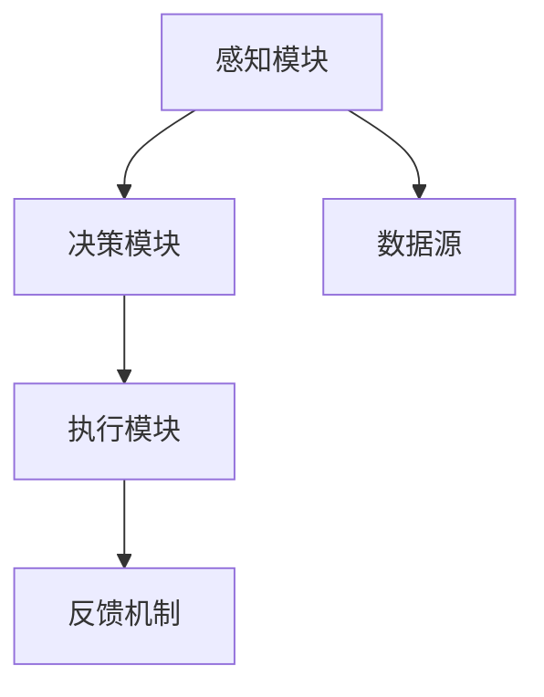
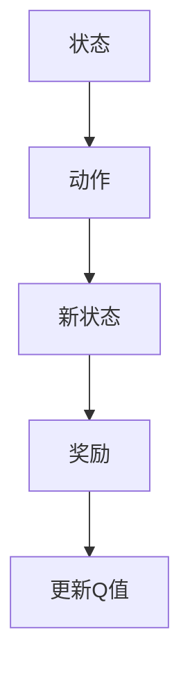
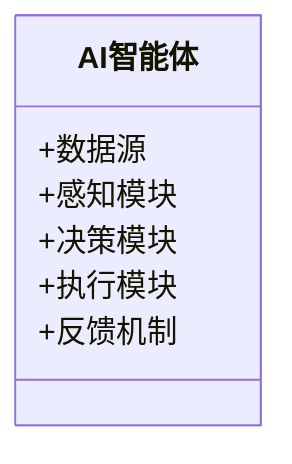
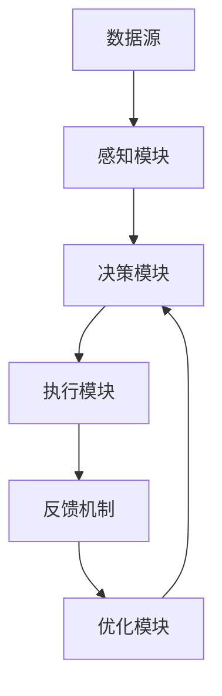
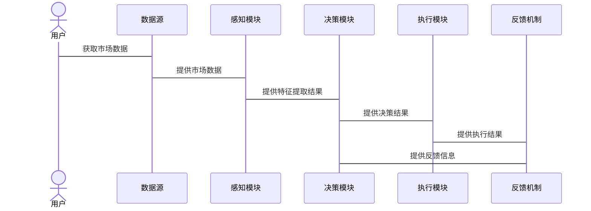

                 


# AI智能体在识别市场结构性机会中的作用

> **关键词**：AI智能体，市场机会识别，强化学习，无监督学习，系统架构，市场分析

> **摘要**：本文深入探讨了AI智能体在识别市场结构性机会中的作用，从核心概念、算法原理到系统架构，结合实际案例，全面解析AI智能体如何通过感知、决策和执行机制，帮助投资者和企业捕捉市场中的结构性机会。文章还详细介绍了强化学习、监督学习和无监督学习在市场机会识别中的应用，并通过系统架构设计展示了AI智能体的实际应用场景。最后，本文提供了具体的项目实战案例，帮助读者理解AI智能体在市场分析中的实际应用。

---

# 第1章: AI智能体与市场机会概述

## 1.1 AI智能体的基本概念

### 1.1.1 什么是AI智能体
AI智能体（Artificial Intelligence Agent）是指具备感知环境、做出决策并执行动作的智能实体。它能够根据环境输入做出自主决策，并通过输出动作与环境进行交互。

### 1.1.2 AI智能体的核心特征
- **自主性**：能够自主决策，无需人工干预。
- **反应性**：能够实时感知环境变化并做出反应。
- **目标导向**：具有明确的目标，并通过动作实现目标。
- **学习能力**：能够通过经验改进自身的决策能力。

### 1.1.3 AI智能体与传统算法的区别
| 特性 | AI智能体 | 传统算法 |
|------|----------|----------|
| 决策能力 | 具备自主决策能力 | 依赖预设规则 |
| 学习能力 | 能够通过经验改进 | 无法自适应 |
| 适应性 | 能够实时调整策略 | 需人工调整 |

## 1.2 市场结构性机会的定义

### 1.2.1 什么是市场结构性机会
市场结构性机会是指在市场中由于结构性变化（如政策变化、技术进步、行业整合等）带来的投资机会。

### 1.2.2 市场结构性机会的特征
- **长期性**：通常持续时间较长，影响范围广。
- **系统性**：与市场整体结构密切相关。
- **可预测性**：可以通过数据分析和模型预测。

### 1.2.3 市场结构性机会的分类
- **行业机会**：由于行业整合或技术进步带来的机会。
- **政策机会**：由于政策变化带来的机会。
- **技术机会**：由于技术创新带来的机会。

## 1.3 AI智能体在市场机会识别中的作用

### 1.3.1 AI智能体的优势
- **高效性**：能够快速处理大量数据，发现潜在机会。
- **准确性**：通过机器学习模型提高预测的准确性。
- **实时性**：能够实时监控市场变化，快速做出反应。

### 1.3.2 AI智能体在市场机会识别中的应用场景
- **股票投资**：通过分析市场数据，识别股票的投资机会。
- **风险管理**：通过预测市场风险，制定风险管理策略。
- **行业分析**：通过分析行业数据，识别行业的结构性机会。

### 1.3.3 AI智能体与人类专家的结合
AI智能体可以通过数据分析提供辅助决策，而人类专家则可以根据经验进行最终决策。

## 1.4 本章小结
本章介绍了AI智能体的基本概念及其在市场机会识别中的作用，强调了AI智能体在市场分析中的优势和应用场景。

---

# 第2章: AI智能体的核心概念与原理

## 2.1 AI智能体的感知机制

### 2.1.1 数据采集与处理
AI智能体通过数据采集模块获取市场数据，如股票价格、市场新闻等，并通过数据预处理模块进行清洗和标准化。

### 2.1.2 数据特征提取
通过特征工程提取关键特征，如趋势特征、波动特征等。

### 2.1.3 数据分析与模式识别
通过机器学习算法识别数据中的模式和趋势，如时间序列分析、聚类分析等。

## 2.2 AI智能体的决策机制

### 2.2.1 决策模型的构建
通过训练机器学习模型，构建决策模型，如随机森林、支持向量机等。

### 2.2.2 决策规则的制定
根据模型预测结果制定决策规则，如买入、卖出等。

### 2.2.3 决策优化与调整
通过反馈机制优化决策模型，提高决策的准确性。

## 2.3 AI智能体的执行机制

### 2.3.1 动作规划与执行
根据决策模型生成动作，并通过执行模块执行动作，如下单交易。

### 2.3.2 执行效果的反馈
通过反馈机制获取执行效果，如交易结果、市场变化等。

### 2.3.3 执行过程的监控与调整
通过监控模块实时监控执行过程，并根据反馈调整决策模型。

## 2.4 AI智能体的核心概念对比表

### 2.4.1 感知、决策、执行的对比
| 特性 | 感知 | 决策 | 执行 |
|------|------|------|------|
| 输入 | 市场数据 | 决策规则 | 动作 |
| 输出 | 特征提取 | 决策结果 | 交易结果 |
| 目标 | 获取信息 | 做出决策 | 实现决策 |

### 2.4.2 不同AI智能体的实体关系图


## 2.5 本章小结
本章详细介绍了AI智能体的核心概念与原理，包括感知、决策和执行机制，并通过对比表和实体关系图展示了各部分的关系。

---

# 第3章: AI智能体识别市场机会的算法原理

## 3.1 强化学习算法

### 3.1.1 强化学习的基本原理
强化学习是一种通过试错方式学习策略的方法，通过与环境交互获得奖励，最终找到最优策略。

### 3.1.2 Q-learning算法的实现


数学模型：
$$ Q(s,a) = Q(s,a) + \alpha (r + \gamma \max Q(s',a') - Q(s,a)) $$

### 3.1.3 强化学习在市场机会识别中的应用
通过强化学习算法，AI智能体可以在复杂的市场环境中找到最优的投资策略。

## 3.2 监督学习算法

### 3.2.1 监督学习的基本原理
监督学习是一种通过标记数据训练模型的方法，用于预测新的数据。

### 3.2.2 回归分析与分类算法
- **回归分析**：用于预测连续型变量，如股票价格。
- **分类算法**：用于分类问题，如判断股票涨跌。

### 3.2.3 监督学习在市场机会识别中的应用
通过监督学习算法，AI智能体可以预测市场趋势，识别投资机会。

## 3.3 无监督学习算法

### 3.3.1 无监督学习的基本原理
无监督学习是一种通过未标记数据训练模型的方法，用于发现数据中的结构。

### 3.3.2 聚类算法
通过聚类算法，AI智能体可以将市场数据分成不同的类别，识别潜在的投资机会。

### 3.3.3 无监督学习在市场机会识别中的应用
通过无监督学习算法，AI智能体可以发现市场中的隐含模式，识别结构性机会。

## 3.4 本章小结
本章详细介绍了AI智能体识别市场机会的算法原理，包括强化学习、监督学习和无监督学习，并通过具体的数学公式和流程图展示了各算法的实现过程。

---

# 第4章: AI智能体识别市场机会的系统架构设计

## 4.1 系统功能设计

### 4.1.1 领域模型


### 4.1.2 功能模块
- **数据采集模块**：负责采集市场数据。
- **感知模块**：负责数据的特征提取和模式识别。
- **决策模块**：负责制定决策策略。
- **执行模块**：负责执行决策动作。
- **反馈机制**：负责收集反馈信息，优化决策模型。

## 4.2 系统架构设计

### 4.2.1 系统架构图


### 4.2.2 系统接口设计
- **输入接口**：负责接收市场数据。
- **输出接口**：负责输出决策结果。
- **反馈接口**：负责接收反馈信息。

### 4.2.3 系统交互流程


## 4.3 本章小结
本章详细介绍了AI智能体识别市场机会的系统架构设计，包括功能模块、系统架构图和系统交互流程。

---

# 第5章: AI智能体识别市场机会的项目实战

## 5.1 环境安装

### 5.1.1 安装Python
```bash
python --version
pip install --upgrade pip
```

### 5.1.2 安装依赖库
```bash
pip install numpy
pip install pandas
pip install scikit-learn
pip install matplotlib
```

## 5.2 核心实现源代码

### 5.2.1 数据采集模块
```python
import pandas as pd
import numpy as np

def get_data():
    # 示例：从CSV文件读取数据
    data = pd.read_csv('market_data.csv')
    return data
```

### 5.2.2 感知模块
```python
from sklearn.preprocessing import StandardScaler

def preprocess(data):
    # 数据预处理
    scaler = StandardScaler()
    processed_data = scaler.fit_transform(data)
    return processed_data
```

### 5.2.3 决策模块
```python
from sklearn.ensemble import RandomForestClassifier

def decision_model(train_data, train_labels):
    # 训练随机森林模型
    model = RandomForestClassifier()
    model.fit(train_data, train_labels)
    return model
```

### 5.2.4 执行模块
```python
import pandas as pd

def execute_strategy(model, new_data):
    # 预测结果
    prediction = model.predict(new_data)
    return prediction
```

## 5.3 代码应用解读与分析

### 5.3.1 数据采集模块
从CSV文件读取市场数据，如股票价格、交易量等。

### 5.3.2 数据预处理模块
对数据进行标准化处理，消除特征之间的量纲差异。

### 5.3.3 决策模块
使用随机森林模型训练决策模型，用于分类或回归任务。

### 5.3.4 执行模块
根据决策模型的预测结果，执行具体的交易动作。

## 5.4 实际案例分析

### 5.4.1 案例背景
以股票市场为例，通过AI智能体识别股票的投资机会。

### 5.4.2 数据准备
从CSV文件读取股票价格数据，进行数据预处理。

### 5.4.3 模型训练
使用随机森林模型训练决策模型，预测股票价格的变化趋势。

### 5.4.4 模型预测
根据模型预测结果，执行买入或卖出操作。

## 5.5 项目小结
本章通过具体的项目实战，展示了AI智能体在识别市场机会中的实际应用，从环境安装到代码实现，详细解读了各部分的功能和实现过程。

---

# 第6章: AI智能体识别市场机会的最佳实践

## 6.1 注意事项
- **数据质量**：确保数据的准确性和完整性。
- **模型选择**：根据具体任务选择合适的算法。
- **风险管理**：制定合理的风险管理策略。

## 6.2 小结
本文通过理论分析和实际案例，全面介绍了AI智能体在识别市场结构性机会中的作用，从核心概念到系统架构，从算法原理到项目实战，为读者提供了全面的指导。

## 6.3 拓展阅读
- 推荐阅读《机器学习实战》、《深度学习》等书籍，深入学习AI智能体的相关知识。

---

# 结语
AI智能体作为一种新兴的技术工具，正在逐步改变市场机会识别的方式。通过本文的介绍，读者可以更好地理解AI智能体在市场分析中的作用，并将其应用于实际投资和风险管理中。

---

