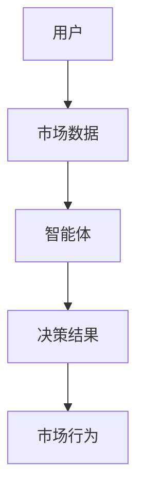
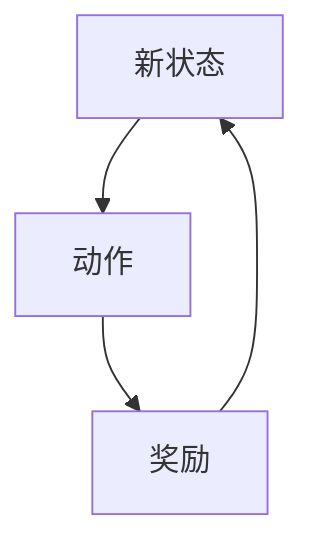
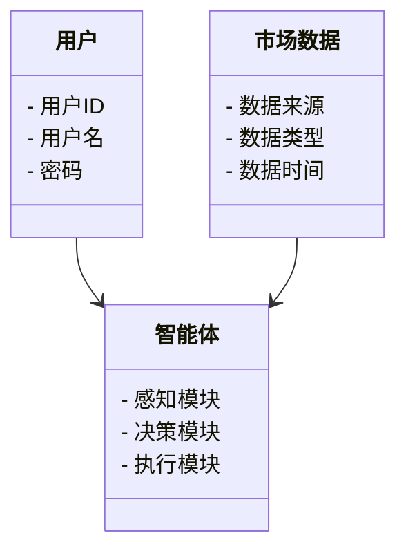
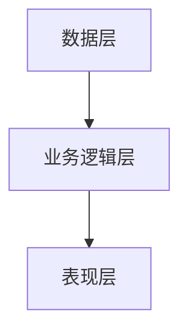

                 


# AI智能体在识别新兴市场价值机会中的作用

> 关键词：AI智能体、新兴市场、价值机会、市场分析、人工智能

> 摘要：本文探讨AI智能体在识别新兴市场价值机会中的作用，分析其核心概念、算法原理、系统架构及实际应用案例。通过详细的技术分析和案例解读，揭示AI智能体如何在新兴市场中创造价值。

---

## 第一部分: 背景介绍

### 第1章: AI智能体与新兴市场概述

#### 1.1 AI智能体的基本概念

AI智能体（Artificial Intelligence Agent，简称AI Agent）是指能够感知环境、自主决策并采取行动以实现目标的智能系统。AI智能体具备感知、决策和执行三大能力，能够在复杂环境中优化决策过程。

#### 1.2 新兴市场的定义与特点

新兴市场是指那些经济增长迅速、市场规模逐步扩大的地区，通常包括发展中国家或转型期国家。这些市场具有高增长潜力，但也伴随着高风险和不确定性。

#### 1.3 AI智能体在新兴市场中的作用

AI智能体能够通过大数据分析、模式识别和预测模型，帮助投资者和企业发现新兴市场的潜在价值机会。其在市场分析、风险评估和投资决策中的应用，显著提高了市场分析的效率和准确性。

---

## 第二部分: 核心概念与联系

### 第2章: AI智能体的核心概念与联系

#### 2.1 AI智能体的核心概念

AI智能体的核心能力包括：

- **感知能力**：通过数据采集和分析，识别市场中的潜在机会。
- **决策能力**：基于感知数据，优化投资策略。
- **执行能力**：将决策转化为实际操作，如投资或市场进入。

#### 2.2 AI智能体的核心原理

AI智能体通过强化学习和监督学习等算法，优化市场分析和决策过程。强化学习通过试错机制提高决策的准确性，而监督学习则利用历史数据训练模型，预测市场趋势。

#### 2.3 AI智能体的核心概念对比表

| 概念         | 特征             | 优势             | 劣势             |
|--------------|------------------|------------------|------------------|
| 感知能力     | 数据采集与分析   | 高效性           | 数据依赖性       |
| 决策能力     | 策略生成与优化   | 精准性           | 算法复杂性       |
| 执行能力     | 行动实施与反馈   | 实时性           | 可控性           |

#### 2.4 AI智能体的ER实体关系图



---

## 第三部分: 算法原理与数学模型

### 第3章: AI智能体的算法原理

#### 3.1 强化学习算法

强化学习通过试错机制优化决策过程。智能体通过与环境互动，获得奖励或惩罚，逐步优化策略。以下是一个简单的强化学习流程图：



#### 3.2 监督学习算法

监督学习利用历史数据训练模型，预测市场趋势。例如，使用线性回归模型预测股票价格：

$$ y = \beta_0 + \beta_1x + \epsilon $$

其中，$y$ 是预测值，$x$ 是自变量，$\beta_0$ 和 $\beta_1$ 是回归系数，$\epsilon$ 是误差项。

---

## 第四部分: 系统分析与架构设计

### 第4章: AI智能体的系统架构

#### 4.1 问题场景介绍

新兴市场中，企业需要快速识别价值机会，但面临数据不全、信息不对称等问题。AI智能体通过实时数据处理和预测模型，帮助企业在复杂环境中做出决策。

#### 4.2 系统功能设计

系统功能模块包括数据采集、分析、决策和执行。以下是领域模型：



#### 4.3 系统架构设计

系统架构采用分层设计，包括数据层、业务逻辑层和表现层。以下是架构图：



---

## 第五部分: 项目实战

### 第5章: 项目实战与案例分析

#### 5.1 项目环境安装

安装必要的开发工具和库：

- Python 3.8+
- TensorFlow 2.0+
- Scikit-learn 0.24+

#### 5.2 核心代码实现

以下是一个简单的强化学习代码示例：

```python
import numpy as np

class AI智能体:
    def __init__(self, 状态空间, 动作空间):
        self.状态空间 = 状态空间
        self.动作空间 = 动作空间
        self.奖励 = 0

    def 状态转换(self, 状态, 动作):
        return self.状态空间[np.random.choice(len(self.状态空间))]
    
    def 获取奖励(self, 状态, 动作):
        return np.random.randn()

# 示例用法
智能体 = AI智能体(状态空间=[1,2,3], 动作空间=[0,1])
状态 = 1
动作 = 0
智能体.状态转换(状态, 动作)
智能体.获取奖励(状态, 动作)
```

#### 5.3 案例分析

以新兴市场中的股票预测为例，AI智能体通过分析历史数据，预测股票价格走势，并给出投资建议。

---

## 第六部分: 最佳实践

### 第6章: 实践总结与未来发展

#### 6.1 本章小结

AI智能体在新兴市场中的应用前景广阔，其强大的数据处理和决策能力为企业创造了显著的价值。然而，AI智能体的应用仍需克服数据依赖性和算法复杂性等挑战。

#### 6.2 注意事项

- 数据质量是AI智能体性能的关键。
- 算法的选择应根据具体场景调整。
- 需要结合人工经验进行结果验证。

#### 6.3 拓展阅读

建议进一步学习强化学习和监督学习的经典论文，以及相关领域的最新研究。

---

## 总结

通过本文的详细分析，AI智能体在识别新兴市场价值机会中的潜力和应用已经清晰可见。未来，随着技术的进步，AI智能体将在更多领域发挥重要作用，为企业创造更多价值。

