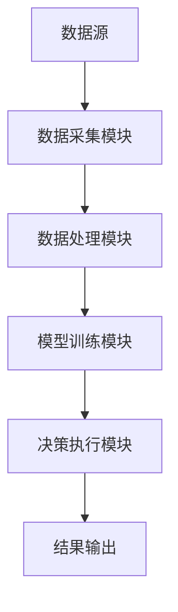

                 

<think>
好的，我现在要撰写一篇关于《AI智能体如何识别并利用市场错误定价》的技术博客文章。首先，我需要理解这个主题的核心内容，确保我能够准确地覆盖所有关键点。我会逐步分析和推理，确保文章结构清晰，内容详实。

### 1. **市场错误定价的定义与背景**

#### 1.1 市场定价的基本原理
市场定价是通过供需关系来确定商品或服务的价格。供需关系的动态变化会影响价格，而市场参与者的行为也会影响定价的准确性。在理想情况下，价格反映市场的真实价值，但在实际情况中，由于信息不对称、市场参与者情绪波动等多种因素，价格可能偏离其真实价值，这就是市场错误定价。

#### 1.2 错误定价的形成原因
错误定价的形成原因多种多样，主要包括：
- **信息不对称**：市场参与者掌握的信息不一致，导致定价不准确。
- **市场情绪影响**：投资者情绪波动可能导致价格短期偏离实际价值。
- **市场结构问题**：如垄断或寡头市场可能导致价格偏离竞争市场定价。
- **交易成本**：交易过程中的摩擦成本也可能影响最终定价。

#### 1.3 AI智能体在定价中的角色
AI智能体通过分析大量数据，识别市场中的错误定价机会。它能够快速处理和分析数据，发现价格异常，并利用这些信息进行投资或交易决策。AI智能体的优势在于其高效性和准确性，能够在短时间内处理大量信息，并根据模型预测未来的价格走势。

### 2. **AI智能体的核心概念与原理**

#### 2.1 AI智能体的基本概念
AI智能体是一种能够感知环境、做出决策并采取行动的智能系统。它具备以下特征：
- **自主性**：能够在没有外部干预的情况下独立运行。
- **反应性**：能够实时感知环境变化并做出反应。
- **目标导向**：具有明确的目标，并采取行动以实现目标。
- **学习能力**：能够通过经验改进自身的决策能力。

#### 2.2 AI智能体的决策机制
AI智能体的决策机制包括以下几个步骤：
- **数据采集与处理**：从多个来源收集市场数据，如价格、成交量、市场情绪等。
- **模型训练与优化**：利用机器学习算法对数据进行建模，训练出能够识别错误定价的模型。
- **决策执行与反馈**：根据模型的预测结果，执行交易或其他相关操作，并根据反馈不断优化模型。

#### 2.3 AI智能体的市场行为分析
AI智能体会根据市场信息进行分析，识别错误定价的机会。例如，当AI智能体发现某只股票的价格被市场低估时，它可能会建议买入该股票，以期在价格回升时获利。反之，如果发现价格被高估，它可能会建议卖出或做空。

### 3. **市场错误定价的识别算法**

#### 3.1 错误定价识别的数学模型
错误定价识别的核心在于建立一个能够反映市场真实价值的模型，并将实际价格与模型预测价格进行对比。常用的模型包括：
- **回归模型**：用于预测商品或服务的合理价格。
- **时间序列模型**：用于分析价格的变动趋势。
- **机器学习模型**：如随机森林、神经网络等，能够捕捉复杂的定价模式。

#### 3.2 基于AI的错误定价识别算法
基于AI的错误定价识别算法通常包括以下几个步骤：
- **数据预处理**：清洗数据，处理缺失值和异常值。
- **特征提取**：从数据中提取有用的特征，如价格、成交量、市场指数等。
- **模型训练**：使用机器学习算法训练模型，识别错误定价的模式。
- **错误定价识别**：通过模型预测实际价格与预测价格之间的差异，识别错误定价。

#### 3.3 算法实现与优化
以下是一个简单的基于机器学习的错误定价识别算法示例：

```python
import pandas as pd
from sklearn.ensemble import RandomForestRegressor
from sklearn.metrics import mean_squared_error
from sklearn.model_selection import train_test_split

# 加载数据
data = pd.read_csv('market_data.csv')

# 特征工程
features = data.drop('price', axis=1)
target = data['price']

# 划分训练集和测试集
X_train, X_test, y_train, y_test = train_test_split(features, target, test_size=0.2, random_state=42)

# 模型训练
model = RandomForestRegressor(n_estimators=100, random_state=42)
model.fit(X_train, y_train)

# 预测与评估
y_pred = model.predict(X_test)
mse = mean_squared_error(y_test, y_pred)
print(f"均方误差: {mse}")
```

### 4. **系统架构与设计**

#### 4.1 系统功能设计
系统功能设计包括以下几个模块：
- **数据采集模块**：从多个数据源采集市场数据。
- **数据处理模块**：清洗数据，提取有用特征。
- **模型训练模块**：训练机器学习模型，识别错误定价。
- **决策执行模块**：根据模型预测结果，执行交易或其他操作。

#### 4.2 系统架构设计
以下是一个简单的系统架构图：



### 5. **项目实战**

#### 5.1 环境安装
需要安装以下库：
- `pandas`
- `numpy`
- `scikit-learn`
- `mermaid`

#### 5.2 核心代码实现
以下是一个简单的错误定价识别代码示例：

```python
import pandas as pd
import numpy as np
from sklearn.ensemble import RandomForestRegressor
from sklearn.model_selection import train_test_split
import matplotlib.pyplot as plt

# 加载数据
data = pd.read_csv('market_data.csv')

# 特征工程
features = data.drop('price', axis=1)
target = data['price']

# 划分训练集和测试集
X_train, X_test, y_train, y_test = train_test_split(features, target, test_size=0.2, random_state=42)

# 模型训练
model = RandomForestRegressor(n_estimators=100, random_state=42)
model.fit(X_train, y_train)

# 预测与评估
y_pred = model.predict(X_test)
mse = mean_squared_error(y_test, y_pred)
print(f"均方误差: {mse}")

# 可视化
plt.scatter(y_test, y_pred)
plt.xlabel('真实价格')
plt.ylabel('预测价格')
plt.title('价格预测结果')
plt.show()
```

### 6. **最佳实践**

#### 6.1 小结
AI智能体通过分析市场数据，识别错误定价，并利用这些信息进行交易决策。这种方法能够提高市场效率，增加投资收益，并优化资源配置。

#### 6.2 注意事项
- **数据质量**：数据的质量直接影响模型的准确性，需确保数据的完整性和准确性。
- **模型优化**：模型需要不断优化，以适应市场的变化。
- **风险控制**：AI智能体的交易需要严格的风险控制，避免过度依赖模型。

#### 6.3 拓展阅读
- 《机器学习实战》
- 《AI在金融市场的应用》
- 《市场微观结构理论》

通过以上分析，我们可以看到，AI智能体在识别并利用市场错误定价方面具有巨大潜力。随着技术的不断进步，AI智能体在金融市场中的应用将更加广泛和深入。

