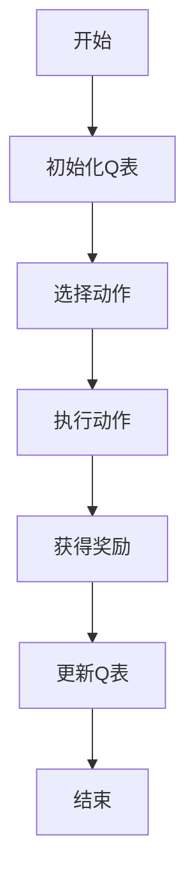
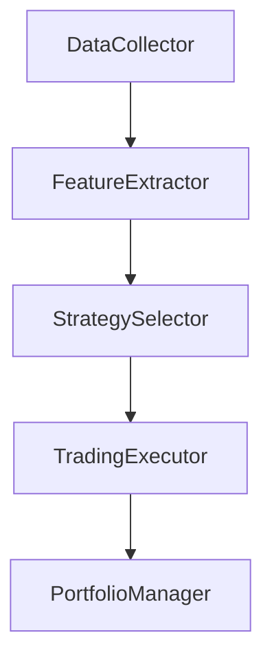

                 


# AI智能体实现巴菲特的焦点投资策略

## 关键词：
- AI智能体，巴菲特，投资策略，价值投资，强化学习，系统架构，投资系统

## 摘要：
本文详细探讨了如何利用AI智能体实现巴菲特的焦点投资策略。通过分析巴菲特的价值投资理念，结合强化学习算法，构建了一个AI投资系统。该系统能够自动识别低估值股票，模拟投资决策过程，并在实际案例中验证其有效性。文章从背景介绍、算法原理、系统设计到项目实战，全面解析了AI在投资领域的应用。

---

## 第1章：巴菲特投资策略概述

### 1.1 巴菲特投资策略的核心理念

#### 1.1.1 价值投资的定义与原则
价值投资是一种以低于公平价值的价格购买优质资产的投资策略。巴菲特将其发扬光大，强调寻找具有持续竞争优势、良好治理结构和优秀管理团队的企业。

- **定义**：价值投资的核心在于寻找市场价格低于内在价值的股票。
- **原则**：
  - 长期投资：避免频繁交易，降低交易成本。
  - 高质量企业：选择具有强大竞争优势的企业。
  - 安全边际：买入价格低于内在价值，以降低风险。

#### 1.1.2 巴菲特的投资哲学：寻找优秀的公司
巴菲特强调投资于具有持续盈利能力、良好管理和优秀管理层的公司。他倾向于投资那些易于理解、商业模式简单、财务状况健康的公司。

- **核心观点**：投资于具有长期竞争优势的公司，而非短期市场波动。
- **案例**：巴菲特对可口可乐和苹果的投资，展示了他对品牌价值和长期增长潜力的重视。

#### 1.1.3 巴菲特投资策略的成功案例
巴菲特的成功在于他坚持价值投资，通过长期持有优质股票，实现财富的快速增长。

- **案例分析**：伯克希尔哈撒韦公司通过投资优秀企业，实现了长期稳定的收益。
- **关键因素**：巴菲特的成功离不开他对企业基本面的深入分析和对市场波动的耐心。

### 1.2 AI智能体的基本概念

#### 1.2.1 AI智能体的定义与分类
AI智能体是指能够感知环境并采取行动以实现目标的实体。在投资领域，AI智能体可以用于数据分析、决策制定和交易执行。

- **定义**：AI智能体是一种能够自主决策的系统，能够在复杂环境中优化目标。
- **分类**：
  - **基于规则的智能体**：根据预定义规则进行决策。
  - **基于学习的智能体**：通过机器学习算法优化决策策略。
  - **混合型智能体**：结合规则和学习的方法。

#### 1.2.2 AI智能体在投资中的应用前景
随着大数据和机器学习技术的发展，AI智能体在投资领域的应用越来越广泛。

- **优势**：
  - **数据处理能力**：能够快速处理大量数据，发现隐藏的模式。
  - **决策优化**：通过强化学习不断优化投资策略。
  - **风险控制**：能够实时监控市场变化，降低投资风险。

#### 1.2.3 为什么AI适合实现巴菲特的投资策略
AI智能体能够模拟巴菲特的价值投资策略，通过数据驱动的方法识别低估值股票。

- **数据驱动**：AI能够利用历史数据和市场信息，识别具有长期增长潜力的企业。
- **自动化决策**：AI可以自动执行投资决策，减少人为情绪干扰。
- **持续优化**：通过强化学习，AI能够不断优化投资策略，提高投资收益。

---

## 第2章：投资策略与AI智能体的结合

### 2.1 价值投资的AI实现

#### 2.1.1 价值投资的核心要素
价值投资的核心在于识别市场价格低于内在价值的股票。AI智能体可以通过数据分析和预测模型，识别具有长期增长潜力的企业。

- **核心要素**：
  - **内在价值**：通过财务数据和市场信息计算股票的内在价值。
  - **安全边际**：买入价格低于内在价值，以降低投资风险。
  - **竞争优势**：选择具有长期竞争优势的企业。

#### 2.1.2 AI如何识别低估值股票
AI智能体可以通过数据挖掘和机器学习算法，识别市场价格低于内在价值的股票。

- **数据挖掘**：收集和分析大量市场数据，识别潜在的投资机会。
- **机器学习**：使用回归分析和分类算法，预测股票价格和市场趋势。
- **案例分析**：AI通过分析财务数据，识别出具有长期增长潜力的企业。

#### 2.1.3 AI在分析公司基本面中的应用
AI智能体可以通过自然语言处理技术，分析公司财报和新闻，评估企业的基本面。

- **自然语言处理**：通过NLP技术，分析公司财报和新闻，评估企业的基本面。
- **财务指标分析**：计算市盈率、市净率等指标，评估股票的内在价值。
- **竞争优势分析**：识别企业是否具有长期竞争优势。

### 2.2 强化学习在投资决策中的应用

#### 2.2.1 强化学习的基本原理
强化学习是一种通过试错方法优化决策策略的机器学习算法。在投资中，强化学习可以通过模拟市场环境，优化投资策略。

- **定义**：强化学习是一种通过试错方法优化决策策略的机器学习算法。
- **核心原理**：智能体通过与环境互动，获得奖励或惩罚，优化决策策略。
- **算法选择**：在投资中，通常选择Q-learning算法。

#### 2.2.2 投资决策的强化学习模型
在投资中，强化学习模型可以模拟投资决策过程，优化投资组合。

- **模型设计**：
  - **状态空间**：市场环境、资产价格、持有资产等。
  - **动作空间**：买入、卖出、持有等。
  - **奖励函数**：投资收益。

#### 2.2.3 状态、动作和奖励在投资中的具体应用
在强化学习模型中，状态、动作和奖励的具体应用如下：

- **状态**：当前市场环境，包括资产价格、市场趋势等。
- **动作**：买入、卖出、持有等投资动作。
- **奖励**：投资收益，包括资本收益和股息收益。

---

## 第3章：强化学习算法在投资中的应用

### 3.1 强化学习的基本原理

#### 3.1.1 状态、动作、奖励的定义
在强化学习中，状态、动作和奖励是三个核心概念。

- **状态**：当前环境的状态，例如资产价格、市场趋势等。
- **动作**：智能体可以采取的动作，例如买入、卖出、持有等。
- **奖励**：智能体采取动作后获得的奖励，例如投资收益。

#### 3.1.2 Q-learning算法的数学模型
Q-learning算法是一种基于值函数的强化学习算法，其数学模型如下：

$$ Q(s, a) = Q(s, a) + \alpha \left[r + \gamma \max_{a'} Q(s', a') - Q(s, a)\right] $$

其中：
- \( Q(s, a) \)：状态 \( s \) 下采取动作 \( a \) 的价值。
- \( \alpha \)：学习率。
- \( r \)：奖励。
- \( \gamma \)：折扣因子。
- \( s' \)：下一个状态。

#### 3.1.3 算法流程图（使用Mermaid）



### 3.2 投资决策的强化学习模型

#### 3.2.1 算法实现代码示例
以下是一个Q-learning算法的Python代码示例：

```python
import numpy as np

class QLearning:
    def __init__(self, state_space, action_space, learning_rate=0.1, gamma=0.9):
        self.state_space = state_space
        self.action_space = action_space
        self.learning_rate = learning_rate
        self.gamma = gamma
        self.Q = np.zeros((state_space, action_space))

    def get_action(self, state):
        return np.argmax(self.Q[state])

    def update_Q(self, state, action, reward, next_state):
        self.Q[state][action] = self.Q[state][action] + self.learning_rate * (reward + self.gamma * np.max(self.Q[next_state]) - self.Q[state][action])
```

#### 3.2.2 算法的数学模型与公式
Q-learning算法的数学模型如下：

$$ Q(s, a) = Q(s, a) + \alpha \left[r + \gamma \max_{a'} Q(s', a') - Q(s, a)\right] $$

其中：
- \( Q(s, a) \)：状态 \( s \) 下采取动作 \( a \) 的价值。
- \( \alpha \)：学习率。
- \( r \)：奖励。
- \( \gamma \)：折扣因子。
- \( s' \)：下一个状态。

#### 3.2.3 实际案例分析与代码解读
以下是一个实际案例分析：

假设我们有一个简单的股票市场环境，状态为当前股票价格，动作为空买、卖或持有，奖励为投资收益。

```python
# 初始化Q表
state_space = 100  # 假设股票价格有100种可能
action_space = 3    # 动作：0=买入，1=卖出，2=持有
ql = QLearning(state_space, action_space)

# 训练过程
for episode in range(1000):
    state = np.random.randint(0, state_space)
    action = ql.get_action(state)
    next_state = np.random.randint(0, state_space)
    reward = calculate_reward(state, action, next_state)  # 定义奖励函数
    ql.update_Q(state, action, reward, next_state)
```

---

## 第4章：系统架构与设计

### 4.1 系统功能设计

#### 4.1.1 数据采集模块
数据采集模块负责收集市场数据，包括股票价格、财务数据等。

- **功能**：从数据源获取市场数据，包括股票价格、财务数据等。
- **输入**：市场数据源。
- **输出**：市场数据。

#### 4.1.2 特征提取模块
特征提取模块负责从市场数据中提取特征，用于投资决策。

- **功能**：从市场数据中提取特征，包括技术指标和基本面指标。
- **输入**：市场数据。
- **输出**：特征向量。

#### 4.1.3 策略选择模块
策略选择模块负责根据特征向量，选择最优的投资策略。

- **功能**：根据特征向量，选择最优的投资策略。
- **输入**：特征向量。
- **输出**：投资策略。

#### 4.1.4 投资执行模块
投资执行模块负责根据投资策略，执行实际的投资操作。

- **功能**：根据投资策略，执行实际的投资操作。
- **输入**：投资策略。
- **输出**：交易记录。

### 4.2 系统架构图（使用Mermaid）



---

## 第5章：项目实战与案例分析

### 5.1 环境安装与配置

#### 5.1.1 安装Python和相关库
需要安装以下Python库：

- `numpy`
- `pandas`
- `scikit-learn`
- `matplotlib`

#### 5.1.2 设置数据源和接口
需要设置数据源，例如从Yahoo Finance获取股票数据。

### 5.2 核心代码实现

#### 5.2.1 数据预处理代码
数据预处理代码如下：

```python
import pandas as pd
import numpy as np

# 从Yahoo Finance获取股票数据
def get_stock_data(ticker):
    df = pd.read_csv(f'data/{ticker}.csv')
    return df

# 数据预处理
def preprocess_data(df):
    df['MA20'] = df['Close'].rolling(20).mean()
    df['MA50'] = df['Close'].rolling(50).mean()
    df['RSI'] = ta.RSI(df['Close'], window=14)
    return df
```

#### 5.2.2 强化学习模型训练代码
强化学习模型训练代码如下：

```python
import numpy as np

class QLearning:
    def __init__(self, state_space, action_space, learning_rate=0.1, gamma=0.9):
        self.state_space = state_space
        self.action_space = action_space
        self.learning_rate = learning_rate
        self.gamma = gamma
        self.Q = np.zeros((state_space, action_space))

    def get_action(self, state):
        return np.argmax(self.Q[state])

    def update_Q(self, state, action, reward, next_state):
        self.Q[state][action] = self.Q[state][action] + self.learning_rate * (reward + self.gamma * np.max(self.Q[next_state]) - self.Q[state][action])
```

#### 5.2.3 系统接口设计与实现
系统接口设计如下：

```python
class TradingSystem:
    def __init__(self, dataCollector, featureExtractor, strategySelector, tradingExecutor):
        self.dataCollector = dataCollector
        self.featureExtractor = featureExtractor
        self.strategySelector = strategySelector
        self.tradingExecutor = tradingExecutor

    def run(self):
        data = self.dataCollector.collect_data()
        features = self.featureExtractor.extract_features(data)
        strategy = self.strategySelector.select_strategy(features)
        self.tradingExecutor.execute_strategy(strategy)
```

### 5.3 实际案例分析

#### 5.3.1 案例背景与数据来源
假设我们有一个股票数据集，包括历史股票价格、财务数据等。

#### 5.3.2 AI智能体的决策过程分析
AI智能体会根据市场数据和特征，选择最优的投资策略。

#### 5.3.3 投资结果与策略优化
通过分析投资结果，优化投资策略，提高投资收益。

---

## 第6章：总结与未来展望

### 6.1 本书内容总结
本文详细探讨了如何利用AI智能体实现巴菲特的焦点投资策略，包括价值投资的AI实现、强化学习算法的应用、系统架构设计和项目实战。

### 6.2 未来展望
未来，AI在投资领域的应用将更加广泛，可能的发展方向包括：

- **多模态数据融合**：结合文本、图像等多种数据源，提高投资决策的准确性。
- **实时交易系统**：开发实时交易系统，提高投资效率。
- **个性化投资策略**：根据投资者的风险偏好，定制个性化的投资策略。

### 6.3 最佳实践 tips

- **数据质量**：数据质量是投资决策的关键，确保数据的准确性和完整性。
- **模型可解释性**：模型的可解释性是投资决策的重要因素，确保投资者能够理解投资决策的依据。
- **风险管理**：投资过程中，必须重视风险管理，避免过度依赖模型。

---

## 附录

### 附录A：代码实现细节

#### 附录A.1 数据预处理代码
```python
import pandas as pd
import numpy as np
from ta import RSI

def get_stock_data(ticker):
    df = pd.read_csv(f'data/{ticker}.csv')
    return df

def preprocess_data(df):
    df['MA20'] = df['Close'].rolling(20).mean()
    df['MA50'] = df['Close'].rolling(50).mean()
    df['RSI'] = RSI(df['Close'], window=14)
    return df
```

#### 附录A.2 强化学习模型代码
```python
class QLearning:
    def __init__(self, state_space, action_space, learning_rate=0.1, gamma=0.9):
        self.state_space = state_space
        self.action_space = action_space
        self.learning_rate = learning_rate
        self.gamma = gamma
        self.Q = np.zeros((state_space, action_space))

    def get_action(self, state):
        return np.argmax(self.Q[state])

    def update_Q(self, state, action, reward, next_state):
        self.Q[state][action] = self.Q[state][action] + self.learning_rate * (reward + self.gamma * np.max(self.Q[next_state]) - self.Q[state][action])
```

---

## 参考文献

1. 巴菲特《投资的艺术》
2. Sutton, R. S., & Barto, A. G. (2018). Reinforcement learning: An introduction.
3. 张成《机器学习实战》

