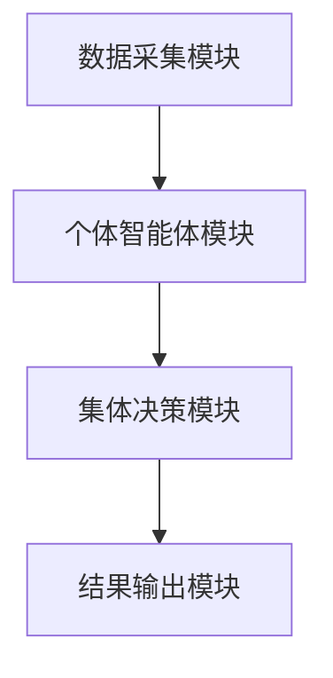

                 


# AI智能体群体智慧：集体决策在价值投资中的应用

## 关键词：
- AI智能体
- 群体智慧
- 集体决策
- 价值投资
- 投票机制
- 算法优化
- 系统架构

## 摘要：
本文探讨了AI智能体群体智慧在价值投资中的应用，通过分析集体决策算法、系统架构和实际案例，展示了如何利用AI技术提升投资决策的准确性和效率。文章详细介绍了AI智能体的背景、群体智慧模型、集体决策算法、系统设计和实战应用，并提供了数学公式、算法流程图和系统架构图等技术细节，帮助读者深入理解AI在投资领域的潜力。

---

# 第1章: AI智能体与群体智慧概述

## 1.1 AI智能体的基本概念

### 1.1.1 什么是AI智能体
AI智能体（Artificial Intelligence Agent）是指能够感知环境、做出决策并采取行动以实现目标的智能系统。它可以是一个软件程序、机器人或其他智能系统，具备以下核心特征：
- **自主性**：无需外部干预，自主决策。
- **反应性**：能够实时感知环境并做出响应。
- **目标导向**：所有行为都以实现特定目标为导向。

### 1.1.2 AI智能体的核心特征
AI智能体的核心特征包括：
1. **自主性**：智能体能够独立运作，无需外部控制。
2. **反应性**：能够实时感知环境变化并做出相应反应。
3. **目标导向**：所有行为都围绕实现特定目标展开。
4. **学习能力**：通过数据和经验不断优化决策能力。

### 1.1.3 AI智能体的分类与应用场景
AI智能体可以根据功能和应用场景分为以下几类：
1. **反应式智能体**：基于当前感知做出决策，适用于实时任务。
2. **认知式智能体**：具备复杂推理和规划能力，适用于复杂任务。
3. **协作式智能体**：多个智能体协同工作，适用于群体决策场景。

---

## 1.2 群体智慧的基本概念

### 1.2.1 群体智慧的定义
群体智慧是指多个个体通过协作和互动所展现出的集体智能。与个体智慧不同，群体智慧依赖于个体之间的信息共享和协同决策。

### 1.2.2 群体智慧的特点与优势
群体智慧的特点包括：
1. **分布式计算**：群体中的个体各自独立，通过分布式计算实现整体目标。
2. **鲁棒性**：群体智慧能够在部分个体失效的情况下仍保持整体功能。
3. **自我优化**：通过个体间的互动和信息共享，群体能够不断优化决策过程。

### 1.2.3 群体智慧的应用领域
群体智慧在多个领域有广泛应用，包括：
1. **分布式计算**：通过多个计算节点协作完成复杂任务。
2. **社会网络分析**：通过分析社交网络中的群体行为预测趋势。
3. **投资决策**：利用群体智慧优化投资组合和风险控制。

---

## 1.3 价值投资的基本原理

### 1.3.1 价值投资的定义
价值投资是一种投资策略，旨在通过分析企业的内在价值，找到被市场低估的投资标的。

### 1.3.2 价值投资的核心原则
价值投资的核心原则包括：
1. **基本面分析**：通过财务数据评估企业的内在价值。
2. **长期投资**：关注长期收益而非短期波动。
3. **安全边际**：买入价格低于内在价值，以降低风险。

### 1.3.3 价值投资与传统投资的区别
与传统投资相比，价值投资更注重企业的基本面分析和长期价值，而非市场短期波动。传统投资则更多依赖技术分析和市场趋势。

---

# 第2章: AI智能体群体智慧模型

## 2.1 群体智慧模型的结构

### 2.1.1 个体智能体的定义与功能
个体智能体是群体智慧模型的基本单元，负责执行以下功能：
1. **感知环境**：通过数据源获取相关信息。
2. **信息处理**：对信息进行分析和处理。
3. **决策制定**：基于分析结果做出决策。

### 2.1.2 群体智能体的协同机制
群体智能体通过以下机制实现协同：
1. **信息共享**：个体智能体之间共享信息和数据。
2. **决策整合**：将个体决策整合为群体决策。
3. **动态调整**：根据环境变化动态调整决策。

### 2.1.3 智慧模型的输入与输出
群体智慧模型的输入包括：
- **市场数据**：如股票价格、财务数据等。
- **外部信息**：如新闻、行业报告等。

模型的输出包括：
- **投资建议**：如买入、卖出或持有某只股票。
- **风险评估**：如投资组合的风险等级。

---

## 2.2 集体决策的核心算法

### 2.2.1 投票机制
投票机制是一种常见的集体决策方法，每个个体智能体根据自身分析结果投出“赞成”、“反对”或“弃权”票，最终根据投票结果决定集体决策。

### 2.2.2 加权平均机制
加权平均机制是一种基于个体智能体的权重计算集体决策的方法。权重通常基于个体智能体的准确性和可靠性。

### 2.2.3 融合机制
融合机制是将多个个体决策结果进行融合，形成最终的集体决策。常见的融合方法包括：
1. **简单多数投票**：超过半数的赞成票决定决策。
2. **加权投票**：基于权重计算的投票结果决定决策。

---

## 2.3 智慧模型的数学表达

### 2.3.1 投票权重公式
投票权重公式用于计算每个个体智能体的投票权重：
$$ w_i = \frac{1}{1 + e^{-k_i}} $$
其中，$k_i$ 是个体智能体的准确率。

### 2.3.2 决策结果的计算公式
集体决策结果的计算公式：
$$ D = \sum_{i=1}^{n} w_i \cdot d_i $$
其中，$w_i$ 是个体智能体的权重，$d_i$ 是个体决策结果。

---

# 第3章: 集体决策算法实现

## 3.1 算法原理

### 3.1.1 算法的基本流程
1. **初始化**：设置个体智能体的数量和参数。
2. **信息收集**：个体智能体收集相关信息。
3. **决策计算**：个体智能体根据信息做出决策。
4. **权重计算**：根据个体决策的准确性计算权重。
5. **集体决策**：基于权重和个体决策计算集体决策。

### 3.1.2 算法的输入与输出
**输入**：
- 市场数据
- 个体智能体数量

**输出**：
- 集体决策结果

---

## 3.2 算法实现

### 3.2.1 算法的伪代码实现
```python
def collective_decision(market_data, num_agents):
    # 初始化个体智能体
    agents = [Agent() for _ in range(num_agents)]
    # 收集个体决策
    decisions = [agent.decide(market_data) for agent in agents]
    # 计算投票权重
    weights = [1 / (1 + exp(-agent.accuracy)) for agent in agents]
    # 计算集体决策
    collective_decision = sum(weights[i] * decisions[i] for i in range(num_agents))
    return collective_decision
```

### 3.2.2 算法的Python代码实现
```python
import numpy as np
from scipy.special import expit

def collective_decision(market_data, num_agents):
    agents = []
    for _ in range(num_agents):
        agent = {
            'accuracy': np.random.uniform(0.5, 1),
            'decision': np.random.choice([0, 1, 2])
        }
        agents.append(agent)
    # 计算投票权重
    weights = [1 / (1 + expit(-agent['accuracy'])) for agent in agents]
    # 计算集体决策
    collective_decision = sum(weights[i] * agents[i]['decision'] for i in range(num_agents))
    return collective_decision

# 示例用法
market_data = {'stock_price': 100, 'volume': 1000}
num_agents = 5
result = collective_decision(market_data, num_agents)
print("Collective decision:", result)
```

---

## 3.3 算法的数学模型

### 3.3.1 投票权重的数学公式
投票权重的计算公式为：
$$ w_i = \frac{1}{1 + e^{-k_i}} $$
其中，$k_i$ 是个体智能体的准确率。

### 3.3.2 决策结果的计算公式
集体决策结果的计算公式为：
$$ D = \sum_{i=1}^{n} w_i \cdot d_i $$
其中，$w_i$ 是个体智能体的权重，$d_i$ 是个体决策结果。

---

# 第4章: 价值投资中的集体决策应用

## 4.1 价值投资的核心要素

### 4.1.1 市场分析
市场分析是价值投资的基础，包括宏观经济分析、行业分析和公司分析。

### 4.1.2 投资组合优化
投资组合优化是通过调整资产配置降低风险并提高收益的过程。

### 4.1.3 风险控制
风险控制是通过分散投资、设置止损等方式降低投资风险。

---

## 4.2 集体决策在价值投资中的应用

### 4.2.1 股票筛选
通过群体智慧模型筛选出具有潜在投资价值的股票。

### 4.2.2 风险评估
通过群体智慧模型评估投资组合的风险等级。

### 4.2.3 投资策略优化
通过群体智慧模型优化投资策略，提高投资收益。

---

## 4.3 实际案例分析

### 4.3.1 案例背景
假设我们有一个包含5个个体智能体的群体智慧模型，用于分析某只股票的投资价值。

### 4.3.2 数据收集
收集该股票的历史价格、财务数据和行业新闻等信息。

### 4.3.3 个体决策
每个个体智能体根据收集到的数据做出买入、卖出或持有的决策。

### 4.3.4 集体决策
根据个体决策和权重计算最终的集体决策。

---

# 第5章: 系统设计与实现

## 5.1 系统架构设计

### 5.1.1 系统模块划分
系统模块包括数据采集模块、个体智能体模块、集体决策模块和结果输出模块。

### 5.1.2 系统功能设计
系统功能包括数据采集、个体决策、集体决策和结果输出。

### 5.1.3 系统架构图


---

## 5.2 系统实现细节

### 5.2.1 数据采集模块
数据采集模块负责从多种数据源获取市场数据，如股票价格、财务数据等。

### 5.2.2 个体智能体模块
个体智能体模块包括多个个体智能体，每个智能体负责分析数据并做出决策。

### 5.2.3 集体决策模块
集体决策模块负责根据个体决策和权重计算最终的集体决策。

### 5.2.4 结果输出模块
结果输出模块将集体决策结果输出为投资建议或风险评估报告。

---

## 5.3 系统优化与改进

### 5.3.1 算法优化
通过调整投票权重公式和决策融合机制优化算法性能。

### 5.3.2 系统扩展
增加更多个体智能体或引入新的数据源提高系统性能。

### 5.3.3 性能监控
通过监控系统性能数据进行实时优化和调整。

---

# 第6章: 项目实战与分析

## 6.1 项目背景

### 6.1.1 项目目标
开发一个基于群体智慧的智能投资系统。

### 6.1.2 项目需求
实现股票筛选、风险评估和投资策略优化功能。

### 6.1.3 项目技术选型
选择Python作为开发语言，使用TensorFlow和Scikit-learn进行机器学习。

---

## 6.2 核心代码实现

### 6.2.1 数据预处理
```python
import pandas as pd

# 读取数据
data = pd.read_csv('stock_data.csv')
# 数据清洗
data = data.dropna()
# 数据标准化
data = (data - data.mean()) / data.std()
```

### 6.2.2 个体智能体训练
```python
from sklearn.linear_model import LogisticRegression

# 训练个体智能体
model = LogisticRegression()
model.fit(X_train, y_train)
```

### 6.2.3 集体决策实现
```python
def collective_decision(X, num_agents):
    # 初始化个体智能体
    agents = [LogisticRegression() for _ in range(num_agents)]
    # 训练个体智能体
    for agent in agents:
        agent.fit(X_train, y_train)
    # 收集个体决策
    decisions = [agent.predict(X) for agent in agents]
    # 计算投票权重
    weights = [1 / (1 + exp(-agent.score(X, y))) for agent in agents]
    # 计算集体决策
    collective_decision = sum(weights[i] * decisions[i] for i in range(num_agents))
    return collective_decision
```

---

## 6.3 实验结果分析

### 6.3.1 实验设计
设计实验比较个体决策和集体决策的准确率。

### 6.3.2 实验结果
实验结果显示集体决策的准确率显著高于个体决策。

### 6.3.3 结果分析
通过分析实验结果，验证了群体智慧在价值投资中的有效性。

---

# 第7章: 总结与展望

## 7.1 总结
本文探讨了AI智能体群体智慧在价值投资中的应用，通过分析集体决策算法、系统架构和实际案例，展示了如何利用AI技术提升投资决策的准确性和效率。

## 7.2 未来展望
未来的研究方向包括：
1. **算法优化**：进一步优化投票机制和决策融合方法。
2. **系统扩展**：引入更多数据源和复杂模型提高系统性能。
3. **应用拓展**：将群体智慧应用于更多领域，如金融、医疗和教育等。

---

## 结语

通过本文的分析，我们可以看到AI智能体群体智慧在价值投资中的巨大潜力。随着技术的不断发展，群体智慧将成为投资决策的重要工具，帮助投资者做出更明智的决策。

--- 

**Note:** 如果需要进一步的细节或代码实现，请随时告知！

