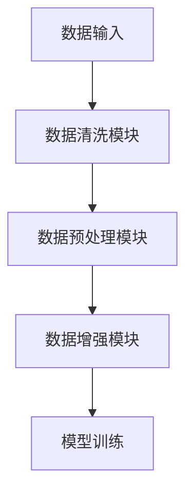
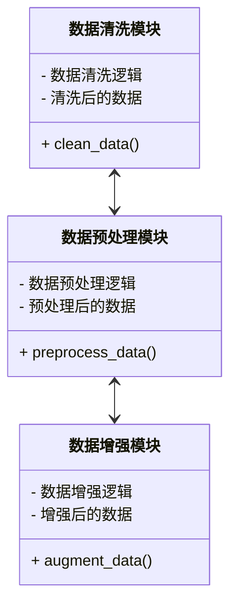
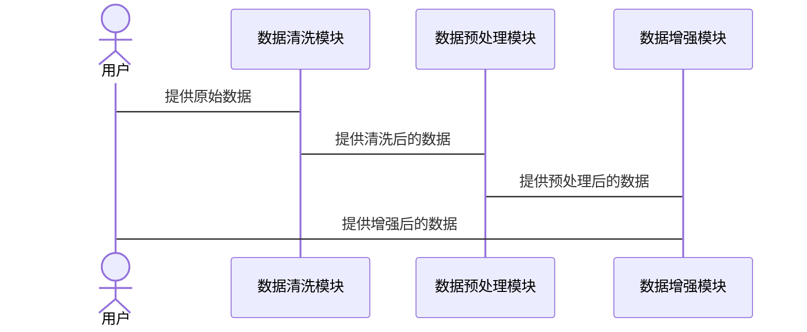

                 


# AI模型训练数据收集与处理技巧

> 关键词：AI模型训练，数据收集，数据处理，数据清洗，数据预处理，数据增强

> 摘要：本文将详细探讨AI模型训练过程中数据收集与处理的核心技巧。从数据收集的背景与挑战，到数据处理的算法原理，再到系统的架构设计，我们将逐步分析如何高效、准确地进行数据处理，以提升AI模型的训练效果。

---

## 第一部分: AI模型训练数据收集与处理背景

### 第1章: AI模型训练数据收集与处理概述

#### 1.1 数据在AI模型训练中的作用

数据是AI模型训练的核心，直接决定了模型的性能。高质量的数据能够显著提升模型的准确性和泛化能力，而低质量或不完整的数据可能导致模型性能下降甚至失败。

- **数据的重要性**：数据是AI模型的“燃料”，决定了模型的学习能力和输出结果。
- **数据的基本概念**：数据可以是结构化的（如表格数据）或非结构化的（如文本、图像），并需要经过清洗和预处理才能用于训练。
- **数据的质量问题**：数据可能存在噪声、缺失值、偏差等问题，需要通过数据清洗和增强来解决。

#### 1.2 数据收集的背景与挑战

数据收集是AI模型训练的第一步，其背景和挑战如下：

- **数据收集的背景**：随着AI技术的发展，数据需求急剧增加，数据收集已成为AI项目的核心环节。
- **数据收集的挑战**：
  - 数据来源多样，可能涉及不同格式和渠道。
  - 数据可能包含噪声或冗余信息，需要进行清洗。
  - 数据收集可能涉及隐私和合规性问题。
- **数据收集的边界与外延**：数据收集不仅仅是获取原始数据，还包括对数据的初步处理和验证。

#### 1.3 数据处理的核心要素

数据处理是数据收集的重要环节，核心要素包括：

- **数据处理的基本概念**：数据处理是对数据进行清洗、转换和增强的过程，以确保数据适合模型训练。
- **数据处理的核心要素**：
  - 数据清洗：去除噪声和冗余信息。
  - 数据转换：将数据转换为适合模型输入的格式。
  - 数据增强：通过增加数据的多样性和丰富性来提升模型的泛化能力。
- **数据处理的流程与阶段**：数据处理通常包括数据清洗、预处理和增强三个阶段。

---

## 第二部分: 数据收集与处理的核心概念

### 第2章: 数据收集的原理与方法

#### 2.1 数据收集的原理

数据收集的原理主要涉及数据的获取、存储和初步处理：

- **数据收集的定义**：数据收集是通过各种渠道获取原始数据的过程。
- **数据收集的核心概念**：数据收集需要考虑数据的来源、格式和质量。
- **数据收集的关键属性特征对比**：不同数据来源（如数据库、网络爬取、传感器）的特点对比。

#### 2.2 数据收集的方法

数据收集的方法多种多样，以下是主要方法及其优缺点对比：

- **数据收集的主要方法**：
  - **结构化数据收集**：从数据库中提取结构化数据。
  - **非结构化数据收集**：从文本文件、图像等非结构化数据源中收集。
  - **网络爬取**：通过网页爬虫技术收集数据。
- **数据收集的优缺点对比**：
  | 方法        | 优点                          | 缺点                          |
  |-------------|-------------------------------|-------------------------------|
  | 数据库提取  | 数据准确、结构清晰            | 数据量可能受限                |
  | 网络爬取    | 数据量大、来源广泛            | 可能涉及法律和道德问题        |
  | 传感器采集  | 数据实时性强                  | 数据可能受到环境干扰          |

#### 2.3 数据收集的工具与技术

- **数据收集的常用工具**：
  - **数据库工具**：如MySQL、MongoDB。
  - **网络爬虫工具**：如Scrapy、BeautifulSoup。
  - **数据采集API**：如公开API（如Twitter API）。
- **数据收集的技术实现**：通过API或爬虫获取数据，并进行初步清洗和存储。
- **数据收集的注意事项**：遵守数据收集的法律法规，避免侵犯隐私。

#### 2.4 数据收集的实体关系图

以下是一个数据收集的实体关系图：

```mermaid
er
actor: 数据收集者
database: 数据库
external_source: 外部数据源
tool: 数据收集工具

actor --> database: 从数据库获取数据
actor --> external_source: 从外部数据源获取数据
actor --> tool: 使用工具进行数据收集
```

---

## 第三部分: 数据处理的算法原理

### 第3章: 数据清洗与预处理的算法原理

#### 3.1 数据清洗的基本原理

数据清洗是数据处理的第一步，旨在去除噪声和冗余信息：

- **数据清洗的定义**：数据清洗是指通过识别和处理数据中的错误、噪声或冗余信息，以提高数据质量的过程。
- **数据清洗的算法流程**：
  1. 识别缺失值。
  2. 处理异常值。
  3. 去除重复数据。
- **数据清洗的数学模型**：数据清洗通常基于统计方法或规则，例如均值填充缺失值。

#### 3.2 数据预处理的核心算法

数据预处理是将数据转换为适合模型输入格式的过程：

- **数据预处理的算法实现**：
  - **归一化**：将数据缩放到统一的范围内。
  - **标准化**：将数据标准化为均值为0，方差为1。
  - **分词**：对文本数据进行分词处理。
- **数据预处理的数学公式**：
  - **归一化公式**：$x_{\text{归一化}} = \frac{x - \min}{\max - \min}$
  - **标准化公式**：$z = \frac{x - \mu}{\sigma}$
- **数据预处理的代码实现**：以下是一个Python代码示例：

```python
import pandas as pd
from sklearn.preprocessing import StandardScaler

# 示例数据
data = pd.DataFrame({'x': [1, 2, 3, 4, 5]})

# 归一化
min_val = data['x'].min()
max_val = data['x'].max()
normalized_data = (data['x'] - min_val) / (max_val - min_val)

# 标准化
scaler = StandardScaler()
standardized_data = scaler.fit_transform(data[['x']])

print("归一化结果:", normalized_data)
print("标准化结果:", standardized_data)
```

#### 3.3 数据增强的原理与方法

数据增强是通过增加数据的多样性和丰富性来提升模型性能的方法：

- **数据增强的定义**：数据增强是指通过对现有数据进行变换，生成更多样化的数据。
- **数据增强的主要方法**：
  - **图像数据增强**：旋转、翻转、裁剪、添加噪声。
  - **文本数据增强**：同义词替换、句式变换。
- **数据增强的算法流程**：
  1. 读取原始数据。
  2. 应用增强方法生成新数据。
  3. 将增强后的数据加入训练集。

#### 3.4 数据处理的系统架构

数据处理系统通常包括以下几个模块：

- **数据清洗模块**：负责去除噪声和冗余数据。
- **数据预处理模块**：负责将数据转换为适合模型输入的格式。
- **数据增强模块**：负责生成多样化的数据。

系统架构图如下：



---

## 第四部分: 数据处理的系统架构与设计

### 第4章: 数据处理系统的设计与实现

#### 4.1 数据处理系统的项目介绍

- **项目背景与目标**：本项目旨在设计一个高效的数据处理系统，用于AI模型训练的数据准备。
- **项目的主要功能**：
  - 数据清洗。
  - 数据预处理。
  - 数据增强。
- **项目的实现方案**：采用模块化设计，分别实现数据清洗、预处理和增强功能。

#### 4.2 数据处理系统的功能设计

- **数据处理的功能模块**：
  - 数据清洗模块：去除缺失值、异常值。
  - 数据预处理模块：归一化、标准化。
  - 数据增强模块：图像旋转、翻转。
- **数据处理的功能流程**：
  1. 读取原始数据。
  2. 数据清洗。
  3. 数据预处理。
  4. 数据增强。
  5. 输出处理后的数据。

#### 4.3 数据处理的系统架构

系统架构设计如下：



#### 4.4 数据处理的交互流程

交互流程如下：



---

## 第五部分: 项目实战与最佳实践

### 5.1 项目实战

#### 5.1.1 数据处理的环境安装

- **Python环境**：安装Python 3.8及以上版本。
- **依赖库安装**：使用以下命令安装所需库：
  ```bash
  pip install pandas scikit-learn matplotlib
  ```

#### 5.1.2 数据处理的核心实现源代码

以下是一个完整的数据处理代码示例：

```python
import pandas as pd
from sklearn.preprocessing import StandardScaler
from skimage.transform import rotate, flip
import numpy as np

# 示例数据
data = pd.DataFrame({'x': [1, 2, 3, 4, 5]})
images = np.random.rand(10, 10, 3)  # 示例图像数据

# 数据清洗
# 假设数据中存在缺失值
cleaned_data = data.dropna()

# 数据预处理
scaler = StandardScaler()
preprocessed_data = scaler.fit_transform(cleaned_data[['x']])

# 数据增强（图像示例）
augmented_images = []
for img in images:
    # 旋转
    img_rotated = rotate(img, 45)
    # 翻转
    img_flipped = flip(img_rotated, 1)
    augmented_images.append(img_flipped)

print("清洗后的数据:", cleaned_data)
print("预处理后的数据:", preprocessed_data)
print("增强后的图像数量:", len(augmented_images))
```

#### 5.1.3 代码应用解读与分析

- **数据清洗**：使用`dropna()`方法去除缺失值。
- **数据预处理**：使用`StandardScaler`对数据进行标准化处理。
- **数据增强**：对图像数据进行旋转和翻转处理，生成更多样化的数据。

#### 5.1.4 实际案例分析

假设我们有一个图像分类任务，使用数据增强可以显著提升模型的泛化能力。通过上述代码，我们可以生成更多样化的训练数据，从而提高模型的准确率。

---

## 第六部分: 最佳实践与注意事项

### 6.1 最佳实践

- **数据质量优先**：确保数据的准确性和完整性。
- **数据安全与隐私**：在数据收集和处理过程中，严格遵守隐私保护法规。
- **工具与技术选择**：根据具体需求选择合适的数据处理工具和技术。

### 6.2 注意事项

- **避免过度处理**：数据处理应适度，过度处理可能导致数据失真。
- **数据版本控制**：对处理后的数据进行版本控制，确保数据可追溯。
- **持续优化**：根据模型表现不断优化数据处理流程。

### 6.3 拓展阅读

- **《机器学习实战》**：深入探讨数据预处理的技巧。
- **《数据科学导论》**：系统介绍数据收集与处理的方法。

---

## 本文总结

通过本文的详细讲解，我们了解了AI模型训练数据收集与处理的核心技巧。从数据收集的背景与挑战，到数据处理的算法原理，再到系统的架构设计，我们逐步分析了如何高效、准确地进行数据处理。希望本文的内容能够为读者在AI模型训练中提供有价值的参考和指导。

