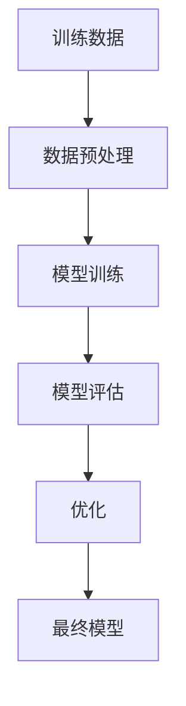
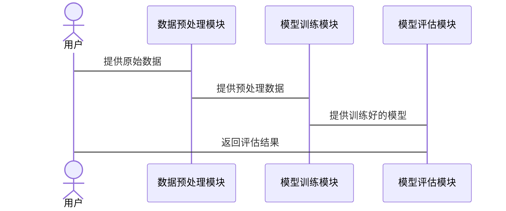

                 


# AI模型训练的步骤与最佳实践

---

## 关键词：
AI模型训练、机器学习、深度学习、算法优化、数据预处理、模型评估、系统架构

---

## 摘要：
本文将详细探讨AI模型训练的步骤与最佳实践，从背景介绍到项目实战，系统性地分析AI模型训练的核心概念、算法原理、系统架构设计以及实际应用。通过丰富的案例分析和代码示例，帮助读者深入理解AI模型训练的关键环节，并掌握实际操作中的技巧与注意事项。

---

# 第一部分: AI模型训练的背景与核心概念

# 第1章: AI模型训练的基本概念

## 1.1 AI模型训练的定义与背景

### 1.1.1 什么是AI模型训练
AI模型训练是通过算法优化和数据驱动的方式，让计算机从数据中学习并生成具有特定预测能力的模型的过程。训练的目标是使模型能够准确地识别模式、分类、回归或生成新的数据。

### 1.1.2 AI模型训练的背景与现状
随着大数据和计算能力的提升，AI模型训练已成为现代技术的核心。从图像识别、自然语言处理到智能推荐，AI模型训练在各个领域都得到了广泛应用。

### 1.1.3 训练AI模型的意义与价值
AI模型训练能够帮助企业自动化决策、提高效率、降低成本，并为创新应用提供技术支持。通过训练高质量的AI模型，企业可以在竞争中占据优势。

## 1.2 AI模型训练的基本流程

### 1.2.1 数据准备阶段
数据是AI模型训练的基础。需要对数据进行清洗、归一化、特征提取等预处理，确保数据质量和适用性。

### 1.2.2 模型选择阶段
根据问题类型（分类、回归、聚类等）选择合适的模型架构，如线性回归、决策树、神经网络等。

### 1.2.3 模型训练阶段
使用训练数据，通过优化算法（如梯度下降）调整模型参数，使模型在训练数据上的损失最小化。

### 1.2.4 模型评估与优化阶段
通过验证集或测试集评估模型性能，并通过超参数调优、数据增强等方法进一步优化模型。

## 1.3 AI模型训练的核心要素

### 1.3.1 数据的重要性
数据的质量和数量直接影响模型性能。高质量的数据能够提高模型的泛化能力。

### 1.3.2 模型的可选性
模型的选择需要结合任务需求、数据特性以及计算资源。复杂的模型可能表现更好，但也会面临过拟合和计算成本高的问题。

### 1.3.3 算法的选择与优化
不同的算法适用于不同的场景。选择合适的算法并对其进行优化是训练高效模型的关键。

### 1.3.4 训练环境的配置与管理
计算资源（如GPU）的合理配置能够显著提升训练效率。此外，版本控制和实验记录也是管理训练过程的重要环节。

## 1.4 本章小结
本章介绍了AI模型训练的基本概念、流程和核心要素，为后续章节的学习奠定了基础。

---

# 第二部分: AI模型训练的核心概念与联系

# 第2章: AI模型训练的核心概念

## 2.1 数据的核心作用

### 2.1.1 数据的类型与特征
数据可以分为结构化数据、非结构化数据等类型。特征工程是提升模型性能的重要环节。

| 数据类型 | 描述 | 示例 |
|----------|------|------|
| 结构化数据 | 有明确结构 | CSV数据 |
| 非结构化数据 | 无明确结构 | 文本、图像 |

### 2.1.2 数据预处理的关键步骤
数据预处理包括数据清洗、特征提取、归一化/标准化等步骤。

### 2.1.3 数据质量对模型性能的影响
低质量的数据可能导致模型性能下降或过拟合。

## 2.2 模型的结构与选择

### 2.2.1 常见AI模型的分类
AI模型可以分为监督学习、无监督学习、强化学习等类型。

| 学习类型 | 描述 | 示例 |
|----------|------|------|
| 监督学习 | 基于标注数据 | 分类、回归 |
| 无监督学习 | 基于无标注数据 | 聚类、降维 |
| 强化学习 | 基于奖励机制 | 游戏AI |

### 2.2.2 模型选择的策略与方法
模型选择需要考虑任务需求、数据特性、计算资源等因素。

### 2.2.3 模型复杂度与性能的平衡
复杂的模型可能表现更好，但也会面临过拟合和计算成本高的问题。

## 2.3 算法的原理与应用

### 2.3.1 监督学习、无监督学习与强化学习的区别
- 监督学习：基于标注数据，预测目标变量。
- 无监督学习：基于无标注数据，发现数据内在结构。
- 强化学习：通过与环境交互，学习最优策略。

### 2.3.2 常用AI算法的优缺点对比

| 算法 | 优点 | 缺点 |
|------|------|------|
| 线性回归 | 简单、高效 | 无法处理非线性关系 |
| 支持向量机 | 准确率高 | 数据预处理复杂 |
| 随机森林 | 抗过拟合 | 计算成本高 |
| 神经网络 | 表现能力强 | 需要大量数据和计算资源 |

### 2.3.3 算法选择的场景分析
根据任务需求和数据特性选择合适的算法。例如，图像分类适合使用卷积神经网络，而文本分类可以使用循环神经网络或Transformer模型。

## 2.4 模型训练的评价指标

### 2.4.1 分类问题的评价指标
- 准确率：正确预测的比例。
- 召回率：真实为正的样本中被正确预测的比例。
- F1分数：准确率和召回率的调和平均数。

### 2.4.2 回归问题的评价指标
- �均方误差（MSE）：预测值与真实值的平方差的平均值。
- 平均绝对误差（MAE）：预测值与真实值的绝对差的平均值。
- R²系数：模型解释的比例。

## 2.5 本章小结
本章详细介绍了数据和算法在AI模型训练中的核心作用，并提供了选择和优化的策略。

---

# 第三部分: AI模型训练的算法原理与系统架构

# 第3章: AI模型训练的算法原理

## 3.1 线性回归算法

### 3.1.1 算法原理
线性回归是一种用于回归问题的简单算法，通过最小化预测值与真实值之间的平方差来优化模型参数。

$$ \text{损失函数} = \sum_{i=1}^{n}(y_i - \hat{y_i})^2 $$

### 3.1.2 算法实现
以下是一个简单的线性回归实现示例：

```python
import numpy as np
from sklearn.linear_model import LinearRegression

# 生成数据
X = np.random.rand(100, 1)
y = 2 * X + 1 + np.random.randn(100, 1)

# 训练模型
model = LinearRegression()
model.fit(X, y)

# 预测
print(model.predict(X))
```

### 3.1.3 应用场景
线性回归适用于简单的线性关系问题，如房价预测。

## 3.2 支持向量机算法

### 3.2.1 算法原理
支持向量机（SVM）是一种分类算法，通过构建超平面将数据分成不同的类别。

$$ \text{目标函数} = \max_{w,b} \sum_{i=1}^{n} y_i(w \cdot x_i + b) - 1 $$

### 3.2.2 算法实现
以下是一个SVM实现的示例：

```python
from sklearn import svm

# 生成数据
X = np.array([[0, 0], [1, 1], [1, 0], [0, 1]])
y = [0, 1, 1, 1]

# 训练模型
model = svm.SVC()
model.fit(X, y)

# 预测
print(model.predict(X))
```

### 3.2.3 应用场景
SVM适用于小规模数据集的分类问题，如手写数字识别。

## 3.3 随机森林算法

### 3.3.1 算法原理
随机森林是一种基于决策树的集成算法，通过投票或平均的方式提高模型的准确率。

$$ \text{预测结果} = \text{投票结果或平均结果} $$

### 3.3.2 算法实现
以下是一个随机森林实现的示例：

```python
from sklearn.ensemble import RandomForestClassifier

# 生成数据
X = np.random.rand(100, 2)
y = np.random.randint(0, 2, 100)

# 训练模型
model = RandomForestClassifier()
model.fit(X, y)

# 预测
print(model.predict(X))
```

### 3.3.3 应用场景
随机森林适用于高维数据的分类和回归问题，如信用评分。

## 3.4 神经网络算法

### 3.4.1 算法原理
神经网络是一种模仿人脑结构的算法，通过多层神经元之间的连接实现复杂模式的识别。

$$ \text{激活函数} = \sigma(z) = \frac{1}{1 + e^{-z}} $$

### 3.4.2 算法实现
以下是一个简单的神经网络实现示例：

```python
import keras
from keras import layers

# 定义模型
model = keras.Sequential()
model.add(layers.Dense(64, activation='relu', input_shape=(input_dim,)))
model.add(layers.Dense(10, activation='softmax'))

# 编译模型
model.compile(optimizer='adam', loss='categorical_crossentropy', metrics=['accuracy'])

# 训练模型
model.fit(X_train, y_train, epochs=10, batch_size=32)
```

### 3.4.3 应用场景
神经网络适用于复杂任务，如图像识别、自然语言处理等。

## 3.5 本章小结
本章通过具体算法的原理和实现，帮助读者理解AI模型训练的算法选择和优化。

---

# 第四部分: AI模型训练的系统架构设计

# 第4章: AI模型训练的系统架构设计

## 4.1 问题场景介绍
假设我们正在开发一个图像分类系统，需要训练一个能够识别10种不同物体的模型。

## 4.2 系统功能设计

### 4.2.1 领域模型类图
以下是一个简单的领域模型类图：


### 4.2.2 系统架构设计



### 4.2.3 系统接口设计
系统接口包括数据输入接口、模型训练接口和结果输出接口。

## 4.3 系统交互设计

### 4.3.1 系统交互流程



## 4.4 本章小结
本章通过图像分类系统的例子，详细介绍了AI模型训练的系统架构设计。

---

# 第五部分: AI模型训练的项目实战

# 第5章: AI模型训练的项目实战

## 5.1 环境安装

### 5.1.1 安装Python
安装Python 3.8或更高版本。

### 5.1.2 安装依赖库
安装TensorFlow、Keras、Scikit-learn等库。

```bash
pip install tensorflow scikit-learn
```

## 5.2 系统核心实现源代码

### 5.2.1 数据准备
以下是一个数据准备的示例：

```python
import numpy as np

# 生成训练数据
X_train = np.random.rand(1000, 2)
y_train = np.random.randint(0, 2, 1000)

# 生成测试数据
X_test = np.random.rand(200, 2)
y_test = np.random.randint(0, 2, 200)
```

### 5.2.2 模型实现
以下是一个简单的神经网络实现示例：

```python
import keras
from keras import layers

# 定义模型
model = keras.Sequential()
model.add(layers.Dense(64, activation='relu', input_shape=(2,)))
model.add(layers.Dense(1, activation='sigmoid'))

# 编译模型
model.compile(optimizer='adam', loss='binary_crossentropy', metrics=['accuracy'])

# 训练模型
model.fit(X_train, y_train, epochs=10, batch_size=32)
```

### 5.2.3 模型评估
以下是一个模型评估的示例：

```python
# 预测
y_pred = model.predict(X_test)
print(y_pred)

# 评估
loss, accuracy = model.evaluate(X_test, y_test)
print(f"损失: {loss}, 准确率: {accuracy}")
```

## 5.3 代码应用解读与分析

### 5.3.1 代码实现细节
通过代码实现数据准备、模型构建、训练和评估的完整流程。

### 5.3.2 代码优化建议
可以尝试不同的优化算法（如Adam、SGD）、调整学习率、增加正则化等。

## 5.4 实际案例分析

### 5.4.1 案例背景
假设我们正在训练一个简单的二分类模型。

### 5.4.2 案例实现
以下是一个完整的案例实现：

```python
import numpy as np
import keras
from keras import layers

# 生成数据
X_train = np.random.rand(1000, 2)
y_train = np.random.randint(0, 2, 1000)

X_test = np.random.rand(200, 2)
y_test = np.random.randint(0, 2, 200)

# 定义模型
model = keras.Sequential()
model.add(layers.Dense(64, activation='relu', input_shape=(2,)))
model.add(layers.Dense(1, activation='sigmoid'))

# 编译模型
model.compile(optimizer='adam', loss='binary_crossentropy', metrics=['accuracy'])

# 训练模型
model.fit(X_train, y_train, epochs=10, batch_size=32)

# 预测
y_pred = model.predict(X_test)
print(y_pred)

# 评估
loss, accuracy = model.evaluate(X_test, y_test)
print(f"损失: {loss}, 准确率: {accuracy}")
```

### 5.4.3 案例分析与小结
通过案例分析，我们可以看到AI模型训练的完整流程，并了解如何优化模型性能。

## 5.5 本章小结
本章通过实际项目案例，详细讲解了AI模型训练的环境搭建、代码实现和优化建议。

---

# 第六部分: AI模型训练的最佳实践与注意事项

# 第6章: AI模型训练的最佳实践

## 6.1 数据预处理的技巧

### 6.1.1 数据清洗
处理缺失值、重复值和异常值。

### 6.1.2 特征工程
通过特征选择、特征提取和特征变换提升模型性能。

### 6.1.3 数据增强
通过数据增强技术（如旋转、翻转、裁剪等）增加数据多样性。

## 6.2 模型选择与优化策略

### 6.2.1 算法选择
根据任务需求和数据特性选择合适的算法。

### 6.2.2 超参数调优
使用网格搜索、随机搜索等方法优化模型超参数。

### 6.2.3 正则化与防止过拟合
通过L1/L2正则化、Dropout等技术防止过拟合。

## 6.3 训练环境的优化

### 6.3.1 硬件优化
使用GPU加速训练过程。

### 6.3.2 并行计算
利用分布式训练技术提升训练效率。

## 6.4 模型部署与监控

### 6.4.1 模型部署
将训练好的模型部署到生产环境中，提供实时预测服务。

### 6.4.2 模型监控
监控模型性能，及时发现并解决问题。

## 6.5 最佳实践总结

### 6.5.1 数据的重要性
高质量的数据是模型性能的基础。

### 6.5.2 算法的选择
选择合适的算法并进行优化。

### 6.5.3 环境的配置
合理配置计算资源，提升训练效率。

## 6.6 注意事项

### 6.6.1 过拟合问题
通过正则化和数据增强等方法防止过拟合。

### 6.6.2 计算成本
合理控制计算成本，避免不必要的资源浪费。

### 6.6.3 模型解释性
提升模型的可解释性，便于分析和优化。

## 6.7 本章小结
本章总结了AI模型训练的最佳实践，并提供了注意事项和优化建议。

---

# 第七部分: 总结与展望

# 第7章: 总结与展望

## 7.1 本文总结
本文详细探讨了AI模型训练的步骤与最佳实践，从核心概念到系统架构设计，再到实际项目实战，为读者提供了全面的指导。

## 7.2 未来展望
随着AI技术的不断发展，AI模型训练将更加高效和智能化。未来的研究方向包括更高效的算法、更强大的计算能力和更广泛的应用场景。

## 7.3 拓展阅读
推荐阅读《深度学习》、《机器学习实战》等书籍，进一步深入学习AI模型训练的相关知识。

---

# 附录

## 附录A: 常用AI模型训练框架
- TensorFlow
- Keras
- PyTorch
- Scikit-learn

## 附录B: 常用优化算法
- 梯度下降
- Adam
- SGD
- AdaGrad

## 附录C: 常用评价指标
- 准确率
- 召回率
- F1分数
- 均方误差
- R²系数

---

# 参考文献
1. 剑桥大学出版社.《深度学习》
2. 费希尔.《机器学习实战》
3. 网易云课堂.《AI模型训练课程》

---

通过以上目录和内容的设计，您可以根据需要进一步扩展每个章节的具体内容，添加更多的案例分析、代码实现和详细解释，以完成一篇高质量的技术博客文章。

