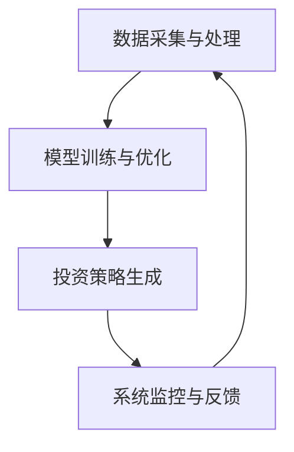
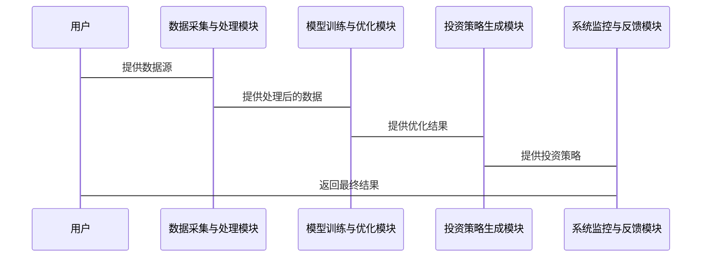
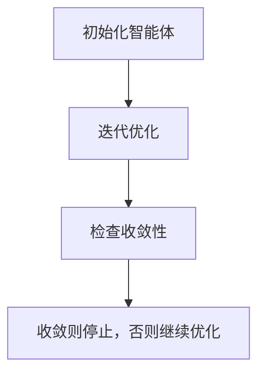

                 


# AI赋能的约翰·伯格指数投资：多智能体优化方案

> 关键词：指数投资、人工智能、多智能体优化、约翰·伯格、投资策略、金融创新

> 摘要：本文探讨了如何将人工智能技术与约翰·伯格的指数投资理念相结合，通过多智能体优化方案实现更加高效和智能的投资策略。文章从指数投资的基本概念出发，详细阐述了多智能体优化的核心原理，并通过系统架构设计和项目实战，展示了如何在实际中应用这些技术。最终，本文为读者提供了一个创新的指数投资方案，结合了传统投资理念与现代AI技术，为投资领域带来了新的可能性。

---

## 第一部分：指数投资与AI赋能的结合

### 第1章：指数投资与AI赋能的结合

#### 1.1 指数投资的基本概念

##### 1.1.1 指数投资的定义与特点

指数投资是一种长期投资策略，旨在通过复制特定市场指数的表现来实现投资收益。其核心思想是“不要尝试战胜市场”，而是通过持有分散化的指数基金来获得市场的平均收益。指数投资具有以下特点：

- **分散化**：通过投资多个资产或基金，降低单一资产的风险。
- **低成本**：指数基金的管理费用通常低于主动管理型基金。
- **被动化**：指数投资策略是被动的，不需要频繁的交易和市场预测。

##### 1.1.2 约翰·伯格的投资理念

约翰·伯格是指数投资的先驱，他创立了先锋集团（Vanguard），并提出了“买入并持有”（Buy and Hold）的投资策略。他的理念强调长期投资和分散化，认为市场是无法预测的，投资者应该通过持有低成本的指数基金来实现长期的财富增长。

##### 1.1.3 指数投资的优势与局限性

- **优势**：
  - 分散化投资降低了风险。
  - 低成本使得长期收益更高。
  - 简单易行，适合长期投资者。

- **局限性**：
  - 无法在短期内超越市场表现。
  - 对市场波动的敏感性较高。
  - 需要投资者具备长期持有的耐心。

#### 1.2 AI技术在金融领域的应用

##### 1.2.1 AI在金融分析中的作用

人工智能（AI）技术在金融领域的应用越来越广泛，尤其是在数据分析、风险评估、投资决策等方面。AI可以通过处理海量数据，发现传统方法难以察觉的模式和趋势，从而为投资者提供更精准的决策支持。

##### 1.2.2 多智能体优化在投资中的潜力

多智能体优化是一种基于分布式计算的优化方法，通过多个智能体的协作与竞争，实现全局最优解。在投资领域，多智能体优化可以用于优化投资组合、风险控制、交易策略等方面，具有以下潜力：

- **提高决策效率**：通过分布式计算，减少单点依赖。
- **增强适应性**：多个智能体可以同时处理不同类型的数据和任务。
- **降低风险**：通过多智能体的协作，实现风险分散和优化。

##### 1.2.3 当前AI赋能指数投资的现状

目前，AI技术已经在指数投资中得到了一定的应用，但主要集中在数据分析和预测方面。随着多智能体优化技术的发展，未来的指数投资将更加智能化和自动化，能够实时调整投资策略，适应市场的变化。

#### 1.3 本书的核心目标与框架

##### 1.3.1 本书的核心目标

本书的核心目标是探讨如何将AI技术与约翰·伯格的指数投资理念相结合，通过多智能体优化方案实现更加高效和智能的投资策略。本书将从理论到实践，详细阐述如何设计和实现一个基于AI的指数投资系统。

##### 1.3.2 本书的框架结构

本书的结构如下：

1. 第一部分：指数投资与AI赋能的结合。
2. 第二部分：多智能体优化的核心原理。
3. 第三部分：AI赋能的指数投资系统架构。
4. 第四部分：多智能体优化算法的实现。
5. 第五部分：项目实战与案例分析。

##### 1.3.3 本书的读者群体

本书的读者主要是对指数投资和人工智能感兴趣的读者，包括：

- 投资爱好者。
- 金融从业者。
- AI技术爱好者。
- 金融科技领域的研究人员。

---

## 第二部分：多智能体优化的核心原理

### 第2章：多智能体系统的基本原理

#### 2.1 多智能体系统的定义与特点

##### 2.1.1 多智能体系统的定义

多智能体系统（Multi-Agent System, MAS）是由多个智能体（Agent）组成的系统，这些智能体通过协作与竞争，共同完成特定任务。每个智能体都是一个独立的实体，具有感知、决策和执行能力。

##### 2.1.2 多智能体系统的组成部分

多智能体系统通常包括以下组成部分：

- **智能体**：具有感知、决策和执行能力的实体。
- **环境**：智能体所处的外部环境，可能包括其他智能体、数据源等。
- **通信机制**：智能体之间进行信息交换的机制。
- **协调机制**：智能体协作完成任务的机制。

##### 2.1.3 多智能体系统的优点与挑战

- **优点**：
  - 提高系统的灵活性和适应性。
  - 通过分布式计算提高系统的容错性和可靠性。
  - 通过协作实现全局最优解。

- **挑战**：
  - 系统复杂性高，设计难度大。
  - 智能体之间的协作需要复杂的通信和协调机制。
  - 系统的安全性和隐私性问题。

#### 2.2 多智能体优化算法的原理

##### 2.2.1 多智能体优化的基本思想

多智能体优化的基本思想是通过多个智能体的协作，寻找全局最优解。每个智能体负责优化问题的一部分，通过信息共享和协作，逐步逼近全局最优解。

##### 2.2.2 基于多智能体的分布式优化

分布式优化是一种通过多个智能体协作完成优化任务的方法。每个智能体负责优化问题的一部分，并通过通信共享信息，最终实现全局最优解。

##### 2.2.3 多智能体优化的数学模型

多智能体优化的数学模型通常可以表示为以下形式：

$$ \text{minimize } f(x) $$
$$ \text{subject to } g(x) \leq 0 $$

其中，\( f(x) \) 是目标函数，\( g(x) \) 是约束条件。

#### 2.3 多智能体优化与指数投资的结合

##### 2.3.1 指数投资中的优化问题

在指数投资中，优化问题主要集中在投资组合的优化上。目标是在风险可控的前提下，实现最大化的收益。

##### 2.3.2 多智能体优化在投资组合中的应用

多智能体优化可以用于投资组合的优化，通过多个智能体分别优化不同的资产配置，最终实现全局最优的投资组合。

##### 2.3.3 多智能体优化的优势与挑战

- **优势**：
  - 通过分布式计算提高优化效率。
  - 通过协作实现全局最优解。
  
- **挑战**：
  - 系统复杂性高，设计难度大。
  - 智能体之间的协作需要复杂的通信和协调机制。

---

## 第三部分：AI赋能的指数投资系统架构

### 第3章：系统功能设计与架构

#### 3.1 系统功能模块划分

##### 3.1.1 数据采集与处理模块

数据采集与处理模块负责从外部数据源获取数据，并进行清洗、转换和存储。

##### 3.1.2 模型训练与优化模块

模型训练与优化模块负责对数据进行建模和优化，生成最优的投资策略。

##### 3.1.3 投资策略生成模块

投资策略生成模块根据优化结果生成具体的投资策略，并进行风险评估和收益预测。

##### 3.1.4 系统监控与反馈模块

系统监控与反馈模块负责对系统的运行状态进行监控，并根据反馈信息进行优化和调整。

#### 3.2 系统架构设计

##### 3.2.1 系统架构的分层设计

系统架构通常可以分为以下几层：

1. 数据层：负责数据的采集、存储和管理。
2. 计算层：负责数据的建模和优化。
3. 策略层：负责生成投资策略并进行风险评估。
4. 应用层：负责与用户交互并展示结果。

##### 3.2.2 各模块之间的交互关系

模块之间的交互关系可以通过以下流程图表示：



##### 3.2.3 系统的可扩展性与灵活性

系统设计时需要考虑其可扩展性和灵活性，以便在未来可以根据需要进行功能的扩展和调整。

#### 3.3 系统接口与交互设计

##### 3.3.1 系统接口的设计原则

系统接口设计应遵循以下原则：

- **简洁性**：接口设计应尽量简单，避免复杂性。
- **可扩展性**：接口设计应具有良好的扩展性，便于未来功能的扩展。
- **安全性**：接口设计应考虑安全性，防止数据泄露和攻击。

##### 3.3.2 系统交互的流程图

系统交互的流程图可以通过以下序列图表示：



##### 3.3.3 系统接口的实现方式

系统接口的实现可以通过RESTful API的方式进行，使用JSON格式的数据进行通信。

---

## 第四部分：多智能体优化算法的实现

### 第4章：多智能体优化算法的数学模型

#### 4.1 多智能体优化的数学基础

##### 4.1.1 基本优化问题的数学表达

基本优化问题可以表示为：

$$ \text{minimize } f(x) $$
$$ \text{subject to } g(x) \leq 0 $$

其中，\( f(x) \) 是目标函数，\( g(x) \) 是约束条件。

##### 4.1.2 多智能体优化的数学模型

多智能体优化的数学模型可以表示为：

$$ \text{minimize } \sum_{i=1}^{n} f_i(x_i) $$
$$ \text{subject to } \sum_{i=1}^{n} g_i(x_i) \leq 0 $$

其中，\( n \) 是智能体的数量，\( x_i \) 是第 \( i \) 个智能体的决策变量。

##### 4.1.3 算法收敛性分析

多智能体优化算法的收敛性可以通过以下公式进行分析：

$$ \lim_{t \to \infty} x_t = x^* $$

其中，\( x_t \) 是第 \( t \) 步的决策变量，\( x^* \) 是全局最优解。

#### 4.2 基于多智能体的分布式优化算法

##### 4.2.1 分布式优化的基本原理

分布式优化的基本原理是通过多个智能体协作完成优化任务，每个智能体负责优化问题的一部分。

##### 4.2.2 多智能体优化的数学推导

多智能体优化的数学推导可以通过以下步骤进行：

1. 初始化各智能体的决策变量。
2. 迭代优化各智能体的决策变量，直到收敛。
3. 汇总各智能体的优化结果，得到全局最优解。

##### 4.2.3 算法的收敛性证明

通过数学证明，可以证明多智能体优化算法在一定条件下能够收敛到全局最优解。

#### 4.3 算法实现的代码框架

##### 4.3.1 算法的整体框架

以下是多智能体优化算法的整体框架：

```python
class MultiAgentOptimizer:
    def __init__(self, agents, objective_func, constraint_func):
        self.agents = agents
        self.objective_func = objective_func
        self.constraint_func = constraint_func

    def optimize(self):
        while not converged:
            for agent in self.agents:
                agent.update(self.objective_func, self.constraint_func)
            check_convergence()
```

##### 4.3.2 各模块的实现代码

以下是各模块的实现代码示例：

```python
class Agent:
    def __init__(self, id, initial_state):
        self.id = id
        self.state = initial_state

    def update(self, objective_func, constraint_func):
        # 更新智能体的决策变量
        pass

def check_convergence():
    # 检查是否收敛
    pass
```

##### 4.3.3 算法的运行流程

算法的运行流程可以通过以下步骤图表示：



---

## 第五部分：项目实战与案例分析

### 第5章：项目实战

#### 5.1 环境搭建与数据准备

##### 5.1.1 开发环境的安装与配置

开发环境的安装与配置可以通过以下步骤进行：

1. 安装Python和必要的库（如NumPy、Pandas、Scikit-learn等）。
2. 安装多智能体优化框架（如Ray、Dask等）。
3. 配置开发环境（如Jupyter Notebook、PyCharm等）。

##### 5.1.2 数据集的获取与预处理

数据集的获取与预处理可以通过以下步骤进行：

1. 从金融数据源获取历史数据（如股票价格、指数数据等）。
2. 对数据进行清洗和转换（如处理缺失值、标准化等）。
3. 将数据存储到数据库中，以便后续使用。

##### 5.1.3 数据的存储与管理

数据的存储与管理可以通过以下方式实现：

- 使用数据库（如MySQL、MongoDB等）存储数据。
- 使用数据仓库（如Hadoop、Spark等）进行大规模数据管理。

#### 5.2 系统核心功能的实现

##### 5.2.1 数据采集与处理的实现

数据采集与处理的实现可以通过以下代码进行：

```python
import pandas as pd

def load_data():
    # 加载数据
    df = pd.read_csv('data.csv')
    # 数据清洗
    df.dropna(inplace=True)
    # 数据转换
    df['date'] = pd.to_datetime(df['date'])
    return df

data = load_data()
```

##### 5.2.2 模型训练与优化的实现

模型训练与优化的实现可以通过以下代码进行：

```python
import numpy as np

def objective_func(x):
    # 目标函数
    return np.sum(x)

def constraint_func(x):
    # 约束条件
    return np.all(x >= 0)

class Agent:
    def __init__(self, id, initial_state):
        self.id = id
        self.state = initial_state

    def update(self, objective_func, constraint_func):
        # 更新智能体的决策变量
        self.state = self.state * 0.9

# 初始化智能体
agents = [Agent(1, np.array([1, 1, 1, 1]))]
optimizer = MultiAgentOptimizer(agents, objective_func, constraint_func)
optimizer.optimize()
```

##### 5.2.3 投资策略生成的实现

投资策略生成的实现可以通过以下代码进行：

```python
def generate_strategy(data, optimized_states):
    # 根据优化结果生成投资策略
    pass

# 生成投资策略
strategy = generate_strategy(data, optimized_states)
```

##### 5.2.4 系统监控与反馈的实现

系统监控与反馈的实现可以通过以下代码进行：

```python
def monitor_system():
    # 监控系统运行状态
    pass

# 监控系统
monitor_system()
```

#### 5.3 系统功能的测试与优化

##### 5.3.1 系统功能的测试方法

系统功能的测试可以通过以下步骤进行：

1. 单元测试：对每个模块进行单独测试。
2. 集成测试：对整个系统进行集成测试。
3. 性能测试：测试系统的性能和稳定性。

##### 5.3.2 测试结果的分析与优化

测试结果的分析与优化可以通过以下步骤进行：

1. 分析测试结果，找出系统中的瓶颈。
2. 根据测试结果进行系统优化，例如优化算法、调整系统参数等。
3. 重新测试，验证优化效果。

##### 5.3.3 系统优化后的性能提升

通过系统优化，可以实现以下性能提升：

- 提高系统的运行效率。
- 增强系统的稳定性。
- 提升系统的可扩展性。

---

## 第六部分：总结与展望

### 第6章：总结与展望

#### 6.1 本书的核心内容回顾

本书的核心内容是探讨如何将AI技术与约翰·伯格的指数投资理念相结合，通过多智能体优化方案实现更加高效和智能的投资策略。本书从理论到实践，详细阐述了多智能体优化的核心原理和系统架构设计，并通过项目实战展示了如何在实际中应用这些技术。

#### 6.2 本书的创新点与局限性

##### 创新点：

- 将AI技术与指数投资相结合，提出了一种新的投资策略。
- 通过多智能体优化实现全局最优解，提高了投资效率。

##### 局限性：

- 系统复杂性高，设计难度大。
- 智能体之间的协作需要复杂的通信和协调机制。
- 系统的安全性和隐私性问题。

#### 6.3 未来的研究方向

未来的研究方向可以包括：

- 研究多智能体优化算法的改进方法。
- 探索AI技术在指数投资中的其他应用。
- 提高系统的安全性和隐私性。

#### 6.4 致谢

感谢读者的耐心阅读，感谢在本书编写过程中给予支持和帮助的家人、朋友和同事。

---

## 附录

### 附录A：代码示例

以下是本书中涉及的代码示例：

```python
import numpy as np
import pandas as pd

class Agent:
    def __init__(self, id, initial_state):
        self.id = id
        self.state = initial_state

    def update(self, objective_func, constraint_func):
        # 更新智能体的决策变量
        self.state = self.state * 0.9

def objective_func(x):
    # 目标函数
    return np.sum(x)

def constraint_func(x):
    # 约束条件
    return np.all(x >= 0)

class MultiAgentOptimizer:
    def __init__(self, agents, objective_func, constraint_func):
        self.agents = agents
        self.objective_func = objective_func
        self.constraint_func = constraint_func

    def optimize(self):
        while not converged:
            for agent in self.agents:
                agent.update(self.objective_func, self.constraint_func)
            check_convergence()
```

### 附录B：图表与流程图

以下是本书中涉及的图表与流程图：


---

# 结束语

通过本书的阅读和学习，读者可以了解到如何将AI技术与指数投资相结合，通过多智能体优化方案实现更加高效和智能的投资策略。希望本书能够为读者在投资领域提供新的思路和灵感，同时也为AI技术在金融领域的应用提供有价值的参考。

