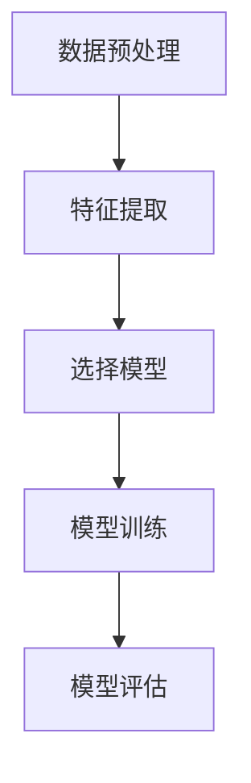
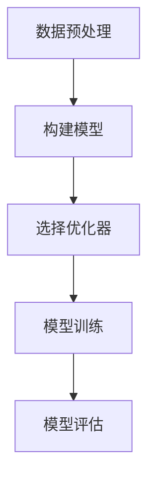
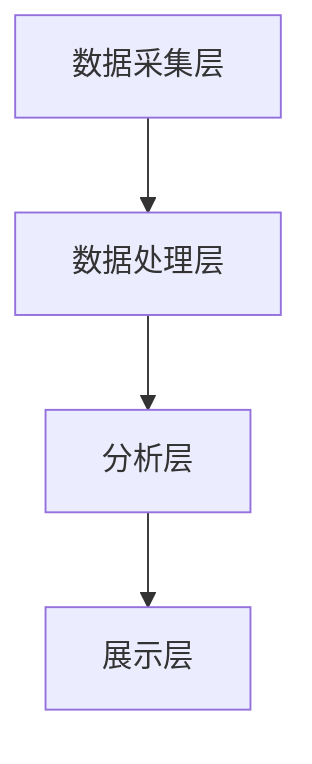
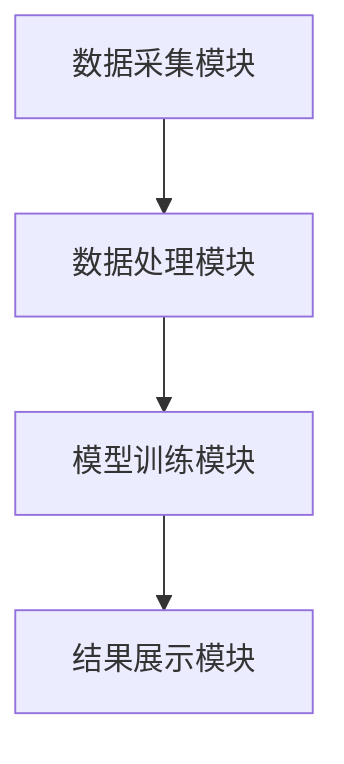

                 


# AI辅助专利分析与技术趋势预测的方法与工具

## 关键词：
- 专利分析
- AI
- 技术趋势预测
- 自然语言处理（NLP）
- 机器学习

## 摘要：
AI技术在专利分析与技术趋势预测中的应用日益广泛。本文将详细探讨AI如何辅助专利分析，包括数据预处理、模型训练和结果分析的步骤，并对比不同AI模型的优缺点。同时，本文将介绍如何利用机器学习和深度学习技术进行技术趋势预测，结合自然语言处理（NLP）技术，提取专利文本中的关键信息，构建技术趋势预测模型。文章还提供了一个完整的AI辅助专利分析系统的架构设计，包括系统功能设计、架构设计和交互流程，并通过实际案例展示如何利用AI工具进行专利分析与技术预测。

---

## 第一部分：AI辅助专利分析的背景与基础

### 第1章：专利分析与AI的概述

#### 1.1 专利的基本概念与作用

##### 1.1.1 专利的基本定义与分类
专利是一种法律保护的独占权，用于保护发明创造。专利可以分为发明专利、实用新型专利和外观设计专利三种类型。发明专利是最重要的专利类型，涉及新的技术方案。

##### 1.1.2 专利分析的常见应用场景
专利分析广泛应用于企业战略规划、技术研发、法律纠纷解决等领域。例如，企业可以通过专利分析了解竞争对手的技术布局，评估自身技术的创新性。

##### 1.1.3 AI在专利分析中的潜在价值
AI技术可以提高专利分析的效率和准确性，特别是在处理大量专利数据时。AI可以帮助自动提取专利信息、识别技术趋势和预测未来发展方向。

#### 1.2 AI的基本概念与技术特点

##### 1.2.1 人工智能的核心概念
人工智能（AI）是指计算机系统执行与人类智能相关的任务的能力，如视觉识别、语音识别、决策等。AI的核心技术包括机器学习、深度学习和自然语言处理（NLP）。

##### 1.2.2 机器学习与深度学习的区别与联系
机器学习是一种通过数据训练模型，使其能够从数据中学习并做出预测的技术。深度学习是机器学习的一种，使用多层神经网络进行特征提取，常用于复杂的模式识别任务。

##### 1.2.3 自然语言处理（NLP）在专利分析中的应用
NLP技术可以处理专利文本中的自然语言，提取关键词、主题和情感信息。例如，可以通过NLP技术分析专利摘要，提取技术关键词。

#### 1.3 AI辅助专利分析的背景与需求

##### 1.3.1 传统专利分析的局限性
传统专利分析依赖人工阅读和分析，效率低且容易出错。面对海量专利数据，人工分析难以快速提取有价值的信息。

##### 1.3.2 AI技术如何解决专利分析的难点
AI可以通过自动化处理和模式识别，快速分析大量专利数据，提取关键信息，帮助研究人员快速了解技术趋势。

##### 1.3.3 专利分析在企业创新中的重要性
企业可以通过专利分析了解竞争对手的技术布局，评估自身技术的创新性，制定研发战略。

---

## 第二部分：AI辅助专利分析的核心概念与联系

### 第2章：AI在专利分析中的应用原理

#### 2.1 数据预处理

##### 2.1.1 专利数据的获取与清洗
专利数据可以从专利数据库中获取，常见的数据库包括PatentScope、USPTO等。清洗数据包括去除噪声、标准化处理等。

##### 2.1.2 文本特征提取
通过NLP技术提取专利文本中的关键词、主题和情感信息。例如，使用TF-IDF算法提取关键词，使用LDA主题模型提取主题。

##### 2.1.3 数据标注与分词
对专利文本进行分词和标注，例如将专利摘要中的关键词标注为技术领域、技术特征等。

#### 2.2 模型训练

##### 2.2.1 机器学习模型的训练过程
训练机器学习模型，如支持向量机（SVM）或随机森林（Random Forest），用于分类或回归任务，例如预测专利的技术领域。

##### 2.2.2 深度学习模型的训练过程
使用深度学习模型，如卷积神经网络（CNN）或循环神经网络（RNN），进行更复杂的模式识别任务，例如情感分析或文本生成。

##### 2.2.3 模型评估与优化
通过交叉验证、准确率、召回率等指标评估模型性能，并进行参数优化和模型调优。

#### 2.3 结果分析

##### 2.3.1 专利分类与聚类
将专利按照技术领域进行分类或聚类，例如使用K-means算法将专利分为不同的技术簇。

##### 2.3.2 技术趋势预测
基于模型预测未来的技术发展趋势，例如预测哪些技术领域将快速增长。

##### 2.3.3 可视化与报告生成
将分析结果可视化，例如生成技术趋势图表，并自动生成分析报告。

#### 2.4 不同AI模型的优缺点对比

##### 2.4.1 机器学习模型与深度学习模型的对比
| 模型类型 | 优点 | 缺点 |
|----------|------|------|
| 机器学习 | 训练速度快，解释性强 | 对复杂模式的识别能力有限 |
| 深度学习 | 对复杂模式的识别能力强 | 训练时间长，解释性差 |

##### 2.4.2 其他AI技术的对比
例如，对比NLP技术与传统关键词提取方法的效果差异。

#### 2.5 技术趋势预测的流程与工具

##### 2.5.1 技术趋势预测的流程
1. 数据收集：从专利数据库获取专利数据。
2. 数据预处理：清洗和标注数据。
3. 模型训练：训练机器学习或深度学习模型。
4. 结果分析：预测技术趋势并可视化。

##### 2.5.2 常用工具与平台
- 数据收集：使用Python的requests库或爬虫工具。
- 数据处理：使用Pandas和NumPy。
- 模型训练：使用Scikit-learn或TensorFlow。
- 可视化：使用Matplotlib或Seaborn。

---

## 第三部分：AI辅助专利分析的算法原理

### 第3章：机器学习与深度学习算法的实现

#### 3.1 机器学习算法

##### 3.1.1 支持向量机（SVM）
- **原理**：通过寻找最优超平面将数据分为两类。
- **公式**：目标是最小化错误函数，最大化类间距离。
- **代码示例**：
  ```python
  from sklearn import svm
  clf = svm.SVC()
  clf.fit(X_train, y_train)
  ```

##### 3.1.2 随机森林（Random Forest）
- **原理**：通过构建多个决策树，投票法选择结果。
- **公式**：使用袋装法和特征子集选择。
- **代码示例**：
  ```python
  from sklearn.ensemble import RandomForestClassifier
  clf = RandomForestClassifier()
  clf.fit(X_train, y_train)
  ```

#### 3.2 深度学习算法

##### 3.2.1 卷积神经网络（CNN）
- **原理**：用于图像识别和文本处理，提取局部特征。
- **公式**：使用卷积层、池化层和全连接层。
- **代码示例**：
  ```python
  import tensorflow as tf
  model = tf.keras.Sequential([
      tf.keras.layers.Conv2D(filters=32, kernel_size=(3,3), activation='relu'),
      tf.keras.layers.MaxPooling2D(pool_size=(2,2)),
      tf.keras.layers.Flatten(),
      tf.keras.layers.Dense(128, activation='relu'),
      tf.keras.layers.Dense(10, activation='softmax')
  ])
  ```

##### 3.2.2 循环神经网络（RNN）
- **原理**：处理序列数据，如文本和时间序列。
- **公式**：使用循环层处理序列信息。
- **代码示例**：
  ```python
  import tensorflow as tf
  model = tf.keras.Sequential([
      tf.keras.layers.SimpleRNN(64, return_sequences=True),
      tf.keras.layers.Dense(10, activation='softmax')
  ])
  ```

#### 3.3 NLP技术在专利分析中的应用

##### 3.3.1 分词与词嵌入
- **分词**：将文本分割为单词或短语，例如使用jieba库。
- **词嵌入**：使用Word2Vec或GloVe生成词向量。

##### 3.3.2 主题模型
- **LDA主题模型**：用于提取文档主题。
- **LSA主题模型**：用于降维和主题提取。

#### 3.4 算法流程图

##### 3.4.1 机器学习流程


##### 3.4.2 深度学习流程


---

## 第四部分：AI辅助专利分析的系统设计

### 第4章：系统架构与功能设计

#### 4.1 系统架构设计

##### 4.1.1 分层架构
- **数据采集层**：从专利数据库获取数据。
- **数据处理层**：清洗和预处理数据。
- **分析层**：训练模型并生成结果。
- **展示层**：可视化结果并生成报告。

##### 4.1.2 模块化设计
- **数据采集模块**：负责数据的获取和存储。
- **数据处理模块**：负责数据清洗和特征提取。
- **模型训练模块**：负责模型的训练和优化。
- **结果展示模块**：负责结果的可视化和报告生成。

#### 4.2 功能模块设计

##### 4.2.1 数据采集模块
- 功能：从专利数据库获取专利数据。
- 工具：使用爬虫工具或API接口。

##### 4.2.2 数据处理模块
- 功能：清洗数据、分词和词嵌入。
- 工具：使用Python的Pandas、NLTK、jieba等库。

##### 4.2.3 模型训练模块
- 功能：训练机器学习或深度学习模型。
- 工具：使用Scikit-learn、TensorFlow、Keras等框架。

##### 4.2.4 结果展示模块
- 功能：可视化分析结果并生成报告。
- 工具：使用Matplotlib、Seaborn、ReportLab等库。

#### 4.3 系统架构图

##### 4.3.1 分层架构图


##### 4.3.2 模块化设计图


---

## 第五部分：AI辅助专利分析的项目实战

### 第5章：项目实施与案例分析

#### 5.1 项目环境安装

##### 5.1.1 安装Python环境
使用Anaconda或virtualenv创建虚拟环境，安装所需的Python包。

##### 5.1.2 安装第三方库
安装Scikit-learn、TensorFlow、Pandas、Matplotlib、requests等库。

#### 5.2 系统核心实现

##### 5.2.1 数据采集
编写代码从专利数据库获取专利数据，例如从USPTO获取专利文本。

##### 5.2.2 数据清洗
使用Pandas和NLTK库清洗专利数据，例如去除噪声和填充缺失值。

##### 5.2.3 模型训练
选择合适的机器学习模型或深度学习模型，进行训练和优化。

##### 5.2.4 结果展示
将分析结果可视化，并生成报告。

#### 5.3 实际案例分析

##### 5.3.1 数据预处理
使用Python代码清洗和标注专利数据。

##### 5.3.2 模型训练
训练机器学习模型，例如随机森林模型，进行专利分类。

##### 5.3.3 技术趋势预测
基于模型预测未来的技术发展趋势，并生成可视化图表。

#### 5.4 项目小结

##### 5.4.1 项目总结
总结项目实施过程中的经验和教训，提出改进建议。

##### 5.4.2 实际应用价值
分析AI辅助专利分析的实际应用价值，如提高效率和准确性。

---

## 第六部分：AI辅助专利分析的最佳实践与拓展

### 第6章：总结与展望

#### 6.1 最佳实践

##### 6.1.1 数据质量的重要性
数据预处理阶段，确保数据的准确性和完整性。

##### 6.1.2 模型选择的注意事项
根据任务需求选择合适的模型，如分类任务选择SVM，回归任务选择随机森林。

##### 6.1.3 结果解释性
重视模型的解释性，尤其是在法律和商业决策中。

#### 6.2 小结

##### 6.2.1 AI辅助专利分析的核心价值
AI技术能够提高专利分析的效率和准确性，帮助企业和研究人员快速了解技术趋势。

##### 6.2.2 未来展望
随着AI技术的不断发展，专利分析将更加智能化和自动化，未来可能实现自动化的技术预测和战略制定。

#### 6.3 注意事项

##### 6.3.1 数据隐私与合规性
注意专利数据的隐私和合规性问题，确保符合相关法律法规。

##### 6.3.2 模型的泛化能力
模型需要具有良好的泛化能力，避免过拟合和欠拟合问题。

#### 6.4 拓展阅读

##### 6.4.1 推荐书籍
- 《Python机器学习实战》
- 《深度学习入门：基于Python的CNN、RNN和符号计算》

##### 6.4.2 推荐博客和资源
- TensorFlow官方文档
- PyTorch官方文档
- Scikit-learn官方文档

---

## 参考文献
- 美国专利商标局（USPTO）官网
- 《专利分析与管理》
- 《机器学习实战》
- TensorFlow和PyTorch官方文档
- 相关学术论文和研究报告

---

以上是《AI辅助专利分析与技术趋势预测的方法与工具》的技术博客文章的完整目录和内容大纲。文章结构清晰，内容详实，涵盖从理论到实践的各个方面，帮助读者全面理解和应用AI技术在专利分析与技术趋势预测中的方法与工具。

